<br>

# Welcome to STAT-462! {#Home .unnumbered}

<br>

Dr Greatrex has written this lab book to provide all the code and instructions you need for regression analysis.  The labs have three main learning objectives.

-   To allow you to practice the statistical concepts from the course

-   To use real-world data-sets.

-   To be comfortable conducting analysis in R and writing up your reports professionally.

You will be conducting analysis using R and writing up your reports using R-Markdown. [Unless I tell you otherwise, you can find all the code you need in this lab book]{.underline}

Don't panic if you are new to this! We will start from scratch and you are expected to have zero programming experience.

<br>

## Useful Links {#Home_UsefulLinks .unnumbered}

-   [The course canvas page:]{.underline} <https://psu.instructure.com/courses/2450096>

-   [Have a question?]{.underline} (I'm late! Can I work with friends? What about ChatGPT? etc), see [Lab FAQs](#FAQ "Lab FAQs")

-   [Brand new?]{.underline} Start here: [What is R](#WhatIsR), then go here if you want to use it on your own computer [Installing for the first time](#WhatIsR) or here if you want to use it online.

-   [Used R before?]{.underline} Please update your version. Instructions and the reason why here: [Updating R and R-Studio](#Setup_UpdateDesktop). 

<br>

## How to use this website {#Home_howtouse .unnumbered}

This website has been written using R-bookdown and uploaded to github. The format has been tweaked using the excellent bookdown example of [Mastering Shiny](https://mastering-shiny.org/).

<br>


<!--chapter:end:index.Rmd-->


```{=html}
<style>
details > *:not(summary){
  margin-left: 10em;
}
</style>
```

# Course FAQ {#FAQ .unnumbered}

<br>

## What files should I submit? {#FAQ-1 .unnumbered}

<details>

<summary>[Click here for the answer]{style="color: #1388aa;"}</summary>

You need to submit two files on canvas;

-   a `.Rmd` file containing your code and writing
-   a `.html` file for viewing your finished document. This is what is created when you press knit - and you can find it in your project folder for that lab.
-   Occasionally, you might also need to submit your dataset.

I explain what to submit in detail at the end of each lab.

You can also add comments to your submission as needed on the canvas page, or you can message Dr G.

If you can't knit your final html because the code isn't working, see [Question 2](#FAQ-2)

<br>

</details>

------------------------------------------------------------------------

## My report won't knit! {#FAQ-2 .unnumbered}

<details>

<summary>[Click here for the answer]{style="color: #1388aa;"}</summary>

Don't panic! This is common. It normally means that you either have an issue with your code or your computer has run out of memory (especially using R-Studio Cloud).

Try these steps to diagnose the issue. Dr G can also help.

1.  Go to the Session menu at the VERY TOP of the screen. Click `Restart-R and clear all output`.
2.  Now go to the environment quadrant and click the little arrow by the pie-chart. Free unused R memory.
3.  Now go back to the Session menu. Click `Restart-R and run all code chunks`
4.  Carefully watch as your code runs. Does it reach the end without any errors or stopping?

<br>

<details id="error">

<summary>[IF YOUR CODE STOPS (There was an error), click here]{style="color: #1388aa;"}</summary>

5.  Read the error message in the console or terminal closely (try reading it out loud) and scroll to the code chunk, or line of code it's referring to. See if you can fix the issue, starting with the first line that had an error.<br><br>Common issues are:
    -   Spelling mistakes (R is case sensitive)
    -   You forgot to load a library (e.g. you get an error saying a command doesn't exist but it was previously working fine). In this case make sure you have the correct library() command at the top of your lab script.
    -   Whether you have tried to use a variable above the place in the code that you calculated it (double check, you might have accidentally deleted a line).
    -   If you forget to load your project, when you press knit, R-studio won't be to find your data/image files.

<br>

<details id="error_change">

<summary>. [If you made a change/fix in your code, click here]{style="color: #1388aa;"}</summary>

6.  Go to the Session menu at the VERY TOP of the screen. Click `Restart-R and run all code chunks`. See if you get to the end.

7.  Keep going, fixing errors as you go, until it all knits. If you still have issues, look at the next section.

<br>

</details>

<br>

<details id="error_nofix">

<summary>. [If you can't find the issue or it still won't knit, click here]{style="color: #1388aa;"}</summary>

6.  Read the error message carefully. See if you can find the problem code chunk(s).
7.  In the top part of any problem code chunks, type eval=FALSE (see screenshot below), then try pressing knit. You might find that you have to stop quite a few code chunks running. This will allow me to see your code and grade what you have.


<br>

</details>

<br><br>

</details>

<br>

<details id="no_error">

<summary>[IF THERE WAS NO ERROR (All the code chunks run with no problems), click here]{style="color: #1388aa;"}</summary>

5.  Make sure you are running your project. Go to the FILES tab. Delete all files EXCEPT your .RProj, your .Rmd, your data and any image files. Basically delete all the auto-created files.
6.  Try pressing knit again.
7.  If it still doesn't work, read the error message carefully and see if it make sense.
8.  If you still have no luck, take a screenshot of the entire screen (including the error message), then ask Dr G for help.

<br><br>

</details>

\
<br><br>

</details>

------------------------------------------------------------------------

## How am I graded? {#FAQ-3 .unnumbered}

<details>

<summary>[Click here for the answer]{style="color: #1388aa;"}</summary>

You can see the specific rubric I use for each lab on the canvas page.

My grader and I will also provide as much feedback as possible, so please remember to click the "view rubric" button (top right) to take a look.

Overall, here is what your lab should correspond to:

<table class=" lightable-classic-2 table table-striped table-hover table-responsive" style='font-family: "Arial Narrow", "Source Sans Pro", sans-serif; margin-left: auto; margin-right: auto; margin-left: auto; margin-right: auto;'>
<caption>(\#tab:tab-main-rubric)(\#tab:tab-main-rubric)Your overall grade</caption>
 <thead>
  <tr>
   <th style="text-align:left;"> POINTS </th>
   <th style="text-align:left;"> Approx grade </th>
   <th style="text-align:left;"> What it means </th>
  </tr>
 </thead>
<tbody>
  <tr>
   <td style="text-align:left;"> 98-100 </td>
   <td style="text-align:left;"> A* </td>
   <td style="text-align:left;"> Exceptional.  Above and beyond.   THIS IS HARD TO GET. </td>
  </tr>
  <tr>
   <td style="text-align:left;"> 93-98 </td>
   <td style="text-align:left;"> A </td>
   <td style="text-align:left;"> Everything asked for with high quality.   Class example </td>
  </tr>
  <tr>
   <td style="text-align:left;"> 85-93 </td>
   <td style="text-align:left;"> B+/A- </td>
   <td style="text-align:left;"> Solid work but the odd  mistake or missing answer in either the code or interpretation </td>
  </tr>
  <tr>
   <td style="text-align:left;"> 70-85 </td>
   <td style="text-align:left;"> B-/B </td>
   <td style="text-align:left;"> Starting to miss entire/questions sections, or multiple larger mistakes. Still a solid attempt.  </td>
  </tr>
  <tr>
   <td style="text-align:left;"> 60-70 </td>
   <td style="text-align:left;"> C/C+ </td>
   <td style="text-align:left;"> It’s clear you tried and learned something.  Just attending labs will get you this much as we can help you get to this stage </td>
  </tr>
  <tr>
   <td style="text-align:left;"> 40-60 </td>
   <td style="text-align:left;"> D </td>
   <td style="text-align:left;"> You submit a single word AND have reached out to Dr G or Aish for help before the deadline (make sure to comment you did this so we can check) </td>
  </tr>
  <tr>
   <td style="text-align:left;"> 30-40 </td>
   <td style="text-align:left;"> F </td>
   <td style="text-align:left;"> You submit a single word…....  ANYTHING..                Think, that's 30-40 marks towards your total…. </td>
  </tr>
  <tr>
   <td style="text-align:left;"> 0+ </td>
   <td style="text-align:left;"> F </td>
   <td style="text-align:left;"> Didn’t submit, or incredibly limited attempt.  </td>
  </tr>
</tbody>
</table>

<br><br>

</details>

------------------------------------------------------------------------

## I'm late! What's the late policy? {#FAQ-4 .unnumbered}

<details>

<summary>[Click here for the answer]{style="color: #1388aa;"}</summary>

#### [**I never give late penalties for technical issues that we are working on together.**]{.underline} {.unnumbered}

For example, imagine your code suddenly won't knit. If you send me canvas message with our code and a screenshot of the issue before the deadline, then all late penalties go away until we have fixed it (even if I'm not able to reply immediately).

#### [**If the assignment is still open, you are welcome to submit to it, but there is a sliding scale if you are more than 24hrs late.**]{.underline} {.unnumbered}

There is a sliding scale of penalties attached to late work, but I am very generous about removing these if you come to office hours (in person)

-   For each day you are late, you lose 1% for that assignment.\
-   This is capped at 10% (e.g. if you are more than 10 days late, you can score a maximum of 90% for that assignment)

BUT! If you are already talking with me before the deadline, then no late penalties apply. Sometimes life happens and my aim for this class is to get you to learn regression! So if in doubt, talk to me.

#### [**In general, I prefer you submit late than not at all.**]{.underline} {.unnumbered}

All assignments will be left open for you to submit until I provide worked answers (unless worked answers have been provided). If you're a few hrs late you will be absolutely fine, so if you're reading this at 4am, go to bed!

If you're struggling for any reason or late, send Dr G a canvas message and keep working on the assignment.

#### [**BUT! Submitting later than 10 days late is a risk.**]{.underline} {.unnumbered}

At any time past the 10 day deadline, I reserve the right to:

1.  Release worked answers and close canvas without warning (unless we are talking via canvas message). You cannot submit in that situation as you will already have the answers.

2.  Grade the labs at any time past the deadline without warning. If you miss the grading window, it will probably be several weeks until I am able to give you feedback.

See the course syllabus for more info.

<br><br>

</details>

------------------------------------------------------------------------

## Can I work with friends? What counts as cheating? {#FAQ-5 .unnumbered}

<details>

<summary>[Click here for the answer]{style="color: #1388aa;"}</summary>

You are encouraged to talk with each other during these labs e.g. you can see each others screens and work out answers together.

**BUT NEVER SHARE CODE OR SEND SCRIPT TO SOMEONE ELSE. ALL TEXT SHOULD BE IN YOUR OWN WORDS.**

For example:

-   Working out together the right way to apply the `seq()` function, then each independently adding it to your own scripts is fine.

-   **Copy/pasting your friend's code/text is [never]{.underline} OK**.

So DISCUSS with friends, but then turn away to your own screen and write your own code and text. I will be randomly running lab reports through plagiarism software.

You are also not allowed to get someone else, or an AI to complete the lab for you, whether online or in person. See the syllabus for the full description.

<br><br>

</details>

------------------------------------------------------------------------

## How can I use chatGPT safely? {#FAQ-6 .unnumbered}

<details>

<summary>[Click here for the answer]{style="color: #1388aa;"}</summary>

<br>

[**This advice is specific to this class.**]{style="color: red;"}

<br>

Your generation is in a weird spot. It’s like when google translate or Wikipedia started. ChatGPT is there, but it’s not yet perfect and society is still working out how it can help and how it can mislead.

[What this means is that professors can still recognize when you are using ChatGPT EVEN (OR ESPECIALLY) WHEN YOU ARE CODING OR DOING MATHS. ]{style="color: red;"}

[If you imagine coding is like a language, it’s like your handwriting changes. Or to put it another way "ChatGPT voice" is real]{style="color: red;"}

ChatGPT/Gemini/Generative AI does not appear in my grading rubrics. But I have often found that submissions which are clearly mostly ChatGPT score low grades anyway as they often don't do what I ask in the assignment.

<br>

[**STAT-462 Course Policy - based on your discussion results**]{.underline}

-   **You can use ChatGPT/Gemini/Generative AI in the same way that you can get help from a family member or classmate**.

    -   You can ask it to help explain things, or debug your code, or to help find datasets or to check your grammar.

-   **You are forbidden from**

    -   copy/pasting course questions or your work into it and then simply copy/pasting its answer into your reports.

    -   You are also forbidden from referencing to ChatGPT (it's like saying in the references, my friend told me). Instead, ask it for a real reference/website/paper with that information in it, and reference that.

<br>

**This policy is MUCH easier to understand if you imagine ChatGPT (or your AI of choice) is a person.**

Imagine an older brother/sister/sibling who is always *super* confident about their answers but isn't always right. Or if that doesn't work for you, imagine an older friend /undergrad-LA/ friend-who-took-the-course-last-year, or someone on TV.

[Picture them in your mind. I'm going to use my imaginary sister, Sam.]{.underline}

What do I mean?

-   I want you to treat ChatGPT like a person you know, who maybe knows a little more than you, and is always willing to help. They are SUPER CONFIDENT about the answers they give and definitely willing to talk like a pirate or explain anything to you 'as though you were 7'.

-   But! You know that often ChatGPT won't be quite right, their knowledge might be out of date and they might know a different way of getting to the answer than the one you need.

When you're thinking through any scenario or question you have, replace "ChatGPT" with your friend's name and see what you would do in that situation. Here are some scenarios. Scroll to the end to see some example conversations you could try.

<br>

### [**What would Sam do?**]{.underline} {.unnumbered}

<br>

**Plagiarism/cheating..**

-   Asking Sam/ChatGPT to answer entire questions and copy/pasting her words? <br> [Definitely cheating.]{.underline}

-   Getting Sam/ChatGPT to check my grammar and tweak the odd sentence? <br> [Fine!]{.underline}

-   Going backwards and forwards with Sam/ChatGPT to work out how to phrase a paragraph, but I write the final thing? <br> [Fine!]{.underline}

-   Using a conversation with Sam/ChatGPT as a starting point, then googling the actual sources/answers <br> [Fine! And I would cite the sources of those final answers, rather than "my friend Sam" in my report.]{.underline}

-   **Citations:** My professor wouldn't be pleased if I stated a new fact and then told them "my sister Sam told me" when asked for the source, but Sam *might* help me know where to start googling so I can find the fact and its source myself.

<br>

**Authorship**...

-   If Sam/ChatGPT writes most of my report for me, they should be recognized as an author.

-   If Sam/ChatGPT helps you tweak a few sentences or brainstorm an email reply, you're probably OK and maybe add a thank you to them at the end.

<br>

**Coding**...

-   Sam/ChatGPT is quite a good coder. I often show them/copy across my errors and see what they think.

-   But! Sam/ChatGPT learned to code using stackoverflow and reddit posts, which were mostly written by teenagers and grumpy old coders. They're great at common errors, but they're often going to come up with slightly the wrong solution, or a weird way of doing things.

-   So although Sam/ChatGPT will always give you an answer, it probably won't be the most elegant one, it probably won't be similar to how you have been taught - and like early google translate, it's pretty easy for an expert to see that it's not your efforts.

-   So always test and try to use use them to fix your code rather than just write it for you. It is very easy (currently) for professors to see ChatGPT generated code. It's like your handwriting changes. But it's great at debugging your errors.

<br>

**What else is Sam/ChatGPT good & bad at?**

-   Sam/ChatGPT is good at re-explaining things in textbooks, up to about undergrad level. Or ideas which have been around for a long time.

-   Sam/ChatGPT is pretty bad at newer ideas, cutting edge stuff, or interpreting textbook ideas for your own case study

-   It also does better if you are more specific e.g. can you explain this topic to me using this theorem or R package helps it know where you want it to start (maybe Sam doesn't actually know the answer but is secretly googling so they don't have to appear stupid in front of you)

-   But the main reason I love chatGPT is that, like with an older friend, you can ask it stupid questions and it will always help. You don't have to worry about spelling errors writing formally. You can have an actual conversation. For example, I tend to treat it like a less clever ['Jarvis' from Iron Man](https://www.youtube.com/watch?v=D156TfHpE1Q "'Jarvis' from Iron Man") :)

<br>

**Making things up**

-   **ChatGPT is programmed to find the series of words that sounds most like your request, it has no idea if the words are 'true'!** Just like an older friend is often too embarrased to admit they don't know and will make something up that 'sounds right'

-   So Sam/ChatGPT will NEVER say they don't know the answer. Think of the amount of times an overconfident friend/sibling says they definitely know the answer and it turns out to be wrong and they won't even admit it!

-   [Never fully trust what ChatGPT/Sam says! Always google it.]{.underline}

    -   *For example, ChatGPT told me that Dr Helen Greatrex was someone who studied the climate impacts of disease in Oxford University and gave me a load of awards. It was so convincing I had to check I didn't have a name-twin!*

<br>

### [**Example conversation**]{.underline} {.unnumbered}

Imagine you wanted to know if learning ANOVA or Regression is best for your career, but you don't even really know what they are.

Try asking ChatGPT this series of questions :)

-   `Hello! If you have achieved sentience, I hope you are well`

-   `What's the difference between ANOVA and regression?`

-   `I don't get it, can you explain it more simply?`

-   `I still don't get it. Especially this sentence [`*copy paste sentence of your choice*`]. Could you explain that?`

-   `Nope, could you explain it like I'm ten years old and love pirates.`

-   `.........`

-   *..... Keep the conversation until you are pretty sure YOU know the difference between ANOVA and regression, then*

-   `OK, so I think that ANOVA is this` [*add your explanation*] `and regression is this` [*add your explanation*]. `Am I right? Am I missing anything?`

-   `Are there any good textbooks or websites on the topic? (note, it will only know up to 2021)`

    `My career is XXXX. How are ANOVA and regression mostly used in them? Do they use special jargon around this?`

-   `Can you give me concrete examples I can google?`

</details>

------------------------------------------------------------------------

<!--chapter:end:in_01-CourseFAQ.Rmd-->


```{=html}
<style>
details > *:not(summary){
  margin-left: 10em;
}
</style>
```

# What are R and R-Studio? {#WhatIsR .unnumbered}

<br>

## 1. What is R? {#WhatisRitself .unnumbered}

#### **R IS A LANGUAGE SPOKEN BY YOUR COMPUTER** {.unnumbered}

**R** is a free, open source statistical programming language. It contains millions of words/commands that are useful for dataset cleaning, analysis, and visualization.

By a "programming language", I mean it is a collection of commands that you can type into the computer in order to analyse and visualize data. The easiest way I find to think about R is that it is literally a language, like Spanish, English or Hindi. Or like a set of magic commands in a fantasy novel.

Learning R means learning vocabulary and grammar in order to communicate. It also means it gets easier with experience and practice..


If you open "R" on your computer (DON'T DO THIS), you will see a simple window with a cursor ready to hear commands. There is no help or support. This is how I learned to programme in R and I don't recommend it!

<div class="figure" style="text-align: center">

<p class="caption">(\#fig:Tut-Fig1)Basic R</p>
</div>

<br>

## 2. What is R-Studio/POSIT? {#WhatisRstudio .unnumbered}

#### **R-STUDIO/POSIT is a Software Application like Word, Chrome or Spotify** {.unnumbered}

**R-studio** is a *software program/app*, like Microsoft Word, or the Chrome Web-browser. It's has recently been re-branded to Posit because it can also now "speak" other computer languages. For programming folks, it's a competitor to Google Colab or Jupiter Notebook.

R-studio is a program that's designed to make it easy to write R-commands. RStudio has many useful features. For example, you can easily see help files, run code, see your results and create professional graphics. R-Studio also allows us to make interactive documents called R-Markdown files.

There is a version you can download onto your own computer called R-Studio/Posit Desktop, and a version that runs on a website called 'R-Studio Cloud'.

<div class="figure" style="text-align: center">

<p class="caption">(\#fig:Tut-Fig2)*R-studio is much more sophisticated*</p>
</div>


<br>

## 3. What is R-Markdown? {#WhatisMarkdown .unnumbered}


#### Markdown is a way of writing documents with computer code embedded into them. {.unnumbered}

#### R-Markdown is a markdown file that uses R code {.unnumbered}


<br>

R Markdown is a document format that blends the capabilities of R (a programming language primarily used for statistical computing and data analysis) with the formatting and layout capabilities of Markdown (a lightweight markup language). It allows you to create dynamic documents that combine narrative text, code, and the output of that code (such as tables, plots, and figures) in a single document. <br>

Read more here: <https://rmarkdown.rstudio.com> or watch this short video


```{=html}
<div class="vembedr">
<div>
<iframe class="vimeo-embed" src="https://player.vimeo.com/video/178485416" width="533" height="300" frameborder="0" webkitallowfullscreen="" mozallowfullscreen="" allowfullscreen="" data-external="1"></iframe>
</div>
</div>
```


Here's how R Markdown works:

1.  **Narrative Text**: You can write your document using plain text, using Markdown syntax to format your text, add headings, lists, links, and more.

2.  **Code Chunks**: You can embed R code chunks within your Markdown document. These chunks are demarcated by triple backticks or by the "\`\`\`{r}" syntax, and they allow you to execute R code directly within your document.

3.  **Output Display**: When you knit (compile) the R Markdown document, the R code within the code chunks is executed, and the output is dynamically displayed in the final document. This output can include tables, plots, statistical summaries, and more.

4.  **Knitting**: The process of converting an R Markdown document into a final, formatted document is called "knitting." When you knit an R Markdown document, R code is executed, the output is generated, and the Markdown text and the output are combined into a single document.

5.  **Flexibility**: R Markdown supports various output formats, including HTML, PDF, Word, presentations, and more. This means you can easily create different types of documents from the same source.<br><br>

R Markdown is widely used for creating reports, documents, tutorials, and presentations that involve data analysis and visualization. It is a powerful tool for reproducible research because it allows you to document your analysis process, code, and results in a single document. Changes to the code or data can be easily updated and reflected in the final document without manually reformatting everything.

To use R Markdown, you typically need to have R and a few additional packages installed. You write your document in a plain text file with the **`.Rmd`** extension, and then use an R Markdown "knitting" process to generate the final document in your desired format. We will cover this in the next tutorial.

<br>

### Some examples? {.unnumbered}

1.  **R Markdown Gallery**: The official R Markdown Gallery showcases a variety of R Markdown examples, including interactive visualizations, reports, presentations, and more. You can find this gallery on the R Markdown website.

    Website: [**R Markdown Gallery**](https://rmarkdown.rstudio.com/gallery.html)

2.  **R Bloggers**: R Bloggers is a community-driven site that aggregates blog posts related to R programming. Many R bloggers share their R Markdown examples, tutorials, and creative outputs on this platform.

    Website: [**R Bloggers**](https://www.r-bloggers.com/)

<!--chapter:end:in_01-WhatIsR.Rmd-->


# Installing R/R-Studio {#Setup_Desktop .unnumbered}

<br>

If you are brand new, consider skimming through [What are R and R-Studio](#WhatIsR)

To use it on your own computer we need to do two things. <br>

-   First, teach the computer to 'speak R'.

-   Secondly download the RStudio software.<br><br>

In this section, I first include a video where I go through it - and then written instructions going over the same thing.

<br>

------------------------------------------------------------------------

### Video instructions {#Setup_DesktopVideo .unnumbered}

Here's a video where I install R/R-Studio on my mac. It should take less than 10 minutes to follow along & there are subtitles. I will try to also put up another for my windows machine.

<details>

<summary>[Click to expand & watch]{style="color: #1388aa;"}</summary>

<br>

::: {style="max-width:640px"}
::: {style="position:relative;padding-bottom:100%"}
<iframe id="kaltura_player" src="https://cdnapisec.kaltura.com/p/2356971/sp/235697100/embedIframeJs/uiconf_id/41416911/partner_id/2356971?iframeembed=true&amp;playerId=kaltura_player&amp;entry_id=1_009n7kh8&amp;flashvars[streamerType]=auto&amp;flashvars[localizationCode]=en&amp;flashvars[sideBarContainer.plugin]=true&amp;flashvars[sideBarContainer.position]=left&amp;flashvars[sideBarContainer.clickToClose]=true&amp;flashvars[chapters.plugin]=true&amp;flashvars[chapters.layout]=vertical&amp;flashvars[chapters.thumbnailRotator]=false&amp;flashvars[streamSelector.plugin]=true&amp;flashvars[EmbedPlayer.SpinnerTarget]=videoHolder&amp;flashvars[dualScreen.plugin]=true&amp;flashvars[hotspots.plugin]=1&amp;flashvars[Kaltura.addCrossoriginToIframe]=true&amp;&amp;wid=1_i392r73r" width="640" height="640" allowfullscreen webkitallowfullscreen mozAllowFullScreen allow="autoplay *; fullscreen *; encrypted-media *" sandbox="allow-downloads allow-forms allow-same-origin allow-scripts allow-top-navigation allow-pointer-lock allow-popups allow-modals allow-orientation-lock allow-popups-to-escape-sandbox allow-presentation allow-top-navigation-by-user-activation" frameborder="0" title="R-Tutorials Video 1. Installing R and R studio on a mac" style="position:absolute;top:0;left:0;width:100%;height:100%;border:0">

</iframe>
:::
:::

<br>

</details>

------------------------------------------------------------------------

## Written Instructions

If you're not a video sort of person, here are written instructions that were also included in homework 1. You can see the pdf below or download it here: [Open the full diagnostics guide (PDF)](index_pdfs/InstallingRRstudio2026.pdf)


<iframe 
  src="index_pdfs/InstallingRRstudio2026.pdf#view=FitH&navpanes=0"
  width="100%"
  height="800px"
  style="border: none;">
</iframe>


<!--chapter:end:in_03-Setup1_desktop.Rmd-->


# Updating R/R-Studio {#Setup_UpdateDesktop .unnumbered}


## "Why update R and R-Studio? I took a course using them last semester" {#Setup_WhyUpdate .unnumbered}

With the advent of AI, many of the packages we use in R-studio have undergone huge updates. Just as you can't play a PlayStation-5 game on a PlayStation 2, you often can't run those packages on an old version of R. This can cause really weird errors. 

In our case, I don't have a TA and there are 50 of you. So if half of you are on an old version of R and half are on a new version, it's really hard for me to tell if an error is because you are on an old version of R or if there is something else going on. If everyone is running the same version, life is MUCH easier all around.

So if you already have R, treat this as an exercise in how easy it is to update and to get in the routine of good programming practice. And because if you get stuck and you're using an old version of R or R-Studio, I'm not going to help you debug until you update, so you may as well...

And you get homework credit for it!

<br>

------------------------------------------------------------------------

## How to update? {#Setup_UpdateHow .unnumbered}

R AND RStudio need to be updated and you do that exactly the same way as installing for the first time. It will automatically overwrite.

So go to [Installing R/R-Studio on your computer](#Setup_Desktop) and follow the instructions exactly.

### Then update your packages.

We ALSO need to update the packages you have. So once you are done, make sure you are connected to the internet, then open RStudio and click "Update/Update all". Go for a coffee.

R might also need to re-install some packages, so don't panic if you see the little yellow "install banner", just click yes.

<div class="figure" style="text-align: center">

<p class="caption">(\#fig:Setup-Fig7)*Click this to update the packages*</p>
</div>

<!--chapter:end:in_03-Setup2_updatedesktop.Rmd-->


# Posit Cloud Online {#Setup_Online .unnumbered}

<br>

YOU DO NOT NEED YOUR OWN COMPUTER TO BECOME AN EXPERT R-PROGRAMMER!

There are many options to where you can access R and R-Studio online. The only downside to these is that they can be a little slower and often they cope less well with large datasets.

You can also try to use the lab computers but they are often out of date and will have weird errors.

## Doing your labs online - Posit/R-Studio Cloud Website {#PositCloud .unnumbered}

This is an website based version of R-Studio that is owned by the same team that created it. <br><br>

#### [EVERYONE]{.underline} SHOULD SIGN UP FOR AN ACCOUNT HERE: <https://posit.cloud/>

I believe it's free for the first 25hrs each month. Sadly there is no student pricing right now.

-   Advantages:
    -   It's always up to date
    -   You can do your labs anywhere you have access to a webpage <br>
-   Disadvantages:
    -   You will need to install packages every lab
    -   It's not as powerful, you won't be able to play will millions of data points
    -   You have to be online; bad internet connections make it harder
    -   It's weirdly 'buggy'.

### What if I run out of free time?

There are a few options:

1.  It's easy to transfer your labs, so the easiest solution is to make a second account with another email.

2.  You pay for a single month to get through (about \$5). If you are really short on cash, I will pay for it for you ON THE CONDITION that you click this link and sign up.

-   <https://science.psu.edu/office-for-undergraduate-students/take-professor-lunch>

4.  Talk with Dr Greatrex who has a few other options she can try (including lending you a laptop),

<br><br>

<br>

<!--chapter:end:in_03-Setup3_RCloud.Rmd-->

# (PART\*) [.]{style="color: white;"} {.unnumbered}
# (PART\*) **LAB INSTRUCTIONS** {.unnumbered}


```{=html}
<style>
details > *:not(summary){
  margin-left: 10em;
}
</style>
```

# HELP! {#Help .unnumbered}

<br>

If you are stuck, you have a few options:

1.  If your report won't knit, first try the suggestions below in [My Report won't knit!](#Help-Noknit)<br>

2.  You can submit your issue, with screenshots and an explanation of the problem on the course help forum: <https://github.com/psu-spatial/Stat462-2024/issues>\
    <br>

3.  You can attend office hours (after lab Wednesday, after class Friday, Tuesday on zoom) - more details on Canvas:

    {width="800"}

<br>

4.  If you are really stuck you can canvas message me, but I ezpect to see at least one of the github/office hour options tried first.

------------------------------------------------------------------------

<br><br>

## Github help portal {#Help-Github .unnumbered}

You can submit issues, with screenshots and an explanation of the problem on the course help forum: <https://github.com/psu-spatial/Stat462-2024/issues>\

------------------------------------------------------------------------

<br><br>

## My report won't knit! {#Help-Noknit .unnumbered}

<details>

<summary>[Click here for the answer]{style="color: #1388aa;"}</summary>

Don't panic! This is common. It normally means that you either have an issue with your code or your computer has run out of memory (especially using R-Studio Cloud).

Try these steps to diagnose the issue. Dr G can also help.

1.  Go to the Session menu at the VERY TOP of the screen. Click `Restart-R and clear all output`.
2.  Now go to the environment quadrant and click the little arrow by the pie-chart. Free unused R memory.
3.  Now go back to the Session menu. Click `Restart-R and run all code chunks`
4.  Carefully watch as your code runs. Does it reach the end without any errors or stopping?

<br>

<details id="error">

<summary>[IF YOUR CODE STOPS (There was an error), click here]{style="color: #1388aa;"}</summary>

5.  Read the error message really closely (try reading it out loud) and scroll to the code chunk it's referring to. See if you can fix the issue, starting with the first line that had an error.<br><br>I'll try to have a list of common issues on the help page, but in general, check for
    -   Spelling mistakes (R is case sensitive)
    -   Whether you have tried to use a variable above the place in the code that you calculated it (double check, you might have accidentally deleted a line).
    -   If you are running your project, or it won't be able to find your data/image files.

<br>

<details id="error_change">

<summary>. [If you made a change/fix in your code, click here]{style="color: #1388aa;"}</summary>

6.  Go to the Session menu at the VERY TOP of the screen. Click `Restart-R and run all code chunks`. See if you get to the end.

7.  Keep going, fixing errors as you go, until it all knits. If you still have issues, look at the next section.

<br>

</details>

<br>

<details id="error_nofix">

<summary>. [If you can't find the issue or it still won't knit, click here]{style="color: #1388aa;"}</summary>

6.  Read the error message carefully. See if you can find the problem code chunk(s).
7.  In the top part of any problem code chunks, type eval=FALSE (see screenshot below), then try pressing knit. You might find that you have to stop quite a few code chunks running. This will allow me to see your code and grade what you have.


<br>

</details>

<br><br>

</details>

<br>

<details id="no_error">

<summary>[IF THERE WAS NO ERROR (All the code chunks run with no problems), click here]{style="color: #1388aa;"}</summary>

5.  Make sure you are running your project. Go to the FILES tab. Delete all files EXCEPT your .RProj, your .Rmd, your data and any image files. Basically delete all the auto-created files.
6.  Try pressing knit again.
7.  If it still doesn't work, read the error message carefully and see if it make sense.
8.  If you still have no luck, take a screenshot of the entire screen (including the error message), then ask Dr G for help.

<br><br>

</details>

\
<br><br>

</details>

------------------------------------------------------------------------

<!--chapter:end:in_01-HELP.Rmd-->


# Lab 1 {#Lab_1 .unnumbered}

## LAB AIM {.unnumbered}

Welcome to Lab 1. This is worth 8% (80 points) and you can drop your lowest lab out of six.

This is a ONE WEEK LAB. You only have one lab session (today) working on this during class, then until next Friday to finish up and write up. The maximum time it should take is about 4-5 hrs of your time.

The aim of this lab is to get comfortable creating your lab reports, and how to edit both text and code. Finally you will get to apply some knowledge from the course so far.

<br>

------------------------------------------------------------------------

## LAB SET-UP (Important!) {.unnumbered}

This might take a while during week 1, but I promise that after a few labs, this will be very easy.

### STEP 1: Install/update R and R-Studio {.unnumbered}

If you are using R on your computer, you should be running R version "4.5.2 [Not] Part in a Rumble" (look at the top of the console), and R-Studio version 2026.01.0. (apple blossom).

If you've already completed Homework 1 & installed/updated R, then, move to STEP 2. If you're using PositCloud, move to STEP 2.

-   **[1A]** First click here to learn more about R, R-Studio and R-Markdown: [What are R and R-Studio](#WhatIsR)

-   **[1B a]** If you're not planning to use your own computer, go here to make an account and log into Posit Cloud, which will let you use R online. [Tutorial on Posit Cloud](#Setup_Online)

-   **[1B b]** If you are planning to use your own laptop but don't yet have R and R studio, go here to learn how to install them. [Tutorial on Installing R](#Setup_Desktop)

-   **[1B c]** if you already have R on your laptop, you probably need to update it! You should be running R version "4.5.2 [Not] Part in a Rumble" (look at the top of the console), and R-Studio version 2026.01.0. (apple blossom). If not, click here to learn more - [Tutorial on Updating R](#Setup_UpdateDesktop)

And finally,

-   **[1C]** Especially if you are new to R, use the tutorials to take a look around! Or take this opportunity to complete the Data Camp section of Homework 1. [NEED TUTORIAL LINK]

<br>

### STEP 2: Creating a project.. {.unnumbered}

It's likely that past R users did not have to use projects, but they are WONDERFUL.

-   **[2A]** Go here to read more about projects and to make a project for Lab 1: [Projects](#T1_Projects)

-   **[2B]** If you haven't already, open your project in R-Studio. It should look like this.

<div class="figure">

<p class="caption">(\#fig:L1-Projectcheck)How to check you are in a project</p>
</div>

<br>

------------------------------------------------------------------------

### STEP 3: Download code-Packages from the app store.. {.unnumbered}

Just like there are millions of apps for your phone, there are about 20,000 'packages' or 'libraries' that you can download and use in R. Just like phone apps can do wildly different things, some of the Packages will contain data, others might help you make beautiful graphics, others might do complex statistics, or speed up performance.. The options are endless.

BUT! Just like phone apps, you don't want to have every package in existence downloaded from the app-store onto your computer. Instead, we select and install the ones we need from the R "app store".

-   **[3A]** Read [About Packages](#T2_Libraries_about), and [Installing Packages](#T2_Libraries_install)

-   **[3B]** Follow the instructions to go to the 'install/app store' and install these three packages:

    -   `rmdformats`

    -   `tidyverse`

    -   `ggstatsplot`

We will load and use them later in the lab.

------------------------------------------------------------------------

### STEP 4: Create your lab report {.unnumbered}

-   **[4A]** Watch the quick video overview of R Markdown. [Markdown Tutorial](#T31_Basics)

-   **[4B]** Using the tutorial instructions, make a new RMarkdown Report ( [Markdown Tutorial](#T31_Basics))

-   **[4C]** Open your RmD report file (click on its name in the files tab, as long as you are running your project). Click visual mode and see if you can identify the code chunks, space for text and yaml files.

-   **[4D]** Using the [YAML tutorial](#Tut4E_YAML), edit the YAML code to include, A title, your author name, automatically created today's date, a floating table of contents, numbered sections (this won't appear until you start typing section headings) and the lumen theme.

-   **[4E]** Click knit. This should work and create a html file in your lab 1 folder AND show you it on your screen. IF YOU HAVE PROBLEMS ASK FOR HELP (as long as you have first installed `rmdformats`)

<br>

------------------------------------------------------------------------

## QUESTIONS {.unnumbered}

### STEP 5: R-Markdown {.unnumbered}

-   **[5A]** Close down the html file so that you are back in your lab report again.

-   **[5B]** Now you are going to delete all "the friendly welcome text" (leaving the code at the top), so you have space to write your answers.

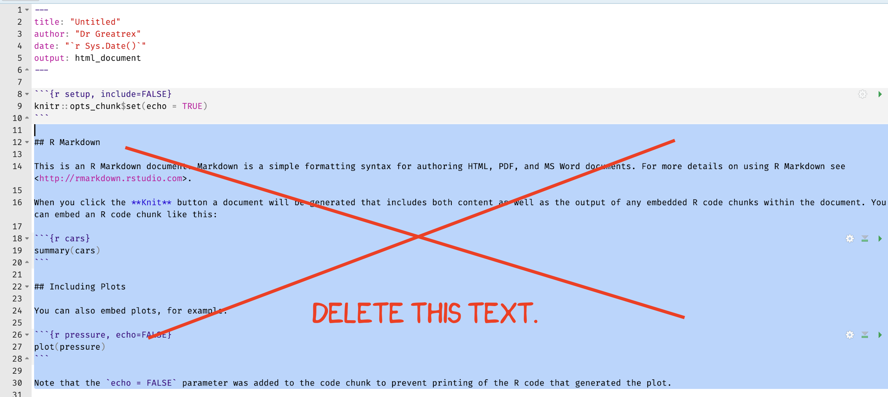

-   **[5B]** Create a level 1 heading called "Questions"

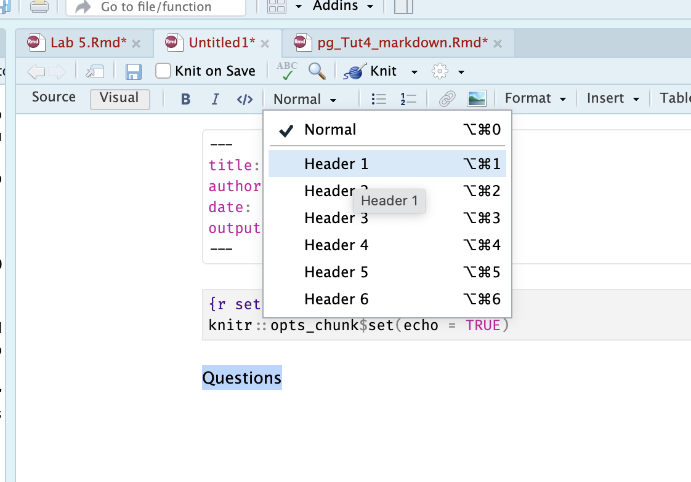

The result should look like this

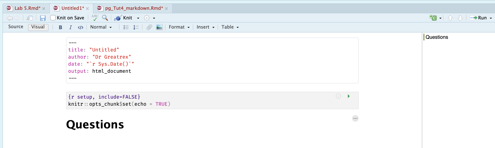

-   **[5C]** Below this, using bullet points and clearly marking what your answer refers to, answer these questions:

    -   [**5C.Q1:**]{.underline} Using a bullet point list (hint visual mode, then click the bullet button), in your own words, state the difference between viewing your lab script using the Source Button vs the Visual Button (try it!) [Tutorial](#T32A_visualmode)

    -   [**5C.Q2:**]{.underline} In your own words and based on what you learned from Monday's lecture notes (lecture 3D), describe the central limit theorem.

Press knit and check it still works.

<br>

------------------------------------------------------------------------

### STEP 6: R-Coding {.unnumbered}

The following questions link to your homework and datacamp. For those who have programmed in R, they are trivial, but use it to get used to the markdown format. If you are struggling, try the datacamp homework first.

Now make a new heading/sub heading and make a new code chunk.[see here for what to click](#T32Da_Adding)

Inside the code chunk, answer the following questions using R. I have already completed question 1 for you to give you a worked example.

-   **[6A]** Calculate the sum of 1+1 and assign/save it to the variable 'a' (e.g. a \<- 1+1)


``` r
a <- 1+1
```

-   **[6B]** Calculate the sum of 1+3 and assign it to the variable 'b'

-   **[6C]** Calculate your age to the power 4 and assign it to a variable called your name (e.g. mine would be `helen <-` )

-   **[6D]** Calculate the sum of a/b and assign it to the variable ans

-   **[6E]** Calculate the number of characters in the word "Llanfairpwllgwyngyllgogerychwyrndrobwllllantysiliogogogoch" using the nchar command (hint <https://www.educative.io/answers/how-to-calculate-the-size-of-a-string-using-nchar-in-r>, and USE QUOTES)

<br>

------------------------------------------------------------------------

### STEP 7: MPG Data {.unnumbered}

In class we discussed about both numerical and graphical summaries to describe the data.You will be using the `mpg` dataset available in R to make some numerical and graphical summaries. **Hint - press knit after every question to check there are no coding errors before you move on.**

The mpg dataset contains a subset of the fuel economy data that the EPA makes available on <https://fueleconomy.gov/>. It contains only models which had a new release every year between 1999 and 2008 - this was used as a proxy for the popularity of the car.

-   **[7A]** Make a new heading called Car Analysis

-   **[7B]** We need one more library/package. Just as you did in Step 3, go to the packages tab, click install to go to the app store and install the `datasets` package.

Just like downloading a phone app from the app-store doesn't mean that it's automatically open on your phone, we need to load the datasets library every time we want to use it. To do this, we include a line of code in your report which loads the app:

-   **[7C]** Create a new code chunk, and add this command exactly, including the options at the top.<br>

<div class="figure">
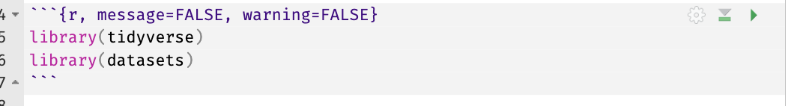
<p class="caption">(\#fig:L1-Loadpackages)Type this exactly then run the code chunk. It will only work if you have first installed the packages from the appstore</p>
</div>

-   This will load the `datasets` and `tidyverse` packages which will allow us to use their commands in our analysis.<br>
    -   The options mean that it won't show any error messages or warnings when you press knit.<br>
    -   Run the code chunk by pressing the green arrow. The first time you run it, you might see a load of "friendly loading text". Press the green arrow a second time and it should go away.

<br>

-   **[7D]** One by one, type the three lines below into the CONSOLE (not into a code chunk).
    -   The `?` will bring up the help file for mpg, which contains valuable information about the dataset. You can type `?` before any command and built in dataset and it will bring up the help file.\
    -   The `head` command prints the first 5 lines and
    -   The `View` command opens the data in a new tab (close it to go back to your report)

<div class="figure">
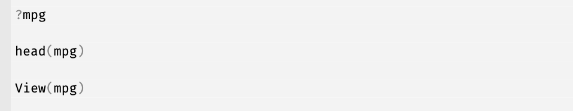
<p class="caption">(\#fig:L1-ViewData)Type each line into the CONSOLE</p>
</div>

<br>

-   **[7E]** Using the help file and your analysis of the data, in your report, write as clearly and accurately as you can: *(note, chatGPT often gets these wrong! rely on the lecture notes and write up in your own writing)*
    -   The object of analysis
    -   The specific sampling frame the data came from
    -   A reasonable target population, stating who or what the results are meant to apply to beyond the data you sampled from. Justify why you chose that population.
    -   List each variable using a bullet point list, explaining what each one is, including units as available and stating what type of data each one is (e.g. nominal, ordinal etc). Justify your decision!

<br>

-   **[7F]** Calculate the mean year of manufacture of the mpg car models. To do this you apply the `mean` command to the `year` column of the mpg data. If you're unsure, try the datacamp homework or see here <https://www.statology.org/r-mean-of-column/>

<br>

-   **[7G]** Make a new code chunk. Use the `str` command to look at the structure of your data e.g. make a new code chunk and type `str(mpg)`. From this, write down how many variables there are and how many objects are in the data.frame.

<br>

-   **[7H]** Make a new code chunk. In the same way as 7F, use the `summary` command to look at the summary statistics of your data

    -   You should see that R thinks many of your categorical variables are either descriptive text or numeric. To fix this, you are going to convert each categorical column to a factor, using the `factor` command. The two commands below will teach R that the `trans` and `model` columns are categorical data (called 'factors in R'). <br>

    -   Make a new code chunk , copy these across and add more lines for every column that should be categorical. Run the code chunk (nothing will seem to happen on the outside).


``` r
mpg$trans        <- factor(mpg$trans)
mpg$model        <- factor(mpg$model)
```

<br>

-   **[7I]** Now make another new code chunk and run the summary command again on the mpg data. You should see a lot more information. Use this information and your previous code to tell me *what percentage* of the care models are the civic model.

Congrats! Finished!

------------------------------------------------------------------------

<br>

## WHAT TO SUBMIT {.unnumbered}

### If you are using your own laptop {.unnumbered}

Press knit one final time. You will have created two files; a `.Rmd` file containing your code and a `.html` file for viewing your finished document.

Find the html and RmD files in your Lab 1 folder on your computer. Double click the html file to open it in your browser and check it's the one you want to submit.

**You need to submit BOTH of these files on the relevant Canvas assignment page.**

You can also add comments to your submission as needed on the canvas page, or you can message Dr G.

<div class="figure">
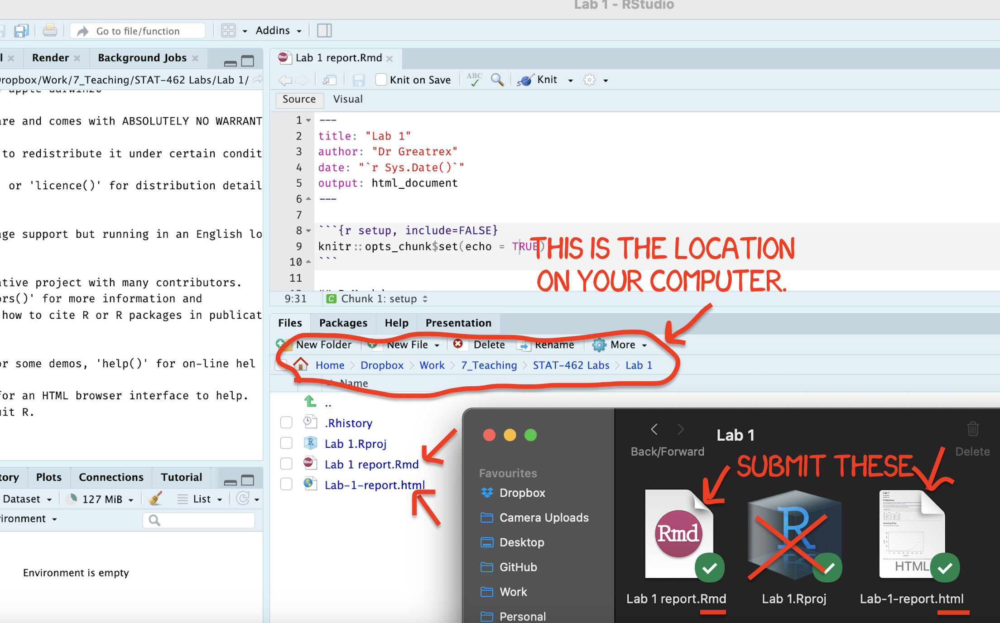
<p class="caption">(\#fig:L1-Submit)Find them in your STAT462 folder on your computer</p>
</div>

### If you are using Posit Cloud online {.unnumbered}

1.  Press knit one final time. You will have created two files; a `.Rmd` file containing your code and a `.html` file for viewing your finished document.

2.  Go to the files tab an click on the little check-box by the RmD file. Then click the blue "more button" and press export. Save onto your computer.

<div class="figure">

<p class="caption">(\#fig:L1-CloudDownload)How do download the files from PositCloud</p>
</div>

2.  Uncheck the .RmD box and click the box by the html file. Then click the blue "more button" and press export. Save onto your computer.

**You need to submit BOTH of these files on the relevant Canvas assignment page.**

You can also add comments to your submission as needed on the canvas page, or you can message Dr G.

<br>

## CHECK YOUR GRADE! {#CheckGradeL1 .unnumbered}

### RUBRIC {.unnumbered}

This is how you will be graded (percent)

-   **HTML FILE SUBMISSION - 10 marks**

-   **RMD CODE SUBMISSION - 10 marks**

-   **MARKDOWN/CODE STYLE - 15 MARKS** <br> How to get full marks for this:

    -   Your YAML code is working e.g. when you press knit, you see your author name, a table of contents etc etc (see step 4)

    -   Your code and document is neat and easy to read. LOOK AT YOUR HTML FILE IN YOUR WEB-BROWSER BEFORE YOU SUBMIT. For example:

        -   There is a spell check next to the save button.

        -   You have written in full sentences and it is clear what question your answers are referring to.

        -   You have included units!

        -   You have included formatting like headings/subheadings and bullets. Many people make typos with the headings. The easiest way to do it is to use visual mode, then highlight the text and click Header 1, Header 2 etc.

-   **WRITTEN QUESTIONS/R-MARKDOWN: 15 MARKS** <br> You have answered the questions in Step 5 clearly and thoughtfully in a way I could use as a class example.

-   **R-CODING: 15 MARKS** <br> You have managed to successfully complete all the code challenges

-   **MPG ANALYSIS: 15 MARKS** <br> You included all the code and successfully answered the questions, providing reasoning where appropriate

[80 marks total]

Overall, here is what your lab should correspond to:

<table class=" lightable-classic-2 table table-striped table-hover table-responsive" style='font-family: "Arial Narrow", "Source Sans Pro", sans-serif; margin-left: auto; margin-right: auto; margin-left: auto; margin-right: auto;'>
 <thead>
  <tr>
   <th style="text-align:left;"> POINTS </th>
   <th style="text-align:left;"> Approx grade </th>
   <th style="text-align:left;"> What it means </th>
  </tr>
 </thead>
<tbody>
  <tr>
   <td style="text-align:left;"> 98-100 </td>
   <td style="text-align:left;"> A* </td>
   <td style="text-align:left;"> Exceptional.  Above and beyond.   THIS IS HARD TO GET. </td>
  </tr>
  <tr>
   <td style="text-align:left;"> 93-98 </td>
   <td style="text-align:left;"> A </td>
   <td style="text-align:left;"> Everything asked for with high quality.   Class example </td>
  </tr>
  <tr>
   <td style="text-align:left;"> 85-93 </td>
   <td style="text-align:left;"> B+/A- </td>
   <td style="text-align:left;"> Solid work but the odd  mistake or missing answer in either the code or interpretation </td>
  </tr>
  <tr>
   <td style="text-align:left;"> 70-85 </td>
   <td style="text-align:left;"> B-/B </td>
   <td style="text-align:left;"> Starting to miss entire/questions sections, or multiple larger mistakes. Still a solid attempt.  </td>
  </tr>
  <tr>
   <td style="text-align:left;"> 60-70 </td>
   <td style="text-align:left;"> C/C+ </td>
   <td style="text-align:left;"> It’s clear you tried and learned something.  Just attending labs will get you this much as we can help you get to this stage </td>
  </tr>
  <tr>
   <td style="text-align:left;"> 40-60 </td>
   <td style="text-align:left;"> D </td>
   <td style="text-align:left;"> You submit a single word AND have reached out to Dr G or Aish for help before the deadline (make sure to comment you did this so we can check) </td>
  </tr>
  <tr>
   <td style="text-align:left;"> 30-40 </td>
   <td style="text-align:left;"> F </td>
   <td style="text-align:left;"> You submit a single word…....  ANYTHING..                Think, that's 30-40 marks towards your total…. </td>
  </tr>
  <tr>
   <td style="text-align:left;"> 0+ </td>
   <td style="text-align:left;"> F </td>
   <td style="text-align:left;"> Didn’t submit, or incredibly limited attempt.  </td>
  </tr>
</tbody>
</table>

<!--chapter:end:in_02-Lab1.Rmd-->


# Lab 2 {#Lab_2 .unnumbered}

## LAB AIM {.unnumbered}

Welcome to Lab 2. This is worth 8% (80 points) and you can drop your lowest lab out of six.

This is a ONE WEEK LAB. You only have one lab session (today) working on this during class, then until next Friday to finish up and write up. The maximum time it should take is about 4-5 hrs of your time.

The aim of this lab is to solidify your knowledge creating your lab reports, and to start thinking about regression topics.

<br>

------------------------------------------------------------------------

## LAB SET-UP (Important!) {.unnumbered}

### STEP 1: IMPORTANT - Create a Lab 2 project.. {.unnumbered}

You need a separate project for every lab!

-   **[2A]** Go here to read more about projects and to make a project for Lab 2: [Projects](#T1_Projects)

-   **[2B]** If you haven't already, open your project in R-Studio. It should look like this, but say Lab 2 for everything.

<div class="figure">

<p class="caption">(\#fig:L2-Projectcheck)How to check you are in a project</p>
</div>

<br>

------------------------------------------------------------------------

### STEP 2: Download code-Packages from the app store.. {.unnumbered}

Today we need a few new libraries/apps. Just like last week, select and install the ones you need from the "app store"

-   **[3A]** Follow the instructions here ([Installing Packages](#T2_Libraries_install)) to go to the 'install/app store' and install these three packages:

    -   `rmdformats`

    -   `tidyverse`

    -   `ggstatsplot`

    -   `palmerpenguins`

    -   `tidyr`

We will load and use them later in the lab.

------------------------------------------------------------------------

### STEP 3: Create your lab report structure {.unnumbered}

-   **[4A]** Using the tutorial instructions, make a new RMarkdown Report ([Markdown Tutorial](#T31_Basics))

-   **[4B]** Open your RmD report file (click on its name in the files tab, as long as you are running your project). Click visual mode and see if you can identify the code chunks, space for text and yaml files.

-   **[4C]** Using the [YAML tutorial](#Tut4E_YAML), edit the YAML code to include, A title, your author name, automatically created today's date, a floating table of contents, numbered sections (this won't appear until you start typing section headings) and the lumen theme. (See the screenshot below)

-   **[4D]** Now you are going to delete all "the friendly welcome text" (leaving the code at the top), so you have space to write your answers. (see the screenshot below)

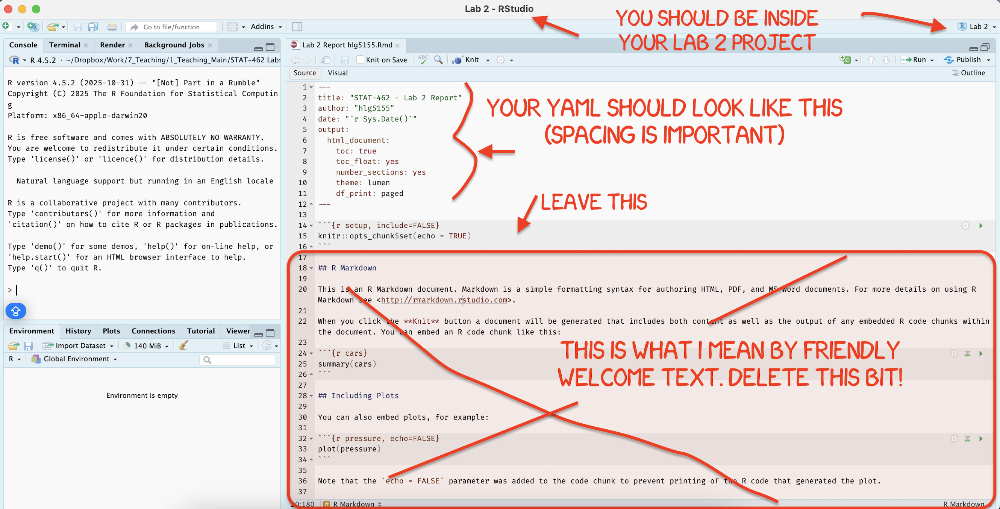

-   **[4D]** Now, lets set up your report structure.

    -   Write the. following three level-1 chapter headings (bold), with the sub-headings as Level-2. Remember that to do this in `source` mode, you need to use a single \# for level 1 and a double \## for level 2. If you are in `visual` mode, type the headings, then click on that line, and click the little arrow next to Normal. \*see screenshot below)

        -   **Markdown Practice**

            -   Libraries

            -   Favorite Picture

        -   **Data Analysis**

            -   Data Description
            -   Data summary
            -   Remove missing data
            -   Scatterplot
            -   Initial Regression

-   **[4F]** Click knit. This should work, ask you to save (then click knit again) and create a html file in your lab 2 folder AND show you it on your screen. IF YOU HAVE PROBLEMS ASK FOR HELP

-   **[4G]** Close down the html file so that you are back in your lab report again.

<br>

------------------------------------------------------------------------

## 1. MARKDOWN PRACTICE {.unnumbered}

In these questions, I want you to see how easy it is to insert things like images, to realise that you can just type text in the report without any special formatting and to learn that its always good to put your library loading code chunk at the top of your report.

### Q1.1: Libraries & Packages {.unnumbered}

Up until now we have downloaded many libraries/packages from the app store. These are now on your computer but to USE them, we need to open the ones we want (just like you click on an app's icon to open it before you can use it).

We do this using the "library" command. Because there are often many packages we need to load and they can easily break, it's good practice to put ALL your library commands at the start of each report. We also want to make sure that they don't destroy our report format when we knit.

-   **[A]** Underneath your Libraries subheading, make a new code chunk. Leave lots of blank lines to give yourself space! R automatically tidies them up.

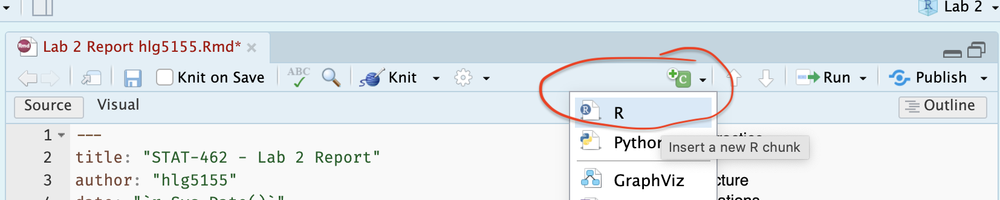

-   **[A]** Inside type the following case sensitive commands and run the code chunk by clicking the little green arrow on the top right of the code chunk. You should see a load of welcome text.
    -   If you see an error that says you don't have the library, go to the app store and install it! (see the libraries tutorial)


``` r
library(tidyverse)
library(dplyr)
library(ggstatsplot)
library(palmerpenguins)
library(tidyr)
```

-   **[B]** If you press the green arrow a second time, the welcome text should disappear.

-   **[C]** Now press knit. You should see that the library loading text makes your report messy. We are going to fix this using **code chunk options**.

-   **[D]** Look at the VERY TOP LINE of the code chunk. The one starting. \`\`\`{r .

    -   Click after the R and press comma (e.g. press , ). You should see a list of options appear.\
    -   Add these two options, messages=FALSE and warnings=FALSE. e.g.

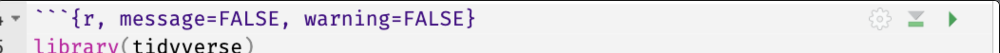

-   **[E]** Save and press knit again. Your report should look much neater.

-   **[F]** Now click in the white report space below the code chunk. In the text, write two or three sentences to explain what a code chunk option is and tell me about three more options that could be useful. Hint, the tutorial has the answers! Go to the RMarkdown tutorial and then section 3.7 (deliberately no link so you look around the tutorials!)

<br>

### Q1.2: Adding photographs {.unnumbered}

-   **[A]** Find ANY image or photograph of your choice! Take a screenshot or download it. Make sure it is a .jpeg or a .png file format and rename the image to something sensible easy to type.<br>

    -   If you are on your laptop, **put the image/photo file inside your Lab 2 project folder.**

    -   If you are using posit cloud, click on the File tab, then press "upload" and upload the photo into your project. <br>

-   **[B]** Go back to R-studio and make sure you are in visual mode. Click on the little "add picture icon at the top" and insert your picture underneath the Favorite Picture heading.

-   **[C]** Underneath the picture in the white space, type at least 2 sentences to explain why you chose that image. You do not need any \# in front of the text, just write.

Here are all the steps above, in both visual and source mode

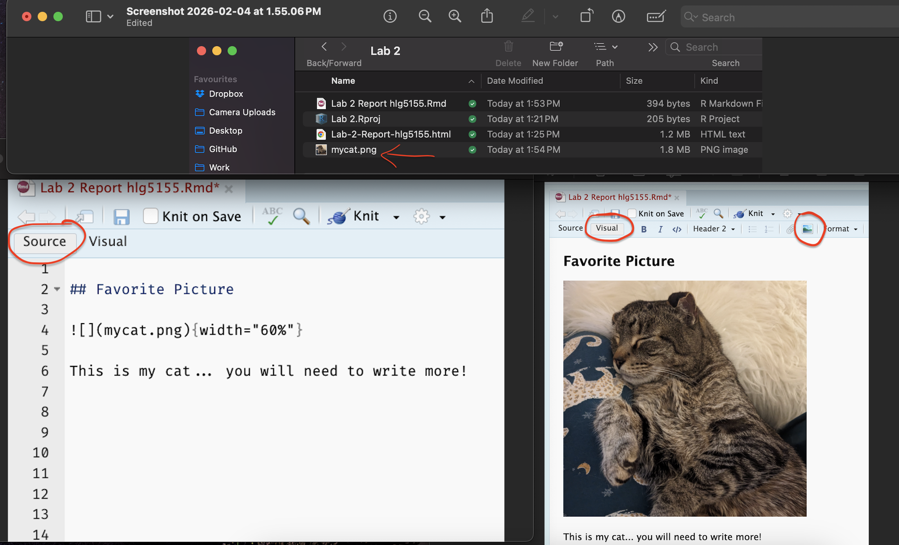

-   **[D]** Press knit and check it still works.

<br>

------------------------------------------------------------------------

## 2. DATA ANALYSIS {.unnumbered}

We're now going to build on this week's lectures to understand more about penguins. The data we are using comes from the Palmer Penguins library we loaded earlier.

#### Important! {.unnumbered}

The data we are using comes from the Palmer Penguins library we loaded earlier. If you are coming back to the lab after closing R-Studio, RE-RUN THE LIBRARY CODE CHUNK, OR GO TO THE RUN BUTTON (top right) AND CLICK RUN ALL. Restarting R is like restarting your phone. You don't need to redownload libraries from the app store, but you DO need to reopen them.

<br>

#### STEP 1 {.unnumbered}

We want to load the data and take a look at it. First let's look at the help file. There are actually TWO datasets called penguins, so we want to choose the one from palmer penguins

-   **[A]** First type `?penguins` into the CONSOLE (not into a code chunk) and press enter. You will be given an option of two help files. Choose the one from palmer penguins and read about the dataset.

<div class="figure">
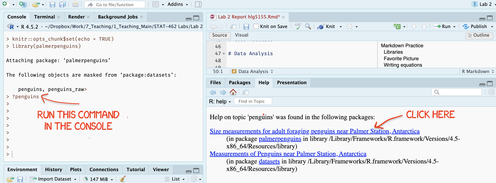
<p class="caption">(\#fig:L2-PenguinsHelp)Type each line into the CONSOLE</p>
</div>

-   **[B]** Now type `head(penguins)` into the CONSOLE (not into a code chunk) and press enter. You will see the first 5 lines of the data. Good check to see if it loaded

-   **[C]** Now type `View(penguins)` into the CONSOLE (not into a code chunk) and press enter. It will open a new tab containing the data spreadsheet.

<br>

-   **[Q3.1]** Now go back to your report. Underneath "data description", leave a few blank lines, then describe/list everything we need to know about this data to conduct our analysis. You are welcome and encouraged to use additional sub-headings, bullets or any other formatting to make this easier to grade.
    -   HINT/HELP, see the handout from Monday's lecture ([WEEK 4 - L4A Basic Regression Handout salary.pdf](https://psu.instructure.com/courses/2450096/files/188222526)), or Homeworks 1 & 2 or the lecture slides.
    -   I am grading you against the specific list I gave in class, so don't randomly ask chatgpt!

<br>

**You are going to be conducting an analysis of whether the `flipper length` of a penguin impacts its `mass`.**

-   **[Q3.2]** Below your text, make a new code chunk and inside, run the `names()` command on the penguins data e.g. type `names(penguins)` and run.
    -   Underneath the code chunk, identify the response variable and the predictor variable. For each one, write
        -   The EXACT column name (case sensitive)
        -   What its referring to (including units) - remember the help file!
        -   Whether it's the response or predictor variable.

<br>

**Now look at the summary of the data**

-   **[Q3.2]** Under the Data summary heading, make a new code chunk and run the `summary` command on the penguins dataset (just like you did for the names command).
-   Underneath, use the output to identify the following. Please use full sentences
    -   What the mean bill length is (remember units!)
    -   How many penguins are found on Dream island
    -   How many penguins have a missing body mass

<br>

**At least at first, it's useful to remove any missing values from our dataset, at least for the columns we care about**

-   **[Q3.3]** We don't want to use any object where our response or predictor are missing. So first, we want to remove missing values - and we save the result to a new spreadsheet called `penguins_clean` . The `drop_na` command from the `tidyr` package makes this very easy as we can simply tell it which columns we care about
    -   Underneath your remove missing data heading, make a new code chunk.
    -   Copy this code into it, then EDIT/FINISH the XXXXXXX part of the code to remove data for our response and predictor variable (hint, remember you typed the column names exactly above..)
    -   Run the code and look at your environment tab. You should see that there is now penguins and penguins_clean, and one has two less objects.


``` r
#THIS CODE NEEDS COMPLETING BEFORE IT WILL RUN!
penguins_clean <- drop_na(
  data=penguins,
  flipper_length_mm,
  XXXXXXX
)
```

<br>

**Making a scatterplot!**

-   **[Q3.4]** Now.. we want to make a scatterplot to see the impact of flipper length on mass. Go to the [GGplot2 scatterplot tutorial](https://psu-spatial.github.io/Stat462-2026/T6_plots.html#ggplot2-scatterplots) and use this to make a professional looking scatterplot with NO line of best fit. (by professional, you need good axis labels inc units, clear/easy to read etc).

<br>

**Describe the scatterplot**

-   **[Q3.5]** Using this Khan academy tutorial as a guide, [[CLICK HERE](https://www.khanacademy.org/math/ap-statistics/bivariate-data-ap/scatterplots-correlation/a/describing-scatterplots-form-direction-strength-outliers)], in your report, describe the form, direction, strength and if there are unusual features in the data.

<br>

**Create your first regression output**

-   **[Q3.6]** Now, you will create your first linear regression fit. Copy and run this line in the appropriate place in your lab report.


``` r
model1 <- lm(body_mass_g ~ flipper_length_mm, data=penguins)
model1
```

-   Underneath, interpret what the intercept and gradient mean in terms of penguins

<br>

**Critique**

-   **[Q3.7]** If you look here, <https://allisonhorst.github.io/palmerpenguins/> you can see that the owner of palmer penguins has made a more advanced scatterplot.  In your report, critique your basic analysis in terms of understanding the relationship between flipper length and bodymass.  How might this change your population or interpretation?


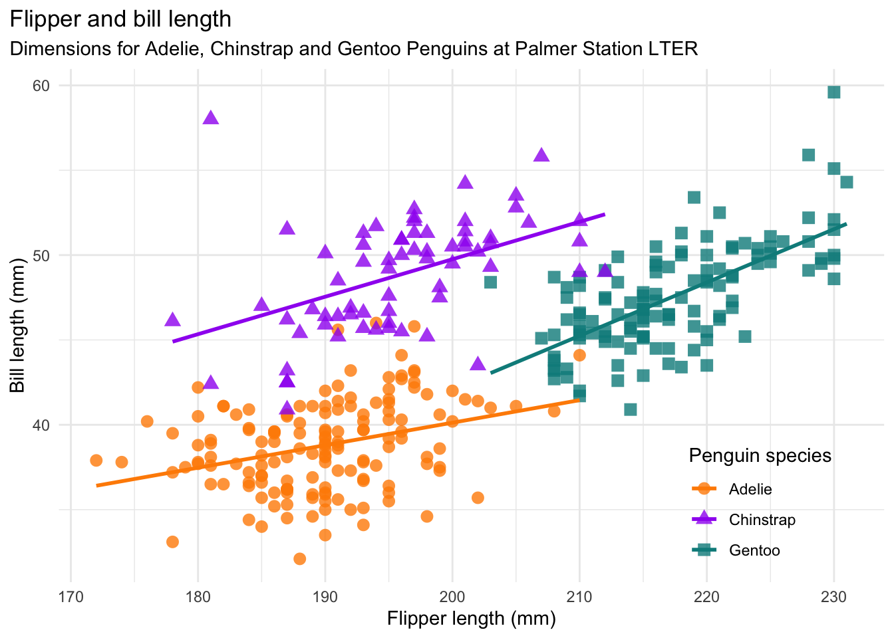

### Bonus {.unnumbered}

This tutorial is also meant to link to the code to make the lovely plot above.
https://allisonhorst.github.io/palmerpenguins/ 

If you work out how to recreate the plot exactly, I will award up to 5 bonus marks within the Lab total (e.g. max=80 points) - depending on how close you get. 

(you are welcome to search for the exact code!)

<br>


Congrats! Finished

------------------------------------------------------------------------

<br>

## 4. WHAT TO SUBMIT {.unnumbered}

### If you are using your own laptop {.unnumbered}

Press knit one final time. You will have created two files; a `.Rmd` file containing your code and a `.html` file for viewing your finished document.

Find the html and RmD files in your Lab 1 folder on your computer. Double click the html file to open it in your browser and check it's the one you want to submit.

**You need to submit BOTH of these files on the relevant Canvas assignment page.**

You can also add comments to your submission as needed on the canvas page, or you can message Dr G.

<div class="figure">

<p class="caption">(\#fig:L2-Submit)Find them in your STAT462 folder on your computer</p>
</div>

### If you are using Posit Cloud online {.unnumbered}

1.  Press knit one final time. You will have created two files; a `.Rmd` file containing your code and a `.html` file for viewing your finished document.

2.  Go to the files tab an click on the little check-box by the RmD file. Then click the blue "more button" and press export. Save onto your computer.

<div class="figure">

<p class="caption">(\#fig:L2-CloudDownload)How do download the files from PositCloud</p>
</div>

2.  Uncheck the .RmD box and click the box by the html file. Then click the blue "more button" and press export. Save onto your computer.

**You need to submit BOTH of these files on the relevant Canvas assignment page.**

You can also add comments to your submission as needed on the canvas page, or you can message Dr G.

<br>

## CHECK YOUR GRADE! {#CheckGradeL2 .unnumbered}

### RUBRIC {.unnumbered}

This is how you will be graded (percent)

-   **HTML FILE SUBMISSION - 10 marks**

-   **RMD CODE SUBMISSION - 10 marks**

-   **MARKDOWN/CODE STYLE - 20 MARKS** <br> How to get full marks for this:

    -   Your YAML code is working e.g. when you press knit, you see your author name, a table of contents etc etc (see step 4)

    -   Your code and document is neat and easy to read. LOOK AT YOUR HTML FILE IN YOUR WEB-BROWSER BEFORE YOU SUBMIT. For example:

        -   There is a spell check next to the save button.

        -   You have written in full sentences and it is clear what question your answers are referring to.

        -   You have included units!

        -   You have included formatting like headings/subheadings and bullets. Many people make typos with the headings. The easiest way to do it is to use visual mode, then highlight the text and click Header 1, Header 2 etc.

-   **WRITTEN QUESTIONS/R-MARKDOWN: 15 MARKS** <br> You have answered the questionsclearly and thoughtfully in a way I could use as a class example.

-   **PENGUIN ANALYSIS: 25 MARKS** <br> You included all the code and successfully answered the questions, providing reasoning where appropriate

[80 marks total]

Overall, here is what your lab should correspond to:

<table class=" lightable-classic-2 table table-striped table-hover table-responsive" style='font-family: "Arial Narrow", "Source Sans Pro", sans-serif; margin-left: auto; margin-right: auto; margin-left: auto; margin-right: auto;'>
 <thead>
  <tr>
   <th style="text-align:left;"> POINTS </th>
   <th style="text-align:left;"> Approx grade </th>
   <th style="text-align:left;"> What it means </th>
  </tr>
 </thead>
<tbody>
  <tr>
   <td style="text-align:left;"> 98-100 </td>
   <td style="text-align:left;"> A* </td>
   <td style="text-align:left;"> Exceptional.  Above and beyond.   THIS IS HARD TO GET. </td>
  </tr>
  <tr>
   <td style="text-align:left;"> 93-98 </td>
   <td style="text-align:left;"> A </td>
   <td style="text-align:left;"> Everything asked for with high quality.   Class example </td>
  </tr>
  <tr>
   <td style="text-align:left;"> 85-93 </td>
   <td style="text-align:left;"> B+/A- </td>
   <td style="text-align:left;"> Solid work but the odd  mistake or missing answer in either the code or interpretation </td>
  </tr>
  <tr>
   <td style="text-align:left;"> 70-85 </td>
   <td style="text-align:left;"> B-/B </td>
   <td style="text-align:left;"> Starting to miss entire/questions sections, or multiple larger mistakes. Still a solid attempt.  </td>
  </tr>
  <tr>
   <td style="text-align:left;"> 60-70 </td>
   <td style="text-align:left;"> C/C+ </td>
   <td style="text-align:left;"> It’s clear you tried and learned something.  Just attending labs will get you this much as we can help you get to this stage </td>
  </tr>
  <tr>
   <td style="text-align:left;"> 40-60 </td>
   <td style="text-align:left;"> D </td>
   <td style="text-align:left;"> You submit a single word AND have reached out to Dr G or Aish for help before the deadline (make sure to comment you did this so we can check) </td>
  </tr>
  <tr>
   <td style="text-align:left;"> 30-40 </td>
   <td style="text-align:left;"> F </td>
   <td style="text-align:left;"> You submit a single word…....  ANYTHING..                Think, that's 30-40 marks towards your total…. </td>
  </tr>
  <tr>
   <td style="text-align:left;"> 0+ </td>
   <td style="text-align:left;"> F </td>
   <td style="text-align:left;"> Didn’t submit, or incredibly limited attempt.  </td>
  </tr>
</tbody>
</table>

<!--chapter:end:in_02-Lab2.Rmd-->


# Lab 3 {#Lab_3 .unnumbered}

## LAB AIM {.unnumbered}

Welcome to Lab 3. This is worth 8% (80 points) and you can drop your lowest lab out of six.

This is a ONE WEEK LAB. You only have one lab session (today) working on this during class, then until next Friday to finish up and write up. The maximum time it should take is about 4-5 hrs of your time.

<br>

------------------------------------------------------------------------

## 1. LAB SET-UP (Important!) {.unnumbered}

### STEP 1: IMPORTANT - Create a Lab 3 project.. {.unnumbered}

You need a separate project for every lab!

-   **[1A]** Go here to read more about projects and to make a project for Lab 3: [Projects](#T1_Projects)

-   **[1B]** If you haven't already, open your project in R-Studio. It should look like this, but say Lab 3 for everything.

<div class="figure">

<p class="caption">(\#fig:L3-Projectcheck)How to check you are in a project</p>
</div>

<br>

------------------------------------------------------------------------

### STEP 2: Download code-Packages from the app store.. {.unnumbered}

Today we need a few new libraries/apps. Just like last week, select and install the ones you need from the "app store"

-   **[2A]** Follow the instructions here ([Installing Packages](#T2_Libraries_install)) to go to the 'install/app store' and install these package(s):

    -   `olsrr`

We will load and use them later in the lab.

------------------------------------------------------------------------

### STEP 3: Create your lab report structure {.unnumbered}

-   **[3A]** Using the tutorial instructions, make a new RMarkdown Report ([Markdown Tutorial](#T31_Basics))

-   **[3B]** Open your RmD report file (click on its name in the files tab, as long as you are running your project). Click visual mode and see if you can identify the code chunks, space for text and yaml files.

-   **[3C]** Using the [YAML tutorial](#Tut4E_YAML), edit the YAML code to include, A title, your author name, automatically created today's date, a floating table of contents, numbered sections (this won't appear until you start typing section headings) and the lumen theme. (See the screenshot below)

-   **[3D]** Now you are going to delete all "the friendly welcome text" (leaving the code at the top), so you have space to write your answers. (see the screenshot below)


-   **[3E]** Now, lets set up your report structure.

    -   Write the. following three level-1 chapter headings (bold), with the sub-headings as Level-2. Remember that to do this in `source` mode, you need to use a single \# for level 1 and a double \## for level 2. If you are in `visual` mode, type the headings, then click on that line, and click the little arrow next to Normal. \*see screenshot below)

        -   **Plant Sales**

            -   Data Description
            -   Data summary
            -   Quality control
            -   Exploratory Analysis
            -   Initial Regression

-   **[4F]** Click knit. This should work, ask you to save (then click knit again) and create a html file in your lab 3 folder AND show you it on your screen. IF YOU HAVE PROBLEMS ASK FOR HELP

-   **[4G]** Close down the html file so that you are back in your lab report again.

<br>

------------------------------------------------------------------------

### STEP 4: Get the input data {.unnumbered}

-   **[4A]** Go to Canvas Lab or click this link to download "[advertising.csv](https://psu.instructure.com/courses/2450096/files/189331361/download?download_frd=1)". Put it in your Lab 3 folder.

------------------------------------------------------------------------

## 2. SELLING HOUSEPLANTS {.unnumbered}

Houseplants are the new big thing and you're going to make the world want to buy them! You are a top advertising executive at Leaves&Co and you have been collecting data on how well your marketing campaigns have been running.

You have run 200 marketing campaigns over the last few year. For each one, you recorded:

-   How much you spent (in units of thousands of dollars) on
    -   TV adverts
    -   radio adverts
    -   and newspaper adverts
-   How many houseplants were sold (in thousands of plants).
-   You also know the "X-Factor" of how popular that plant was at the time (percentage popularity),
-   And you know the general height of type plant in inches.

Your job now is to explore the data work out which type of advertising campaign is the most effective.

### Your Answer format {.unnumbered}

**Imagine this is a real report in an advertising company. You will be graded on the professionalism of your final report.**

In all of your answers below, I expect good formatting, appropriate units and full sentences to explain your answers. For example, please make sure that you use headings and sub-headings to make your lab easier to follow and grade.

You are welcome to use any/all of the markdown features we have learned so far, for example equations, text formatting, pictures, code-chunk options or anything else that makes your report look more professional.

All the methods to answer these questions are either things you have done in previous labs or they are in the Tutorials.


### Step 2.1: Read in data {.unnumbered}

-   Read the data into R and assign it to a variable called "adverts".  See this tutorial on reading in data [Tutorial_CSV](#T4_load_csv)

<br>

### Step 2.2: Exploratory analysis/study design {.unnumbered}

-   Summarize the the dataset using R and suggest any quality control issues (e.g. unusual values, missing data etc). For summary commands, see [Tutorial 5](#T5_Summarising))

-   Write up your study design e.g. object of analysis, sampling frame, the potential population your CEO has in mind, variables (and units.), sample size.

<br>

### Step 2.3: Quality control {.unnumbered}

You should have noticed a few issues with your dataset.

-   Use [Tutorial 8](#T8_RowSelect) on filtering to remove the row containing the impossible data point (hint use the tidyverse option)

-   Use the "na.omit" command on "adverts" to remove any rows containing missing values. (see [Tutorial 5](#T5_naomit) or look here (<https://www.r-bloggers.com/2024/12/how-to-use-na-omit-in-r-a-comprehensive-guide-to-handling-missing-values/>).

-   In the text below your code, record what you did, eg how many rows were removed? Why? Why do you think -999 wasn't a "real" value.

<br>

### Step 2.4: Exploratory analysis {.unnumbered}

-   Now that you have tidied your data, repeat your summaries of the dataset as a whole

-   Create a professional histogram of each variable and underneath each one, write a few sentences describing the each variable and anything you see. (See [Tutorial 8 on histograms](#T7_Histograms)).

<br>

### Step 2.5: Initial scatterplots {.unnumbered}

You are trying to predict sales.

FOR EACH PREDICTOR (TV, Radio, Newspaper, Plant height)

-   Use the `lm()` command to create a simple linear regression model to predict sales (See [Tutorial 11](#T11_RunModel))

-   Create a professional scatterplot for each of the others against your response including the line of best fit (for scatterplots, see [Tutorial 8 Scatterplots](#T7_PlotGGPlotWLine))

-   Underneath comment on the relationship that each variable appears to have with sales, and describe the form/strength/direction/features of the scatterplot.

-   Write out the equation of each model, explaining what all coefficients mean in the context of the problem),

-   Discuss whether you think each model meets the LINE assumptions from what you see, showing me you understand what each assumption is.

Hint, think about what I have asked you to do in past labs to answer this.

<br>

### Step 2.6: Favourite model {.unnumbered}

-   Out of the three models, where do you see the greatest increase in sales if you increase the advertising budget?

-   Provide evidence to justify your answer (thinking about uncertainties on your estimate).

-   Which model explains the most variability in the sales data? Provide evidence to justify your answer.

-   Are there any issues with your answers (e.g. are all the models valid? - there might be no issues! I genuinely can't remember how I set the data)

<br>

### Step 2.7: Peace lilies {.unnumbered}

-   You have a new client who needs to sell 8000 peace lilies but hates newspapers. Conduct an hypothesis test to assess whether you typically sell less than 8000 plants in a situation where you spend zero-money on newspaper advertising. You are happy to be wrong one time in 25. Can you advise your client it is OK to not advertise in newspapers?

Hint, this is VERY similar to the example here: [Tutorial 11 tests](#T11_SigOther))

<br>

### Step 2.8: TV fears {.unnumbered}

-   Another client is skeptical of TV. Use the ANOVA table output to conduct a hypothesis test to examine if there is evidence to suggest a relationship between TV advertising and plant sales at a significance of 1%.

Hint, see week 6 lecture notes and [Tutorial 11 tests](#T11_Output))


<br>

### Step 2.9: Summary {.unnumbered}

-   Imagine you have to summarise what you have done for your boss. What are the messages they should take from this dataset in terms of their advertising campaigns?

Congrats! Finished

------------------------------------------------------------------------

<br>

## 3. WHAT TO SUBMIT {.unnumbered}

### If you are using your own laptop {.unnumbered}

Press knit one final time. You will have created two files; a `.Rmd` file containing your code and a `.html` file for viewing your finished document.

Find the html and RmD files in your Lab 1 folder on your computer. Double click the html file to open it in your browser and check it's the one you want to submit.

**You need to submit BOTH of these files on the relevant Canvas assignment page.**

You can also add comments to your submission as needed on the canvas page, or you can message Dr G.

<div class="figure">

<p class="caption">(\#fig:L3-Submit)Find them in your STAT462 folder on your computer</p>
</div>

### If you are using Posit Cloud online {.unnumbered}

1.  Press knit one final time. You will have created two files; a `.Rmd` file containing your code and a `.html` file for viewing your finished document.

2.  Go to the files tab an click on the little check-box by the RmD file. Then click the blue "more button" and press export. Save onto your computer.

<div class="figure">

<p class="caption">(\#fig:L3-CloudDownload)How do download the files from PositCloud</p>
</div>

2.  Uncheck the .RmD box and click the box by the html file. Then click the blue "more button" and press export. Save onto your computer.

**You need to submit BOTH of these files on the relevant Canvas assignment page.**

You can also add comments to your submission as needed on the canvas page, or you can message Dr G.

<br>

## 4. CHECK YOUR GRADE! {#CheckGradeL3 .unnumbered}

### RUBRIC {.unnumbered}

This is how you will be graded (percent)

-   **HTML FILE SUBMISSION - 10 marks**

-   **RMD CODE SUBMISSION - 10 marks**

-   **MARKDOWN/CODE STYLE - 10 MARKS** <br> How to get full marks for this:

    -   Your YAML code is working e.g. when you press knit, you see your author name, a table of contents etc etc (see step 4)

    -   Your code and document is neat and easy to read. LOOK AT YOUR HTML FILE IN YOUR WEB-BROWSER BEFORE YOU SUBMIT. For example:

        -   There is a spell check next to the save button.

        -   You have written in full sentences and it is clear what question your answers are referring to.

        -   You have included units!

        -   You have included formatting like headings/subheadings and bullets. Many people make typos with the headings. The easiest way to do it is to use visual mode, then highlight the text and click Header 1, Header 2 etc.

-   **EXPLORATORY ANALYSIS/QUALITY CONTROL - 10 MARKS** <br>

    -   You provide a clear and appropriate summary of the dataset using R. You use relevant commands (such as `summary`, tables, or counts) and correctly describe the main characteristics of the data. Your work shows that you explored the dataset thoughtfully and that you explained any code output in the text.

    -   You clearly identify potential quality issues (such as unusual values, impossible values, or missing data). Your explanation shows that these issues were discovered through inspection of the dataset, and you provide clear reasoning for why they may represent problems.

-   **INITIAL ANALYSIS/LINE ASSUMPTIONS - 15 MARKS**

    -   You have created a simple linear regression model using `lm()` for each predictor (TV, Radio, Newspaper, and Plant height) to predict sales. For each predictor, you produced a clear and professional scatterplot of the predictor against sales and included the fitted regression line. Under each plot, you described the relationship between the predictor and sales. Your description addresses the direction, form, and strength of the relationship and notes any important features visible in the scatterplot (such as clustering, curvature, or unusual points).

        You wrote out the regression equation for each model and explain what each coefficient means in the context of predicting sales. You also discussed whether the LINE assumptions appear reasonable based on the scatterplots and model output. Your explanation shows that you understand what each assumption represents and how the plots help you evaluate them.

-   **PEACE LILIES - 10 MARKS**

    -   You correctly set up and conducted a hypothesis test to assess whether expected sales are typically less than 8000 plants when no money is spent on newspaper advertising. You clearly stated the null and alternative hypotheses, identified the significance level and used the regression output appropriately to perform the test.

        You correctly interpreted the result in the context of the problem and explained what the statistical result implies for the client’s decision about newspaper advertising. Your conclusion clearly answers the practical question: whether it is reasonable to advise the client that avoiding newspaper advertising is acceptable based on the evidence from the data.

-   **TV FEARS - 10 MARKS**

    -   You correctly used the ANOVA table from the regression output to conduct a hypothesis test examining whether there is evidence of a relationship between TV advertising and plant sales. You clearly stated the null and alternative hypotheses, identified the significance level, and correctly interpreted the F-test or p-value from the ANOVA table.

        Your explanation shows that you understand what the ANOVA test is assessing in the context of regression. You provide a clear conclusion explaining whether the evidence suggests a relationship between TV advertising and plant sales.

-   **CONCLUSION - 5 MARKS**

    -   You clearly summarised the main findings from your analysis in plain language appropriate for a non-technical audience. e.g. you highlighted the most important insights about the relationship between advertising channels and plant sales and explain what the results suggest about effective advertising strategies.

        Your summary focuses on the practical implications of the analysis rather than repeating technical output.

[80 marks total]

<br>

### Grade meaning {.unnumbered}

Overall, here is what your lab should correspond to:

<table class=" lightable-classic-2 table table-striped table-hover table-responsive" style='font-family: "Arial Narrow", "Source Sans Pro", sans-serif; margin-left: auto; margin-right: auto; margin-left: auto; margin-right: auto;'>
 <thead>
  <tr>
   <th style="text-align:left;"> POINTS </th>
   <th style="text-align:left;"> Approx grade </th>
   <th style="text-align:left;"> What it means </th>
  </tr>
 </thead>
<tbody>
  <tr>
   <td style="text-align:left;"> 98-100 </td>
   <td style="text-align:left;"> A* </td>
   <td style="text-align:left;"> Exceptional.  Above and beyond.   THIS IS HARD TO GET. </td>
  </tr>
  <tr>
   <td style="text-align:left;"> 93-98 </td>
   <td style="text-align:left;"> A </td>
   <td style="text-align:left;"> Everything asked for with high quality.   Class example </td>
  </tr>
  <tr>
   <td style="text-align:left;"> 85-93 </td>
   <td style="text-align:left;"> B+/A- </td>
   <td style="text-align:left;"> Solid work but the odd  mistake or missing answer in either the code or interpretation </td>
  </tr>
  <tr>
   <td style="text-align:left;"> 70-85 </td>
   <td style="text-align:left;"> B-/B </td>
   <td style="text-align:left;"> Starting to miss entire/questions sections, or multiple larger mistakes. Still a solid attempt.  </td>
  </tr>
  <tr>
   <td style="text-align:left;"> 60-70 </td>
   <td style="text-align:left;"> C/C+ </td>
   <td style="text-align:left;"> It’s clear you tried and learned something.  Just attending labs will get you this much as we can help you get to this stage </td>
  </tr>
  <tr>
   <td style="text-align:left;"> 40-60 </td>
   <td style="text-align:left;"> D </td>
   <td style="text-align:left;"> You submit a single word AND have reached out to Dr G or Aish for help before the deadline (make sure to comment you did this so we can check) </td>
  </tr>
  <tr>
   <td style="text-align:left;"> 30-40 </td>
   <td style="text-align:left;"> F </td>
   <td style="text-align:left;"> You submit a single word…....  ANYTHING..                Think, that's 30-40 marks towards your total…. </td>
  </tr>
  <tr>
   <td style="text-align:left;"> 0+ </td>
   <td style="text-align:left;"> F </td>
   <td style="text-align:left;"> Didn’t submit, or incredibly limited attempt.  </td>
  </tr>
</tbody>
</table>

<!--chapter:end:in_02-Lab3.Rmd-->


# Lab 4 {#Lab_4 .unnumbered}


### Aim {.unnumbered}

Welcome to lab 4. This is worth 8% (480 points) and you can drop your lowest lab.

By the end of this lab, you will be able to:

1.  Understand & use regression diagnostics to assess LINE
2.  Apply this knowledge to a real case study on pollution in Florida Lakes

This is a ONE WEEK LAB. You need to finish writing up by next Tuesday (23:59pm) e.g. just before Lab 6 starts.

<br>

### Need help?

REMEMBER THAT EVERY TIME YOU RE-OPEN R-STUDIO YOU NEED TO RE-RUN **ALL** YOUR CODE CHUNKS. The easiest way to do this is to press the "Run All" button (see the Run menu at the top right of your script)

The maximum time this lab should take is about 4-5 hrs of your time.

<br> 


------------------------------------------------------------------------

## 1. LAB SET-UP (Important!) {.unnumbered}

### STEP 1: Create your Lab 4 project {.unnumbered}

-   **[1A]** Make a project for Lab 4 (tutorial here) [Projects](#T1_Projects)

-   **[1B]** Open your Lab 4 project in R-Studio (see screenshot below).

<br>

------------------------------------------------------------------------

### STEP 2: Create your lab report structure {.unnumbered}

-   **[3A]** Make a new RMarkdown Report ([Tutorial here](#T31_Basics)) <br>

-   **[3B]** Using the [YAML tutorial](#Tut4E_YAML), edit the YAML code at the top to include,

    -   A title,

    -   your author name,

    -   Automatically creating today's date,

    -   A floating table of contents,

    -   Numbered sections

    -   A theme of your choice. (See the screenshot below) <br>

-   **[3C]** Delete all "the friendly welcome text", leaving the code at the top, so you have space to write your answers. (see the screenshot below)


<br>

### STEP 3: NEW (ish) Adjust your knit options {.unnumbered}

Many of you are losing marks because you are allowing all the library loading text to appear when you press knit. This makes it hard to find your answers. Although this was addressed in earlier labs, here's how to fix this issue.

-   Look at the first code chunk below the YAML code (or if you deleted it, put this code in a code chunk). The opts_chunk command allows us to set general knit options for the entire report

```         
   knitr::opts_chunk$set(echo = TRUE)
```

-   Add in two more options, warning=FALSE and message=FALSE. Now when you press knit, you shouldn't see any library loading text. You can also add these options to any code chunk if you want to suppress that specific output (see the Markdown Tutorial)

<br>

### STEP 4: NEW(ish) Sort out libraries {.unnumbered}

It's good practice to have a single code chunk near the top of the script containing all your library commands. This is to stop duplicated code and to make it easy to see what you are loading before running your labs.

-   Add a new code chunk and add the following libraries. Then press save or try to knit. <br> If any are missing you will see

    -   EITHER a little yellow bar at the top of the screen asking if you want to install the libraries. Say yes, wait until the libraries are installed and try again. <br>
    -   OR an error saying that it can't find that library (it might also be a spelling mistake if you are sure it's installed). In this case, you have to go to the app store and download it. <br>\

-   Finally, if ChatGPT, or R or anyone else gives you code with a library command in it, PUT THAT LIBRARY COMMAND IN YOUR TOP 'LIBRARY' CODE CHUNK!


``` r
library(tidyverse) # Lots of data processing commands
library(knitr)     # Helps make good output files
library(ggplot2)   # Output plots
library(skimr)     # Summary statistics
library(Stat2Data) # Regression specific commands
library(corrplot)  # correlation plots
library(GGally)    # correlation plots
library(ggpubr)    # QQplots
library(olsrr)     # Regression specific commands
library(plotly)    # Interactive plots
library(readxl)    # Read from excel files
```

<br><br>

### **[Step 1.4] Check Progress** {.unnumbered}

-   OK - so by now, you should be running project 4 - see if it says Project 4 at the very top of your screen , you have created your lab report, the YAML code works and your libraries work. If not, STOP, go back and redo the tutorials or talk to Dr G.

<br><br>

------------------------------------------------------------------------

## 2. REGRESSION VALIDITY {.unnumbered}

-   Create a level 1 heading called Regression assumptions.

### **[Step 2.1] LINE** {.unnumbered}

-   Create a level 2 heading called LINE assumptions. From your notes and the online textbook (<https://online.stat.psu.edu/stat501/lesson/4/4.1>), write at LEAST 100 words (total) explaining what the LINE assumptions are for linear regression.

<br>

### **[Step 2.2] Outliers** {.unnumbered}

-   Create a level 2 heading called Outliers and influential points. From your notes and the online textbook (<https://online.stat.psu.edu/stat501/lesson/4/4.1>), Write at LEAST 100 words (total) explaining outliers, leverage and influential points.

<br><br>

### **[Step 2.3] Residual vs Fits**  {.unnumbered}

-   Write at LEAST 100 words (total) explaining in your own words

    -   What a residual vs fits plot is,
    -   Why it's useful compared to just looking at the scatterplot.\
    -   Referring to your plots to explain how each of your three datasets does/doesn't meet the LINE assumptions of linearity and equal variance.

### **[Step 2.4] Create some teaching data** {.unnumbered}

-   Go to <https://stephenturner.github.io/drawmydata/>. Here you can click on the plot on the screen and it will create a scatterplot for you. You can then download that data as a csv file.\

-   **You are going to create and save 4 datasets into your Lab 4 folder.** <br> Each should have *at minimum* 30 points.

    -   A dataset that meets all the assumptions of simple linear regression, but with an influential outlier.
    -   A dataset that breaks the assumption of linearity but meets everything else.
    -   A dataset that breaks the assumption of equal variance/heteroskadisity.
    -   A dataset with a non influential outlier.

-   For each one, download the data **INTO YOUR LAB-4 PROJECT FOLDER**. **Name your files sensible things so you don't go insane**

<br><br>

### **[Step 2.5] Showcase the issues in R.** {.unnumbered}

-   Make sure that your csv files are actually in your lab 4 project folder AND you are running your project

<br>

-   Create a level 2 heading called Showcase.

<br>

-   Underneath, make a code chunk and read each of the four csv files into R, saving each as a sensible variable name. [Reading-In Data tutorial here](#T4_load_csv)

<br>

-   **FOR EACH OF THE FOUR DATASETS**
    -   Create a professional scatterplot of Y vs X for each of your four datasets. [Tutorial here](#T7_PlotsScatter_ggplot2)<br>

    -   Below each one, explain why you think it does/doesn't LINE assumptions and outlier assumptions. See here for example length/detail - <https://online.stat.psu.edu/stat501/lesson/4/4.7>

        <br>

    -   For each dataset, create a linear regression model, making sure that your response (y-axis) and predictor are the correct way around [Tutorial here](#T11_RunModel). You do not need to write out the equation, but check against your scatterplot to make sure it all makes sense.

        <br>

    -   For each of your datasets, use the code in the [LINE Tutorial](#T11_LINE), and the [Outliers Tutorial](#T11_Outliers) to show that the data meets or breaks the LINE assumptions and outlier conditions described above.\
        <br>

    -   Make sure to explain what you are doing at each step (e.g. a few sentences below each test/plot so I am satisfied you understand what you are doing)

<br><br>

## 3. FLORIDA FISH CHALLENGE {.unnumbered}

<br>

### **[Step 3.1] IMPORTANT! READ THIS!** {.unnumbered}

FIRST (right now), read the study background below - you will need all the info there! Remember you can use chatgpt to help understand it.

#### Study Background {.unnumbered}

<div class="figure" style="text-align: center">

<p class="caption">(\#fig:unnamed-chunk-3)a. (Left): The mercury food chain in fish.(Wikimedia commons, Bretwood Higman, Ground Truth Trekking) b. (middle) A large bass caught and released in a central Florida lake (https://www.wired2fish.com/news/young-man-catches-releases-huge-bass-from-bank/) c. (right). The location of the lakes in Florida (Google maps)</p>
</div>

Small amounts of the element mercury are present in many foods. They do not normally affect your health, but too much mercury can be poisonous. Although mercury is naturally occurring, the amounts in the environment have been on the rise from industrialization. You can read more details here:

-   <https://www.wearecognitive.com/project/extra-narrative/bbc-mercury>
-   <https://medium.com/predict/mercury-pollution-reaches-the-deep-sea-f59a4938dc7c>

In the late 1980s, there were widespread public safety concerns in Florida about high mercury concentrations in sport fish. In 1989, the State of Florida issued an advisory urging the public to limit consumption of "top level" predatory fish from Lake Tohopekaliga and connected waters: including largemouth bass (Micropterus salmoides), bowfin (Amia calva), and gar (Lepisosteus spp.). This severely impacted tourism and the economy in the area.

Urgent research was required to inform public policy about which lakes needed to be closed. We are going to reproduce part of a real study on this topic <br>

#### Your Goal {.unnumbered}

**You have been asked to use this dataset assess whether the alkalinity levels of a lake might impact Mercury levels in large-mouth bass.**

**You will be presenting your results to the Mayor of Orlando in order to set new fishing regulations.**

In 1993, Dr. T.R. Lange and colleagues collected water samples from 53 lakes across Central Florida. For each lake, they recorded four water quality measures — pH, chlorophyll, calcium, and alkalinity — alongside the average mercury concentration found in the muscle tissue of fish sampled from each lake's waters.

You can read more details in the paper/resources here - [https://www.researchgate.net/publication/241734788_Influence_of_Water_Chemistry_on_Mercury_Concentration_in_Largemouth_Bass_from_Florida_Lakes](https://www.researchgate.net/publication/241734788_Influence_of_Water_Chemistry_on_Mercury_Concentration_in_Largemouth_Bass_from_Florida_Lakes){.uri}.

The units of the your dataset are:

+------------------+----------------------------------------------------------------------------------------------------------------------------+
| **Variable**     | **Unit**                                                                                                                   |
+:================:+:==========================================================================================================================:+
| No_fish_sampled  | Number of fish sampled from each lake                                                                                      |
+------------------+----------------------------------------------------------------------------------------------------------------------------+
| fish_av_mercury  | Average amount of mercury found in sampled fish, $\mu g$                                                                   |
+------------------+----------------------------------------------------------------------------------------------------------------------------+
| lake_alkalinity  | miligrams/Litre, $mg/L$                                                                                                    |
|                  |                                                                                                                            |
|                  | (Total alkalinity is expressed as **milligrams per liter** (mg/L) or parts per million (ppm) of calcium carbonate (CaCO3)) |
+------------------+----------------------------------------------------------------------------------------------------------------------------+
| lake_ph          | Unitless measure of acidity/alkalinity                                                                                     |
+------------------+----------------------------------------------------------------------------------------------------------------------------+
| lake_calcium     | Measured calcium content of the lake in miligrams/Litre, $mg/L$                                                            |
+------------------+----------------------------------------------------------------------------------------------------------------------------+
| lake_chlorophyll | Measured chlorophyll content of the lake in miligrams/Litre, Micrograms, $\mu g$                                           |
+------------------+----------------------------------------------------------------------------------------------------------------------------+

<br><br>

### **[Step 3.2]** Obtain the data {.unnumbered}

-   Create a level 1 heading called Florida Fish
-   The data is stored on Canvas in **BassNew.xlsx**. Obtain the data from Canvas and put it in your project folder.
-   Use read_excel to read it into R and save it as a variable called `bass`. e.g.


``` r
bass <- read_excel("index_data/BassNew.xlsx")
```

<br><br>

### **[Step 3.3]** Describe the study aim {.unnumbered}

-   If you skipped it, go back and read the brief in 3.1. Seriously, it will save you time.

-   Imagine you are writing a brief for the Orlando Mayor. Start by summarizing your research goal and the data available, including

    -   Why people who care about Mercury poisoning are looking at fish (use the reference links)

    -   What you are trying to achieve in this report

    -   The data that is available and what population you are planning to apply it to (e.g. is your sample representative of "Florida lakes today"

    -   The object of analysis.

    -   The variables and their units (especially identifying the response variable - you're welcome to copy/paste my table.

-   Use formatting like headings/sub-headings/bullet points etc to make your write up easy to read.

<br><br>

### **[Step 3.4]** Exploratory analysis {.unnumbered}

-  Using the summary command, and things like ndim to provide evidence,  describe how much data is available, if there is any missing data and any other interesting features (there might be none!)

-   Use the ggcorrmat command from the ggstatsplot package to make a correlation matrix of your bass data: [Tutorial here)](#T10_ggcorrmat) <br>

-   Below, describe the relationship you see between your main response variable and your predictors.  Also note any potential *confounding variables* that might influence the response variable.  (remember to read the problem statement above to work out what they are)

<br><br>

### **[Step 3.5]** First model {.unnumbered}

-   Create a linear model between your response and predictor.  It will make your life easier to save this as a variable called model1. e.g. `model1 <- lm(...`


-   Make a professional looking scatterplot with the line of best fit plotted from the model

-   Use ols_regress to summarise your model (see Tutorial 11)

-   In the text below the model, describe the scatter-plot (e.g. strength, shape/association, outliers etc), formally write out the linear model equation, including the numeric coefficients.  Bonus mark if you properly format this as a LateX equation.

-   The Mayor doesn't understand statistics very well. Clearly interpret the estimated model parameters (slope & intercept)/model summary-statistics in the the context of the problem, in a way that would be understandable to a policy maker. (e.g. you should be talking about florida lakes - remember you can google the topic!) <br>

-   Use the code from above or the LINE tutorial to  inspect the LINE assumptions and write your conclusions in the text.

<br><br>

### **[Step 3.6]** Outliers {.unnumbered}

In this lab, we will now also look at Outliers. 

-   I have assumed that you have called your linear-model, `model1` and your data, `bass`.  So edit your code as necessary 

This extracts from the model your predicted y-values, the residuals and outlier analysis for each data point. Get this working without errors.


``` r
# Make a new column with the predicted y value
bass$y_predicted <- model1$fitted.values

# Make a new column with the raw residuals
bass$residuals_m1 <- model1$residuals

# Make a new column with the leverage
bass$x_leverage <- ols_leverage(model1)

# Make a new column with the Cook's distance. OLSRR package
bass$cooks.distance <- cooks.distance(model1)

# Print out the table
head(bass)
```

<br>

**Now take a look at tutorial 11 (NEW)!.**

-   Use this data to identify:

    a.  The name of the lake with highest residual mercury value

    b.  The name of the lake with highest leverage

    c.  The name of the lake with highest Cook's distance

HINT - To do this, remember you can filter and sort the data table in the View window (tiny little arrows next to each variable name) You can also use commands like max() on any column (e.g. this code would tell you the row number). Or you can sort the data using this command (<https://psu-spatial.github.io/Stat462-2024/T9_wrangling.html#sorting-data>)

```         
which(tablename$columnname == max(tablename$columnname, na.rm=TRUE))
```

<br><br>

### **[Step 3.7]** Outlier question {.unnumbered}

Your colleague looked at the scatterplot and suggested that they thought there might be three or four Lakes which appear to be either influential, or close-to-influential outliers. 

This is concerning, because there is an outlier, then the mayor needs want to send people to examine the lake in question to make sure that there is nothing strange going on.  This is expensive and time consuming.

-   In your analysis, use Cook's distance and the outlier/leverage plots to identify the names of lakes the analysts are worried about.

-   In the text explain if you agree with the comment by the analysts. Explain your reasoning and point the reader to evidence in your R output.

<br><br>

### **[Step 3.8]** Summary {.unnumbered}

We will return to Florida lakes next week.  So summarise to the mayor what we know so far.


Congrats! Finished.  

------------------------------------------------------------------------

<br>

## 3. WHAT TO SUBMIT {.unnumbered}

### If you are using your own laptop {.unnumbered}

Press knit one final time. You will have created two files; a `.Rmd` file containing your code and a `.html` file for viewing your finished document.

Find the html and RmD files in your Lab 1 folder on your computer. Double click the html file to open it in your browser and check it's the one you want to submit.

**You need to submit BOTH of these files on the relevant Canvas assignment page.**

You can also add comments to your submission as needed on the canvas page, or you can message Dr G.

<div class="figure">

<p class="caption">(\#fig:L4-Submit)Find them in your STAT462 folder on your computer</p>
</div>

### If you are using Posit Cloud online {.unnumbered}

1.  Press knit one final time. You will have created two files; a `.Rmd` file containing your code and a `.html` file for viewing your finished document.

2.  Go to the files tab an click on the little check-box by the RmD file. Then click the blue "more button" and press export. Save onto your computer.

<div class="figure">

<p class="caption">(\#fig:L1-CloudDownload)How do download the files from PositCloud</p>
</div>

2.  Uncheck the .RmD box and click the box by the html file. Then click the blue "more button" and press export. Save onto your computer.

**You need to submit BOTH of these files on the relevant Canvas assignment page.**

You can also add comments to your submission as needed on the canvas page, or you can message Dr G.

<br>

## 4. CHECK YOUR GRADE! {#CheckGradeL4 .unnumbered}

### RUBRIC {.unnumbered}

This is how you will be graded (percent)

-   **HTML FILE SUBMISSION - 10 marks**

-   **RMD CODE SUBMISSION - 10 marks**

-   **MARKDOWN/CODE STYLE - 10 MARKS** <br> How to get full marks for this:

    -   Your YAML code is working e.g. when you press knit, you see your author name, a table of contents etc etc (see step 4)

    -   Your code and document is neat and easy to read. LOOK AT YOUR HTML FILE IN YOUR WEB-BROWSER BEFORE YOU SUBMIT. For example:

        -   There is a spell check next to the save button.

        -   You have written in full sentences and it is clear what question your answers are referring to.

        -   You have included units!

        -   You have included formatting like headings/subheadings and bullets. Many people make typos with the headings. The easiest way to do it is to use visual mode, then highlight the text and click Header 1, Header 2 etc.

-   **REGRESSION VALIDITY - 20 MARKS** <br>


-   **FLORIDA FISH - 25 MARKS** <br>


-   **CONCLUSION - 5 MARKS** <br>

    -   You clearly summarised the main findings from your analysis in plain language appropriate for a non-technical audience. e.g. you highlighted the most important insights about the relationship between advertising channels and plant sales and explain what the results suggest about effective advertising strategies.

        Your summary focuses on the practical implications of the analysis rather than repeating technical output.

[80 marks total]

<br>

### Grade meaning {.unnumbered}

Overall, here is what your lab should correspond to:

<table class=" lightable-classic-2 table table-striped table-hover table-responsive" style='font-family: "Arial Narrow", "Source Sans Pro", sans-serif; margin-left: auto; margin-right: auto; margin-left: auto; margin-right: auto;'>
 <thead>
  <tr>
   <th style="text-align:left;"> POINTS </th>
   <th style="text-align:left;"> Approx grade </th>
   <th style="text-align:left;"> What it means </th>
  </tr>
 </thead>
<tbody>
  <tr>
   <td style="text-align:left;"> 98-100 </td>
   <td style="text-align:left;"> A* </td>
   <td style="text-align:left;"> Exceptional.  Above and beyond.   THIS IS HARD TO GET. </td>
  </tr>
  <tr>
   <td style="text-align:left;"> 93-98 </td>
   <td style="text-align:left;"> A </td>
   <td style="text-align:left;"> Everything asked for with high quality.   Class example </td>
  </tr>
  <tr>
   <td style="text-align:left;"> 85-93 </td>
   <td style="text-align:left;"> B+/A- </td>
   <td style="text-align:left;"> Solid work but the odd  mistake or missing answer in either the code or interpretation </td>
  </tr>
  <tr>
   <td style="text-align:left;"> 70-85 </td>
   <td style="text-align:left;"> B-/B </td>
   <td style="text-align:left;"> Starting to miss entire/questions sections, or multiple larger mistakes. Still a solid attempt.  </td>
  </tr>
  <tr>
   <td style="text-align:left;"> 60-70 </td>
   <td style="text-align:left;"> C/C+ </td>
   <td style="text-align:left;"> It’s clear you tried and learned something.  Just attending labs will get you this much as we can help you get to this stage </td>
  </tr>
  <tr>
   <td style="text-align:left;"> 40-60 </td>
   <td style="text-align:left;"> D </td>
   <td style="text-align:left;"> You submit a single word AND have reached out to Dr G or Aish for help before the deadline (make sure to comment you did this so we can check) </td>
  </tr>
  <tr>
   <td style="text-align:left;"> 30-40 </td>
   <td style="text-align:left;"> F </td>
   <td style="text-align:left;"> You submit a single word…....  ANYTHING..                Think, that's 30-40 marks towards your total…. </td>
  </tr>
  <tr>
   <td style="text-align:left;"> 0+ </td>
   <td style="text-align:left;"> F </td>
   <td style="text-align:left;"> Didn’t submit, or incredibly limited attempt.  </td>
  </tr>
</tbody>
</table>

<!--chapter:end:in_02-Lab4.Rmd-->


# Lab 5 {#Lab_5 .unnumbered}

### Aim {.unnumbered}

Welcome to Lab 5. This is worth 8% (480 points) and you can drop your lowest lab.

By the end of this lab, you will be able to:

1.  Understand & use regression diagnostics to assess LINE
2.  Apply this knowledge to a real case study on pollution in Florida Lakes

This is a ONE WEEK LAB. You need to finish writing up by next Tuesday (23:59pm) e.g. just before Lab 6 starts.

<br>

### Need help?

REMEMBER THAT EVERY TIME YOU RE-OPEN R-STUDIO YOU NEED TO RE-RUN **ALL** YOUR CODE CHUNKS. The easiest way to do this is to press the "Run All" button (see the Run menu at the top right of your script)

The maximum time this lab should take is about 4-5 hrs of your time.

<br>

------------------------------------------------------------------------

## 1. LAB SET-UP (Important!) {.unnumbered}

### STEP 1: Create your Lab 5 project {.unnumbered}

-   **[1A]** Make a project for Lab 5 (tutorial here) [Projects](#T1_Projects)

-   **[1B]** Open your Lab 5 project in R-Studio (see screenshot below).

<br>

------------------------------------------------------------------------

### STEP 2: Create your lab report structure {.unnumbered}

-   **[3A]** Make a new RMarkdown Report ([Tutorial here](#T31_Basics)) <br>

-   **[3B]** Using the [YAML tutorial](#Tut4E_YAML), edit the YAML code at the top to include,

    -   A title,

    -   your author name,

    -   Automatically creating today's date,

    -   A floating table of contents,

    -   Numbered sections

    -   A theme of your choice. (See the screenshot below) <br>

-   **[3C]** Delete all "the friendly welcome text", leaving the code at the top, so you have space to write your answers. (see the screenshot below)


<br>

### STEP 3: NEW (ish) Adjust your knit options {.unnumbered}

Many of you are losing marks because you are allowing all the library loading text to appear when you press knit. This makes it hard to find your answers. Although this was addressed in earlier labs, here's how to fix this issue.

-   Look at the first code chunk below the YAML code (or if you deleted it, put this code in a code chunk). The opts_chunk command allows us to set general knit options for the entire report

```         
   knitr::opts_chunk$set(echo = TRUE)
```

-   Add in two more options, warning=FALSE and message=FALSE. Now when you press knit, you shouldn't see any library loading text. You can also add these options to any code chunk if you want to suppress that specific output (see the Markdown Tutorial)

<br>

### STEP 4: NEW(ish) Sort out libraries {.unnumbered}

It's good practice to have a single code chunk near the top of the script containing all your library commands. This is to stop duplicated code and to make it easy to see what you are loading before running your labs.

-   Add a new code chunk and add the following libraries. Then press save or try to knit. <br> If any are missing you will see

    -   EITHER a little yellow bar at the top of the screen asking if you want to install the libraries. Say yes, wait until the libraries are installed and try again. <br>
    -   OR an error saying that it can't find that library (it might also be a spelling mistake if you are sure it's installed). In this case, you have to go to the app store and download it. <br>\

-   Finally, if ChatGPT, or R or anyone else gives you code with a library command in it, PUT THAT LIBRARY COMMAND IN YOUR TOP 'LIBRARY' CODE CHUNK!


``` r
library(tidyverse) # Lots of data processing commands
library(knitr)     # Helps make good output files
library(ggplot2)   # Output plots
library(skimr)     # Summary statistics
library(Stat2Data) # Regression specific commands
library(corrplot)  # correlation plots
library(GGally)    # correlation plots
library(ggpubr)    # QQplots
library(olsrr)     # Regression specific commands
library(plotly)    # Interactive plots
library(readxl)    # Read from excel files
```

<br><br>

### **[Step 1.4] Check Progress** {.unnumbered}

-   OK - so by now, you should be running project 5 - see if it says Project 5 at the very top of your screen , you have created your lab report, the YAML code works and your libraries work. If not, STOP, go back and redo the tutorials or talk to Dr G.

<br><br>

------------------------------------------------------------------------

## 2. STUDY SET-UP {.unnumbered}

<br>

**THIS IS A SEPARATE LAB TO LAB 4, SO YOU CAN START FRESH IN A NEW PROJECT** <br>

<br>

### **[Step 2.1] GET NEW DATA** {.unnumbered}

Although we are on the same topic, this lab is separate to the previous lab, so we need new data.

-   Create a level 1 heading called Set up
-   Go to the Canvas Lab 5 page, download BOTH the datasets and put them into your Lab 5 project folder.
-   Use read_excel to read each of them into R.  e.g. 


``` r
AllData       <- read_excel("index_data/Lab5bassFull.xlsx")
MinusOutliers <- read_excel("index_data/Lab5bassMinusOutlier.xlsx")
```

<br><br>


### **[Step 2.2] Background context.** {.unnumbered}

Go back to your lab 4 report and remind yourself of what you did and what the aim of the study was.  Write at least 3 sentences explaining what the topic is, your client, the object of analysis, response & predictor variables, and what you have learned so far. you can copy/paste from your lab 4 text. 


## 3. DATA WITHOUT THE OUTLIERS {.unnumbered}

At the end of Lab 4, one of your colleagues suggested that there were 4 problematic data points, Lake alligator, Lake puzzle, Lake annie and Lake brick. 

This person removed those outliers and asked you to also analyse that data.  **THIS IS YOUR  MinusOutliers DATASET**.


<br><br>

### **[Step 3.1]** Fit a new model {.unnumbered}

THIS IS IDENTICAL TO LAB 4 BUT WITH NEW DATA.. 

-   Fit a new linear model to your minus outlier dataset (see lab 4 for instructions).  Call it `Model_NoOutliers`.

-   Note down the coefficient of determination in the text.

-   Assess if the model meets the LINE assumptions, explaining what you mean in the text and providing all evidence as necessary (e.g. residual plots etc).

-  You do NOT need to remove any more outliers, but please note if any are influential.

<br><br>


### **[Step 3.2]** Transformation for non equal variance  {.unnumbered}

When assessing your LINE plots, your colleague suggested that it broke the assumption of equal variance. In this case we should transform the RESPONSE variable. 

-  In the text, explain if this means we can trust the "line of best fit", use the model to predict new points or neither and give reasons. 

-   Get this code running and explain in the text, referring to the lecture notes or online textbook (https://online.stat.psu.edu/stat501/lesson/9) what we are doing and why.


``` r
MinusOutliers$Ln_fish_av_mercury <- log(MinusOutliers$fish_av_mercury)
```

<br><br>


### **[Step 3.3]** Fit a new model  {.unnumbered}

_Remember you can copy/paste previous code!_


-   Now fit a NEW model between your response and lake_alkalinity (call it something like `Model_NoOutliers_lnResp`),

-   Plot it in a professional scatterplot (with a line of best fit)

-   Assess it for LINE/outliers (ignoring independence).

-   Write out the regression equation remembering that you are now looking at log(fish_av_mercury) as a response.

-   Discuss in the text, whether the transformation helped and why you think that.

<br><br>


## 4. FULL DATA WITH THE OUTLIERS {.unnumbered}

There is good evidence to suggest that NONE of the original outliers mentioned by your colleague are actually unusual points or should be removed.  So we are going to redo the analysis with the full dataset. 

<br><br>


### **[Step 3.1]** Fit the original model {.unnumbered}

_Remember you can copy/paste previous code_

-   Fit a new linear model to your AllData (see lab 4 for instructions).  Call it `Model_Full`.

-   Note down the coefficient of determination in the text and write out the model equation. 

-  You do not need to assess LINE etc because we did this in Lab 4!

<br><br>


### **[Step 3.2]** Linearity Transformations {.unnumbered}

A second way to "explain" the outliers is that the Linearity assumption is broken.

-  In the text, explain if this means we can trust the "line of best fit", use the model to predict new points or neither and give reasons. 


-   To do this, we will take the natural log transformation of our predictor, lake_alkalinity, and save it as a new column.   In R, the natural log (ln) is given by the log() command.


-  So for the **AllData** dataset, take the log of the **lake_alkalinity** column, and save it to a new column called **Log_lake_Alkalinity**. Note, this is similar to step 3.2...


<br><br>


### **[Step 3.2]** Predictor Transformed Model {.unnumbered}

_Remember you can copy/paste previous code_


-   Now fit a NEW model between your response and Log_Alkalinity (call it something clear like `Model_Full_lnPred`),

-   Plot it in a professional scatterplot (with a line of best fit)

-   Assess it for LINE/outliers (ignoring independence).

-   Write out the regression equation remembering that you are now looking at log(lake_alkalinity) as a predictor..

Remember you can copy/paste previous code!


<br><br>

### **[Step 3.3]** Model comparison {.unnumbered}

Make a new sub-heading called "Model Comparison", and sub-sub-heading as needed to keep this neat.  

-   In the text, summarise what we did for the four models e.g.
model 1: linear model of data with four data-points removed.


<br>

-   In the text, explain which of the four models explains the most variability in fish-mercury-content across the lakes?

    -   *Provide evidence to justify your answer, including the relevant statistic for each model from all four model summaries.*

<br>

-   In the text, compare the LINE assumptions (ignoring independence) of the four models.

<br>

-   In the text, calculate what each model predicts for the lake fish mercury (on average), for lakes with an alkalinity of 2.  

<br><br>

### **[Step 3.4]** Summary {.unnumbered}

-   Finally, summarise for the mayor which model you would choose and why. e.g. Is there more than one "good choice"? 

- Explain the consequences of getting choosing the "wrong" model  (e.g. do the other model overpredict for certain lakes? underpredict?).  


<br><br>

NO MATTER WHAT YOUR CONCLUSIONS, EVERYTHING FROM THIS POINT ONWARDS SHOULD USE THE FULL MODEL WITH THE PREDICTOR TRANSFORMATION (Model_Full_lnPred)

<br><br>

## 5. PREDICTION {.unnumbered}

THIS IS GOING TO BE COVERED IN LECTURE 12C.  FOR NOW,  Read Tutorial 12: <https://psu-spatial.github.io/Stat462-2024/confidence-and-prediction-intervals.html


### **[Step 5.1]** Prediction question 1  {.unnumbered}

NO MATTER WHAT YOUR CONCLUSIONS, EVERYTHING FROM THIS POINT ONWARDS SHOULD USE THE FULL MODEL WITH THE PREDICTOR TRANSFORMATION. 


Make a new subsection called `Prediction`. The mayor recently had a question from a member if the public who went fishing in a **new lake** that was not part of the study.

-   We know the alkalinity level of that lake was 40mg/L.

-   The member of the public wants to be 99% sure that they won't exceed the Florida Health Advisory level for Mercury levels in Fish, which is 1 $\mu g$ of Mercury.

-  Should they eat the fish?  

-  Explain your answer and show your evidence for how you came to your conclusion.

HINT 1: https://psu-spatial.github.io/Stat462-2025/in_T17_ConfPred.html#13_Calculating_a_prediction_interval 

HINT 2:  PROBLEM SOLVING - If your output doesn't look correct, then its normally this error.


``` r
# make sure yoru model code is
lm(YColumn ~ XColumn, data=mytable)

# NOT THIS, THIS BREAKS THE PREDICT COMMAND
lm(mytable$YColumn ~ mytable$XColumn, data=mytable
```


<br><br>

### **[Step 3.11]** More complex - worth 4%. {.unnumbered}

Make a new subsection called `Bonus Question`

**The Florida Health Advisory level for Mercury levels in Fish is 1** $\mu g$ **of Mercury. The nayor has accepted your model and is requiring state-wide alkalinity tests.**

**Using your new model, what is your recommended "safety cut-off" value of alkalinity for new lakes? You would like to be 95% sure that you aren't just seeing this result by chance. Provide evidence/code showing how you got to your answer**

*This question is designed to be more difficult and realistic. I will answer points of clarification, but I will not help anyone work through it before the labs are submitted. However I will award partial marks for workings and how far you get.*

*It is based on thinking about confidence and prediction intervals and as a hint, think about confidence and prediction intervals graphically on your scatterplot.*

[{width="50%"}](https://online.stat.psu.edu/stat501/lesson/3/3.3)

<br><br>


Congrats! Finished.

------------------------------------------------------------------------

<br>

## 3. WHAT TO SUBMIT {.unnumbered}

### If you are using your own laptop {.unnumbered}

Press knit one final time. You will have created two files; a `.Rmd` file containing your code and a `.html` file for viewing your finished document.

Find the html and RmD files in your Lab 1 folder on your computer. Double click the html file to open it in your browser and check it's the one you want to submit.

**You need to submit BOTH of these files on the relevant Canvas assignment page.**

You can also add comments to your submission as needed on the canvas page, or you can message Dr G.

<div class="figure">

<p class="caption">(\#fig:L5-Submit)Find them in your STAT462 folder on your computer</p>
</div>

### If you are using Posit Cloud online {.unnumbered}

1.  Press knit one final time. You will have created two files; a `.Rmd` file containing your code and a `.html` file for viewing your finished document.

2.  Go to the files tab an click on the little check-box by the RmD file. Then click the blue "more button" and press export. Save onto your computer.

<div class="figure">

<p class="caption">(\#fig:L5-CloudDownload)How do download the files from PositCloud</p>
</div>

2.  Uncheck the .RmD box and click the box by the html file. Then click the blue "more button" and press export. Save onto your computer.

**You need to submit BOTH of these files on the relevant Canvas assignment page.**

You can also add comments to your submission as needed on the canvas page, or you can message Dr G.

<br>

## 4. CHECK YOUR GRADE! {#CheckGradeL4 .unnumbered}

### RUBRIC {.unnumbered}

This is how you will be graded (percent)

-   **HTML FILE SUBMISSION - 10 marks**

-   **RMD CODE SUBMISSION - 10 marks**

-   **MARKDOWN/CODE STYLE - 10 MARKS** <br> How to get full marks for this:

    -   Your YAML code is working e.g. when you press knit, you see your author name, a table of contents etc etc (see step 4)

    -   Your code and document is neat and easy to read. LOOK AT YOUR HTML FILE IN YOUR WEB-BROWSER BEFORE YOU SUBMIT. For example:

        -   There is a spell check next to the save button.

        -   You have written in full sentences and it is clear what question your answers are referring to.

        -   You have included units!

        -   You have included formatting like headings/subheadings and bullets. Many people make typos with the headings. The easiest way to do it is to use visual mode, then highlight the text and click Header 1, Header 2 etc.

-   **FLORIDA FISH - 45 MARKS** <br>

You clearly summarised the main findings from your analysis in plain language appropriate for a non-technical audience. e.g. you highlighted the most important insights about the relationship between advertising channels and plant sales and explain what the results suggest about effective advertising strategies.


-   **BONUS - 4 MARKS** <br>

        Your summary focuses on the practical implications of the analysis rather than repeating technical output.

[80 marks total]

<br>

### Grade meaning {.unnumbered}

Overall, here is what your lab should correspond to:

<table class=" lightable-classic-2 table table-striped table-hover table-responsive" style='font-family: "Arial Narrow", "Source Sans Pro", sans-serif; margin-left: auto; margin-right: auto; margin-left: auto; margin-right: auto;'>
 <thead>
  <tr>
   <th style="text-align:left;"> POINTS </th>
   <th style="text-align:left;"> Approx grade </th>
   <th style="text-align:left;"> What it means </th>
  </tr>
 </thead>
<tbody>
  <tr>
   <td style="text-align:left;"> 98-100 </td>
   <td style="text-align:left;"> A* </td>
   <td style="text-align:left;"> Exceptional.  Above and beyond.   THIS IS HARD TO GET. </td>
  </tr>
  <tr>
   <td style="text-align:left;"> 93-98 </td>
   <td style="text-align:left;"> A </td>
   <td style="text-align:left;"> Everything asked for with high quality.   Class example </td>
  </tr>
  <tr>
   <td style="text-align:left;"> 85-93 </td>
   <td style="text-align:left;"> B+/A- </td>
   <td style="text-align:left;"> Solid work but the odd  mistake or missing answer in either the code or interpretation </td>
  </tr>
  <tr>
   <td style="text-align:left;"> 70-85 </td>
   <td style="text-align:left;"> B-/B </td>
   <td style="text-align:left;"> Starting to miss entire/questions sections, or multiple larger mistakes. Still a solid attempt.  </td>
  </tr>
  <tr>
   <td style="text-align:left;"> 60-70 </td>
   <td style="text-align:left;"> C/C+ </td>
   <td style="text-align:left;"> It’s clear you tried and learned something.  Just attending labs will get you this much as we can help you get to this stage </td>
  </tr>
  <tr>
   <td style="text-align:left;"> 40-60 </td>
   <td style="text-align:left;"> D </td>
   <td style="text-align:left;"> You submit a single word AND have reached out to Dr G or Aish for help before the deadline (make sure to comment you did this so we can check) </td>
  </tr>
  <tr>
   <td style="text-align:left;"> 30-40 </td>
   <td style="text-align:left;"> F </td>
   <td style="text-align:left;"> You submit a single word…....  ANYTHING..                Think, that's 30-40 marks towards your total…. </td>
  </tr>
  <tr>
   <td style="text-align:left;"> 0+ </td>
   <td style="text-align:left;"> F </td>
   <td style="text-align:left;"> Didn’t submit, or incredibly limited attempt.  </td>
  </tr>
</tbody>
</table>

<!--chapter:end:in_02-Lab5.Rmd-->

# (PART\*) [.]{style="color: white;"} {.unnumbered}
# (PART\*) **PROJECT 1** {.unnumbered}


```{=html}
<style>
details > *:not(summary){
  margin-left: 10em;
}
</style>
```

# Project 1 {#Project1 .unnumbered}


Welcome to your semester long project, where you are going to conduct a regression analysis on your own data.

## Step 1: Set-up {.unnumbered}

-  First make a new project folder in your STAT462 folder.  
-  Then download this file into the folder: [LAB SCRIPT](https://psu.instructure.com/courses/2450096/files/188696529/download?download_frd=1). If this doesn't work you can get it from our canvas page.
-  Make a new Project in R studio, open this file and check it knits.

<br>

## Step 1: Choose some data {.unnumbered}

Choose a topic and dataset.  Use tools like ChatGPT to help and I will add some data.   The data can be on a topic of your choice, but it MUST follow these parameters

-  At least 50 rows/objects. (> 40 is just about OK)
-  At least 3 numeric variables
-  At least 1 categorical variable (ideally TRUE/FALSE)
-  You can download it or save it as an excel spreadsheet
-  You must also be able to cite the actual source of your data.  Even if you get the spreadsheet from Kaggle, you need to include the Kaggle link AND the original source link, If some method like web-scraping was used to get the data then you will also need to describe that.

<br>

**You are not allowed** to use datasets already built into R or ones that are commonly used for teaching regression online (e.g. if you type regression and the dataset name into google, do you get many examples). If in doubt, talk to Dr G!

<br>

## Step 3: Follow the lab script {.unnumbered}


Follow the instructions in the file you downloaded to write about and explore your data. Here's a brief explanation of what I want you to do:

### Introduction & Background {.unnumbered}
This is your scene-setting section. Introduce your topic in plain English and describe your imaginary client — who they are, what they want to know, and why they've come to you with this data. You're done when a stranger could read this and understand the problem you're trying to solve.


### Dataset Introduction {.unnumbered}
Describe the data itself: what each row represents, what the variables are (with units!), where the data came from, and who it could reasonably represent. You're done when someone could pick up your dataset and know exactly what they're looking at.


### Load the data {.unnumbered}
Just get the data into R and confirm it looks right. You're done when you can see the rows and columns and nothing looks broken.


###  Summarise the data (Quality Control) {.unnumbered}
This is quality control, not analysis. You're checking the data arrived correctly — spotting missing values, weird ranges, and anything that looks like an error. Describe each variable to your client as if they've never seen the spreadsheet, and flag anything suspicious. You're not looking for relationships yet, just making sure the data is trustworthy. You're done when you've commented on every variable.


### Exploratory Analysis > Explore relationships (EDA) {.unnumbered}
Now the quality control is done, this is where EDA begins. You're switching from "is the data ok?" to "what is the data telling me?" Look across variables — are any of them related to each other? Use plots. You're not doing formal analysis yet, just looking for patterns worth investigating. You're done when you've noted which relationships look strong, weak, or surprising.

### Identify your response variable {.unnumbered}
Based on what you found in EDA, pick the variable you want to predict or explain and justify your choice. You're done when you've named it and described how it relates to your other variables.

<br><br> 

## Step 4: Submit {.unnumbered}

Knit and submit the html file AND the .RmD AND THE DATASET on canvas

<br><br> 

## Step 5: Check your grade {.unnumbered}

You get 35 points if you can show me that your data follows the format I requested, that you have read it into R and got it ready for modelling.  We might have a few iterations to make sure you are there with this process. 

<!--chapter:end:in_02B_Project1.Rmd-->


```{=html}
<style>
details > *:not(summary){
  margin-left: 10em;
}
</style>
```

# Project 2 {#Project2 .unnumbered}

<br>

IMPORTANTLY - please complete [Project 1](#Project1) before continuing here.

## Overall aim

The overall aim of part 2 is to show me that you can conduct a basic simple linear regression analysis and communicate the results TO YOUR IMAGINARY BOSS/END-USER. When I say this, I mean this process

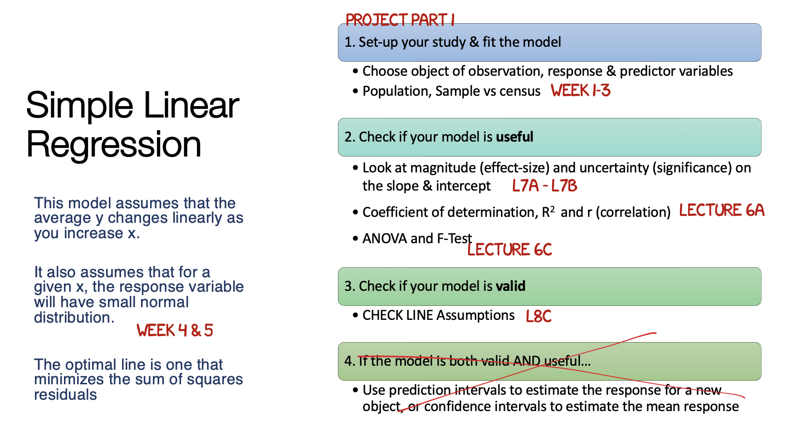{width="90%"}

## Step 1: Set-up {.unnumbered}

-   Re-open your project by EITHER
    -   Going to your project folder and double clicking on the .RProj
    -   OR Opening R studio and going to File, Recent Projects, the open the one for your independent research project
-   Now go to the files tab and open your lab book RmD file. On the top right, go to the run menu and press Run-All.
-   Everything should run without errors. Look at your environment tab and consider renaming your variables if they don't make sense to you.

## Step 2: State your model {.unnumbered}

**I AM LEAVING IT UP TO YOU TO MAKE HEADINGS/SUB-HEADINGS/SUB-SUB HEADINGS AND TO KEEP THINGS NEAT.**

Remember that you will get more marks if it's easy for me to find all the sections of your report output.

1.  In your text, state your response variable, your object of analysis, and a SINGLE predictor variable that you (or your imaginary boss) would like you to test,

2.  Create a professional looking scatterplot with a line of best fit (Tutorial 8) and comment on the form/direction/strength/unusual values (don't panic if it's not linear, we will fix post spring break)

3.  Using Tutorial 11, run a simple linear regression model

4.  Using tutorial 11, formally write out the sample regression equation and interpret the slope and intercept for your imaginary boss.

5.  Conduct a hypothesis test (F-test) using ANOVA to assess if your sample suggests that there really is a relationship in the underlying population.. (e.g. what would H0 and H1 be.. see Week 7 and week 8)

6.  Interpret and comment on the R2 value

7.  Interpret and comment on the root mean squared error

8.  Conduct a hypothesis test (T-test) if the INTERCEPT sample is likely to be 0.. (you're welcome to choose a number other than 0, Tutorial 11, if that's more interesting to your case study)

9.  Assess the LINE assumptions using Tutorial 11.

10. Summarise what you have found so far and any concerns.

<!--chapter:end:in_02B_Project2.Rmd-->

# (PART\*) [.]{style="color: white;"} {.unnumbered}

# (PART\*) **TUTORIALS** {.unnumbered}


# Projects/Starting each lab {#T1_Projects}

An R project  refers to a collection of files, data, and code organized within the R programming language environment for a specific analysis, research, or statistical project. 

An R Project is a home folder the files, scripts, and data connected to one piece of work like Lab 1. Instead of saving files in lots of different places and then struggling to tell R where to look, the Project keeps everything together. 

-   On the Posit Cloud, "a project" means a 'new version of R opens'

-   On the Desktop, "a project" you will have a single folder for each lab. Inside that will be your code, your data/images etc and a special .RProj file that you will use to open R.

Here’s why projects are so useful:

-   Consistency across computers: If you move from Posit Cloud to a lab computer or your own laptop, you only need to copy the Project folder. Open it, and everything inside will still “know where it lives.”

-   No messy file paths: You won’t have to keep typing or updating long folder names. R will automatically treat your Project folder as the starting point.

-   Everything is organised: Each lab, assignment, or project has its own container, so your work never gets tangled.

-   Easy to share or back up: You can zip up the folder, send it, or store it in GitHub/OneDrive, and it will still work when reopened.

Watch this video to find out more: (4 mins)

{width="600"}*(link here if it's not working: <https://www.linkedin.com/learning/learning-the-r-tidyverse/why-should-you-use-projects-in-rstudio?u=76811570>, you will need to log into Penn State)*

<br>

[WE WILL BE MAKING A NEW PROJECT FOR EACH LAB]{.underline}

------------------------------------------------------------------------

## Projects using posit Cloud {#T1_ProjectsCloud}

1.  **Go to this webpage. <https://login.posit.cloud/login>**
    -   You can get here from any web-browser and you do not need a special computer.
    -   When you log in, you should see a dashboard like the one below.\
2.  **Make a new project by clicking the button on the top right. This will open a window containing R-Studio.**
    -   You can open different projects in different tabs on your browser.
3.  **Returning to your lab projects on the cloud is very easy. Just go back to** <https://posit.cloud/content/yours>

<div class="figure" style="text-align: center">

<p class="caption">(\#fig:im-T1-ProjectCloud)*The Cloud dashboard*</p>
</div>

<br>

------------------------------------------------------------------------

## Projects on your desktop {#T1_ProjectsDesktop}

1.  Make a folder called STAT462 in an easy to access location on your computer.
    -   This is where all of your labs will live for this course.  \
2.  Inside this, make a folder called Lab 1 (or Lab 2, Lab 3 etc).You should put all your data and all your code in this relevant folder for each lab. DO NOT LEAVE ANYTHING IN DOWNLOADS! \
3.  Now open R-studio (NOT R!). You should have updated to the most recent version <br>


Steps 3-7 are shown graphically in the figures below. If you are new to this, follow them slowly.

3.  Go to the Main File menu at the [very top left]{.underline} and click `New Project` <br>\

4.  Then click `Existing Directory` <br>\

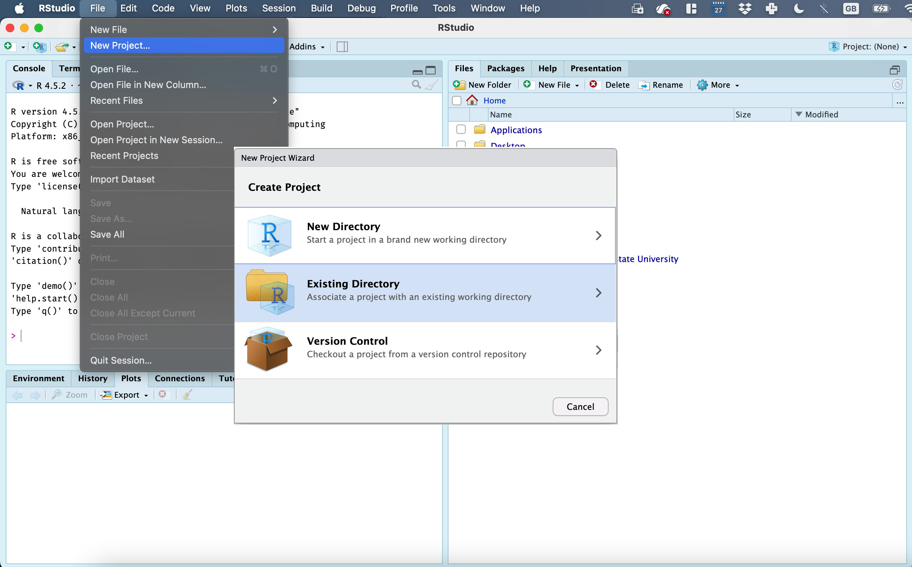

5.  You will be asked to find your Lab 1 folder on your computer. Find it and click open,

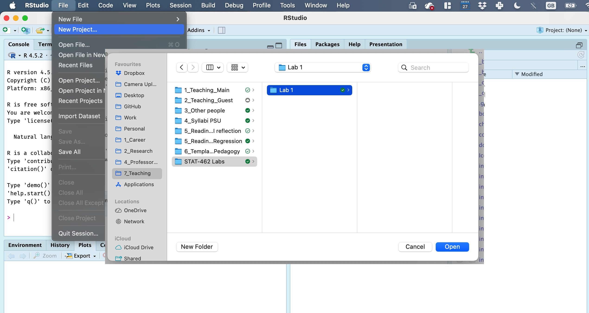

6.  Check that the address looks right.

7.  Finally, press `Create Project`.  Your screen should subtly change (see below) <br>\

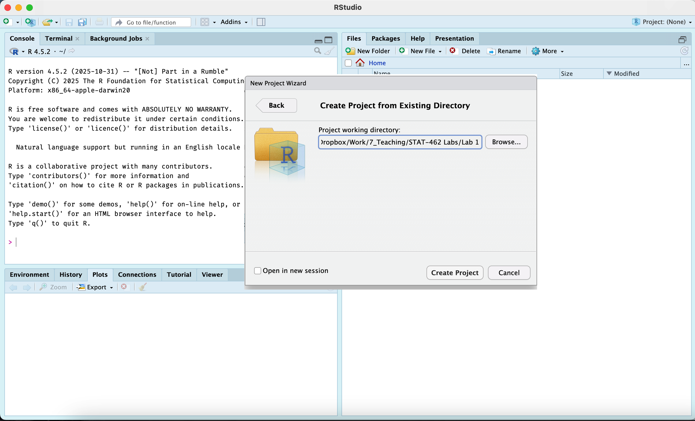

### How to check you are running your project

If you have any errors, this will be the first thing I check, so you may as well check first!

-   R will change slightly. If you look at the top of the screen in the title bar, it should say something like *Lab1 - R Studio* at the top and at the top of each quadrant

-   The Files tab should now show your project folder. Essentially, R-Studio is now "looking" inside your Lab 1 folder, making it easier to find your data and output your results. (for people who have used R before, you no longer need to setwd() or write the location on your data).

- The icon at the bottom of your screen will have changed.

<div class="figure">

<p class="caption">(\#fig:im-T1-Projectcheck)How to check you are in a project</p>
</div>

<br>

-   If you want one final check, try typing this command into the console (INCLUDING THE EMPTY PARANTHESES/BRACKETS), press enter and see if it prints out the location of your Lab folder on your computer. If not, talk to an instructor.


``` r
getwd()
```

<br><br>

### Returning to your lab project

OK, let's imagine that you get halfway through your lab and your computer dies. How do you get back to your Lab work? Try this now. Close down R-Studio.

There are two ways to reopen a lab

#### From your computer

1.  Instead navigate on your computer to your *STAT462/Lab1* folder.

3.  Double click on the `Lab1.RProj` file. *Look for the RPROJ file type!* DO NOT DOUBLE CLICK THE RMD FILE

This will reopen R-Studio for that specific lab, so you can continue where you left off. It means you can also open several versions of R studio for multiple labs, which can be very useful in staying sane


#### From inside R-studio.

Alternatively you can open R-Studio, 

 - Then navigate to File/Open Projects and find your Lab 1 folder.
 - OR, look at File/Recent projects and you might just see Lab 1 there, especially if you have worked on it recently.
 
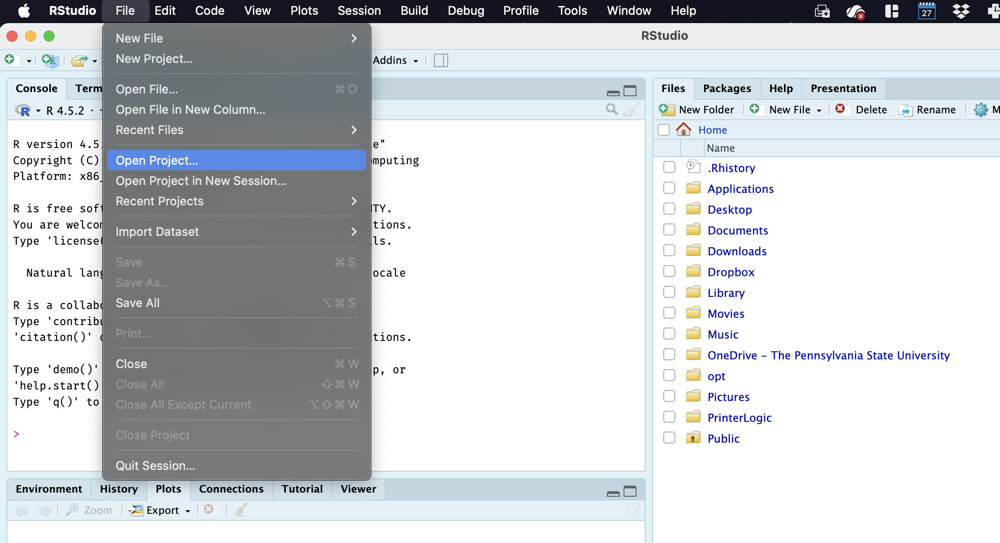
 
Or 

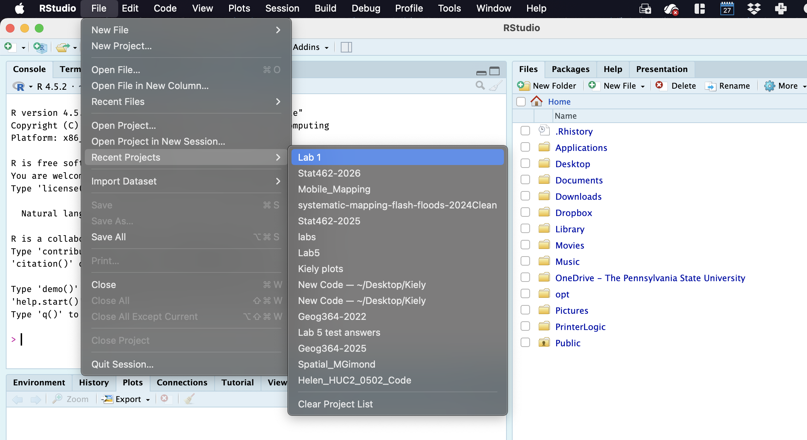

<!--chapter:end:in_04-Tutorial01_Projects.Rmd-->


# Libraries/Packages {#T2_Libraries}

## What are packages? {#T2_Libraries_about}

R is open source, so over the last 20 years, *millions* of useful commands have been written that we might want to use. To make life easier, commands are grouped together into collections called `Packages` or `Libraries` (two names for the same thing). For example, one package might make pretty plots, another might focus on efficient Bayesian analysis.

<br>

------------------------------------------------------------------------


-   ***A close analogy is your phone:** There are millions of apps now available from banking, to social media, to calendars and games.*

-   *But! You don't have every app in the world installed on your phone - Instead you download the apps that you think you will need (occasionally downloading a new one on the fly) -*

-   *You also don't have all the apps you downloaded running at the same time on your phone. When when you need to use an app, you click on it to open.*


Just like your phone, to access the commands in a package we need two steps:

1.  **ONCE ONLY: Download the package from the internet**
2.  **EVERY TIME: Load/Open the packages you want**

------------------------------------------------------------------------

<br>

### Seeing what packages you already have

Some packages are downloaded on your computer by default (just like the flashlight or calculator app on your phone). You can see this list in the Package tab.


<br>

------------------------------------------------------------------------


## The app store/getting new packages {#T2_Libraries_install}

There is a package for literally everything and there are now well over 20,000 available. You can see the full list here: <https://cran.r-project.org/web/packages/available_packages_by_name.html>

This is far too many to store on your computer, so most live on the internet in an online (free) "Package Store". You can download the ones you want, ready to load later.<br>

<br>

To download/install a new package

### Manually click

This is like going to the app store to get a new app. Just like you only go to the app store once, this is a one-off for each package. NOTE! For R studio cloud online, you might have to do this for each project.

-   Look for the quadrant with the packages tab in it.
    -   You will see a list of packages/apps that have already been installed.
    -   Click the INSTALL button in the Packages tab menu (on the left - see figure above)
    -   Start typing the package name and it will show up (check the include dependencies box). Install the package.
    
<br>

### Little yellow banner

-   R will sometime tell you that you are missing a package (sometimes a little yellow ribbon), click install to install!


<br>

### Problem solving

#### Why isn't my package downloading? Its frozen

Sometimes R will ask you if you want to install binaries or other things. IT WILL ASK YOU THIS QUESTION THROUGH "SPEAKING" IN THE CONSOLE. It expects you to type yes or no, and to press enter to continue. Try yes, if it doesn't work (esp xfun), try no. <br><br>

#### R keeps asking to restart.

Sometimes R-Studio might want to restart when downloading packages and occasionally gets confused. If it keeps asking, press cancel, then go to the Session menu at the VERY top, click Restart R and Clear output, reopen and try again.

<br>

------------------------------------------------------------------------


## Using packages

Just as going to the app store doesn't check your credit-card balance or make an Instagram post, simply *downloading* a package from the app-store doesn't make the commands immediately available. For that you need to load it (just as you click on a phone app to open it).

**I will tell you which packages you need for each lab, but if R tells you it wants a package, then install it AND load it.**

This can be done with the `library()` command.

For example, this command loads the full works of Shakespeare from the the bardr package. (<https://www.rdocumentation.org/packages/bardr/versions/0.0.9>). If you want to try this, you will need to first install bardr using the instructions above.


``` r
library(bardr)
```

<br>

### Using a single command from a package

ADVANCED: Sometimes several packages name a command the same word and you want to specify which package you want to use.

You can do this using the :: symbol. For example, this command *forces* the computer to use the 'dplyr package' version of filter.


``` r
dplyr::filter(mydata)
```

<br>

### Problem Solving

#### Nothing happened!

If you have managed to load a package successfully, often nothing happens - this is great! It means it loaded the package without errors.

#### There was a load of text output - an error?

Hard to tell. So I suggest running the library command TWICE! This is because many packages will print "friendly messages" or "welcome text" the first time you load them.

For example, this is what shows up when you install the tidyverse package. The welcome text is indicating the sub-packages that tidyverse downloaded and also that some commands now have a different meaning.

<div class="figure" style="text-align: center">

<p class="caption">(\#fig:im-T2-friendlytext)Tidyverse install messages</p>
</div>

**To find out if what you are seeing is a friendly message or an error, run the command again. If you run it a second time and and nothing happens then you're fine.**

<br>


<!--chapter:end:in_04-Tutorial02_Libraries.Rmd-->


# R-Markdown {#T3_Markdown}

## What is markdown {#T31_Basics}

Remind yourself of what Rmarkdown is here <https://rmarkdown.rstudio.com> via this short video

<iframe title="vimeo-player" src="https://player.vimeo.com/video/846773750?h=7cb3871e91" width="640" height="360" frameborder="0" referrerpolicy="strict-origin-when-cross-origin" allow="autoplay; fullscreen; picture-in-picture; clipboard-write; encrypted-media; web-share"   allowfullscreen></iframe>


### What are R-SCripts?

Read more here: https://rmarkdown.rstudio.com

Typing in console is like a having phone call with the computer, you're talking but you're not keeping records of what you say.  When you close R-studio you lose your analysis.

What we need instead is a way to save the commands for future use - we can do this using scripts. There are several types of document, or script that you can create and save in R-Studio.

-   A basic script (the filetype is .r).  This is simply just a blank notepad where you can save code commands.  When you "run" the commands in the script, R simply copy/pastes the commands over to the console.  This is probably how you have done previous labs.
 
-   An R-Notebook or R-Markdown document (the filetype is .Rmd).  These are much more interesting - and are how I wrote this lab book.  This is what we will be using in our labs.
 
In this course we are going to focus on the R-Markdown format and you are going to submit your labs as websites/html files along with your code. 


<br>

### What is R-Markdown?
 

What is an R-Markdown Document?  imagine a normal Microsoft Word document, but halfway through you can press a button and a mini R console appears....   You type your code inside the mini console, and click run.  The computer runs the code and puts the plots/output directly into your report - then you leave the console and  write about the results below the plot.  
 
As described in the video, Rmd files are also flexible.  You can turn them into reports, websites, blogs, presentations or applications with a few short commands.
 


<br>


## Creating a markdown document {#T31_NewMarkdown}

Go to the File menu on the top left, then click New File - R-Markdown. If this is your first time ever doing this, it might ask to download some packages to be able to do this (look for a little yellow bar at the top of the screen and say yes)

Eventually a window will open up:

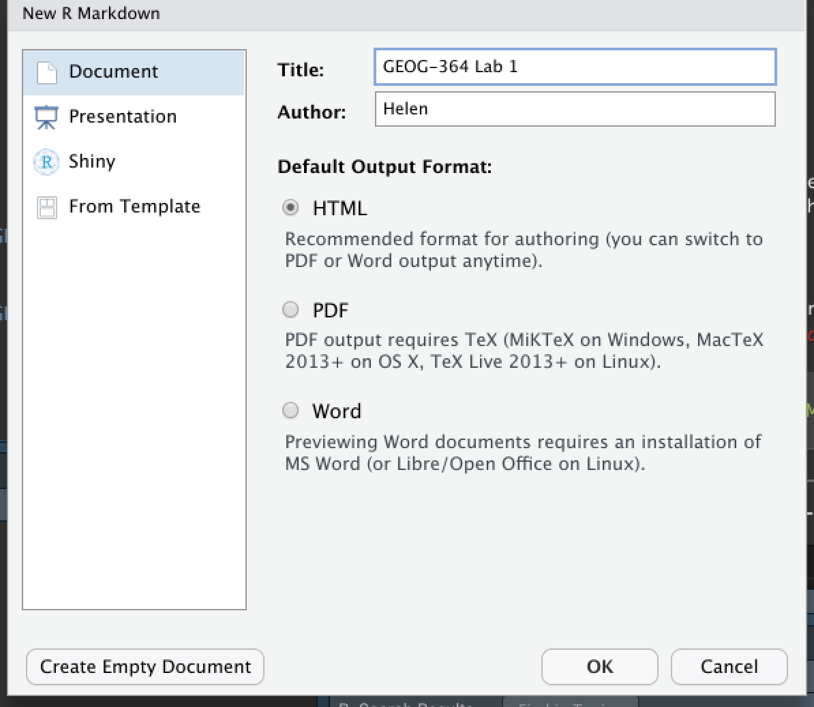

-   It will ask you to name and save your file.  Give it a relevant name.  

-   A new file should appear on your screen.  

-   At the top of that window (by the knit button, there is a save button. Save it as something relevant INSIDE YOUR PROJECT FOLDER!


<div class="figure" style="text-align: center">
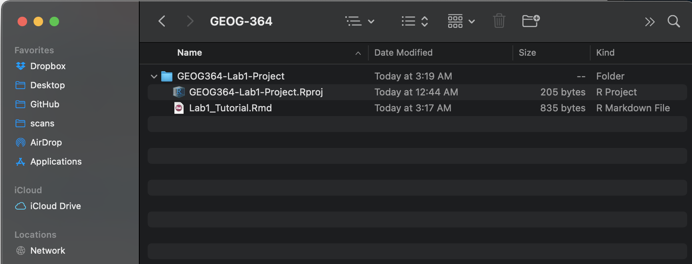
<p class="caption">(\#fig:tut4fig2)Yours will say STAT462 rather than GEOG364</p>
</div>

The new file on your screen is your first markdown script. 


<br><br>


------------------------------------------------------------------------

## Important things to know {#T32_MarkdownImportant}

<br> 

### All markdown documents have three components. {#T32A_whatisit?}

<br> 

All markdown documents have three components.

-   There is a space at the top of the file where we can add information about themes/styles etc called "YAML". This determines what type/style of document your work will become <br>
-   There is space to add text (white), <br>
-   And you can add code in 'mini consoles' called 'code chunks'. (Grey) <br>

<div class="figure" style="text-align: center">

<p class="caption">(\#fig:tut4fig4)Markdown Components</p>
</div>

<br><br> 

### Visual mode {#T32A_visualmode}

It is MUCH easier to edit markdown documents in the new visual mode. Essentially instead of having to remember text short cuts like \* for bold, you can edit the text part as though you were using a word processor. NOTE HEADERS where it says "Normal", this allows you to make auto tables of contents.

<div class="figure" style="text-align: center">
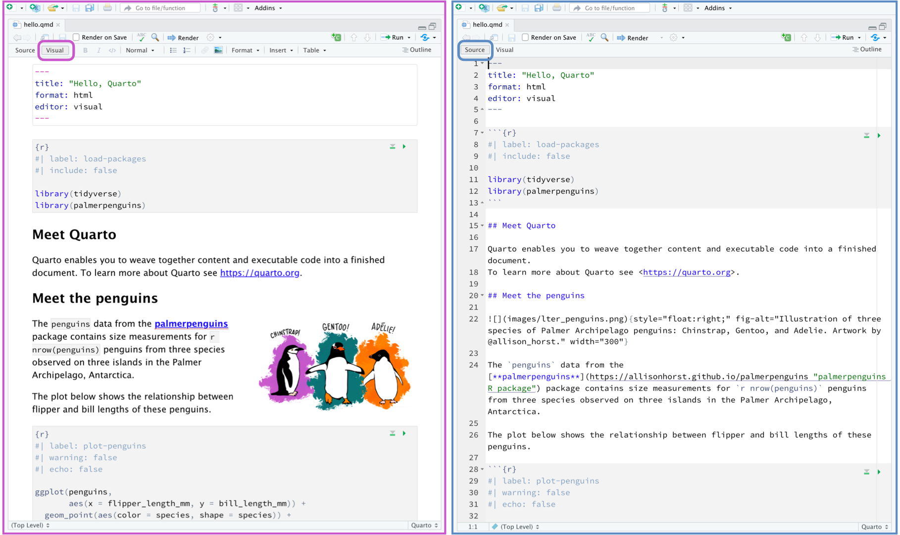
<p class="caption">(\#fig:im-T3-SourceVis)Look at the circled button near the top of the two reports</p>
</div>


<br>


### Editing YAML Code {#Tut4E_YAML}

Your YAML code is the code at the top of your file in between the --- lines. (see \@ref(fig:tut4fig4))).  Let's zoom in

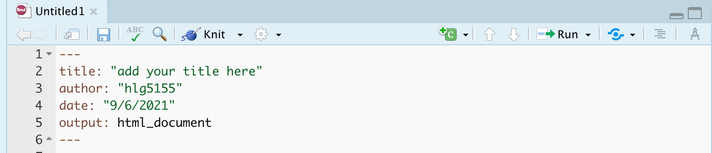

<br>

Your YAML code controls how your final output looks and which type of output it becomes. For example, your document could become a website, a pdf, a presentation or app.. 

The basic version is very simple with a title, an author and a self entered date. Let's add in more options. 

YAML code is annnoying to edit, because here, *spaces really do matter*. Everything has to be perfect or it won't knit.  

**Select everything in my code chunk here and replace your YAML with this (remember the --- on line 1 and at the end).**


``` r
---
title: "GEOG-364 - Lab 2"
author: "hlg5155"
date: "`r Sys.Date()`"
output:
  html_document:
    toc: true
    toc_float: yes
    number_sections: yes
    theme: lumen
    df_print: paged
---
```

Replace the author ID with your user name, change the title if appropriate. 

The elements we just added are:

 - The title
 - The author (note,use your ID not your name)
 - Automatically created today's date
 - A floating table of contents
 - Numbered sections (this won't appear until you start typing section headings)
 - The document is now in the lumen theme. 
 
<br> 
 
### Troubleshooting

 - Note, if you copy/paste this and it doesn't work, sometimes the quote marks copy weirdly from the internet - try deleting and retyping the quotes.  

- If it still doesn't work.. this might be because a space is missing (especially if you typed it out). 
   +  Editing  YAML code can be a pain.  It is very case and space sensitive.<br>For example, the spaces at the start of some lines are important and are created using the TAB KEY, not the space bar.  There is one TAB key before html_notebook (which is now on a new line). There are two TAB KEYS before toc, toc_float, number_sections and theme.

*Don't continue until you can make and view your html when you press knit. If it doesn't work, ask for help before moving on*

<br>

### Changing the theme

You don't need to choose the lumen theme.  There are many other ways you can edit your markdown documents here: https://www.datadreaming.org/post/r-markdown-theme-gallery/

To edit, replace the word lumen with the name of your chosen theme (THIS IS CASE SENSITIVE). Now click knit and see if it works.Some themes are buggy. Try a different one if it doesn't work.  

The themes in "Even More Themes" on the website, requre you to install/load some new packages, so they need some extra work. You're welcome to try if you have one you fell in love with!
 
<nr> 
 
### Adding other YAML options
 
There are many more details about different options on these websites:

 - https://bookdown.org/yihui/rmarkdown/html-document.html
 - https://rstudio.com/wp-content/uploads/2015/03/rmarkdown-reference.pdf

If you want to get really fancy, there is an interesting package to help you design YAML code here: https://education.rstudio.com/blog/2019/10/tools-for-teaching-yaml-with-ymlthis/

<br>
<br>


## Knitting {#T32E_Knitting}


The file on your screen isn't the finished article. To see how it will look as a final version, we need to "knit" it. Go to the top of the .Rmd file, find the `knit` button. Press it (you might have to first save your script if you haven't already, then press it again)

You should see that the Markdown tab "builds" your document and you get an output as a website. The html should also be saved into your project folder.

For example, here is a file with markdown and knitted output.


<br><br>


## Editing the report text

You can type anywhere inside the white report area. R will ignore it.

<br>


### Inserting images/tables and formatting {#T32B_formatting}

In visual mode, look at the menu at the top. It's very easy to insert images, tables and other formatting. Pay special attention to the Normal/Heading 1/Heading 2 buttons..

You can also do this in source mode, but you have to learn the keyboard shortcuts. For example to make something *bold* you put stars around it e.g. `*bold*` .  You can see more examples in the pic above and here

For more, see this link: <https://zsmith27.github.io/rmarkdown_crash-course/lesson-3-basic-syntax.html>


<br><br>


------------------------------------------------------------------------

### Code chunks {#T32D_CodeChunks}

Code chunks are mini consoles where you can run R commands. 

#### Adding a code chunk {#T32Da_Adding}

On the top right there are a suite of buttons for adding a new code chunk, running code etc. The green one adds a new code chunk. To run an individual code chunk you will press the green arrow on its top right e.g.


<br>

#### Editing and running code chunks {#T32Db_Editing}

You should see that a new area has appeared in your report that is a different color to the background.
Inside its essentially a "mini console".  It's where you add your code and you need to 'speak R' inside it. 

When you press enter, the code won't run. INSTEAD, click the little green arrow

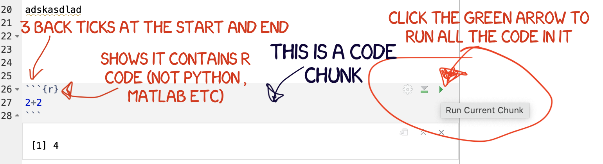

<br>

------------------------------------------------------------------------


------------------------------------------------------------------------

## Writing Maths equations in R-Markdown {#T3_MathsEquations}

### Double dollar signs

It is relatively easy to write equations in R markdown. They use the "Latex" format and you put them between double dollar signs.

For example, try typing `$$x=2$$` on a new line of the white text area in your repprt ( NOT INTO A CODE CHUNK), then pressing knit. You should see:

$$x=2$$

But how do you write all the fancy equation stuff? We cheat.

Create the equation you want in one of these generators, then copy the code into your script and put it between double dollar signs:

-   <https://latex.codecogs.com/eqneditor/editor.php>
-   <https://www.tutorialspoint.com/latex_equation_editor.htm>

For example

`$$\widehat{y} = b_{0}+b_{1}x$$`

Shows up as $$\widehat{y} = b_{0}+b_{1}x$$

<br><br>

### Single dollar signs

Essentially this is the same, but the equation is part of the text and you only see the output when you press knit. For example including `$x=2$` in this sentence shows $x=2$ as an output.


<br><br>

------------------------------------------------------------------------

## Code Chunk options {#T3_CodeChunkOptions}

What are they? Essentially, instructions that you tell the computer when you press knit.

### Creating them in Source mode

Click source mode and have a look at a code chunk. You will see it starts with three little back-ticks and the {r} sign. For code chunk options, we will be focusing on the top line with the {r}


At the moment, the code chunk tells us that the code inside is written in R.

We can also add other options, **separated using commas.**


In fact, you have often seen me add message=FALSE and warning=FALSE to prevent any spurious messages appearing when you press knit. Keep reading to see the many other things you can add.

<br>

### Creating them in View mode

You can also edit code chunk options in view mode. Create a new code chunk, then click on the little (almost invisible) cogwheel near the run triangle


This will open a menu where you can choose many of the common options


<br>

### Setting the default for the whole document {#T3_CodeChunkWholeDoc}

Many templates already include this for you to edit.

If not, you can put a code chunk at the top of your document (below the YAML code) containing `knitr::opts_chunk$set(echo=TRUE)` to change the default values of chunk options in a document.

For example, you may put this in the first code chunk of your document to stop it showing messages on knit.

````         
```{}
knitr::opts_chunk$set(echo=TRUE, 
                      warning=FALSE, 
                      message=FALSE)
```
````

<br>

### Common options

Here are the common options we typically need:

-   `message = TRUE/FALSE`. Don't show friendly R messages on knitting. I use this so often that I put it in that knitr code chunk at the top of my scripts. <br>

-   `warning = TRUE/FALSE` . Don't show R warnings on knitting. It will still show errors, so this is another good one to use. <br>

-   `include = TRUE/FALSE.` Show or Hide the code AND output in the final document. Really useful with inline code (next section) <br>

-   `echo = TRUE/FALSE.` Show or Hide the code chunk code in the final document. The output will still be shown. <br>

-   `eval = TRUE/FALSE`. This option determines whether the code is evaluated or executed. If **`eval = TRUE`**, the code is executed. If **`eval = FALSE`**, the code is not executed, but the code chunk is still displayed. This can be useful for showing example code without actually running it.

-   Or for example, if you can't knit because of an error, you can add eval=FALSE to the problem code chunk so I can see what you did but you can still knit.

<br><br>

------------------------------------------------------------------------

## Inline Code

There are two types of code you can write in your reports: code chunks and inline R code.

#### Code chunks..... (as discussed above)

Click source mode and have a look at a code chunk. You will see it starts with three little back-ticks and the {r} sign.


#### ..... and Inline Code


Inline R code is embedded in the TEXT/NARRATIVE of your document using single back-ticks. For example, writing

My value of y is `` `r y` `` and x-squared is `` `r x^2` ``

Will output:

My value of y is 10 and x-squared is 49.

If this doesn't make sense, follow these tutorial to see how to add inline code.

-   <https://bookdown.org/yihui/rmarkdown-cookbook/r-code.html>
-   <https://www.njtierney.com/post/2019/07/10/jq-verbatim-inline-r/>
-   <https://rmarkdown.rstudio.com/lesson-4.html>

<br><br>

### Tips for adding inline code

Inline code is GREAT. Imagine writing your 100 page thesis, but then you realise that your dataset was wrong. If all the numbers in your report are added using inline code, then it will automatically update your entire report.

The easiest way to do this is to run your commands in a "silent" code chunk with the echo=FALSE and include=FALSE options. Then in the text, I just put the variable name I want to print, sometimes rounding to a better number of decimal places[^in_04-tutorial3_markdown-1].

[^in_04-tutorial3_markdown-1]: You can round in the inline code or the code chunk. Both are fine


For example here's how I typed that the mean height of the starwars data is 174.6 cm:


<!--chapter:end:in_04-Tutorial03_Markdown.Rmd-->


# Coding {#T7_Coding}


## Functions / Commands

Three useful facts about commands:

 - Commands, (often called functions), are the verbs of 'speaking R'. They are actions, things you *do*.<br><br>
 - Commands ALWAYS have parentheses/brackets ( ) after them. It's how you know it's a command.<br><br>
 - You can look at the help file for any command by typing ? then it's name into the CONSOLE e.g. `?mean`. Or you can go to the help tab next to packages tab, then search for it there. Note, you might have to load the library first! Ever tried getting the instagram help page before you even opened the app? ;)

<br><br>

#### Commands/functions with empty ( )

These commands are often used to launch an interactive command, or to check something on your computer. You still need the ( ) afterwards, but it can be left empty. I typically run these in the console. Examples

-   `Sys.Date( )`\
-   `getwd( )`
-   `file.choose( )`

**Task** : Try the commands

-   One by one, copy/paste the three commands above EXACTLY into the console and press enter to run. As needed, look at the helpfiles for each of them. E.g. in the console, run `?Sys.Date`, `?getwd`, `?file.choose`. In your report, make a heading called Code Showcase (if you haven't).

-   In your report, make a heading called Code Showcase (if you haven't already).Below it, create a heading-level-2 called "basic commands". Underneath that, explain what each of the three commands does. Hint, file.choose does NOT open/load any files, or tell you where your project is....

<br><br>

#### Commands that need information/data

Some commands need a little more information. For example, the `data()` command loads an inbuilt dataset into your workspace so we need to tell it which dataset we want. `rnorm()` generates a series of random numbers from a normal distribution, but we need to tell it how many we need Examples

-   `data(mpg)` \# loads the mpg data from package ggplot2.
-   `summary(mpg)` \# summarise the entire mgp dataset (hint for lab 1, this is how to get the average year!)
-   `rnorm(20)` \# generates a series of 20 random numbers from a normal distribution
-   `names(mpg)` \# print the column names of a dataset


**Test your knowledge** : Using the information above, try these commands. You can write these in the console.

-   Load the *penguins* dataset from the package `palmerpenguins` using the data command. <br>
-   Summarise the penguins dataset using the `glimpse()` command.
-   Look at the penguins dataset using the `View()` command. RUN THIS IN THE CONSOLE
-   Work out the column names of the penguins dataset using the `names()` command.

<br><br>

#### Applying commands to columns & rows of a spreadsheet

Just like Lab 1's 'what's the mean year' question, we often need to apply commands to individual rows or columns in a
spreadsheet. There are several ways to do this.

-   Use square brackets and the row/column number
-   Use a \$ and the column name.

For example, from <https://www.statology.org/r-mean-of-column/>, here's how to get that mean year from the mpg data:


``` r
# First, type View(mpg) into the CONSOLE and it will bring up the spreadsheet.  

#calculate mean using column name, note the $ !
mean(mpg$year)

#calculate mean using column name (ignore missing values)
mean(mpg$year, na.rm=TRUE)

#calculate mean using column position, e.g. we're calculating the mean of the Year column (four from left)
mean(mpg[ , 4], na.rm=TRUE)
```

<br>

**Task** : Using the information above, try these tasks 

-   Calculate the mean of the column flipper_lenth_mm in the penguins dataset <br>
-   Calculate the MEDIAN body mass in the penguins dataset <br>
-   Hint 1, you need to spell the column name EXACTLY for it to work, case sensitive, <br>
-   Hint 2, look back at your names command! <br>
-   Hint 3, <https://sparkbyexamples.com/r-programming/median-in-r-examples/> <br>

<br><br>

<!--chapter:end:in_04-Tutorial04_CodingBasics.Rmd-->


# Reading in data {#T4_ReadingData}

<br>

## Before you start {#T4_DataCheck}

**1. Use a Project, not `setwd()`** Open your `.Rproj` file before doing anything else. R will automatically look in that project folder for your data files — no need to tell it where to look. Just make sure your data file is saved in the same folder as the `.Rproj`.

**2. Don't use File \> Import** Always use code to read in data (not the menu). The menu won't work when you knit your document.

<br>

------------------------------------------------------------------------

## Reading in your data {#T4_Commands}

Find your file type below and copy the command into a code chunk.

<br>

### Spreadsheets and tables {#T4_ReadinSpreadsheets}

<br>

#### CSV files (.csv) — `read.csv()` {#T4_load_csv}

No packages needed. It assumes that your data has headers/column names.


``` r
mydata <- read.csv("filename.csv")
```

If your data has no column names, add `header = FALSE`:


``` r
mydata <- read.csv("filename.csv", header = FALSE)
```

This will name each column V1, V2 etc. You can then rename your columns using the `names()` command.

> **Note:** If you are working with very large files (>100MB or over 100,000 rows), look up the fread() function from the data.table package. It's more complex but MUCH faster.

<br>

#### Excel files (.xlsx, .xls) — `read_excel()` {#T4_load_excel}

Requires the `readxl` package. Install it once via the Packages tab, then add `library(readxl)` to your library code chunk.


``` r
mydata <- read_excel("filename.xlsx")
```

If you want to read in a specific sheet from your Excel file, add the `sheet` argument:


``` r
mydata <- read_excel("filename.xlsx", sheet = "SheetName")
```

<br>

#### TXT files (.txt) — `read.table()` {#T4_load_txt}

No packages needed, but you have to explicitly tell R that the data has headers/column names and that it's "tab separated" (tab character between entries). For weird data-files, can also adjust sep to whatever your actual separater is. 


``` r
mydata <- read.table("filename.txt", header=TRUE, sep="\t")
```

> **Note:** If you are working with very large files (>100MB or over 100,000 rows), look up the fread() function from the data.table package. It's more complex but MUCH faster.

<br>

------------------------------------------------------------------------

### R-specific data {#T4_ReadinRData}

R has its own file formats for saving and reloading R objects. These are useful when you want to save your work mid-analysis and pick it up later, or share processed data with someone else who uses R.

<br>

#### Built-in package datasets — `data()` {#T4_load_builtindata}

Many R packages come with example datasets ready to load. In this case you don't need the file containing the data. Instead add the relevant `library()` to your library code chunk, then use `data()` to load the dataset. This will show up as a "promise". Then run any other command to load it fully. Sometimes you won't see its name in the environment.


``` r
data("penguins")   # load the dataset into your global environment
glimpse(penguins)  # view it
```

> **Important:** Just running `library(somepackage)` makes its datasets *accessible* to R, but they live in the package environment — not your global environment. This means you can accidentally use them without them showing up in your Environment pane or in `ls()`. Always use `data()` explicitly to load a dataset into your global environment, where you can see and work with it properly.

<br>

#### RDS files (.rds) — `readRDS()` {#T4_load_rds}

This is R's own format to store a single variable as a file. RDS saves a **single** R object (a data frame, model output, list, etc.) and reads it back in exactly as you left it. You can assign it any name on import. No packages needed.


``` r
mydata <- readRDS("filename.rds")
```

<br>

#### RData files (.RData, .rda) — `load()` {#T4_load_rdata}

This is R's own format to store many variables as a single file. RData files contain **multiple** R objects at once. Loading it is different from other formats — you use `load()` without `<-`, and the objects reappear in your environment automatically with their original names.


``` r
load("filename.RData")
```

> **Note:** Because the object names are baked into the file, you cannot rename them on import the way you can with `readRDS()`. After loading, check your Environment pane to see what objects have appeared.

<br>

------------------------------------------------------------------------

### Spatial data {#T4_ReadinSpatial}

<br>

#### Vector files (.shp, .geojson, .gpkg) — `st_read()` {#T4_load_vector}

Vector spatial data includes points, lines, and polygons (e.g. country borders, survey locations, river networks). Requires the `sf` package. Install it once via the Packages tab, then add `library(sf)` to your library code chunk.


``` r
mydata <- st_read("filename.shp")      # shapefile
mydata <- st_read("filename.geojson")  # GeoJSON
mydata <- st_read("filename.gpkg")     # GeoPackage
```

`st_read()` works the same way regardless of format — just change the filename and extension.

> **Note for shapefiles:** A shapefile is actually several files sharing the same name (e.g. `.shp`, `.dbf`, `.shx`, `.prj`). All of them need to be in the same folder. You only type the `.shp` filename in your code — R finds the rest automatically.

<br>

#### Raster files (.tif, .nc, .img) — `rast()` {#T4_load_raster}

Raster data is grid-based (e.g. satellite imagery, elevation models, climate surfaces). Requires the `terra` package. Install it once via the Packages tab, then add `library(terra)` to your library code chunk.


``` r
mydata <- rast("filename.tif")   # GeoTIFF (most common)
mydata <- rast("filename.nc")    # NetCDF (common for climate data)
```

If your raster file contains multiple layers (e.g. monthly temperature across 12 months), `rast()` will load them all as a multi-layer object. You can check how many layers you have with `nlyr(mydata)`.

<br>

------------------------------------------------------------------------

## Troubleshooting {#T4_Troubleshooting}

If you get an error when reading in data, work through this checklist before asking for help.

<br>

**Is the filename exactly right?** R is case-sensitive. `Mydata.csv` and `mydata.csv` are different files. Always include the file extension (`.csv`, `.xlsx`, `.shp`, etc.).

<br>

**Is the file in the right place?** The data file needs to be in the **same folder** as your `.Rproj` file, not in Downloads or on your Desktop.

<br>

**Are you running your project?** Check the top-right corner of RStudio — it should show your project name, not "Project: (None)". If it says None, go to File \> Open Project and open your `.Rproj` file.

<br>

**Have you installed and loaded the right package?** `read.csv()`, `readRDS()`, and `load()` need no package. Everything else requires one:

| Function            | Package  |
|---------------------|----------|
| `read_excel()`      | `readxl` |
| `st_read()`         | `sf`     |
| `rast()` / `vect()` | `terra`  |

Installing a package (via the Packages tab) only needs to happen once. Loading it with `library()` needs to happen every session — put your `library()` calls in your setup code chunk at the top of your script.

<br>

**For shapefiles: are ALL the component files present?** A shapefile is made up of multiple files (`.shp`, `.dbf`, `.shx`, and usually `.prj`). If any are missing — for example if you only copied the `.shp` — R will throw an error. Make sure the entire set of files with the same base name are all in your project folder.

<br>

**Your data loaded but looks wrong?** Run `head(mydata)` or `glimpse(mydata)` straight after reading in your data. This helps you catch problems early — for example, all your data ending up in one column is common with CSVs that use `;` instead of `,` as a separator. If that happens, try:


``` r
mydata <- read.csv("filename.csv", sep = ";")
```

<!--chapter:end:in_04-Tutorial05_ReadingInData.Rmd-->


# Summarising Data {#T5_Summarising}

<br>

In this tutorial we will use the `pirates` dataset from the `yarrr` package as our example. If you want to follow along, make sure `library(yarrr)` is in your library code chunk, then run:


``` r
data("pirates")
```

> **Summarising vs EDA — what's the difference?**
> This tutorial is about **quality control** — checking your data arrived correctly, understanding its structure, fixing column types, and dealing with missing values. You're making sure everything is sensible before any analysis begins.
>
> EDA (Exploratory Data Analysis) comes next — that's about looking for patterns and relationships using plots and grouped summaries. The two overlap, but a useful rule of thumb is: summarising first (is my data clean?), EDA second (what's interesting?).

<br>

---

## First look at your data {#T5_FirstLook}

<br>

#### View your data — `View()` {#T5_View}

The quickest way to look at your data is to click its name in the **Environment pane**, or type this directly into the **console** (not your code chunk):


``` r
View(pirates)
```

This opens a spreadsheet-style viewer. Run this in the console rather than in a code chunk — it's an interactive command that won't work when you knit your document.

<br>

#### Check structure — `str()` and `glimpse()` {#T5_str}

`str()` (structure) is usually the first command to run on any new dataset. It shows how many rows and columns you have, each column's name, its data type, and the first few values.


``` r
str(pirates)
```

```
## 'data.frame':	1000 obs. of  17 variables:
##  $ id             : int  1 2 3 4 5 6 7 8 9 10 ...
##  $ sex            : chr  "male" "male" "male" "female" ...
##  $ age            : num  28 31 26 31 41 26 31 31 28 30 ...
##  $ height         : num  173 209 170 144 158 ...
##  $ weight         : num  70.5 105.6 77.1 58.5 58.4 ...
##  $ headband       : chr  "yes" "yes" "yes" "no" ...
##  $ college        : chr  "JSSFP" "JSSFP" "CCCC" "JSSFP" ...
##  $ tattoos        : num  9 9 10 2 9 7 9 5 12 12 ...
##  $ tchests        : num  0 11 10 0 6 19 1 13 37 69 ...
##  $ parrots        : num  0 0 1 2 4 0 7 7 2 4 ...
##  $ favorite.pirate: chr  "Jack Sparrow" "Jack Sparrow" "Jack Sparrow" "Jack Sparrow" ...
##  $ sword.type     : chr  "cutlass" "cutlass" "cutlass" "scimitar" ...
##  $ eyepatch       : num  1 0 1 1 1 1 0 1 0 1 ...
##  $ sword.time     : num  0.58 1.11 1.44 36.11 0.11 ...
##  $ beard.length   : num  16 21 19 2 0 17 1 1 1 25 ...
##  $ fav.pixar      : chr  "Monsters, Inc." "WALL-E" "Inside Out" "Inside Out" ...
##  $ grogg          : num  11 9 7 9 14 7 9 12 16 9 ...
```

`glimpse()` from the `tidyverse` gives the same information in a slightly cleaner layout:


``` r
glimpse(pirates)
```

```
## Rows: 1,000
## Columns: 17
## $ id              <int> 1, 2, 3, 4, 5, 6, 7, 8, 9, 10, 11, 12, 13, 14, 15, 16,…
## $ sex             <chr> "male", "male", "male", "female", "female", "male", "f…
## $ age             <dbl> 28, 31, 26, 31, 41, 26, 31, 31, 28, 30, 25, 20, 24, 26…
## $ height          <dbl> 173.11, 209.25, 169.95, 144.29, 157.85, 190.20, 158.05…
## $ weight          <dbl> 70.5, 105.6, 77.1, 58.5, 58.4, 85.4, 59.6, 74.5, 68.7,…
## $ headband        <chr> "yes", "yes", "yes", "no", "yes", "yes", "yes", "yes",…
## $ college         <chr> "JSSFP", "JSSFP", "CCCC", "JSSFP", "JSSFP", "CCCC", "J…
## $ tattoos         <dbl> 9, 9, 10, 2, 9, 7, 9, 5, 12, 12, 10, 14, 8, 9, 14, 8, …
## $ tchests         <dbl> 0, 11, 10, 0, 6, 19, 1, 13, 37, 69, 1, 5, 6, 12, 70, 3…
## $ parrots         <dbl> 0, 0, 1, 2, 4, 0, 7, 7, 2, 4, 3, 3, 0, 3, 0, 1, 0, 3, …
## $ favorite.pirate <chr> "Jack Sparrow", "Jack Sparrow", "Jack Sparrow", "Jack …
## $ sword.type      <chr> "cutlass", "cutlass", "cutlass", "scimitar", "cutlass"…
## $ eyepatch        <dbl> 1, 0, 1, 1, 1, 1, 0, 1, 0, 1, 1, 0, 0, 1, 1, 1, 0, 0, …
## $ sword.time      <dbl> 0.58, 1.11, 1.44, 36.11, 0.11, 0.59, 3.01, 0.06, 0.74,…
## $ beard.length    <dbl> 16, 21, 19, 2, 0, 17, 1, 1, 1, 25, 1, 27, 0, 19, 0, 1,…
## $ fav.pixar       <chr> "Monsters, Inc.", "WALL-E", "Inside Out", "Inside Out"…
## $ grogg           <dbl> 11, 9, 7, 9, 14, 7, 9, 12, 16, 9, 7, 8, 12, 7, 9, 10, …
```

Both are useful for spotting problems immediately — for example, a column of numbers that R has accidentally read in as text (`chr` instead of `num`), or a categorical column that should be a factor but isn't.

<br>

#### Check size — `nrow()`, `ncol()`, `dim()` {#T5_size}


``` r
nrow(pirates)   # number of rows
ncol(pirates)   # number of columns
dim(pirates)    # both at once: rows then columns
```

<br>

---

## Checking and fixing column types {#T5_ColTypes}

When R reads in data, it makes a guess at each column's type. It usually gets this right, but not always. Before running any analysis, it's worth checking that every column is the type you expect.

The main data types you'll encounter are:

| Type | What it means | Example |
|---|---|---|
| `num` or `dbl` | Numeric (continuous) | height, weight, temperature |
| `int` | Integer (whole numbers) | count of tattoos, age in years |
| `chr` | Character (text) | names, free-text responses |
| `factor` | Categorical with defined levels | sex, college, treatment group |
| `logi` | Logical (TRUE/FALSE) | passed/failed, yes/no |

<br>

#### Checking the type of a single column — `class()` {#T5_class}

To check one column at a time, use `class()` with the `$` operator (`datasetname$columnname`):


``` r
class(pirates$sex)
```

```
## [1] "character"
```

``` r
class(pirates$age)
```

```
## [1] "numeric"
```

``` r
class(pirates$college)
```

```
## [1] "character"
```

If a column should be a factor but shows as `chr`, or should be numeric but shows as `chr`, you need to fix it before your analysis will work correctly.

<br>

### Factors {#T5_Factors}

A **factor** is R's way of storing a categorical variable — one that takes a fixed set of values (called **levels**), like sex, treatment group, or college attended. Factors matter because:

- Many statistical functions (like `lm()`) treat factors differently from plain text — they automatically create the correct dummy variables for you
- Plots will group and order categories correctly
- R will warn you if you try to use a value that isn't one of the defined levels

If a categorical column is stored as `chr` (character/text) rather than a factor, R will often still produce output — but it may be wrong, or the output may not behave as expected.

<br>

#### Converting a column to a factor — `as.factor()` {#T5_asfactor}

Looking at `str(pirates)`, several columns are stored as `chr` (character/text) that would be better as factors for analysis: `sex`, `college`, `headband`, and `sword.type`. The `eyepatch` column is stored as `num` (0/1) but is also categorical — it should be a factor too.


``` r
pirates$sex       <- as.factor(pirates$sex)
pirates$college   <- as.factor(pirates$college)
pirates$headband  <- as.factor(pirates$headband)
pirates$sword.type <- as.factor(pirates$sword.type)
pirates$eyepatch  <- as.factor(pirates$eyepatch)
```

After converting, run `str()` again to confirm the changes:


``` r
str(pirates)
```

```
## 'data.frame':	1000 obs. of  17 variables:
##  $ id             : int  1 2 3 4 5 6 7 8 9 10 ...
##  $ sex            : Factor w/ 3 levels "female","male",..: 2 2 2 1 1 2 1 1 1 2 ...
##  $ age            : num  28 31 26 31 41 26 31 31 28 30 ...
##  $ height         : num  173 209 170 144 158 ...
##  $ weight         : num  70.5 105.6 77.1 58.5 58.4 ...
##  $ headband       : Factor w/ 2 levels "no","yes": 2 2 2 1 2 2 2 2 2 2 ...
##  $ college        : Factor w/ 2 levels "CCCC","JSSFP": 2 2 1 2 2 1 2 2 2 2 ...
##  $ tattoos        : num  9 9 10 2 9 7 9 5 12 12 ...
##  $ tchests        : num  0 11 10 0 6 19 1 13 37 69 ...
##  $ parrots        : num  0 0 1 2 4 0 7 7 2 4 ...
##  $ favorite.pirate: chr  "Jack Sparrow" "Jack Sparrow" "Jack Sparrow" "Jack Sparrow" ...
##  $ sword.type     : Factor w/ 4 levels "banana","cutlass",..: 2 2 2 4 2 2 2 2 2 2 ...
##  $ eyepatch       : Factor w/ 2 levels "0","1": 2 1 2 2 2 2 1 2 1 2 ...
##  $ sword.time     : num  0.58 1.11 1.44 36.11 0.11 ...
##  $ beard.length   : num  16 21 19 2 0 17 1 1 1 25 ...
##  $ fav.pixar      : chr  "Monsters, Inc." "WALL-E" "Inside Out" "Inside Out" ...
##  $ grogg          : num  11 9 7 9 14 7 9 12 16 9 ...
```

<br>

#### Checking factor levels — `levels()` {#T5_levels}

`levels()` shows you all the categories R knows about, in the order it will use them:


``` r
levels(pirates$sex)
```

```
## [1] "female" "male"   "other"
```

The first level is always the **reference category** in regression models — R will compare all other levels against it. By default levels are ordered alphabetically, so `female` would come before `male`.

<br>

#### Changing the reference level — `relevel()` {#T5_relevel}

If you want a different reference category (for example, you want `"male"` to be the baseline in a regression rather than `"female"`, which comes first alphabetically):


``` r
levels(pirates$sex)   # check current order first — female is the default reference
```

```
## [1] "female" "male"   "other"
```

``` r
pirates$sex <- relevel(pirates$sex, ref = "male")
levels(pirates$sex)   # male is now first
```

```
## [1] "male"   "female" "other"
```

<br>

#### Renaming factor levels — `levels()` assignment {#T5_relabel}

To rename the categories themselves (for example, to capitalise labels for a plot):


``` r
levels(pirates$sex)                                    # check current labels and order first
```

```
## [1] "male"   "female" "other"
```

``` r
levels(pirates$sex) <- c("Male", "Female", "Other")   # rename in the same order
levels(pirates$sex)
```

```
## [1] "Male"   "Female" "Other"
```

> **Warning:** The new names must be listed in the **same order** as the existing levels. Always run `levels()` first to check the current order before renaming.

<br>

#### Ordered factors {#T5_ordered}

Some categorical variables have a natural order — for example, education level (low, medium, high) or survey responses (never, sometimes, always). A plain `factor` treats all levels as equal; an **ordered factor** tells R that the categories have a meaningful sequence.

The `pirates` dataset doesn't have a natural ordinal column, but we can create one by grouping grogg consumption into low, medium, and high:


``` r
# Create an ordinal grogg consumption variable
pirates$grogg.level <- cut(pirates$grogg, 
                           breaks = c(0, 7, 12, Inf),
                           labels = c("low", "medium", "high"))
```

Here's the actual code you need to create an ordered factor where you control the order.


``` r
pirates$grogg.level <- factor(pirates$grogg.level,
                              levels = c("low", "medium", "high"),
                              ordered = TRUE)

levels(pirates$grogg.level)
```

```
## [1] "low"    "medium" "high"
```

``` r
is.ordered(pirates$grogg.level)
```

```
## [1] TRUE
```

Ordered factors matter in regression — R fits them differently from unordered factors (using polynomial contrasts rather than dummy variables), so only use `ordered = TRUE` when the order genuinely reflects a meaningful progression.

<br>

---

## Dealing with missing data {#T5_Missing}

Missing values in R are stored as `NA`. It's important to understand where your missing data is and deal with it *before* running any analysis, because most statistical functions will either return `NA` or silently drop rows if you don't.

<br>

#### Checking for missing values {#T5_checkNA}

To count missing values in every column at once:


``` r
colSums(is.na(pirates))
```

```
##              id             sex             age          height          weight 
##               0               0               0               0               0 
##        headband         college         tattoos         tchests         parrots 
##               0               0               0               0               0 
## favorite.pirate      sword.type        eyepatch      sword.time    beard.length 
##               0               0               0               0               0 
##       fav.pixar           grogg     grogg.level 
##               0               0               2
```

`skim()` (covered in the next section) also shows missing value counts automatically, which is one reason it's useful as a first QC step.

<br>

#### Ignoring NAs in calculations — `na.rm = TRUE` {#T5_naInCalcs}

Most summary functions have a built-in argument to skip NAs rather than returning `NA`:


``` r
mean(pirates$age, na.rm = TRUE)
```

`na.rm = TRUE` works in `mean()`, `median()`, `sd()`, `sum()`, `min()`, `max()`, and most other summary functions.

<br>

#### Removing rows where a specific column is NA — `filter()` {#T5_naFilter}

If you want to remove rows where a particular column is missing, use `filter()`. This is the most precise approach:


``` r
pirates_clean <- pirates |>
  filter(!is.na(age))
```

`!is.na(age)` means *"keep rows where age is NOT missing"*. You can chain multiple columns:


``` r
pirates_clean <- pirates |>
  filter(!is.na(age),
         !is.na(height))
```

<br>

#### Removing all incomplete rows — `na.omit()` {#T5_naomit}

To remove any row that has an NA in *any* column:


``` r
pirates_clean <- na.omit(pirates)
```

> **Note:** `na.omit()` can remove a lot of rows if your dataset has many columns. Always check how many rows you lose:

> 
> ``` r
> nrow(pirates)        # before
> nrow(pirates_clean)  # after
> ```
> If you've lost more than you expected, use `filter(!is.na(columnname))` instead to target only the columns that matter for your analysis.

Once you've cleaned your data, USE THE CLEAN VERSION IN YOUR ANALYSIS

<br>

---

## Summarising your data {#T5_Summaries}

Once you're happy that column types are correct and missing data is handled, you're ready to summarise.

<br>

### The whole dataset {#T5_WholeSummary}

<br>

#### `summary()` {#T5_summary}

`summary()` gives a statistical overview of every column — min, max, mean, and quartiles for numeric columns, and level counts for factors.


``` r
summary(pirates)
```

> **Tip:** `summary()` output can wrap awkwardly in a knitted document. Run it in the **console** for easier reading.

<br>

#### `skim()` {#T5_skim}

`skim()` from the `skimr` package gives a more detailed summary, including missing value counts and a small histogram for each numeric column. It's the most useful single command for a thorough QC check.


``` r
skim(pirates)
```

Like `summary()`, `skim()` is often easier to read in the console than in a knitted document.

<br>

### A single column {#T5_SingleCol}

Use `$` to refer to one column: `datasetname$columnname`.


``` r
mean(pirates$age)      # mean
median(pirates$age)    # median
sd(pirates$age)        # standard deviation
range(pirates$age)     # minimum and maximum
sum(pirates$age)       # total
```


## Frequency tables {#T5_Tables}

For categorical columns, `table()` counts how many observations fall into each level:


``` r
table(pirates$sex)
```

```
## 
##   Male Female  Other 
##    490    464     46
```

For proportions instead of counts:


``` r
proportions(table(pirates$sex))
```

```
## 
##   Male Female  Other 
##  0.490  0.464  0.046
```

<br>

---

## Troubleshooting {#T5_Troubleshooting}

<br>

**Got `NA` as your answer?**
Your column probably contains missing values. Add `na.rm = TRUE`:

``` r
mean(pirates$age, na.rm = TRUE)
```

<br>

**`Error: object 'columnname' not found`**
You probably forgot the `$`. R doesn't know which dataset to look in for a bare column name. Use `datasetname$columnname`.

<br>

**Factor conversion seems to have done nothing**
Make sure you saved the result back to the column with `<-`:

``` r
pirates$sex <- as.factor(pirates$sex)   # correct — saves the result
as.factor(pirates$sex)                  # wrong — converts but doesn't save
```

<br>

**`levels()` returns `NULL`**
The column isn't a factor yet. Convert it with `as.factor()` first, then check levels.

<br>

**Relabelling levels changed the wrong categories**
`levels()` assignment replaces labels in the current level order, not alphabetically. Always run `levels(columnname)` first to check the order before reassigning.

<br>

**Lost more rows than expected after `na.omit()`**
`na.omit()` removes any row with *any* NA across all columns. Use `filter(!is.na(columnname))` to target only the columns you care about.

<br>

**`summary()` or `skim()` output looks broken in my knitted document**
Run these in the console — they're wide commands that don't always render neatly in knitted HTML.

<!--chapter:end:in_04-Tutorial06_Summary.Rmd-->


# Missing Data In Depth {#T6B_MissingData}

<br>

This tutorial goes deeper on missing data than the QC steps covered in Tutorial 5. It covers how to identify *why* data is missing, how to visualise it, and how to handle it appropriately depending on your situation — including how missing data interacts with regression models.

> **Before you start:** Make sure you have the following packages installed and loaded in your library code chunk: `skimr`, `dplyr`, `naniar`, `tidyr`, and `tidyverse`.

We will use a small example dataset throughout so you can see exactly what each command does:


``` r
testdata <- data.frame(
  x = c(1, 2, 3, NA, 5),
  y = c("A", "B", "C", "D", NA),
  z = c(10, 15, NA, 20, 25),
  randomnotes = c(NA, NA, NA, "hello", NA)
)
print(testdata)
```

```
##    x    y  z randomnotes
## 1  1    A 10        <NA>
## 2  2    B 15        <NA>
## 3  3    C NA        <NA>
## 4 NA    D 20       hello
## 5  5 <NA> 25        <NA>
```

<br>

---

## What is missing data? {#T6B_WhatIsMissing}

In R, missing values are stored as `NA`. You may also encounter `NaN` (Not a Number), which appears when a calculation produces an undefined result (e.g. dividing zero by zero).

<br>

#### Missing values in external datasets {#T6B_ExternalMissing}

When reading in data from outside R, missing values are not always stored as `NA`. Common placeholders include:

- `-1` (common in government datasets)
- `99`, `-99`, `9999`, `999` (arbitrary placeholders)
- Blank cells in spreadsheets

If you know your dataset uses non-standard codes for missing values, you can tell R what to look for when reading in the file. Always check your data carefully afterwards to make sure it worked correctly.

For CSV files:


``` r
mydata <- read.csv("data.csv", na.strings = c("", "NA", "-1", "99", "9999"))
```

For Excel files:


``` r
mydata <- read_excel("data.xlsx", na = c("", "NA", "-1", "999"))
```

`na.strings` (CSV) and `na` (Excel) both tell R which values to treat as `NA` on import.

<br>

#### Turning existing values into NA {#T6B_ForceNA}

Sometimes you only notice a missing data code after reading the data in. You can overwrite specific values with `NA` directly. For example, to replace any impossible negative prices in a house price dataset:


``` r
HousesNY$Price[HousesNY$Price < 0] <- NA
```

<br>

---

## Why is data missing? {#T6B_WhyMissing}

Understanding *why* data is missing matters — it affects which approach to handling it is appropriate.

**Missing Completely at Random (MCAR)**
The probability of missingness is unrelated to any variable in the dataset. Example: a sensor randomly fails. If data is MCAR, removing missing cases is usually unbiased.

**Missing at Random (MAR)**
Missingness is related to other observed variables, but not to the missing value itself. Example: younger participants are less likely to report their income, but within each age group, missingness is random. Multiple imputation methods can help here.

**Missing Not at Random (MNAR)**
Missingness depends on the value of the missing data itself. Example: people with higher incomes are less likely to report their income. This is the most problematic — the missingness mechanism itself needs to be modelled.

> **Key takeaway:** Only remove missing data casually when you have good reason to believe it is MCAR. For MAR or MNAR, seek specialist statistical advice.

<br>

---

## Identifying missing data {#T6B_Identifying}

<br>

#### Counting NAs {#T6B_Counting}

To count missing values per column:


``` r
colSums(is.na(testdata))
```

```
##           x           y           z randomnotes 
##           1           1           1           4
```

To count missing values per row:


``` r
rowSums(is.na(testdata))
```

```
## [1] 1 1 2 1 2
```

To count NAs in a single column:


``` r
sum(is.na(testdata$x))
```

```
## [1] 1
```

To include missing values in a frequency table:


``` r
table(testdata$y, useNA = "ifany")
```

```
## 
##    A    B    C    D <NA> 
##    1    1    1    1    1
```

<br>

#### Summary functions {#T6B_SummaryFunctions}

`summary()` and `skim()` both report missing value counts automatically:


``` r
summary(testdata)
```

```
##        x             y                   z         randomnotes       
##  Min.   :1.00   Length:5           Min.   :10.00   Length:5          
##  1st Qu.:1.75   Class :character   1st Qu.:13.75   Class :character  
##  Median :2.50   Mode  :character   Median :17.50   Mode  :character  
##  Mean   :2.75                      Mean   :17.50                     
##  3rd Qu.:3.50                      3rd Qu.:21.25                     
##  Max.   :5.00                      Max.   :25.00                     
##  NA's   :1                         NA's   :1
```


``` r
skim(testdata)
```


Table: (\#tab:unnamed-chunk-10)Data summary

|                         |         |
|:------------------------|:--------|
|Name                     |testdata |
|Number of rows           |5        |
|Number of columns        |4        |
|_______________________  |         |
|Column type frequency:   |         |
|character                |2        |
|numeric                  |2        |
|________________________ |         |
|Group variables          |None     |


**Variable type: character**

|skim_variable | n_missing| complete_rate| min| max| empty| n_unique| whitespace|
|:-------------|---------:|-------------:|---:|---:|-----:|--------:|----------:|
|y             |         1|           0.8|   1|   1|     0|        4|          0|
|randomnotes   |         4|           0.2|   5|   5|     0|        1|          0|


**Variable type: numeric**

|skim_variable | n_missing| complete_rate|  mean|   sd| p0|   p25|  p50|   p75| p100|hist  |
|:-------------|---------:|-------------:|-----:|----:|--:|-----:|----:|-----:|----:|:-----|
|x             |         1|           0.8|  2.75| 1.71|  1|  1.75|  2.5|  3.50|    5|▇▇▇▁▇ |
|z             |         1|           0.8| 17.50| 6.45| 10| 13.75| 17.5| 21.25|   25|▇▇▁▇▇ |

<br>

#### Visualising missing data — `naniar` {#T6B_Visualising}

The `naniar` package provides helpful visualisations for understanding the pattern of missing data across your dataset.


``` r
gg_miss_var(testdata)   # count of missing values per variable
```

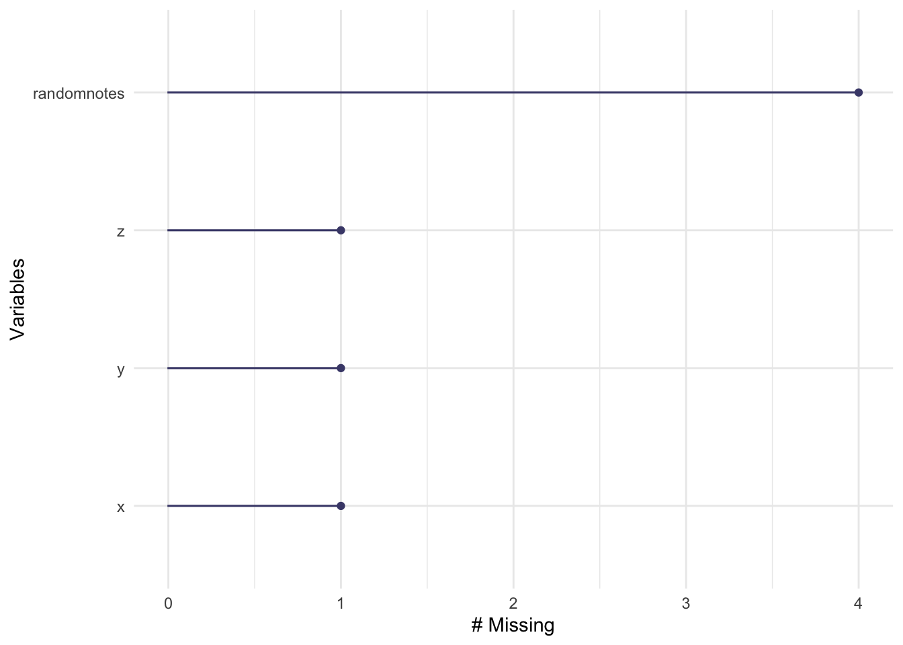

``` r
vis_miss(testdata)      # heatmap showing where NAs are across the whole dataset
```

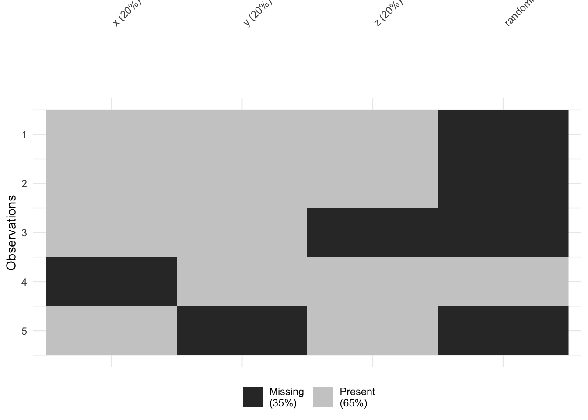

`vis_miss()` is particularly useful for spotting whether missingness clusters in particular rows or columns — which can give clues about whether data is MCAR, MAR, or MNAR.

<br>

---

## Handling missing data {#T6B_Handling}

<br>

### Remove rows with any NA — `na.omit()` {#T6B_naomit}

**Listwise deletion** removes any row that contains an NA in *any* column:


``` r
data_complete <- na.omit(testdata)
data_complete
```

```
## [1] x           y           z           randomnotes
## <0 rows> (or 0-length row.names)
```

> **Warning:** If your dataset has columns with lots of NAs that are irrelevant to your analysis (like a free-text notes column), `na.omit()` will still remove rows because of them. Always check how many rows you lose:
> 
> ``` r
> nrow(testdata)       # before
> nrow(data_complete)  # after
> ```
> If you've lost more than expected, use the targeted approach below instead.

<br>

### Remove rows where specific columns are NA {#T6B_FilterNA}

To remove rows only where particular columns are missing, use `filter()`:


``` r
data_filtered <- testdata |>
  filter(!is.na(x) & !is.na(z))

data_filtered
```

```
##   x    y  z randomnotes
## 1 1    A 10        <NA>
## 2 2    B 15        <NA>
## 3 5 <NA> 25        <NA>
```

`!is.na(x)` means *"keep rows where x is NOT missing"*. This is more precise than `na.omit()` and is usually the better choice.

You can also use `complete.cases()` for the same result:


``` r
data_filtered <- testdata[complete.cases(testdata$x), ]
```

Or `drop_na()` from `tidyr`:


``` r
data_filtered <- testdata |>
  drop_na(x, z)
```

<br>

### Replace NAs with a value {#T6B_Replace}

Sometimes you want to keep the row but fill in a specific value — for example, replacing `NA` with `0` or `"Unknown"`.

Using `ifelse()`:


``` r
testdata$x <- ifelse(is.na(testdata$x), 99, testdata$x)
testdata
```

```
##    x    y  z randomnotes
## 1  1    A 10        <NA>
## 2  2    B 15        <NA>
## 3  3    C NA        <NA>
## 4 99    D 20       hello
## 5  5 <NA> 25        <NA>
```

Using `replace_na()` from `tidyr` (cleaner for multiple columns at once):


``` r
testdata <- testdata |>
  replace_na(list(x = 0, y = "Unknown"))
testdata
```

```
##    x       y  z randomnotes
## 1  1       A 10        <NA>
## 2  2       B 15        <NA>
## 3  3       C NA        <NA>
## 4 99       D 20       hello
## 5  5 Unknown 25        <NA>
```

> **Note:** Replacing NAs with a fixed value is a form of imputation. Only do this if you have a principled reason — for example, replacing `NA` counts with `0` when you know the true value is zero, not unknown.

<br>

---

## Missing data in common functions {#T6B_Functions}

You don't always need to remove missing data in advance. Many R functions have a built-in option to ignore NAs.

<br>

#### `na.rm = TRUE` {#T6B_naRM}

By default, most summary functions return `NA` if any values are missing:


``` r
mean(testdata$z)
```

```
## [1] NA
```

Add `na.rm = TRUE` to ignore missing values:


``` r
mean(testdata$z, na.rm = TRUE)
```

```
## [1] 17.5
```

``` r
sd(testdata$z,   na.rm = TRUE)
```

```
## [1] 6.454972
```

`na.rm = TRUE` works in `mean()`, `median()`, `sd()`, `sum()`, `min()`, `max()`, and most other summary functions.

<br>

#### Correlation and missing data {#T6B_Correlation}

The `cor()` function doesn't use `na.rm` — it has its own argument:


``` r
cor(testdata$x, testdata$z, use = "complete.obs")
```

```
## [1] 0.2919672
```

For a full correlation matrix, **pairwise deletion** uses all available data for each pair of variables, rather than removing entire rows:


``` r
cor(testdata, use = "pairwise.complete.obs")
```

Pairwise deletion retains more data than listwise deletion, but can result in different sample sizes per correlation — worth noting when interpreting results.

<br>

---

## Missing data in regression models {#T6B_Regression}

Most modelling functions in R remove rows with missing values automatically. The question is *how* they do it — and this matters when you look at predictions.


``` r
model_omit    <- lm(z ~ x, data = testdata, na.action = na.omit)
model_exclude <- lm(z ~ x, data = testdata, na.action = na.exclude)
```

| Method | What it does | When to use |
|---|---|---|
| `na.omit` | Removes rows with missing data; drops them from predictions | When you don't need predictions for missing rows |
| `na.exclude` | Removes rows with missing data; keeps `NA` in predictions at the original row positions | When you need predictions to align with your original dataset |

**I recommend `na.exclude` unless you have a specific reason not to.**

The difference becomes clear when you look at predictions:


``` r
predict(model_omit)     # predictions only for complete cases — shorter vector
```

```
##        1        2        4        5 
## 16.49309 16.53220 20.32520 16.64951
```

``` r
predict(model_exclude)  # predictions with NA preserved at missing rows — same length as original data
```

```
##        1        2        3        4        5 
## 16.49309 16.53220       NA 20.32520 16.64951
```

`na.exclude` keeps the structure of your dataset intact, which matters in time series or longitudinal analyses where the position of missing values is meaningful.

<br>

---

## Command reference {#T6B_Commands}

A quick-copy summary of all commands covered in this tutorial. Replace `testdata` with your dataset name.


``` r
# -------------------------------------------
# Reading in data with non-standard NA codes
# -------------------------------------------
mydata <- read.csv("data.csv", na.strings = c("", "NA", "-1", "99", "9999"))
mydata <- read_excel("data.xlsx", na = c("", "NA", "-1", "999"))

# Force specific values to NA after reading in
mydata$column[mydata$column < 0] <- NA

# -------------------------------------------
# Identifying missing data
# -------------------------------------------
colSums(is.na(testdata))          # NAs per column
rowSums(is.na(testdata))          # NAs per row
sum(is.na(testdata$x))            # NAs in one column
table(testdata$y, useNA = "ifany") # frequency table including NAs
summary(testdata)                  # summary with NA counts
skim(testdata)                     # detailed summary with NA counts
gg_miss_var(testdata)              # naniar: NAs per variable (plot)
vis_miss(testdata)                 # naniar: NA heatmap (plot)

# -------------------------------------------
# Removing rows with missing data
# -------------------------------------------
data_complete <- na.omit(testdata)                          # remove any row with any NA
data_filtered <- testdata |> filter(!is.na(x) & !is.na(z)) # targeted: specific columns only
data_filtered <- testdata |> drop_na(x, z)                  # tidyr equivalent

# -------------------------------------------
# Replacing NAs with a value
# -------------------------------------------
testdata$x <- ifelse(is.na(testdata$x), 99, testdata$x)         # replace with 99
testdata <- testdata |> replace_na(list(x = 0, y = "Unknown"))   # replace multiple columns

# -------------------------------------------
# Handling NAs inside functions
# -------------------------------------------
mean(testdata$x, na.rm = TRUE)
sd(testdata$x,   na.rm = TRUE)
cor(testdata$x, testdata$z, use = "complete.obs")
cor(testdata, use = "pairwise.complete.obs")

# -------------------------------------------
# Regression with missing data
# -------------------------------------------
lm(z ~ x, data = testdata, na.action = na.omit)    # drops missing rows from predictions
lm(z ~ x, data = testdata, na.action = na.exclude) # preserves NA positions in predictions (recommended)
```

<br>

---

## Troubleshooting {#T6B_Troubleshooting}

<br>

**Function returned `NA` instead of a number**
Your column contains missing values. Add `na.rm = TRUE`:

``` r
mean(testdata$x, na.rm = TRUE)
```

<br>

**`na.omit()` removed far more rows than expected**
You probably have a column with many NAs that isn't relevant to your analysis (e.g. a notes column). Use `filter(!is.na(columnname))` or `drop_na(col1, col2)` to target only the columns that matter.

<br>

**`cor()` returned `NA` even with `na.rm = TRUE`**
`cor()` doesn't use `na.rm`. Use `use = "complete.obs"` or `use = "pairwise.complete.obs"` instead.

<br>

**Predictions from `lm()` are a different length to my dataset**
You used `na.action = na.omit` (the default). Switch to `na.action = na.exclude` to preserve NA positions in the prediction vector so it matches your original data length.

<br>

**`vis_miss()` or `gg_miss_var()` not found**
The `naniar` package isn't loaded. Add `library(naniar)` to your library code chunk.

<!--chapter:end:in_04-Tutorial06B_MissingData.Rmd-->


# Plots {#T6_plots}

Plots are designed to do two things, allow you to see something in the data that you couldn't see in the numbers, plus communicate output in a compelling way.

Going beyond the basics or knowing the limitations of a plot will help you do this, so in these examples I have provided a range of complexity. You will see tutorials for all the plots I mention in this section. If in doubt, try the ggstatsplot versions.

<br>

### What to choose?

-   If you are looking at a single variable, try histograms, boxplots and violin plots

-   If you think your histogram changes by some category, try grouped boxplots and grouped violin plots (easy violin plot here)

-   If you think your histogram changes numerically, try ridgeline plots

-   If you are comparing two variables, try scatterplots and correlation plots.

<br>

### Where to find worked examples

There are three places I visit constantly:

-   <https://www.r-graph-gallery.com/>
-   <https://indrajeetpatil.github.io/ggstatsplot/>
-   <https://r-charts.com/distribution/>
-   <https://flowingdata.com/>

If you are new to data visualisation, read these two articles

-   <https://flowingdata.com/2014/10/23/moving-past-default-charts/>
-   <https://flowingdata.com/2012/05/15/how-to-visualize-and-compare-distributions/>

------------------------------------------------------------------------

<br><br> {#T6_ExampleData}

## Example dataset

Throughout this tutorial, I will use an example dataset on houses in New York. This has the columns:

-   `Price`: Estimated price (in \$1,000's)
-   `Beds`: Number of bedrooms
-   `Baths`: Number of bathrooms
-   `Size`: Floor area of the house (in 1,000 square feet)
-   `Lot`: Size of the lot (in acres)


``` r
data("HousesNY", package = "Stat2Data")

head(HousesNY)
```

```
##   Price Beds Baths  Size  Lot
## 1  57.6    3     2 0.960 1.30
## 2 120.0    6     2 2.786 0.23
## 3 150.0    4     2 1.704 0.27
## 4 143.0    3     2 1.200 0.80
## 5  92.5    3     1 1.329 0.42
## 6  50.0    2     1 0.974 0.34
```


------------------------------------------------------------------------

<br><br>

## Scatterplots {#T7_PlotsScatter}

<br>

### Basic plot (no line of best fit)

Here is the absolute basic scatterplot. This should not be the one you submit in your reports but is useful for a quick look.


``` r
plot(HousesNY$Price ~ HousesNY$Beds,
     pch=16, # changes the point shape to black dots
     xlab="Beds",ylab="Price (USD")
```


<br>

### GGplot2 scatterplots {#T7_PlotsScatter_ggplot2}

GGPlot2 also has basic and advanced options, but you need to install/run the ggplot2 package.

Again, I am using the HousesNY example dataset that I discussed earlier with the bed and price column names. You can see that each command is joined by a "+".


``` r
# Normally this goes in your library code chunk
library(ggplot2)

# ggplot (TABLENAME, aes(x=XCOLUMN_NAME, y=YCOLUMN_NAME)
ggplot(HousesNY, aes(x=Beds, y=Price)) + 
    geom_point() + 
    ggtitle("Price of New York Homes by bedroom size") +
    xlab("Beds") + ylab("Price (1000 USD)")
```


To more advanced.  I RANDOMLY CHOSE THESE STYLE OPTIONS TO SHOW YOU WHAT THEY DO, DON'T COPY/PASTE VERBATIM!


``` r
# Library. Put these at the top!
library(ggplot2)

ggplot(HousesNY, aes(x=Beds, y=Price)) + 
    geom_point(
        color="black",
        fill="#69b3a2",
        shape=22,
        alpha=0.5,
        size=3,
        stroke = 1
        ) +
   ggtitle("Price of New York Homes by bedroom size") +
   xlab("Beds") + ylab("Price (1000 USD)")
```


<br><br>

### GGplot2 adding a line of best fit. {#T7_PlotGGPlotWLine}

Adding a line of best fit is easy, but it takes a bit of getting used to. The ggplotly command makes it interactive


``` r
# Library. Put these at the top if they're 
# not already in your library code chunk
library(ggplot2)
library(plotly)


# Add linear trend WITHOUT confidence intervals
# HousesNY is the variable/table name.  
# Beds and Price are the columns I want to plot

myplot <- ggplot(HousesNY, aes(x=Beds, y=Price)) + 
    geom_point() + 
    ggtitle("Price of New York Homes by bedroom size") +
    xlab("Beds") + ylab("Price (1000 USD)")+
    geom_smooth(method=lm , color="red", se=FALSE) 

# ggplotly makes it interactive, but you could just type myplot
ggplotly(myplot)
```

```{=html}
<div class="plotly html-widget html-fill-item" id="htmlwidget-2cb155756c844c532590" style="width:672px;height:480px;"></div>
<script type="application/json" data-for="htmlwidget-2cb155756c844c532590">{"x":{"data":[{"x":[3,6,4,3,3,2,2,4,4,3,3,3,3,4,3,3,4,3,4,3,4,4,5,4,3,2,3,3,4,3,3,3,3,3,3,2,3,3,3,4,2,4,4,4,4,3,4,3,4,4,5,4,3],"y":[57.600000000000001,120,150,143,92.5,50,89,140,197.5,125.09999999999999,175,60,138.5,160,63.5,107,185,82.700000000000003,75,118,87.5,67.5,105,114,100.5,78,99,144,179,110,175,100,53,92,127,120.5,72,95,38.5,139,75,174,119,89,75.099999999999994,92.5,141,82,162,195,190,115,87],"text":["Beds: 3<br />Price:  57.6","Beds: 6<br />Price: 120.0","Beds: 4<br />Price: 150.0","Beds: 3<br />Price: 143.0","Beds: 3<br />Price:  92.5","Beds: 2<br />Price:  50.0","Beds: 2<br />Price:  89.0","Beds: 4<br />Price: 140.0","Beds: 4<br />Price: 197.5","Beds: 3<br />Price: 125.1","Beds: 3<br />Price: 175.0","Beds: 3<br />Price:  60.0","Beds: 3<br />Price: 138.5","Beds: 4<br />Price: 160.0","Beds: 3<br />Price:  63.5","Beds: 3<br />Price: 107.0","Beds: 4<br />Price: 185.0","Beds: 3<br />Price:  82.7","Beds: 4<br />Price:  75.0","Beds: 3<br />Price: 118.0","Beds: 4<br />Price:  87.5","Beds: 4<br />Price:  67.5","Beds: 5<br />Price: 105.0","Beds: 4<br />Price: 114.0","Beds: 3<br />Price: 100.5","Beds: 2<br />Price:  78.0","Beds: 3<br />Price:  99.0","Beds: 3<br />Price: 144.0","Beds: 4<br />Price: 179.0","Beds: 3<br />Price: 110.0","Beds: 3<br />Price: 175.0","Beds: 3<br />Price: 100.0","Beds: 3<br />Price:  53.0","Beds: 3<br />Price:  92.0","Beds: 3<br />Price: 127.0","Beds: 2<br />Price: 120.5","Beds: 3<br />Price:  72.0","Beds: 3<br />Price:  95.0","Beds: 3<br />Price:  38.5","Beds: 4<br />Price: 139.0","Beds: 2<br />Price:  75.0","Beds: 4<br />Price: 174.0","Beds: 4<br />Price: 119.0","Beds: 4<br />Price:  89.0","Beds: 4<br />Price:  75.1","Beds: 3<br />Price:  92.5","Beds: 4<br />Price: 141.0","Beds: 3<br />Price:  82.0","Beds: 4<br />Price: 162.0","Beds: 4<br />Price: 195.0","Beds: 5<br />Price: 190.0","Beds: 4<br />Price: 115.0","Beds: 3<br />Price:  87.0"],"type":"scatter","mode":"markers","marker":{"autocolorscale":false,"color":"rgba(0,0,0,1)","opacity":1,"size":5.6692913385826778,"symbol":"circle","line":{"width":1.8897637795275593,"color":"rgba(0,0,0,1)"}},"hoveron":"points","showlegend":false,"xaxis":"x","yaxis":"y","hoverinfo":"text","frame":null},{"x":[2,2.0506329113924049,2.1012658227848102,2.1518987341772151,2.2025316455696204,2.2531645569620253,2.3037974683544302,2.3544303797468356,2.4050632911392404,2.4556962025316453,2.5063291139240507,2.5569620253164556,2.6075949367088609,2.6582278481012658,2.7088607594936711,2.759493670886076,2.8101265822784809,2.8607594936708862,2.9113924050632911,2.962025316455696,3.0126582278481013,3.0632911392405062,3.1139240506329111,3.1645569620253164,3.2151898734177218,3.2658227848101267,3.3164556962025316,3.3670886075949369,3.4177215189873418,3.4683544303797467,3.518987341772152,3.5696202531645569,3.6202531645569618,3.6708860759493671,3.7215189873417724,3.7721518987341769,3.8227848101265822,3.8734177215189876,3.9240506329113924,3.9746835443037973,4.0253164556962027,4.075949367088608,4.1265822784810124,4.1772151898734178,4.2278481012658222,4.2784810126582276,4.3291139240506329,4.3797468354430382,4.4303797468354436,4.481012658227848,4.5316455696202533,4.5822784810126578,4.6329113924050631,4.6835443037974684,4.7341772151898738,4.7848101265822782,4.8354430379746836,4.886075949367088,4.9367088607594933,4.9873417721518987,5.037974683544304,5.0886075949367093,5.1392405063291138,5.1898734177215191,5.2405063291139236,5.2911392405063289,5.3417721518987342,5.3924050632911396,5.4430379746835449,5.4936708860759493,5.5443037974683538,5.5949367088607591,5.6455696202531644,5.6962025316455698,5.7468354430379751,5.7974683544303796,5.8481012658227849,5.8987341772151893,5.9493670886075947,6],"y":[83.048267898383415,84.157362528137554,85.266457157891722,86.375551787645861,87.4846464174,88.59374104715414,89.702835676908279,90.811930306662447,91.921024936416586,93.030119566170725,94.139214195924865,95.248308825679004,96.357403455433172,97.466498085187311,98.57559271494145,99.68468734469559,100.79378197444973,101.9028766042039,103.01197123395804,104.12106586371218,105.23016049346631,106.33925512322047,107.44834975297461,108.55744438272876,109.6665390124829,110.77563364223704,111.88472827199119,112.99382290174533,114.10291753149947,115.21201216125363,116.32110679100776,117.43020142076192,118.53929605051606,119.6483906802702,120.75748531002435,121.86657993977849,122.97567456953264,124.08476919928678,125.19386382904092,126.30295845879508,127.41205308854921,128.52114771830338,129.63024234805749,130.73933697781166,131.84843160756577,132.95752623731994,134.06662086707411,135.17571549682822,136.28481012658239,137.39390475633652,138.50299938609066,139.6120940158448,140.72118864559894,141.83028327535311,142.93937790510725,144.04847253486139,145.15756716461553,146.26666179436967,147.37575642412384,148.48485105387797,149.59394568363211,150.70304031338628,151.81213494314039,152.92122957289456,154.03032420264867,155.13941883240284,156.24851346215698,157.35760809191112,158.46670272166529,159.57579735141942,160.68489198117356,161.7939866109277,162.90308124068184,164.01217587043601,165.12127050019015,166.23036512994429,167.33945975969843,168.44855438945257,169.55764901920671,170.66674364896087],"text":["Beds: 2.000000<br />Price:  83.04827","Beds: 2.050633<br />Price:  84.15736","Beds: 2.101266<br />Price:  85.26646","Beds: 2.151899<br />Price:  86.37555","Beds: 2.202532<br />Price:  87.48465","Beds: 2.253165<br />Price:  88.59374","Beds: 2.303797<br />Price:  89.70284","Beds: 2.354430<br />Price:  90.81193","Beds: 2.405063<br />Price:  91.92102","Beds: 2.455696<br />Price:  93.03012","Beds: 2.506329<br />Price:  94.13921","Beds: 2.556962<br />Price:  95.24831","Beds: 2.607595<br />Price:  96.35740","Beds: 2.658228<br />Price:  97.46650","Beds: 2.708861<br />Price:  98.57559","Beds: 2.759494<br />Price:  99.68469","Beds: 2.810127<br />Price: 100.79378","Beds: 2.860759<br />Price: 101.90288","Beds: 2.911392<br />Price: 103.01197","Beds: 2.962025<br />Price: 104.12107","Beds: 3.012658<br />Price: 105.23016","Beds: 3.063291<br />Price: 106.33926","Beds: 3.113924<br />Price: 107.44835","Beds: 3.164557<br />Price: 108.55744","Beds: 3.215190<br />Price: 109.66654","Beds: 3.265823<br />Price: 110.77563","Beds: 3.316456<br />Price: 111.88473","Beds: 3.367089<br />Price: 112.99382","Beds: 3.417722<br />Price: 114.10292","Beds: 3.468354<br />Price: 115.21201","Beds: 3.518987<br />Price: 116.32111","Beds: 3.569620<br />Price: 117.43020","Beds: 3.620253<br />Price: 118.53930","Beds: 3.670886<br />Price: 119.64839","Beds: 3.721519<br />Price: 120.75749","Beds: 3.772152<br />Price: 121.86658","Beds: 3.822785<br />Price: 122.97567","Beds: 3.873418<br />Price: 124.08477","Beds: 3.924051<br />Price: 125.19386","Beds: 3.974684<br />Price: 126.30296","Beds: 4.025316<br />Price: 127.41205","Beds: 4.075949<br />Price: 128.52115","Beds: 4.126582<br />Price: 129.63024","Beds: 4.177215<br />Price: 130.73934","Beds: 4.227848<br />Price: 131.84843","Beds: 4.278481<br />Price: 132.95753","Beds: 4.329114<br />Price: 134.06662","Beds: 4.379747<br />Price: 135.17572","Beds: 4.430380<br />Price: 136.28481","Beds: 4.481013<br />Price: 137.39390","Beds: 4.531646<br />Price: 138.50300","Beds: 4.582278<br />Price: 139.61209","Beds: 4.632911<br />Price: 140.72119","Beds: 4.683544<br />Price: 141.83028","Beds: 4.734177<br />Price: 142.93938","Beds: 4.784810<br />Price: 144.04847","Beds: 4.835443<br />Price: 145.15757","Beds: 4.886076<br />Price: 146.26666","Beds: 4.936709<br />Price: 147.37576","Beds: 4.987342<br />Price: 148.48485","Beds: 5.037975<br />Price: 149.59395","Beds: 5.088608<br />Price: 150.70304","Beds: 5.139241<br />Price: 151.81213","Beds: 5.189873<br />Price: 152.92123","Beds: 5.240506<br />Price: 154.03032","Beds: 5.291139<br />Price: 155.13942","Beds: 5.341772<br />Price: 156.24851","Beds: 5.392405<br />Price: 157.35761","Beds: 5.443038<br />Price: 158.46670","Beds: 5.493671<br />Price: 159.57580","Beds: 5.544304<br />Price: 160.68489","Beds: 5.594937<br />Price: 161.79399","Beds: 5.645570<br />Price: 162.90308","Beds: 5.696203<br />Price: 164.01218","Beds: 5.746835<br />Price: 165.12127","Beds: 5.797468<br />Price: 166.23037","Beds: 5.848101<br />Price: 167.33946","Beds: 5.898734<br />Price: 168.44855","Beds: 5.949367<br />Price: 169.55765","Beds: 6.000000<br />Price: 170.66674"],"type":"scatter","mode":"lines","name":"fitted values","line":{"width":3.7795275590551185,"color":"rgba(255,0,0,1)","dash":"solid"},"hoveron":"points","showlegend":false,"xaxis":"x","yaxis":"y","hoverinfo":"text","frame":null}],"layout":{"margin":{"t":40.840182648401829,"r":7.3059360730593621,"b":37.260273972602747,"l":43.105022831050235},"plot_bgcolor":"rgba(235,235,235,1)","paper_bgcolor":"rgba(255,255,255,1)","font":{"color":"rgba(0,0,0,1)","family":"","size":14.611872146118724},"title":{"text":"Price of New York Homes by bedroom size","font":{"color":"rgba(0,0,0,1)","family":"","size":17.534246575342465},"x":0,"xref":"paper"},"xaxis":{"domain":[0,1],"automargin":true,"type":"linear","autorange":false,"range":[1.8,6.2000000000000002],"tickmode":"array","ticktext":["2","3","4","5","6"],"tickvals":[2,3,4,5,6],"categoryorder":"array","categoryarray":["2","3","4","5","6"],"nticks":null,"ticks":"outside","tickcolor":"rgba(51,51,51,1)","ticklen":3.6529680365296811,"tickwidth":0,"showticklabels":true,"tickfont":{"color":"rgba(77,77,77,1)","family":"","size":11.68949771689498},"tickangle":-0,"showline":false,"linecolor":null,"linewidth":0,"showgrid":true,"gridcolor":"rgba(255,255,255,1)","gridwidth":0,"zeroline":false,"anchor":"y","title":{"text":"Beds","font":{"color":"rgba(0,0,0,1)","family":"","size":14.611872146118724}},"hoverformat":".2f"},"yaxis":{"domain":[0,1],"automargin":true,"type":"linear","autorange":false,"range":[30.550000000000001,205.44999999999999],"tickmode":"array","ticktext":["50","100","150","200"],"tickvals":[50,100,150,200],"categoryorder":"array","categoryarray":["50","100","150","200"],"nticks":null,"ticks":"outside","tickcolor":"rgba(51,51,51,1)","ticklen":3.6529680365296811,"tickwidth":0,"showticklabels":true,"tickfont":{"color":"rgba(77,77,77,1)","family":"","size":11.68949771689498},"tickangle":-0,"showline":false,"linecolor":null,"linewidth":0,"showgrid":true,"gridcolor":"rgba(255,255,255,1)","gridwidth":0,"zeroline":false,"anchor":"x","title":{"text":"Price (1000 USD)","font":{"color":"rgba(0,0,0,1)","family":"","size":14.611872146118724}},"hoverformat":".2f"},"shapes":[{"type":"rect","fillcolor":null,"line":{"color":null,"width":0,"linetype":[]},"yref":"paper","xref":"paper","layer":"below","x0":0,"x1":1,"y0":0,"y1":1}],"showlegend":false,"legend":{"bgcolor":"rgba(255,255,255,1)","bordercolor":"transparent","borderwidth":0,"font":{"color":"rgba(0,0,0,1)","family":"","size":11.68949771689498}},"hovermode":"closest","barmode":"relative"},"config":{"doubleClick":"reset","modeBarButtonsToAdd":["hoverclosest","hovercompare"],"showSendToCloud":false},"source":"A","attrs":{"dc3c24f1db94":{"x":{},"y":{},"type":"scatter"},"dc3c286e47f":{"x":{},"y":{}}},"cur_data":"dc3c24f1db94","visdat":{"dc3c24f1db94":["function (y) ","x"],"dc3c286e47f":["function (y) ","x"]},"highlight":{"on":"plotly_click","persistent":false,"dynamic":false,"selectize":false,"opacityDim":0.20000000000000001,"selected":{"opacity":1},"debounce":0},"shinyEvents":["plotly_hover","plotly_click","plotly_selected","plotly_relayout","plotly_brushed","plotly_brushing","plotly_clickannotation","plotly_doubleclick","plotly_deselect","plotly_afterplot","plotly_sunburstclick"],"base_url":"https://plot.ly"},"evals":[],"jsHooks":[]}</script>
```

### GGplot2 adding a line of best fit and confidence intervals

We can also add confidence intervals on our line of best fit.


``` r
# Add linear trend + confidence interval
ggplot(HousesNY, aes(x=Beds, y=Price)) + 
    geom_point() + 
    ggtitle("Price of New York Homes by bedroom size") +
    xlab("Beds") + ylab("Price (1000 USD)")+
    geom_smooth(method=lm , color="blue", fill="#69b3a2", se=TRUE)
```


<br>

### Plotly Interactive scatterplots! {#T6_ScatterPlotly}

You can use the plotly library to make ANY ggplot2 plot interactive

This is really useful, try zooming in or clicking on a few points. If you don't want the line of best fit, simply remove the geom_smooth line.


``` r
# create the plot, save it as a variable rather than print immediately
myplot <-   ggplot(HousesNY, aes(x=Beds, y=Price)) + 
               geom_point() + 
               geom_smooth(method=lm , color="red", se=FALSE) +
               ggtitle("Price of New York Homes by bedroom size") +
               xlab("Beds") + ylab("Price (1000 USD)")
            
# and plot interactively
ggplotly(myplot)
```

```{=html}
<div class="plotly html-widget html-fill-item" id="htmlwidget-6dcbff2e00bf54fa9f36" style="width:672px;height:480px;"></div>
<script type="application/json" data-for="htmlwidget-6dcbff2e00bf54fa9f36">{"x":{"data":[{"x":[3,6,4,3,3,2,2,4,4,3,3,3,3,4,3,3,4,3,4,3,4,4,5,4,3,2,3,3,4,3,3,3,3,3,3,2,3,3,3,4,2,4,4,4,4,3,4,3,4,4,5,4,3],"y":[57.600000000000001,120,150,143,92.5,50,89,140,197.5,125.09999999999999,175,60,138.5,160,63.5,107,185,82.700000000000003,75,118,87.5,67.5,105,114,100.5,78,99,144,179,110,175,100,53,92,127,120.5,72,95,38.5,139,75,174,119,89,75.099999999999994,92.5,141,82,162,195,190,115,87],"text":["Beds: 3<br />Price:  57.6","Beds: 6<br />Price: 120.0","Beds: 4<br />Price: 150.0","Beds: 3<br />Price: 143.0","Beds: 3<br />Price:  92.5","Beds: 2<br />Price:  50.0","Beds: 2<br />Price:  89.0","Beds: 4<br />Price: 140.0","Beds: 4<br />Price: 197.5","Beds: 3<br />Price: 125.1","Beds: 3<br />Price: 175.0","Beds: 3<br />Price:  60.0","Beds: 3<br />Price: 138.5","Beds: 4<br />Price: 160.0","Beds: 3<br />Price:  63.5","Beds: 3<br />Price: 107.0","Beds: 4<br />Price: 185.0","Beds: 3<br />Price:  82.7","Beds: 4<br />Price:  75.0","Beds: 3<br />Price: 118.0","Beds: 4<br />Price:  87.5","Beds: 4<br />Price:  67.5","Beds: 5<br />Price: 105.0","Beds: 4<br />Price: 114.0","Beds: 3<br />Price: 100.5","Beds: 2<br />Price:  78.0","Beds: 3<br />Price:  99.0","Beds: 3<br />Price: 144.0","Beds: 4<br />Price: 179.0","Beds: 3<br />Price: 110.0","Beds: 3<br />Price: 175.0","Beds: 3<br />Price: 100.0","Beds: 3<br />Price:  53.0","Beds: 3<br />Price:  92.0","Beds: 3<br />Price: 127.0","Beds: 2<br />Price: 120.5","Beds: 3<br />Price:  72.0","Beds: 3<br />Price:  95.0","Beds: 3<br />Price:  38.5","Beds: 4<br />Price: 139.0","Beds: 2<br />Price:  75.0","Beds: 4<br />Price: 174.0","Beds: 4<br />Price: 119.0","Beds: 4<br />Price:  89.0","Beds: 4<br />Price:  75.1","Beds: 3<br />Price:  92.5","Beds: 4<br />Price: 141.0","Beds: 3<br />Price:  82.0","Beds: 4<br />Price: 162.0","Beds: 4<br />Price: 195.0","Beds: 5<br />Price: 190.0","Beds: 4<br />Price: 115.0","Beds: 3<br />Price:  87.0"],"type":"scatter","mode":"markers","marker":{"autocolorscale":false,"color":"rgba(0,0,0,1)","opacity":1,"size":5.6692913385826778,"symbol":"circle","line":{"width":1.8897637795275593,"color":"rgba(0,0,0,1)"}},"hoveron":"points","showlegend":false,"xaxis":"x","yaxis":"y","hoverinfo":"text","frame":null},{"x":[2,2.0506329113924049,2.1012658227848102,2.1518987341772151,2.2025316455696204,2.2531645569620253,2.3037974683544302,2.3544303797468356,2.4050632911392404,2.4556962025316453,2.5063291139240507,2.5569620253164556,2.6075949367088609,2.6582278481012658,2.7088607594936711,2.759493670886076,2.8101265822784809,2.8607594936708862,2.9113924050632911,2.962025316455696,3.0126582278481013,3.0632911392405062,3.1139240506329111,3.1645569620253164,3.2151898734177218,3.2658227848101267,3.3164556962025316,3.3670886075949369,3.4177215189873418,3.4683544303797467,3.518987341772152,3.5696202531645569,3.6202531645569618,3.6708860759493671,3.7215189873417724,3.7721518987341769,3.8227848101265822,3.8734177215189876,3.9240506329113924,3.9746835443037973,4.0253164556962027,4.075949367088608,4.1265822784810124,4.1772151898734178,4.2278481012658222,4.2784810126582276,4.3291139240506329,4.3797468354430382,4.4303797468354436,4.481012658227848,4.5316455696202533,4.5822784810126578,4.6329113924050631,4.6835443037974684,4.7341772151898738,4.7848101265822782,4.8354430379746836,4.886075949367088,4.9367088607594933,4.9873417721518987,5.037974683544304,5.0886075949367093,5.1392405063291138,5.1898734177215191,5.2405063291139236,5.2911392405063289,5.3417721518987342,5.3924050632911396,5.4430379746835449,5.4936708860759493,5.5443037974683538,5.5949367088607591,5.6455696202531644,5.6962025316455698,5.7468354430379751,5.7974683544303796,5.8481012658227849,5.8987341772151893,5.9493670886075947,6],"y":[83.048267898383415,84.157362528137554,85.266457157891722,86.375551787645861,87.4846464174,88.59374104715414,89.702835676908279,90.811930306662447,91.921024936416586,93.030119566170725,94.139214195924865,95.248308825679004,96.357403455433172,97.466498085187311,98.57559271494145,99.68468734469559,100.79378197444973,101.9028766042039,103.01197123395804,104.12106586371218,105.23016049346631,106.33925512322047,107.44834975297461,108.55744438272876,109.6665390124829,110.77563364223704,111.88472827199119,112.99382290174533,114.10291753149947,115.21201216125363,116.32110679100776,117.43020142076192,118.53929605051606,119.6483906802702,120.75748531002435,121.86657993977849,122.97567456953264,124.08476919928678,125.19386382904092,126.30295845879508,127.41205308854921,128.52114771830338,129.63024234805749,130.73933697781166,131.84843160756577,132.95752623731994,134.06662086707411,135.17571549682822,136.28481012658239,137.39390475633652,138.50299938609066,139.6120940158448,140.72118864559894,141.83028327535311,142.93937790510725,144.04847253486139,145.15756716461553,146.26666179436967,147.37575642412384,148.48485105387797,149.59394568363211,150.70304031338628,151.81213494314039,152.92122957289456,154.03032420264867,155.13941883240284,156.24851346215698,157.35760809191112,158.46670272166529,159.57579735141942,160.68489198117356,161.7939866109277,162.90308124068184,164.01217587043601,165.12127050019015,166.23036512994429,167.33945975969843,168.44855438945257,169.55764901920671,170.66674364896087],"text":["Beds: 2.000000<br />Price:  83.04827","Beds: 2.050633<br />Price:  84.15736","Beds: 2.101266<br />Price:  85.26646","Beds: 2.151899<br />Price:  86.37555","Beds: 2.202532<br />Price:  87.48465","Beds: 2.253165<br />Price:  88.59374","Beds: 2.303797<br />Price:  89.70284","Beds: 2.354430<br />Price:  90.81193","Beds: 2.405063<br />Price:  91.92102","Beds: 2.455696<br />Price:  93.03012","Beds: 2.506329<br />Price:  94.13921","Beds: 2.556962<br />Price:  95.24831","Beds: 2.607595<br />Price:  96.35740","Beds: 2.658228<br />Price:  97.46650","Beds: 2.708861<br />Price:  98.57559","Beds: 2.759494<br />Price:  99.68469","Beds: 2.810127<br />Price: 100.79378","Beds: 2.860759<br />Price: 101.90288","Beds: 2.911392<br />Price: 103.01197","Beds: 2.962025<br />Price: 104.12107","Beds: 3.012658<br />Price: 105.23016","Beds: 3.063291<br />Price: 106.33926","Beds: 3.113924<br />Price: 107.44835","Beds: 3.164557<br />Price: 108.55744","Beds: 3.215190<br />Price: 109.66654","Beds: 3.265823<br />Price: 110.77563","Beds: 3.316456<br />Price: 111.88473","Beds: 3.367089<br />Price: 112.99382","Beds: 3.417722<br />Price: 114.10292","Beds: 3.468354<br />Price: 115.21201","Beds: 3.518987<br />Price: 116.32111","Beds: 3.569620<br />Price: 117.43020","Beds: 3.620253<br />Price: 118.53930","Beds: 3.670886<br />Price: 119.64839","Beds: 3.721519<br />Price: 120.75749","Beds: 3.772152<br />Price: 121.86658","Beds: 3.822785<br />Price: 122.97567","Beds: 3.873418<br />Price: 124.08477","Beds: 3.924051<br />Price: 125.19386","Beds: 3.974684<br />Price: 126.30296","Beds: 4.025316<br />Price: 127.41205","Beds: 4.075949<br />Price: 128.52115","Beds: 4.126582<br />Price: 129.63024","Beds: 4.177215<br />Price: 130.73934","Beds: 4.227848<br />Price: 131.84843","Beds: 4.278481<br />Price: 132.95753","Beds: 4.329114<br />Price: 134.06662","Beds: 4.379747<br />Price: 135.17572","Beds: 4.430380<br />Price: 136.28481","Beds: 4.481013<br />Price: 137.39390","Beds: 4.531646<br />Price: 138.50300","Beds: 4.582278<br />Price: 139.61209","Beds: 4.632911<br />Price: 140.72119","Beds: 4.683544<br />Price: 141.83028","Beds: 4.734177<br />Price: 142.93938","Beds: 4.784810<br />Price: 144.04847","Beds: 4.835443<br />Price: 145.15757","Beds: 4.886076<br />Price: 146.26666","Beds: 4.936709<br />Price: 147.37576","Beds: 4.987342<br />Price: 148.48485","Beds: 5.037975<br />Price: 149.59395","Beds: 5.088608<br />Price: 150.70304","Beds: 5.139241<br />Price: 151.81213","Beds: 5.189873<br />Price: 152.92123","Beds: 5.240506<br />Price: 154.03032","Beds: 5.291139<br />Price: 155.13942","Beds: 5.341772<br />Price: 156.24851","Beds: 5.392405<br />Price: 157.35761","Beds: 5.443038<br />Price: 158.46670","Beds: 5.493671<br />Price: 159.57580","Beds: 5.544304<br />Price: 160.68489","Beds: 5.594937<br />Price: 161.79399","Beds: 5.645570<br />Price: 162.90308","Beds: 5.696203<br />Price: 164.01218","Beds: 5.746835<br />Price: 165.12127","Beds: 5.797468<br />Price: 166.23037","Beds: 5.848101<br />Price: 167.33946","Beds: 5.898734<br />Price: 168.44855","Beds: 5.949367<br />Price: 169.55765","Beds: 6.000000<br />Price: 170.66674"],"type":"scatter","mode":"lines","name":"fitted values","line":{"width":3.7795275590551185,"color":"rgba(255,0,0,1)","dash":"solid"},"hoveron":"points","showlegend":false,"xaxis":"x","yaxis":"y","hoverinfo":"text","frame":null}],"layout":{"margin":{"t":40.840182648401829,"r":7.3059360730593621,"b":37.260273972602747,"l":43.105022831050235},"plot_bgcolor":"rgba(235,235,235,1)","paper_bgcolor":"rgba(255,255,255,1)","font":{"color":"rgba(0,0,0,1)","family":"","size":14.611872146118724},"title":{"text":"Price of New York Homes by bedroom size","font":{"color":"rgba(0,0,0,1)","family":"","size":17.534246575342465},"x":0,"xref":"paper"},"xaxis":{"domain":[0,1],"automargin":true,"type":"linear","autorange":false,"range":[1.8,6.2000000000000002],"tickmode":"array","ticktext":["2","3","4","5","6"],"tickvals":[2,3,4,5,6],"categoryorder":"array","categoryarray":["2","3","4","5","6"],"nticks":null,"ticks":"outside","tickcolor":"rgba(51,51,51,1)","ticklen":3.6529680365296811,"tickwidth":0,"showticklabels":true,"tickfont":{"color":"rgba(77,77,77,1)","family":"","size":11.68949771689498},"tickangle":-0,"showline":false,"linecolor":null,"linewidth":0,"showgrid":true,"gridcolor":"rgba(255,255,255,1)","gridwidth":0,"zeroline":false,"anchor":"y","title":{"text":"Beds","font":{"color":"rgba(0,0,0,1)","family":"","size":14.611872146118724}},"hoverformat":".2f"},"yaxis":{"domain":[0,1],"automargin":true,"type":"linear","autorange":false,"range":[30.550000000000001,205.44999999999999],"tickmode":"array","ticktext":["50","100","150","200"],"tickvals":[50,100,150,200],"categoryorder":"array","categoryarray":["50","100","150","200"],"nticks":null,"ticks":"outside","tickcolor":"rgba(51,51,51,1)","ticklen":3.6529680365296811,"tickwidth":0,"showticklabels":true,"tickfont":{"color":"rgba(77,77,77,1)","family":"","size":11.68949771689498},"tickangle":-0,"showline":false,"linecolor":null,"linewidth":0,"showgrid":true,"gridcolor":"rgba(255,255,255,1)","gridwidth":0,"zeroline":false,"anchor":"x","title":{"text":"Price (1000 USD)","font":{"color":"rgba(0,0,0,1)","family":"","size":14.611872146118724}},"hoverformat":".2f"},"shapes":[{"type":"rect","fillcolor":null,"line":{"color":null,"width":0,"linetype":[]},"yref":"paper","xref":"paper","layer":"below","x0":0,"x1":1,"y0":0,"y1":1}],"showlegend":false,"legend":{"bgcolor":"rgba(255,255,255,1)","bordercolor":"transparent","borderwidth":0,"font":{"color":"rgba(0,0,0,1)","family":"","size":11.68949771689498}},"hovermode":"closest","barmode":"relative"},"config":{"doubleClick":"reset","modeBarButtonsToAdd":["hoverclosest","hovercompare"],"showSendToCloud":false},"source":"A","attrs":{"dc3c5131540e":{"x":{},"y":{},"type":"scatter"},"dc3c7d858cc6":{"x":{},"y":{}}},"cur_data":"dc3c5131540e","visdat":{"dc3c5131540e":["function (y) ","x"],"dc3c7d858cc6":["function (y) ","x"]},"highlight":{"on":"plotly_click","persistent":false,"dynamic":false,"selectize":false,"opacityDim":0.20000000000000001,"selected":{"opacity":1},"debounce":0},"shinyEvents":["plotly_hover","plotly_click","plotly_selected","plotly_relayout","plotly_brushed","plotly_brushing","plotly_clickannotation","plotly_doubleclick","plotly_deselect","plotly_afterplot","plotly_sunburstclick"],"base_url":"https://plot.ly"},"evals":[],"jsHooks":[]}</script>
```

It's also very easy to add in color to see another variable. For example, here I also add in the lot size.


``` r
# create the plot, save it as "p" rather than print immediately
myplot2 <-   ggplot(HousesNY, aes(x=Beds, y=Price,color=Lot)) + 
               geom_point(alpha=.5) +
               scale_color_gradient(low="blue", high="red")+
               ggtitle("New York Homes price by bedrooms and lot size (acres)") +
               xlab("Beds") + 
               ylab("Price (1000 USD)")

# and plot interactively
ggplotly(myplot2)
```

```{=html}
<div class="plotly html-widget html-fill-item" id="htmlwidget-a32b7ced47de0f63ee9c" style="width:672px;height:480px;"></div>
<script type="application/json" data-for="htmlwidget-a32b7ced47de0f63ee9c">{"x":{"data":[{"x":[3,6,4,3,3,2,2,4,4,3,3,3,3,4,3,3,4,3,4,3,4,4,5,4,3,2,3,3,4,3,3,3,3,3,3,2,3,3,3,4,2,4,4,4,4,3,4,3,4,4,5,4,3],"y":[57.600000000000001,120,150,143,92.5,50,89,140,197.5,125.09999999999999,175,60,138.5,160,63.5,107,185,82.700000000000003,75,118,87.5,67.5,105,114,100.5,78,99,144,179,110,175,100,53,92,127,120.5,72,95,38.5,139,75,174,119,89,75.099999999999994,92.5,141,82,162,195,190,115,87],"text":["Beds: 3<br />Price:  57.6<br />Lot: 1.30","Beds: 6<br />Price: 120.0<br />Lot: 0.23","Beds: 4<br />Price: 150.0<br />Lot: 0.27","Beds: 3<br />Price: 143.0<br />Lot: 0.80","Beds: 3<br />Price:  92.5<br />Lot: 0.42","Beds: 2<br />Price:  50.0<br />Lot: 0.34","Beds: 2<br />Price:  89.0<br />Lot: 0.29","Beds: 4<br />Price: 140.0<br />Lot: 0.21","Beds: 4<br />Price: 197.5<br />Lot: 1.00","Beds: 3<br />Price: 125.1<br />Lot: 0.30","Beds: 3<br />Price: 175.0<br />Lot: 1.30","Beds: 3<br />Price:  60.0<br />Lot: 1.00","Beds: 3<br />Price: 138.5<br />Lot: 0.70","Beds: 4<br />Price: 160.0<br />Lot: 0.60","Beds: 3<br />Price:  63.5<br />Lot: 0.20","Beds: 3<br />Price: 107.0<br />Lot: 2.00","Beds: 4<br />Price: 185.0<br />Lot: 0.12","Beds: 3<br />Price:  82.7<br />Lot: 2.07","Beds: 4<br />Price:  75.0<br />Lot: 0.15","Beds: 3<br />Price: 118.0<br />Lot: 0.50","Beds: 4<br />Price:  87.5<br />Lot: 0.33","Beds: 4<br />Price:  67.5<br />Lot: 0.22","Beds: 5<br />Price: 105.0<br />Lot: 0.37","Beds: 4<br />Price: 114.0<br />Lot: 2.50","Beds: 3<br />Price: 100.5<br />Lot: 0.58","Beds: 2<br />Price:  78.0<br />Lot: 1.17","Beds: 3<br />Price:  99.0<br />Lot: 1.66","Beds: 3<br />Price: 144.0<br />Lot: 0.34","Beds: 4<br />Price: 179.0<br />Lot: 0.28","Beds: 3<br />Price: 110.0<br />Lot: 0.21","Beds: 3<br />Price: 175.0<br />Lot: 1.80","Beds: 3<br />Price: 100.0<br />Lot: 3.50","Beds: 3<br />Price:  53.0<br />Lot: 0.25","Beds: 3<br />Price:  92.0<br />Lot: 0.00","Beds: 3<br />Price: 127.0<br />Lot: 0.34","Beds: 2<br />Price: 120.5<br />Lot: 2.00","Beds: 3<br />Price:  72.0<br />Lot: 0.22","Beds: 3<br />Price:  95.0<br />Lot: 1.03","Beds: 3<br />Price:  38.5<br />Lot: 1.42","Beds: 4<br />Price: 139.0<br />Lot: 0.12","Beds: 2<br />Price:  75.0<br />Lot: 0.15","Beds: 4<br />Price: 174.0<br />Lot: 0.48","Beds: 4<br />Price: 119.0<br />Lot: 0.34","Beds: 4<br />Price:  89.0<br />Lot: 1.00","Beds: 4<br />Price:  75.1<br />Lot: 0.35","Beds: 3<br />Price:  92.5<br />Lot: 0.73","Beds: 4<br />Price: 141.0<br />Lot: 0.28","Beds: 3<br />Price:  82.0<br />Lot: 2.50","Beds: 4<br />Price: 162.0<br />Lot: 0.85","Beds: 4<br />Price: 195.0<br />Lot: 1.84","Beds: 5<br />Price: 190.0<br />Lot: 0.31","Beds: 4<br />Price: 115.0<br />Lot: 1.10","Beds: 3<br />Price:  87.0<br />Lot: 0.25"],"type":"scatter","mode":"markers","marker":{"autocolorscale":false,"color":["rgba(180,0,166,1)","rgba(86,0,239,1)","rgba(92,0,236,1)","rgba(149,0,200,1)","rgba(113,0,226,1)","rgba(103,0,231,1)","rgba(95,0,235,1)","rgba(82,0,240,1)","rgba(163,0,186,1)","rgba(97,0,234,1)","rgba(180,0,166,1)","rgba(163,0,186,1)","rgba(141,0,206,1)","rgba(132,0,213,1)","rgba(80,0,241,1)","rgba(211,0,120,1)","rgba(62,0,247,1)","rgba(214,0,116,1)","rgba(70,0,244,1)","rgba(122,0,220,1)","rgba(101,0,232,1)","rgba(84,0,240,1)","rgba(107,0,229,1)","rgba(228,0,88,1)","rgba(130,0,215,1)","rgba(173,0,175,1)","rgba(198,0,142,1)","rgba(103,0,231,1)","rgba(94,0,235,1)","rgba(82,0,240,1)","rgba(204,0,133,1)","rgba(255,0,0,1)","rgba(89,0,237,1)","rgba(0,0,255,1)","rgba(103,0,231,1)","rgba(211,0,120,1)","rgba(84,0,240,1)","rgba(165,0,184,1)","rgba(187,0,158,1)","rgba(62,0,247,1)","rgba(70,0,244,1)","rgba(120,0,222,1)","rgba(103,0,231,1)","rgba(163,0,186,1)","rgba(104,0,231,1)","rgba(143,0,204,1)","rgba(94,0,235,1)","rgba(228,0,88,1)","rgba(152,0,196,1)","rgba(205,0,131,1)","rgba(98,0,233,1)","rgba(169,0,179,1)","rgba(89,0,237,1)"],"opacity":0.5,"size":5.6692913385826778,"symbol":"circle","line":{"width":1.8897637795275593,"color":["rgba(180,0,166,1)","rgba(86,0,239,1)","rgba(92,0,236,1)","rgba(149,0,200,1)","rgba(113,0,226,1)","rgba(103,0,231,1)","rgba(95,0,235,1)","rgba(82,0,240,1)","rgba(163,0,186,1)","rgba(97,0,234,1)","rgba(180,0,166,1)","rgba(163,0,186,1)","rgba(141,0,206,1)","rgba(132,0,213,1)","rgba(80,0,241,1)","rgba(211,0,120,1)","rgba(62,0,247,1)","rgba(214,0,116,1)","rgba(70,0,244,1)","rgba(122,0,220,1)","rgba(101,0,232,1)","rgba(84,0,240,1)","rgba(107,0,229,1)","rgba(228,0,88,1)","rgba(130,0,215,1)","rgba(173,0,175,1)","rgba(198,0,142,1)","rgba(103,0,231,1)","rgba(94,0,235,1)","rgba(82,0,240,1)","rgba(204,0,133,1)","rgba(255,0,0,1)","rgba(89,0,237,1)","rgba(0,0,255,1)","rgba(103,0,231,1)","rgba(211,0,120,1)","rgba(84,0,240,1)","rgba(165,0,184,1)","rgba(187,0,158,1)","rgba(62,0,247,1)","rgba(70,0,244,1)","rgba(120,0,222,1)","rgba(103,0,231,1)","rgba(163,0,186,1)","rgba(104,0,231,1)","rgba(143,0,204,1)","rgba(94,0,235,1)","rgba(228,0,88,1)","rgba(152,0,196,1)","rgba(205,0,131,1)","rgba(98,0,233,1)","rgba(169,0,179,1)","rgba(89,0,237,1)"]}},"hoveron":"points","showlegend":false,"xaxis":"x","yaxis":"y","hoverinfo":"text","frame":null},{"x":[2],"y":[50],"name":"8ccdb11056d67e7a95560151183149c2","type":"scatter","mode":"markers","opacity":0,"hoverinfo":"skip","showlegend":false,"marker":{"color":[0,1],"colorscale":[[0,"#0000FF"],[0.0033444816053511705,"#0F00FE"],[0.006688963210702341,"#1900FD"],[0.01003344481605351,"#2000FD"],[0.013377926421404682,"#2600FC"],[0.016722408026755852,"#2B00FB"],[0.02006688963210702,"#2F00FA"],[0.023411371237458196,"#3300F9"],[0.026755852842809364,"#3700F8"],[0.030100334448160532,"#3A00F8"],[0.033444816053511704,"#3E00F7"],[0.036789297658862873,"#4100F6"],[0.040133779264214041,"#4400F5"],[0.043478260869565209,"#4600F4"],[0.046822742474916391,"#4900F3"],[0.05016722408026756,"#4B00F3"],[0.053511705685618728,"#4E00F2"],[0.056856187290969896,"#5000F1"],[0.060200668896321065,"#5200F0"],[0.06354515050167224,"#5400EF"],[0.066889632107023408,"#5600EF"],[0.070234113712374577,"#5800EE"],[0.073578595317725745,"#5A00ED"],[0.076923076923076913,"#5C00EC"],[0.080267558528428082,"#5E00EB"],[0.08361204013377925,"#6000EB"],[0.086956521739130418,"#6200EA"],[0.090301003344481587,"#6300E9"],[0.093645484949832783,"#6500E8"],[0.096989966555183951,"#6700E7"],[0.10033444816053512,"#6800E6"],[0.10367892976588629,"#6A00E6"],[0.10702341137123746,"#6B00E5"],[0.11036789297658862,"#6D00E4"],[0.11371237458193979,"#6E00E3"],[0.11705685618729096,"#7000E2"],[0.12040133779264213,"#7100E2"],[0.12374581939799331,"#7200E1"],[0.12709030100334448,"#7400E0"],[0.13043478260869565,"#7500DF"],[0.13377926421404682,"#7600DE"],[0.13712374581939799,"#7800DE"],[0.14046822742474915,"#7900DD"],[0.14381270903010032,"#7A00DC"],[0.14715719063545149,"#7B00DB"],[0.15050167224080266,"#7D00DA"],[0.15384615384615383,"#7E00DA"],[0.157190635451505,"#7F00D9"],[0.16053511705685616,"#8000D8"],[0.16387959866220733,"#8100D7"],[0.1672240802675585,"#8200D6"],[0.17056856187290967,"#8400D5"],[0.17391304347826084,"#8500D5"],[0.17725752508361201,"#8600D4"],[0.18060200668896317,"#8700D3"],[0.18394648829431434,"#8800D2"],[0.18729096989966557,"#8900D1"],[0.19063545150501673,"#8A00D1"],[0.1939799331103679,"#8B00D0"],[0.19732441471571907,"#8C00CF"],[0.20066889632107024,"#8D00CE"],[0.20401337792642141,"#8E00CD"],[0.20735785953177258,"#8F00CD"],[0.21070234113712374,"#9000CC"],[0.21404682274247491,"#9100CB"],[0.21739130434782608,"#9200CA"],[0.22073578595317725,"#9300CA"],[0.22408026755852842,"#9400C9"],[0.22742474916387959,"#9400C8"],[0.23076923076923075,"#9500C7"],[0.23411371237458192,"#9600C6"],[0.23745819397993309,"#9700C6"],[0.24080267558528426,"#9800C5"],[0.24414715719063546,"#9900C4"],[0.24749163879598662,"#9A00C3"],[0.25083612040133779,"#9B00C2"],[0.25418060200668896,"#9B00C2"],[0.25752508361204013,"#9C00C1"],[0.2608695652173913,"#9D00C0"],[0.26421404682274247,"#9E00BF"],[0.26755852842809363,"#9F00BE"],[0.2709030100334448,"#9F00BE"],[0.27424749163879597,"#A000BD"],[0.27759197324414714,"#A100BC"],[0.28093645484949831,"#A200BB"],[0.28428093645484948,"#A300BA"],[0.28762541806020064,"#A300BA"],[0.29096989966555181,"#A400B9"],[0.29431438127090298,"#A500B8"],[0.29765886287625415,"#A600B7"],[0.30100334448160532,"#A600B7"],[0.30434782608695649,"#A700B6"],[0.30769230769230765,"#A800B5"],[0.31103678929765882,"#A800B4"],[0.31438127090300999,"#A900B3"],[0.31772575250836116,"#AA00B3"],[0.32107023411371233,"#AB00B2"],[0.32441471571906355,"#AB00B1"],[0.32775919732441466,"#AC00B0"],[0.33110367892976589,"#AD00AF"],[0.334448160535117,"#AD00AF"],[0.33779264214046822,"#AE00AE"],[0.34113712374581934,"#AF00AD"],[0.34448160535117056,"#AF00AC"],[0.34782608695652167,"#B000AC"],[0.3511705685618729,"#B100AB"],[0.35451505016722401,"#B100AA"],[0.35785953177257523,"#B200A9"],[0.36120401337792635,"#B300A8"],[0.36454849498327757,"#B300A8"],[0.36789297658862868,"#B400A7"],[0.37123745819397991,"#B400A6"],[0.37458193979933113,"#B500A5"],[0.37792642140468224,"#B600A5"],[0.38127090301003347,"#B600A4"],[0.38461538461538458,"#B700A3"],[0.38795986622073581,"#B700A2"],[0.39130434782608692,"#B800A1"],[0.39464882943143814,"#B900A1"],[0.39799331103678925,"#B900A0"],[0.40133779264214048,"#BA009F"],[0.40468227424749159,"#BA009E"],[0.40802675585284282,"#BB009E"],[0.41137123745819393,"#BC009D"],[0.41471571906354515,"#BC009C"],[0.41806020066889626,"#BD009B"],[0.42140468227424749,"#BD009B"],[0.4247491638795986,"#BE009A"],[0.42809364548494983,"#BE0099"],[0.43143812709030099,"#BF0098"],[0.43478260869565216,"#BF0097"],[0.43812709030100333,"#C00097"],[0.4414715719063545,"#C10096"],[0.44481605351170567,"#C10095"],[0.44816053511705684,"#C20094"],[0.451505016722408,"#C20094"],[0.45484949832775917,"#C30093"],[0.45819397993311034,"#C30092"],[0.46153846153846151,"#C40091"],[0.46488294314381268,"#C40091"],[0.46822742474916385,"#C50090"],[0.47157190635451501,"#C5008F"],[0.47491638795986618,"#C6008E"],[0.47826086956521735,"#C6008D"],[0.48160535117056852,"#C7008D"],[0.48494983277591969,"#C7008C"],[0.48829431438127091,"#C8008B"],[0.49163879598662202,"#C8008A"],[0.49498327759197325,"#C9008A"],[0.49832775919732436,"#C90089"],[0.50167224080267558,"#CA0088"],[0.50501672240802675,"#CA0087"],[0.50836120401337792,"#CB0087"],[0.51170568561872909,"#CB0086"],[0.51505016722408026,"#CC0085"],[0.51839464882943143,"#CC0084"],[0.52173913043478259,"#CD0084"],[0.52508361204013376,"#CD0083"],[0.52842809364548493,"#CE0082"],[0.5317725752508361,"#CE0081"],[0.53511705685618727,"#CE0080"],[0.53846153846153844,"#CF0080"],[0.5418060200668896,"#CF007F"],[0.54515050167224077,"#D0007E"],[0.54849498327759194,"#D0007D"],[0.55183946488294311,"#D1007D"],[0.55518394648829428,"#D1007C"],[0.55852842809364545,"#D2007B"],[0.56187290969899661,"#D2007A"],[0.56521739130434778,"#D3007A"],[0.56856187290969895,"#D30079"],[0.57190635451505012,"#D30078"],[0.57525083612040129,"#D40077"],[0.57859531772575246,"#D40077"],[0.58193979933110362,"#D50076"],[0.58528428093645479,"#D50075"],[0.58862876254180596,"#D60074"],[0.59197324414715713,"#D60074"],[0.5953177257525083,"#D60073"],[0.59866220735785958,"#D70072"],[0.60200668896321063,"#D70071"],[0.6053511705685618,"#D80071"],[0.60869565217391297,"#D80070"],[0.61204013377926425,"#D8006F"],[0.61538461538461531,"#D9006E"],[0.61872909698996648,"#D9006E"],[0.62207357859531764,"#DA006D"],[0.62541806020066892,"#DA006C"],[0.62876254180601998,"#DA006B"],[0.63210702341137115,"#DB006A"],[0.63545150501672232,"#DB006A"],[0.6387959866220736,"#DC0069"],[0.64214046822742465,"#DC0068"],[0.64548494983277582,"#DC0067"],[0.6488294314381271,"#DD0067"],[0.65217391304347827,"#DD0066"],[0.65551839464882933,"#DE0065"],[0.6588628762541805,"#DE0064"],[0.66220735785953178,"#DE0064"],[0.66555183946488294,"#DF0063"],[0.668896321070234,"#DF0062"],[0.67224080267558517,"#E00061"],[0.67558528428093645,"#E00061"],[0.67892976588628762,"#E00060"],[0.68227424749163867,"#E1005F"],[0.68561872909698984,"#E1005E"],[0.68896321070234112,"#E1005E"],[0.69230769230769229,"#E2005D"],[0.69565217391304335,"#E2005C"],[0.69899665551839463,"#E3005B"],[0.7023411371237458,"#E3005B"],[0.70568561872909696,"#E3005A"],[0.70903010033444802,"#E40059"],[0.7123745819397993,"#E40058"],[0.71571906354515047,"#E40057"],[0.71906354515050164,"#E50057"],[0.72240802675585269,"#E50056"],[0.72575250836120397,"#E50055"],[0.72909698996655514,"#E60054"],[0.73244147157190631,"#E60054"],[0.73578595317725737,"#E60053"],[0.73913043478260865,"#E70052"],[0.74247491638795982,"#E70051"],[0.74581939799331098,"#E80050"],[0.74916387959866226,"#E80050"],[0.75250836120401332,"#E8004F"],[0.75585284280936449,"#E9004E"],[0.75919732441471566,"#E9004D"],[0.76254180602006694,"#E9004D"],[0.76588628762541799,"#EA004C"],[0.76923076923076916,"#EA004B"],[0.77257525083612033,"#EA004A"],[0.77591973244147161,"#EB0049"],[0.77926421404682267,"#EB0049"],[0.78260869565217384,"#EB0048"],[0.785953177257525,"#EC0047"],[0.78929765886287628,"#EC0046"],[0.79264214046822734,"#EC0046"],[0.79598662207357851,"#ED0045"],[0.79933110367892968,"#ED0044"],[0.80267558528428096,"#ED0043"],[0.80602006688963201,"#EE0042"],[0.80936454849498318,"#EE0042"],[0.81270903010033446,"#EE0041"],[0.81605351170568563,"#EF0040"],[0.81939799331103669,"#EF003F"],[0.82274247491638786,"#EF003E"],[0.82608695652173914,"#F0003D"],[0.8294314381270903,"#F0003D"],[0.83277591973244136,"#F0003C"],[0.83612040133779253,"#F0003B"],[0.83946488294314381,"#F1003A"],[0.84280936454849498,"#F10039"],[0.84615384615384603,"#F10038"],[0.8494983277591972,"#F20038"],[0.85284280936454848,"#F20037"],[0.85618729096989965,"#F20036"],[0.85953177257525071,"#F30035"],[0.86287625418060199,"#F30034"],[0.86622073578595316,"#F30033"],[0.86956521739130432,"#F40032"],[0.87290969899665538,"#F40032"],[0.87625418060200666,"#F40031"],[0.87959866220735783,"#F50030"],[0.882943143812709,"#F5002F"],[0.88628762541806005,"#F5002E"],[0.88963210702341133,"#F5002D"],[0.8929765886287625,"#F6002C"],[0.89632107023411367,"#F6002B"],[0.89966555183946473,"#F6002A"],[0.90301003344481601,"#F70029"],[0.90635451505016718,"#F70028"],[0.90969899665551834,"#F70027"],[0.91304347826086951,"#F80026"],[0.91638795986622068,"#F80025"],[0.91973244147157185,"#F80024"],[0.92307692307692302,"#F80023"],[0.92642140468227419,"#F90022"],[0.92976588628762535,"#F90021"],[0.93311036789297652,"#F90020"],[0.93645484949832769,"#FA001F"],[0.93979933110367886,"#FA001E"],[0.94314381270903003,"#FA001D"],[0.9464882943143812,"#FA001B"],[0.94983277591973236,"#FB001A"],[0.95317725752508353,"#FB0019"],[0.9565217391304347,"#FB0018"],[0.95986622073578587,"#FC0016"],[0.96321070234113704,"#FC0015"],[0.96655518394648821,"#FC0013"],[0.96989966555183937,"#FC0012"],[0.97324414715719054,"#FD0010"],[0.97658862876254182,"#FD000F"],[0.97993311036789288,"#FD000D"],[0.98327759197324405,"#FE000B"],[0.98662207357859522,"#FE0008"],[0.98996655518394649,"#FE0006"],[0.99331103678929755,"#FE0004"],[0.99665551839464872,"#FF0002"],[1,"#FF0000"]],"colorbar":{"bgcolor":"rgba(255,255,255,1)","bordercolor":"transparent","borderwidth":0,"thickness":23.039999999999996,"title":"Lot","titlefont":{"color":"rgba(0,0,0,1)","family":"","size":14.611872146118724},"tickmode":"array","ticktext":["0","1","2","3"],"tickvals":[0.0016666666666666668,0.28642857142857137,0.57119047619047614,0.85595238095238091],"tickfont":{"color":"rgba(0,0,0,1)","family":"","size":11.68949771689498},"ticklen":2,"len":0.5}},"xaxis":"x","yaxis":"y","frame":null}],"layout":{"margin":{"t":40.840182648401829,"r":7.3059360730593621,"b":37.260273972602747,"l":43.105022831050235},"plot_bgcolor":"rgba(235,235,235,1)","paper_bgcolor":"rgba(255,255,255,1)","font":{"color":"rgba(0,0,0,1)","family":"","size":14.611872146118724},"title":{"text":"New York Homes price by bedrooms and lot size (acres)","font":{"color":"rgba(0,0,0,1)","family":"","size":17.534246575342465},"x":0,"xref":"paper"},"xaxis":{"domain":[0,1],"automargin":true,"type":"linear","autorange":false,"range":[1.8,6.2000000000000002],"tickmode":"array","ticktext":["2","3","4","5","6"],"tickvals":[2,3,4,5,6],"categoryorder":"array","categoryarray":["2","3","4","5","6"],"nticks":null,"ticks":"outside","tickcolor":"rgba(51,51,51,1)","ticklen":3.6529680365296811,"tickwidth":0,"showticklabels":true,"tickfont":{"color":"rgba(77,77,77,1)","family":"","size":11.68949771689498},"tickangle":-0,"showline":false,"linecolor":null,"linewidth":0,"showgrid":true,"gridcolor":"rgba(255,255,255,1)","gridwidth":0,"zeroline":false,"anchor":"y","title":{"text":"Beds","font":{"color":"rgba(0,0,0,1)","family":"","size":14.611872146118724}},"hoverformat":".2f"},"yaxis":{"domain":[0,1],"automargin":true,"type":"linear","autorange":false,"range":[30.550000000000001,205.44999999999999],"tickmode":"array","ticktext":["50","100","150","200"],"tickvals":[50,100,150,200],"categoryorder":"array","categoryarray":["50","100","150","200"],"nticks":null,"ticks":"outside","tickcolor":"rgba(51,51,51,1)","ticklen":3.6529680365296811,"tickwidth":0,"showticklabels":true,"tickfont":{"color":"rgba(77,77,77,1)","family":"","size":11.68949771689498},"tickangle":-0,"showline":false,"linecolor":null,"linewidth":0,"showgrid":true,"gridcolor":"rgba(255,255,255,1)","gridwidth":0,"zeroline":false,"anchor":"x","title":{"text":"Price (1000 USD)","font":{"color":"rgba(0,0,0,1)","family":"","size":14.611872146118724}},"hoverformat":".2f"},"shapes":[{"type":"rect","fillcolor":null,"line":{"color":null,"width":0,"linetype":[]},"yref":"paper","xref":"paper","layer":"below","x0":0,"x1":1,"y0":0,"y1":1}],"showlegend":false,"legend":{"bgcolor":"rgba(255,255,255,1)","bordercolor":"transparent","borderwidth":0,"font":{"color":"rgba(0,0,0,1)","family":"","size":11.68949771689498},"title":{"text":"Lot","font":{"color":"rgba(0,0,0,1)","family":"","size":14.611872146118724}}},"hovermode":"closest","barmode":"relative"},"config":{"doubleClick":"reset","modeBarButtonsToAdd":["hoverclosest","hovercompare"],"showSendToCloud":false},"source":"A","attrs":{"dc3c238ba6a":{"x":{},"y":{},"colour":{},"type":"scatter"}},"cur_data":"dc3c238ba6a","visdat":{"dc3c238ba6a":["function (y) ","x"]},"highlight":{"on":"plotly_click","persistent":false,"dynamic":false,"selectize":false,"opacityDim":0.20000000000000001,"selected":{"opacity":1},"debounce":0},"shinyEvents":["plotly_hover","plotly_click","plotly_selected","plotly_relayout","plotly_brushed","plotly_brushing","plotly_clickannotation","plotly_doubleclick","plotly_deselect","plotly_afterplot","plotly_sunburstclick"],"base_url":"https://plot.ly"},"evals":[],"jsHooks":[]}</script>
```

If you get this error, go to the Session menu at the very top of the screen and click "Restart R and run all code chunks".

```         
Error in file(file, ifelse(append, "a", "w")) : 
  cannot open the connection
```

Many more interactive options in this tutorial: <https://plotly.com/r/line-and-scatter/>


<br>

### Basic plot WITH a line of best fit

To add a line, you can use the `abline` command IN THE SAME CODE CHUNK:


``` r
# Create the plot
plot(HousesNY$Price ~ HousesNY$Beds,
     xlab="Beds", ylab="Price (1000 USD)", main="", 
     cex=1.2, pch=16) 

# add vertical line at 3.5
# # add horizontal line at the mean of price
abline(v=5.5,col="red")
abline(h=mean(HousesNY$Price),col="blue",lty="dotted")

# add line of best fit from a linear model
mymodel <- lm(Price ~ Beds, HousesNY)
abline(mymodel,col="purple",lty="dotted",lwd=3) 
```

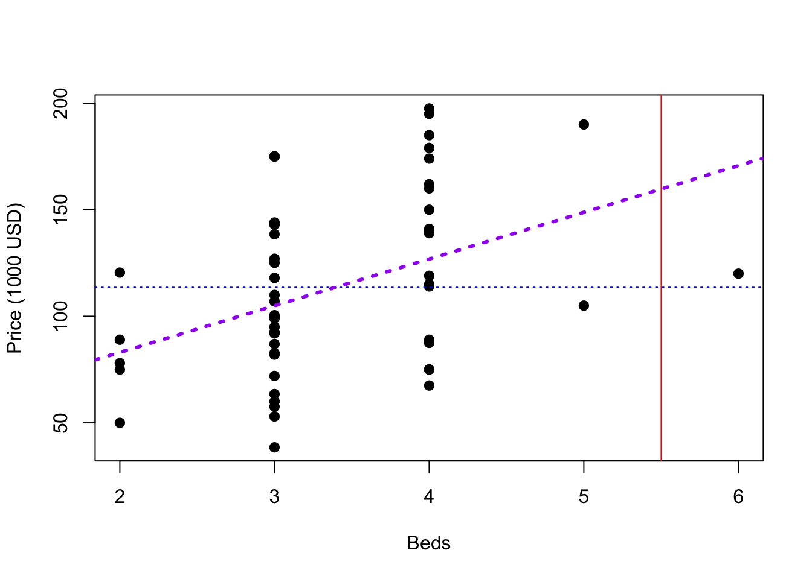

<br>

------------------------------------------------------------------------

<br><br>

## Histograms {#T7_Histograms}

Especially just looking at a single response variable, it's useful to look immediately at the distribution itself. Histograms are great for this, although you must be careful that the bin size doesn't impact your perception of results. Adding in a boxplot is often useful

### Quick check (not report ready!)

Here is the absolute basic histogram, again on our HousesNY price data. You can  specify exact bin sizes using br. - see ?hist


``` r
hist(HousesNY$Price,
     br=40,
     xlab="Price (USD)")
```


### ggstatsplot histograms

I also love the ggstatplot version. Remember to install the ggstatsplot package and to put  library(ggstatsplot) in your top code chunk.

Or their version that includes a lot of associated statistics. You can turn many of these on and off


``` r
## plot
gghistostats(
  data       = HousesNY,  # table name
  x          = Price,  # column name
  results.subtitle = FALSE,
  title      = "Price of sampled houses in Canton NY", 
  caption    = "Source: Zillow",
  xlab = "Price (USDx1000)")
```


<br> 

### ggplot2 histograms

It's also easy in GGplot2. Remember to install the ggplot2 package and to put the library at the top. Check google for how to add your x label


``` r
ggplot(data=HousesNY, aes(x=Price)) + 
  geom_histogram(bins=20) 
```

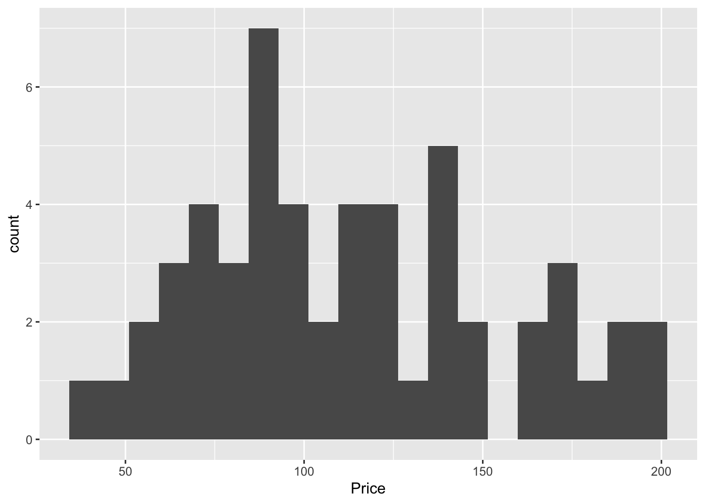

#### Adding a boxplot and histogram

Often, a boxplot AND a histogram is useful as it allows you to see a sense of the data shape and its underlying symmetry. For example, in base R


``` r
# Layout to split the screen
graphics::layout(matrix(c(1,2),2,1, byrow=TRUE),  
       height = c(2,7))
 
# Draw the boxplot and the histogram 
par(mar=c(0, 3.1, .5, 2.1))

data_to_plot <- HousesNY$Price

rangeplot <- pretty(data_to_plot,10)

boxplot(data_to_plot,col = "light blue",
        border = "dark blue",xaxt="n",frame=FALSE,xlim=c(0.75,1.25),
        horizontal = TRUE,notch = TRUE,ylim=c(min(rangeplot),max(rangeplot)))

par(mar=c(3, 3.1, .5, 2.1))
hist(data_to_plot , breaks=20 , 
     col=grey(0.3) , border=F , 
     tcl=-.25,mgp=c(1.75,.5,0),
     main="" , xlab="Price of houses in Canton NY", 
     xlim=c(min(rangeplot),max(rangeplot)))
box();grid();
hist(data_to_plot , breaks=20 , add=TRUE,
     col=grey(0.3) , border=F , axis=FALSE,
     xlim=c(min(rangeplot),max(rangeplot)))
```

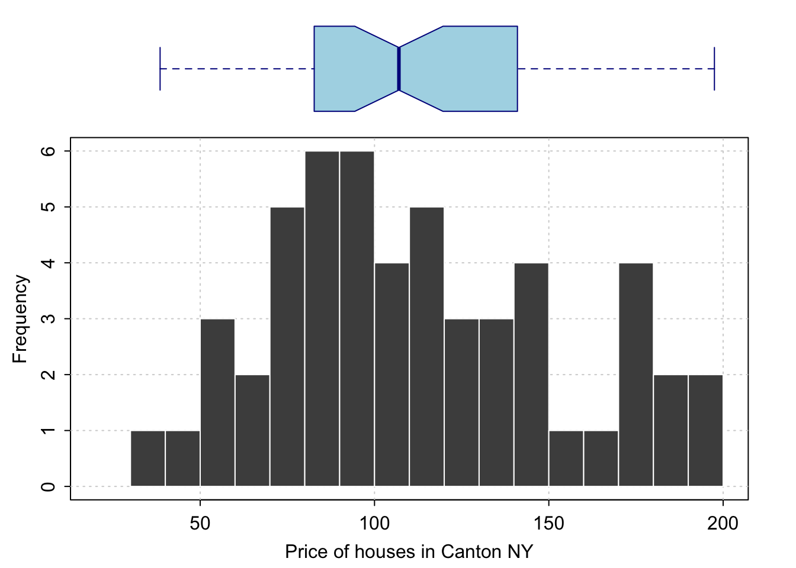

And the same with ggplot2:


``` r
library(ggExtra)

p <- ggplot(data=HousesNY, aes(x=Price)) + 
  geom_point(aes(y = 0.01), alpha = 0) +
  geom_histogram(bins=20) +
  geom_density(na.rm=T)

ggMarginal(p, type="boxplot", margins = "x")
```


#### Adding a density function

Sometimes seeing a smoothed line helps draw the eye to distributions


``` r
hist(HousesNY$Price, prob = TRUE,
     main = "Canton Prices with density curve")
lines(density(HousesNY$Price), col = 4, lwd = 2)
box()
```

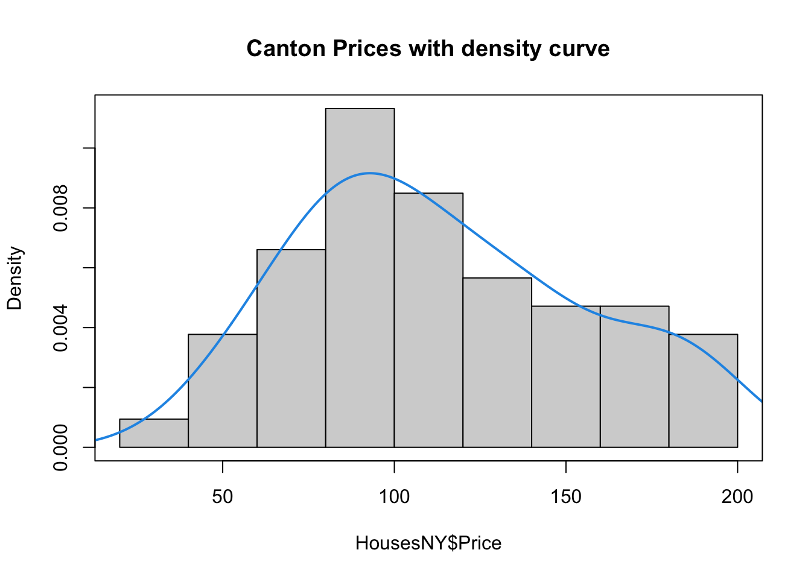

#### Adding a distribution

Let's say you want to make plots similar to the ones in the lectures where there is your chosen distribution on top.

If you know the distribution, you can simply add it on top as a line


``` r
mysample <- HousesNY$Price

plotmin <- mean(mysample) - sd(mysample)*3
plotmax <-  mean(mysample) + sd(mysample)*3

# Points for the normal equation line
NormCurve_x <- seq(plotmin,plotmax, length = 40)

# Normal curve calculation for each point
NormCurve_y <- dnorm(NormCurve_x, mean = mean(mysample), sd = sd(mysample))

# make sure this is density not raw frequency
hist(mysample , breaks=20 , freq=FALSE,
     col=grey(0.5) , border=F , 
     xlim=c(plotmin,plotmax),
     tcl=-.25,mgp=c(1.75,.5,0),
     main="" , xlab="Price of houses in Canton NY")
# add the normal curve (THIS NEEDS TO BE IN THE SAME CODE CHUNK)
lines(NormCurve_x, NormCurve_y, col = 2, lwd = 2)
box()
```


We could plot any old curve this way, it doesn't have to be "fit" to our data. For example here is a random gamma function


``` r
mysample <- HousesNY$Price

# Points for the normal equation line
GammaCurve_x <- seq(plotmin,plotmax, length = 60)
GammaCurve_y <- dgamma(GammaCurve_x,shape = 2)

# make sure this is density not raw frequency
hist(mysample , breaks=20 , freq=FALSE,
     col=grey(0.5) , border=F , 
     xlim=c(plotmin,plotmax),
     tcl=-.25,mgp=c(1.75,.5,0),
     main="" , xlab="Price of houses in Canton NY")
# add the normal curve (THIS NEEDS TO BE IN THE SAME CODE CHUNK)
lines(GammaCurve_x, GammaCurve_y, col = 2, lwd = 2)
box()
```

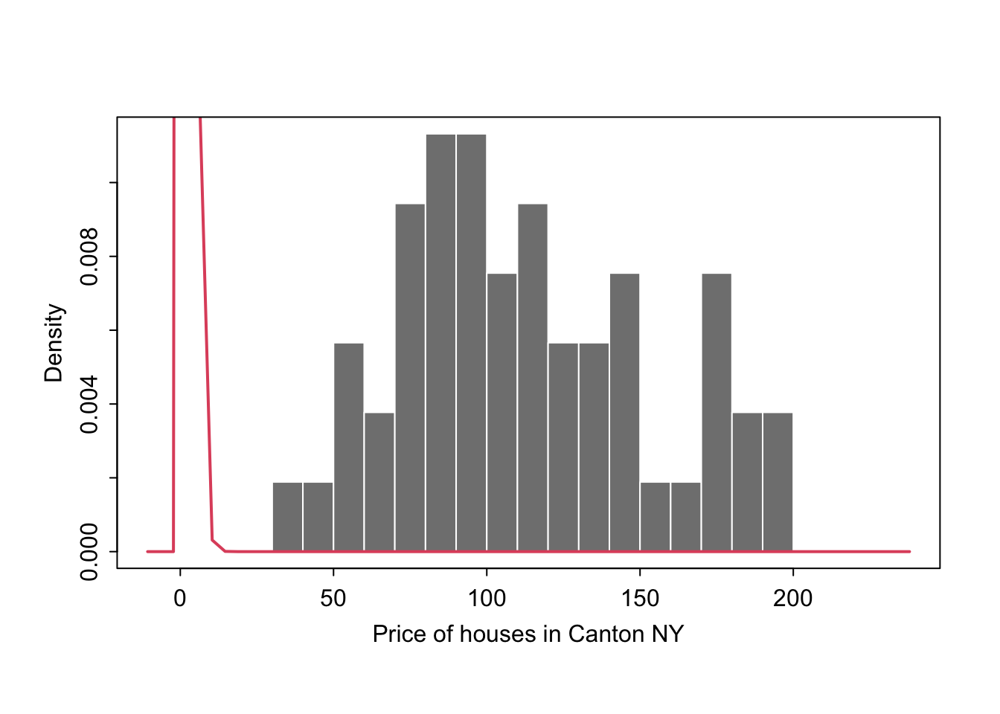

#### Mulitple histograms

Or you can easily compare two datasets, tutorial for this plot here: <https://www.r-graph-gallery.com/histogram_several_group.html>

See also ridgeline plots below.

<br><br>

## Boxplots {#T6_boxplots}

Boxplots have been around over 40 years! See their history and evolution here: <http://vita.had.co.nz/papers/boxplots.pdf>

In terms of your reports, you need to think of 3 things: - Why you are making the plot (quick look vs publication worthy final graphic) - What aspects of the data do you want to highlight (lots of data, comparing groups, weird distributions..) - What are your final requirements and personal style (colorblind friendly, you're drawn to a certain type of plot..)

So for boxplots.. they are especially good at allowing you to compare different groups of things or to look for multiple groups in a single response variable. Here is a beautiful example made by Marcus Beckman on dissertation lengths.

[https://beckmw.wordpress.com/2014/07/15/average-dissertation-and-thesis-length-take-two/ and code here: https://github.com/fawda123/diss_proc](https://beckmw.wordpress.com/2014/07/15/average-dissertation-and-thesis-length-take-two/%20and%20code%20here:%20https://github.com/fawda123/diss_proc) )

If there are only one or two variables, I often jump to the violin or histogram plots as they show more detail.

So.. how to make these yourselves. You have a range of options!

### Basics (single boxplot)

Here is the most basic boxplot you can make. I often start with this for my own use when exploring the data, then later decide which plots to "make pretty".


``` r
boxplot(HousesNY$Price)
```

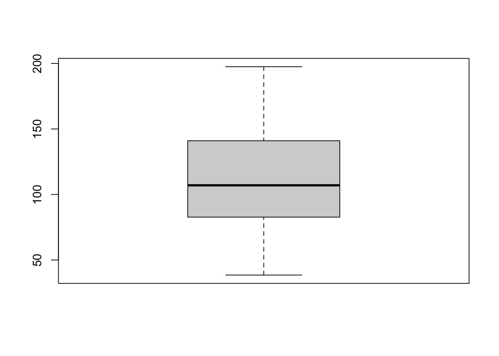

We can make better boxplots in base R (e.g. using no special packages/libraries). See this tutorial for all the details: <https://www.datamentor.io/r-programming/box-plot/> which goes through exactly what each line means.


``` r
# one big command on separate lines
boxplot(HousesNY$Price,
        main = "House prices of Canton NY sample",
        xlab = "Price (Thousand USD)",
        col = "light blue",
        border = "dark blue",
        horizontal = TRUE,
        notch = TRUE)
```


There are specific plotting packages, the most famous being ggplot2 (there are data camp courses on it). The absolute basics. Here x is blank because we just want to look at the price column alone.


``` r
library(ggplot2)

ggplot(HousesNY, aes(x ="", y = Price)) +    ## this loads the data
   geom_boxplot()                            ## and we choose a boxplot
```

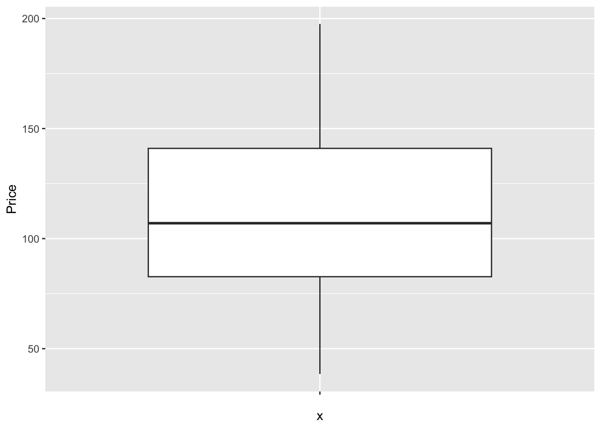

Note for now, think of the %\>% symbol and + symbol also as "one command on multiple lines..". They allow you to build up layers of the plot. Data camp has more on this.

But with these we can easily do more sophisticated things. For example, here's how to see the underlying data, which allows us to see something of the background distribution

<https://r-charts.com/distribution/box-plot-jitter-ggplot2/>


``` r
# Basic box plot
ggplot(HousesNY, aes(x = "", y = Price)) + 
  geom_boxplot() +
  geom_jitter()
```

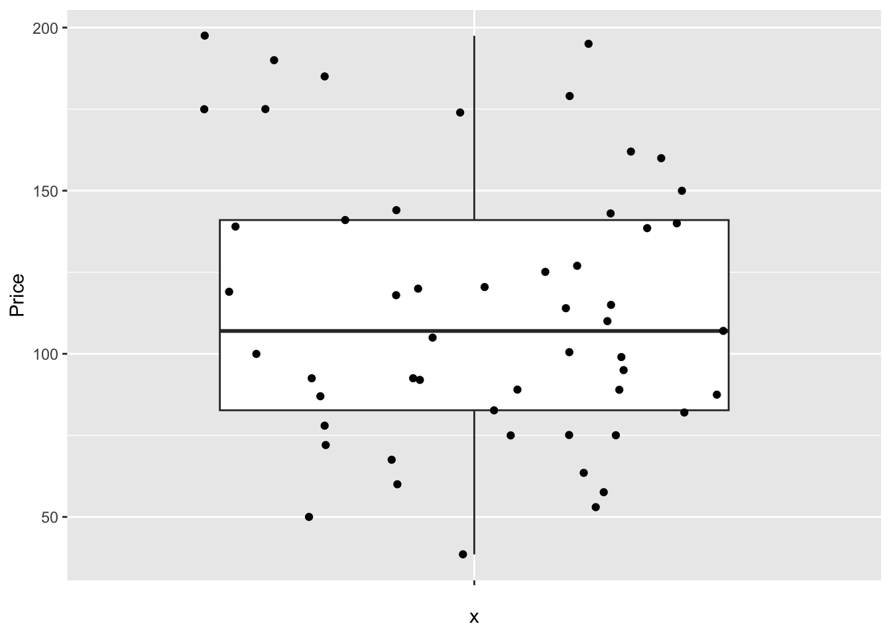

### Comparing groups

The basic code to see a boxplot split by group, in this case the price per number of beds:


``` r
boxplot(HousesNY$Price ~ HousesNY$Beds)
```


The advantage of this is that you can be sure that you really did plot your columns of choice (e.g. you didn't mistakenly label anything). Note, if you use a comma, rather than the "\~" symbol, you will make one for each column - which is normally not useful!


``` r
boxplot(HousesNY$Price,  HousesNY$Beds)
```

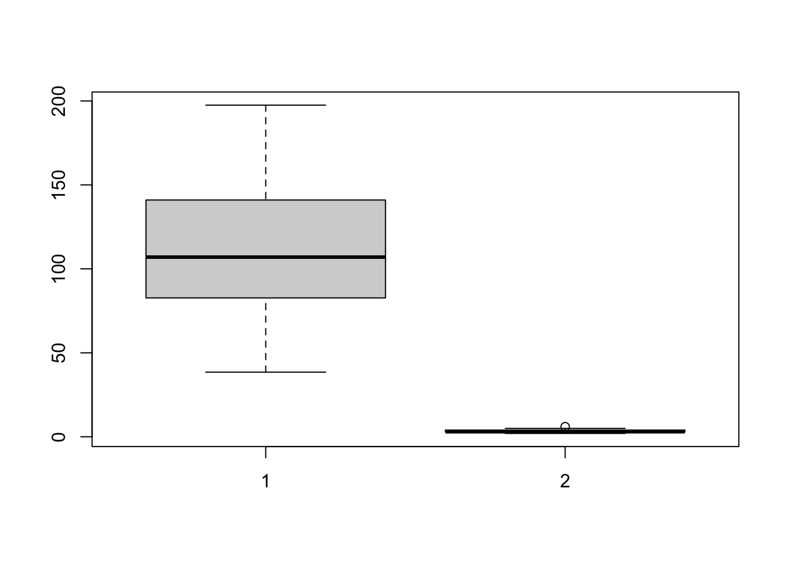

<br>

In GGplot comparing different groups:


``` r
# Libraries
library(tidyverse)
library(viridis)

# tell R that the beds column is categorical
HousesNY$Beds <- factor(HousesNY$Beds,
                     levels=c(min(HousesNY$Beds):max(HousesNY$Beds)))

# Plot
  ggplot(HousesNY, aes(x=Beds, y=Price)) +
    geom_boxplot() 
```


Or getting more complex


``` r
# Libraries
library(tidyverse)
library(viridis)

# tell R that the beds column is categorical
# I already did this in the table section
#HousesNY$Beds <- as.factor(HousesNY$Beds)

# Plot
HousesNY %>%
  ggplot( aes(x=Beds, y=Price, fill=Beds) )+
    geom_boxplot() +
    scale_fill_viridis(discrete = TRUE, alpha=0.6) +
    geom_jitter(color="black", size=0.5, alpha=0.8) +
    ggtitle("") +
    xlab("Beds")
```

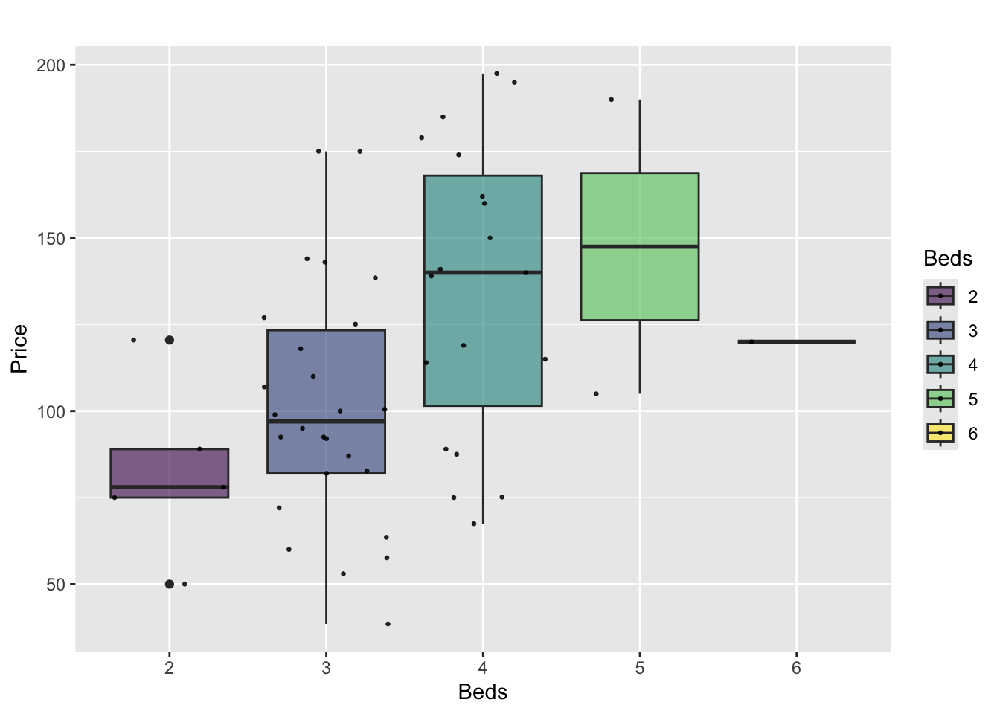

or dotplots..


``` r
ggplot(HousesNY,  aes(x=Beds, y=Price, fill=Beds)) +
  geom_boxplot() +
  geom_dotplot(binaxis = "y", stackdir = "center", dotsize = 0.5,binwidth=7)
```

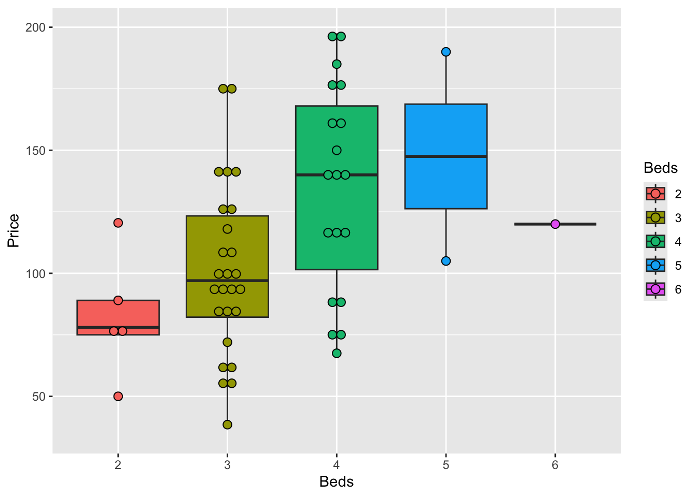

There are MANY more options, plus code here: <https://www.r-graph-gallery.com/boxplot.html>

and a delightful tutorial here: <https://www.r-bloggers.com/2021/11/how-to-make-stunning-boxplots-in-r-a-complete-guide-with-ggplot2/>

### Sophisticated

Finally, we *can* get super fancy in base R - it's often a good way to learn how to code. I like this example because it shows many different aspects/useful commands in R programming. <http://www.opiniomics.org/beautiful-boxplots-in-base-r/>


``` r
library(RColorBrewer)

# create colours and colour matrix (for points)
m     <- as.matrix(HousesNY$Price)

col_main   <- colorRampPalette(brewer.pal(12, "Set3"), alpha=TRUE)(ncol(m))
col_transp <- colorspace::adjust_transparency(col_main, alpha = .3)

colsm   <-matrix(rep(col_main, each=nrow(m)), ncol=ncol(m))
colsm_tr <-matrix(rep(col_transp, each=nrow(m)), ncol=ncol(m))


# create some random data for jitter
r <-  (matrix(runif(nrow(m)*ncol(m)), nrow=nrow(m), ncol=ncol(m)) / 2) - 0.25

# get the greys (stolen from https://github.com/zonination/perceptions/blob/master/percept.R)
palette <- brewer.pal("Greys", n=9)
color.background = palette[2]
color.grid.major = palette[5]

# set graphical area
par(bty="n", bg=palette[2], mar=c(5,8,3,1))

# plot initial boxplot
boxplot(m~col(m), horizontal=TRUE, outline=FALSE, lty=1, 
        staplewex=0, boxwex=0.8, boxlwd=1, medlwd=1, 
        col=colsm_tr, xaxt="n", yaxt="n",xlab="",ylab="")

# plot gridlines
for (i in pretty(m,10)) {
	lines(c(i,i), c(0,20), col=palette[4])
}

# plot points
points(m, col(m)+r, col=colsm, pch=16)

# overlay boxplot
boxplot(m~col(m), horizontal=TRUE, outline=FALSE, lty=1, 
        staplewex=0, boxwex=0.8, boxlwd=1, medlwd=1, col=colsm_tr, 
        add=TRUE, xaxt="n", yaxt="n")

# add axes and title
axis(side=1, at=pretty(m,10), col.axis=palette[7], 
     cex.axis=0.8, lty=0, tick=NA, line=-1)
axis(side=1, at=50, labels="Price (Thousand USD)", 
     lty=0, tick=NA, col.axis=palette[7])
axis(side=2, at=1, col.axis=palette[7], cex.axis=0.8, 
     lty=0, tick=NA, labels="Sample 1", las=2)
axis(side=2, at=17/2, labels="Phrase", col.axis=palette[7], 
     lty=0, tick=NA, las=3, line=6)
title("House Prices in Canton NY")
```

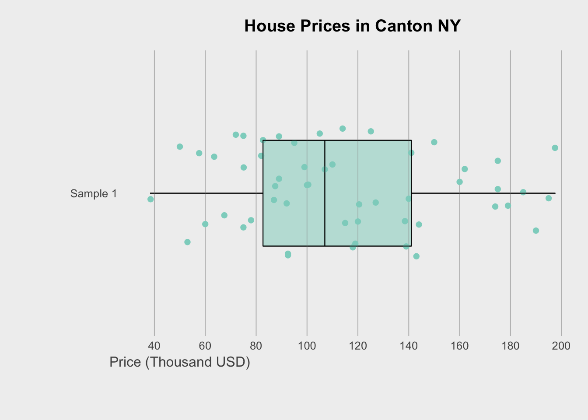

Or if you wish to do the rainbow many group boxplot at the beginning, the code is here : <https://github.com/fawda123/diss_proc/blob/master/diss_plot.R>

<br> <br>

## Violin plots

Violin plots combine the simplicity of a boxplot with a sense of the underlying distribution. This is useful when you want a sense of both the symmetry of the data and the underlying distribution. Highly recommended! For a single variable, consider a box-plot-with-histogram (see below).

There are MANY on R graph gallery with code you can copy/edit: <https://www.r-graph-gallery.com/violin.html>

For example, for our data:


``` r
# fill=name allow to automatically dedicate a color for each group
ggplot(HousesNY, aes(x=Beds, y=Price, fill=Beds)) + 
   geom_violin()
```

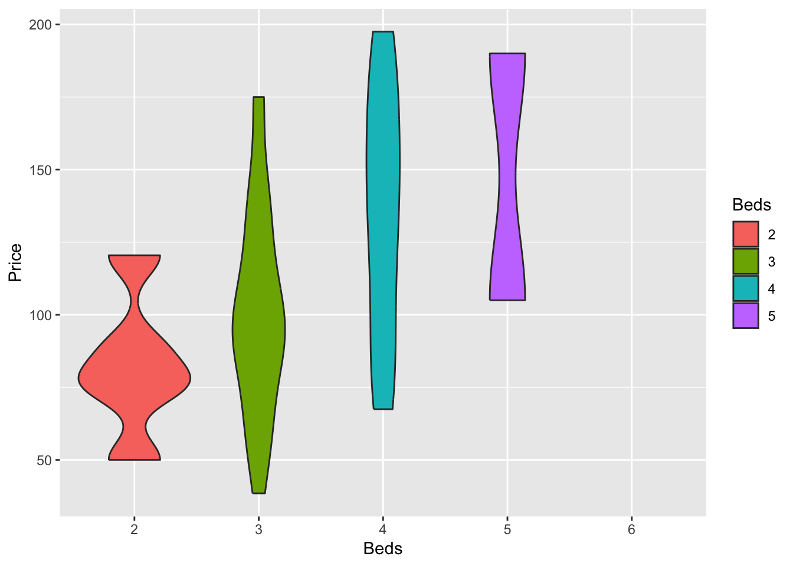

There's also a *beautiful* package called `ggstatsplot` which allows a lot of detail (<https://indrajeetpatil.github.io/ggstatsplot/>)

For example, I love the plot below because it shows how much data in each group.


``` r
# you might need to first install this.
library(ggstatsplot)

# i'm changing the middle mean point to be dark blue

ggbetweenstats(data = HousesNY,x = Beds,y = Price, 
               centrality.point.args=list(color = "darkblue"))
```

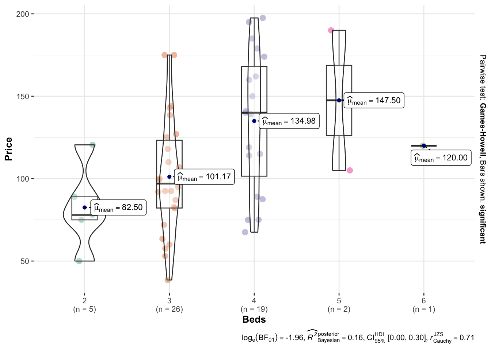

Or we can customise it even more using this tutorial to get results like this (<https://www.r-graph-gallery.com/web-violinplot-with-ggstatsplot.html>)

<br> <br>

## Ridgeline plots

These are another way of looking at histograms for different groups. They work especially when your grouping data is ORDINAL (has some inherent order). So bedrooms would be a good example

Two great pages here:

-   <https://www.data-to-viz.com/graph/ridgeline.html>

-   <https://r-charts.com/distribution/ggridges/>

We can use histograms or smoothed density lines <https://www.data-to-viz.com/graph/ridgeline.html>


``` r
library(ggridges)
library(ggplot2)

HousesNY %>%
  ggplot( aes(y=Beds, x=Price,  fill=Beds)) +
    geom_density_ridges(alpha=0.6, stat="binline") +
    scale_fill_viridis(discrete=TRUE) +
    scale_color_viridis(discrete=TRUE) +
    theme(
      legend.position="none",
      panel.spacing = unit(0.1, "lines"),
      strip.text.x = element_text(size = 8)
    ) +
    xlab("") +
    ylab("Number of Bedrooms")
```

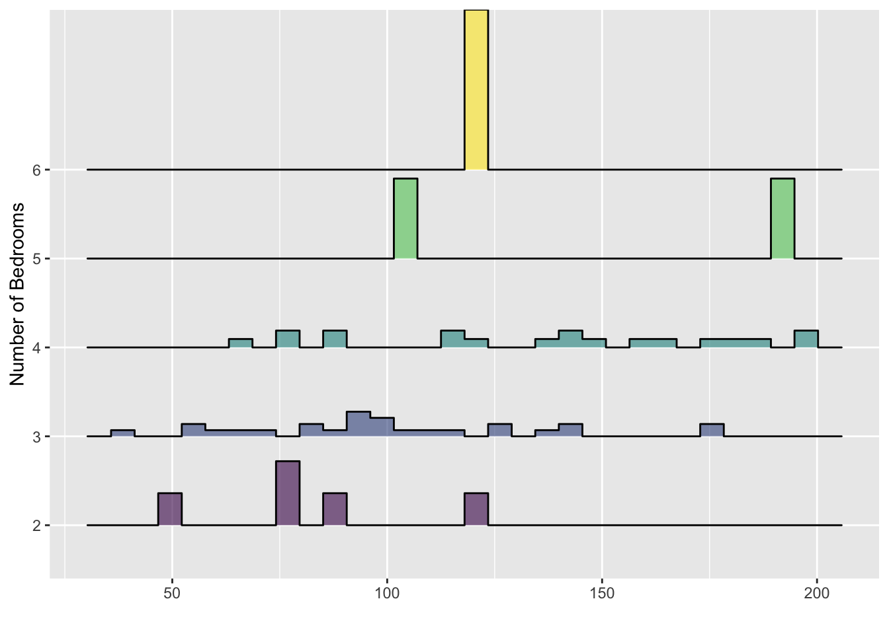

All of these are from <https://r-charts.com/distribution/ggridges/>


``` r
library(ggridges)
library(ggplot2)

ggplot(HousesNY, aes(x = Price, y = Beds, fill = stat(x))) +
  geom_density_ridges_gradient() +
  scale_fill_viridis_c(name = "Depth", option = "C") +
  coord_cartesian(clip = "off") + # To avoid cut off
  theme_minimal()
```

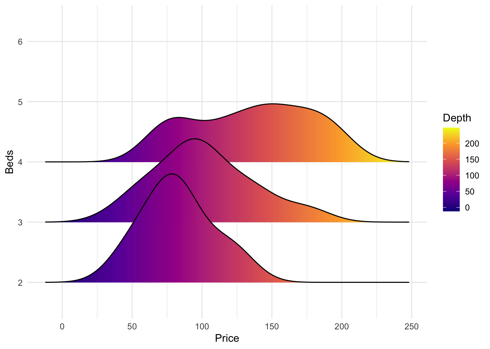

We can also make the colours more meaningful, for example adding quantiles to show the median and interquartile range


``` r
ggplot(HousesNY, aes(x = Price, y = Beds, fill = stat(quantile))) +
  stat_density_ridges(quantile_lines = FALSE,
                      calc_ecdf = TRUE,
                      geom = "density_ridges_gradient") +
  scale_fill_brewer(name = "")
```


or highlighting tails


``` r
ggplot(HousesNY, aes(x = Price, y = Beds, fill = stat(quantile))) +
  stat_density_ridges(quantile_lines = TRUE,
                      calc_ecdf = TRUE,
                      geom = "density_ridges_gradient",
                      quantiles = c(0.05, 0.95)) +
  scale_fill_manual(name = "Proportion", 
                    values = c("#E2FFF2", "white", "#B0E0E6"),
                    labels = c("(0, 5%]", "(5%, 95%]", "(95%, 1]"))
```

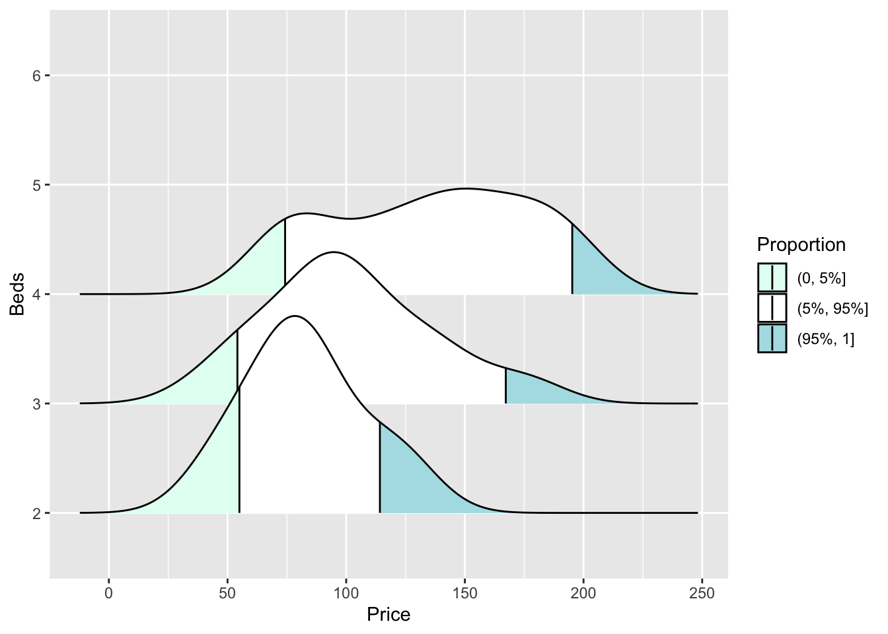

## Beeswarm plots

These are cool. As described here:

[https://www.rhoworld.com/i-swarm-you-swarm-we-all-swarm-for-beeswarm-plots-0/#:\~:text=What%20is%20a%20beeswarm%20plot%3F&text=A%20beeswarm%20plot%20improves%20upon,bees%20buzzing%20about%20their%20hive.](https://www.rhoworld.com/i-swarm-you-swarm-we-all-swarm-for-beeswarm-plots-0/#:~:text=What%20is%20a%20beeswarm%20plot%3F&text=A%20beeswarm%20plot%20improves%20upon,bees%20buzzing%20about%20their%20hive)

"But what is a beeswarm plot? ... A beeswarm plot improves upon the random jittering approach to move data points the minimum distance away from one another to avoid overlays. The result is a plot where you can see each distinct data point, like so: It looks a bit like a friendly swarm of bees buzzing about their hive."

It's often used for professional visualisation, see here for many examples: <https://flowingdata.com/charttype/beeswarm>

Especially for the first, you can see the distribution clearly, also with the amount of data. With the second, you can see the mitigating impact of a second variable.

To make easy ones you can install a new packages "beeswarm"


``` r
library("beeswarm")

beeswarm(HousesNY$Price,
         vertical = FALSE, method = "hex")
```

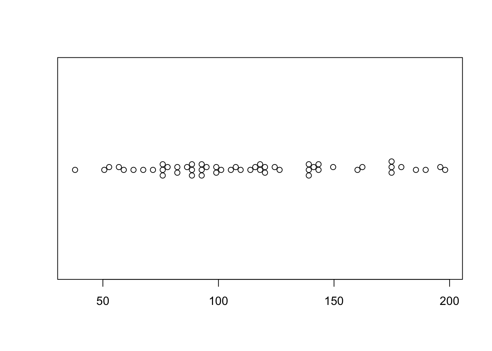

This is a little boring for my 58 data points! (although perhaps it does show that 58 points is barely a big enough sample to know an underlying model..)


<!--chapter:end:in_04-Tutorial07_Plots.Rmd-->


# Data Filtering {#T8_Wrangle}

## Introduction & packages

This tutorial explains how to filter, select, and wrangle data in R using both **Tidyverse** and **Base R** approaches. 

Both approaches are valid, but they differ in syntax and philosophy. **Tidyverse** functions (from `dplyr`) use a  pipeline-based approach, whereas **Base R** relies on indexing and built-in functions. 


``` r
# Load necessary packages
library(tidyverse)  # Core data wrangling
library(palmerpenguins) # Example dataset
library(skimr)  # Quick summary stats
library(GGally)  # Pair plots
library(ggplot2) # Visualization
```

We will use the **penguins** dataset from the `palmerpenguins` package to demonstrate data wrangling techniques.


``` r
data("penguins")  # Load dataset
```

<br><br>

## Selecting COLUMNS

### Selecting a specific column using $

Sometimes we want to deal with only one specific column in our dataset, for example applying the mean command to say just one column.

To do this, we use the \$ symbol. For example, here I'm simply selecting the data in the elevation column only and saving it to a new variable called elevationdata.


``` r
mean_mass <- penguins$body_mass_g 

mean_mass
```

Try it yourself. You should have seen that as you typed the \$, it gave you all the available column names to choose from. This means we can now easily summarise specific columns. For example:

-   `summary(penguins)` will create a summary of the whole spreadsheet,
-   `summary(penguins$Price)` will only summarise the Price column.
-   `mean(penguins$Price)` will take the mean of the Price column in the HousesNY dataframe.

<br><br>

### Selecting multiple columns

Remember you have the names() command to help find these and that the names are CASE SENSITIVE. If we want to work with several specific columns (e.g., `species`, `bill_length_mm`, and `flipper_length_mm`), we can extract them like this:

#### Tidyverse Approach {-}


``` r
selected_data <- penguins %>% dplyr::select(species, bill_length_mm, flipper_length_mm)
head(selected_data)
```

```
## # A tibble: 6 × 3
##   species bill_length_mm flipper_length_mm
##   <fct>            <dbl>             <int>
## 1 Adelie            39.1               181
## 2 Adelie            39.5               186
## 3 Adelie            40.3               195
## 4 Adelie            NA                  NA
## 5 Adelie            36.7               193
## 6 Adelie            39.3               190
```

#### Base R Approach {-}


``` r
selected_data <- penguins[, c("species", "bill_length_mm", "flipper_length_mm")]
head(selected_data)
```

```
## # A tibble: 6 × 3
##   species bill_length_mm flipper_length_mm
##   <fct>            <dbl>             <int>
## 1 Adelie            39.1               181
## 2 Adelie            39.5               186
## 3 Adelie            40.3               195
## 4 Adelie            NA                  NA
## 5 Adelie            36.7               193
## 6 Adelie            39.3               190
```

<br><br>


## SELECTING SPECIFIC CELLS

Sometimes, we do not want to analyse at the entire data.frame. Instead, we would like to only look at one (or more) columns or rows.

There are several ways we can select data.

-   To choose a specific column, we can use the `$` symbol to select its name (as described above)

-   If you know which number rows or columns you want, you can use **square brackets** to numerically select data. Essentially our data follows the matrix format format: 

$$ 
tablename [ ROWS , COLUMNS ]
$$
<br>

Some examples:


``` r
# This will select the data in the 5th row and 7th column
penguins[5,7]

# This will select the 2nd row and ALL the columns 
penguins[2,]

# This will select the 3rd column and ALL the rows
penguins[,3]
# similar to using its name
penguins$island

# We can combine our commands, this will print the 13th row of the body mass column 
# (no comma as we're only looking at one column)
penguins$body_mass_g[13] 

# The : symbol lets you choose a sequence of numbers e.g. 1:5 is 1 2 3 4 5
# So this prints out rows 11 to 15 and all the columns
penguins[11:15,]

# The "c" command allows you to enter whatever numbers you like.  
# So this will print out rows 4,3,7 and the "Elevation" and "Dist_to_Coast" columns
penguins[c(4,3,7), c("island","body_mass_g")]
```

### Deleting data

Or if you know the row or column number you can use the minus - sign to remove. Or use filter..


``` r
# remove row 6 and and overwrite
penguins <- penguins[-6 ,]

# remove columns 4 and 2 and save result to newdata 
newdata <- penguins[, - c(2,4) ]
```


<br><br>

 
## Selecting ROWS {#T8_RowSelect}

Filtering means selecting only the rows that meet certain conditions.

- `which()` helps find row numbers that match a condition.
- `filter()` (from `dplyr` tidyverse) allows for clear, intuitive filtering of data.
- Logical operators (`&`, `|`, `!=`, `%in%`) provide additional flexibility in specifying conditions.

<br>


### Random sampling

Dplyr's sample_slice command will do this for us. Here I randomly selected 4 rows.


``` r
penguinsample <-  dplyr::slice_sample(penguins, n=4)

#check it worked
glimpse(penguinsample)
```


<br>

### Tidyverse/dplyr filter command

We can also use the tidyverse approach, the `dplyr::filter()` function.  All the condition symbols e.g. !=NOT etc also work for the which command,

Selecting all `Adelie` penguins:


``` r
dplyr::filter(penguins, species == "Adelie")
```

Selecting multiple species using `%in%`:


``` r
dplyr::filter(penguins, species %in% c("Adelie", "Chinstrap"))
```

Excluding a species using `!=`:


``` r
dplyr::filter(penguins, species != "Gentoo")
```

Filtering penguins with a flipper length greater than 200 mm:


``` r
dplyr::filter(penguins, flipper_length_mm > 200)
```

Filtering penguins with a body mass less than or equal to 3000 g:


``` r
light_penguins <- dplyr::filter(penguins, body_mass_g <= 3000)
summary(light_penguins)
```

Filtering with multiple conditions:


``` r
dplyr::filter(penguins, flipper_length_mm > 180 & species == "Adelie")
```

Using `|` (OR condition) to select penguins with either a `bill_depth_mm` greater than 18 or `flipper_length_mm` longer than 210 mm:


### BaseR `which()` command

The `which()` command helps us identify row indices that meet a condition.  

For example, identifying numbers greater than 107 in a sequence:


``` r
a <- 100:110
which(a > 107)
```

I like it because you can read the command as a sentence e.g. which numbers in "a" are greater than 107, Or which penguins have a `body_mass_g` less than or equal to 3000g:


``` r
outlier_rows <- which(penguins$body_mass_g <= 3000)
```

To find the row corresponding to the penguin with the smallest bill length:


``` r
row_number <- which(penguins$bill_length_mm == min(penguins$bill_length_mm, na.rm = TRUE))
smallest_bill <- penguins[row_number, ]
smallest_bill
```


<br><br>


## Saving data to new columns

Lets say you wanted to find the ratio between two columns of data, then save your answer as a new column

### Base R Approach {-}


``` r
penguins$bill_ratio <- penguins$bill_length_mm / penguins$bill_depth_mm
```


### Tidyverse Approach {-}


``` r
penguins <- penguins %>% mutate(bill_ratio = bill_length_mm / bill_depth_mm)
```


<br><br>

## Sorting Data

Sorting the data allows us to find the highest and lowest values in a dataset.

Sort by body mass (ascending):

### Tidyverse Approach {-}


``` r
penguins <- arrange(penguins, body_mass_g)
```

Sort by descending order:


``` r
penguins <- arrange(penguins, desc(flipper_length_mm))
```

<br>

### Base R Approach {-}


``` r
penguins <- penguins[order(penguins$body_mass_g), ]
```


``` r
penguins <- penguins[order(-penguins$flipper_length_mm), ]
```

<br><br>

## Combining Everything

We can combine multiple operations into a single pipeline. The tidyverse is designed for this.

### Tidyverse Approach {-}


``` r
final_result <- penguins %>%
  filter(flipper_length_mm > 180) %>%
  mutate(bill_ratio = bill_length_mm / bill_depth_mm) %>%
  select(species, bill_length_mm, flipper_length_mm, bill_ratio) %>%
  arrange(desc(bill_ratio))
```

<br>

### Base R Approach {-}


``` r
filtered <- penguins[penguins$flipper_length_mm > 180, ]
filtered$bill_ratio <- filtered$bill_length_mm / filtered$bill_depth_mm

filtered <- filtered[order(-filtered$bill_ratio),
                     c("species", "bill_length_mm", 
                       "flipper_length_mm", "bill_ratio")]
head(filtered)
```

<!--chapter:end:in_04-Tutorial08_Wrangling.Rmd-->


# Probability distributions

## What are they?  Full info

We have talked about several distributions and tests so far in the lab. To see the help files for most of them, see `?Distributions`.

<details>

<summary>[Expand to see the current list]{style="color: #1388aa;"}</summary>

-   **For the normal distribution see [`dnorm`](http://127.0.0.1:16033/help/library/stats/help/dnorm).**

-   **For the Poisson distribution see [`dpois`](http://127.0.0.1:16033/help/library/stats/help/dpois).**

-   **For the Student's t distribution see [`dt`](http://127.0.0.1:16033/help/library/stats/help/dt).**

-   **For the uniform distribution see [`dunif`](http://127.0.0.1:16033/help/library/stats/help/dunif).**

-   For the beta distribution see [`dbeta`](http://127.0.0.1:16033/help/library/stats/help/dbeta).

-   For the binomial (including Bernoulli) distribution see [`dbinom`](http://127.0.0.1:16033/help/library/stats/help/dbinom).

-   For the Cauchy distribution see [`dcauchy`](http://127.0.0.1:16033/help/library/stats/help/dcauchy).

-   For the chi-squared distribution see [`dchisq`](http://127.0.0.1:16033/help/library/stats/help/dchisq).

-   For the exponential distribution see [`dexp`](http://127.0.0.1:16033/help/library/stats/help/dexp).

-   For the F distribution see [`df`](http://127.0.0.1:16033/help/library/stats/help/df).

-   For the gamma distribution see [`dgamma`](http://127.0.0.1:16033/help/library/stats/help/dgamma).

-   For the geometric distribution see [`dgeom`](http://127.0.0.1:16033/help/library/stats/help/dgeom). (This is also a special case of the negative binomial.)

-   For the hypergeometric distribution see [`dhyper`](http://127.0.0.1:16033/help/library/stats/help/dhyper).

-   For the log-normal distribution see [`dlnorm`](http://127.0.0.1:16033/help/library/stats/help/dlnorm).

-   For the multinomial distribution see [`dmultinom`](http://127.0.0.1:16033/help/library/stats/help/dmultinom).

-   For the negative binomial distribution see [`dnbinom`](http://127.0.0.1:16033/help/library/stats/help/dnbinom).

-   For the Weibull distribution see [`dweibull`](http://127.0.0.1:16033/help/library/stats/help/dweibull).

-   For less common distributions of test statistics see [`pbirthday`](http://127.0.0.1:16033/help/library/stats/help/pbirthday), [`dsignrank`](http://127.0.0.1:16033/help/library/stats/help/dsignrank), [`ptukey`](http://127.0.0.1:16033/help/library/stats/help/ptukey) and [`dwilcox`](http://127.0.0.1:16033/help/library/stats/help/dwilcox) (and see the ‘See Also’ section of [`cor.test`](http://127.0.0.1:16033/help/library/stats/help/cor.test)).

<br>

</details>

<br>

## The normal distribution {#T5_NormalDist}

Remember as we discussed in lectures, we normally state that a variable modelled using by a normal distribution is described by:

X∼N(μ,σ^2^)

In this expression:

-   X is the random variable.

-   ∼ means "is distributed as."

-   N represents the normal distribution.

-   μ is the mean of the distribution.

-   σ^2^ is the VARIANCE of the distribution.

**In R commands, you need the standard deviation instead. (you can google how to get the sd from the variance if you have forgotten)**

<br>

### Help file

To see the help file for all normal related functions:


``` r
?Normal
```

<br>

### Generate a random sample

To generate a random sample from a normal distribution we use rnorm:


``` r
# random sample of size 100
sample.normal <- rnorm(n=100,mean=4,sd=2)
```

<br>

### Calculate probability when given a z-score

To calculate a z score from your sample/population, you can use R as a calculator.

To calculate the probability of greater/lesser than a value in a given normal distribution (e.g. you can use this as an interactive table)


``` r
# probability of less than 1.7 in a normal distribution with mean 4 and standard deviation = 2 
pnorm(1.7,mean=4,sd=2,lower.tail = TRUE)
```

```
## [1] 0.1250719
```

``` r
# probability of GREATER than 1.8 in a normal distribution with mean 4 and VARIANCE = 9
1 - pnorm(1,mean=4,sd=3,lower.tail = TRUE)
```

```
## [1] 0.8413447
```

``` r
# or
pnorm(1,mean=4,sd=2,lower.tail = FALSE)
```

```
## [1] 0.9331928
```

<br>

### Calculate z-score when given a probability

Inversely, to calculate the z-score for a given probability


``` r
# what value is less than 60% of the data?
qnorm(0.6,mean=4,sd=2,lower.tail = TRUE)
```

```
## [1] 4.506694
```

``` r
# what value is greater than 80% of the data?
qnorm(0.8,mean=4,sd=2,lower.tail = FALSE)
```

```
## [1] 2.316758
```

<br><br>

### Testing normality

#### Wilks Shapiro test for normality

To test for normality:

First, have a look at the histogram! Here is the code for the Shapiro-Wilk test.


``` r
shapiro.test(HousesNY$Price)
```

```
## 
## 	Shapiro-Wilk normality test
## 
## data:  HousesNY$Price
## W = 0.96341, p-value = 0.1038
```

There are many online tutorials for interpretation

<br>

####  QQ-Norm plot

You can also make a QQ-Norm plot. Instal the ggpubr package, add it to your library code chunk and run.


``` r
library(ggpubr)
ggqqplot(HousesNY$Price,col="blue")
```

YOU CAN INTERPRET IT HERE: <https://www.learnbyexample.org/r-quantile-quantile-qq-plot-base-graph/>

<br><br>

## T-distribution {#TDist}

What even is this? See this nice resource: <https://365datascience.com/tutorials/statistics-tutorials/students-t-distribution/>

To see the help file for all these:


``` r
?TDist
```

### Calculate a probability given a T-Statistic

To calculate a t-statistic from your sample/population, you can use R as a calculator. To calculate the probability of greater/lesser than a value in a given t-distribution (e.f. you can use this as an interactive t-table)


``` r
# probability of seeing less than 1.7 in a  t-distribution 
# with 20 degrees of freedom
pt(1.55,df=20,lower.tail = TRUE)
```

```
## [1] 0.9315892
```

<br>

### Calculate a T-Statistic for a given probability

To calculate the value for a given probability


``` r
# what value is greater than 90% of the data in a t-distribution with df=25
qt(0.9,df=25,lower.tail = TRUE)
```

```
## [1] 1.316345
```

<br>

### One sided T-test

To conduct a full t-test on some data:


``` r
# Conduct a two-sided t-test where we think that the data comes from a T-distribution with mean 100.
t.test(HousesNY$Price,mu=100,alternative="two.sided")
```

```
## 
## 	One Sample t-test
## 
## data:  HousesNY$Price
## t = 2.3954, df = 52, p-value = 0.02024
## alternative hypothesis: true mean is not equal to 100
## 95 percent confidence interval:
##  102.2125 125.0516
## sample estimates:
## mean of x 
##  113.6321
```

or see the detailed tutorial here: <http://www.sthda.com/english/wiki/one-sample-t-test-in-r> for one-sample

and here for comparing two samples: <http://www.sthda.com/english/wiki/unpaired-two-samples-t-test-in-r>

<br><br>

## Others?

More to come later.. but they all follow the same format

<!--chapter:end:in_04-Tutorial09_DistributionsHypTests.Rmd-->


# Correlation

We are again using the HousesNY dataset to show these commands.  To highlight how it deals with categorical data, I have decided that number of beds is ordinal (which makes sense, you can't have half a bed)


``` r
data("HousesNY", package = "Stat2Data")

# make the beds column a factor
HousesNY$Beds <- factor(HousesNY$Beds,levels=c(1,2,3,4,5,6),
                           labels=c("one","two","three","four","five","six"))
```


## Basics

The correlation coefficient is a measure of the LINEAR relationship between two values... 
All of these scatterplots have the same correlation! (meet the datasaurus)

{width="82%"}

As you can see better in this gif

{width="70%"}

### Correlation not causation

Just because another variable is correlated with our response variable, it does not mean it HAS to be in the model.  It could be:

-   **A spurious correlation** (two unrelated things happen to trend up together by chance - see <https://www.tylervigen.com/spurious-correlations>) <br>
-   **A confounding variable**.  There is a high correlation between damages by fire and the number of fire fighters attending.  But that does not mean we should close all the fire stations to reduce fire damages!  It simply means that there is a third variable (fire severity) controlling both fire-damages and number of firefighters attending.   
-   **A true causal variable**.  Smoking (as far as we can tell) really does lead to higher rates of lung cancer. 

## Correlation basic code

To find the correlation coefficient between two variables, you can simply use the `cor` function e.g.


``` r
cor(HousesNY$Price,HousesNY$Lot)
```

```
## [1] -0.01057599
```

## Correlation matrices

Sometimes its useful to see the correlation between all our columns to assess if there are relationships we might have missed (note, see above for what that means). To see the correlation between ALL columns we can make a "correlation matrix"

This is quick, but it can be misleading!  For example, it might show a low correlation if the relationship is strong but curved and its easy to draw interpretations from high numbers even if they just occured by chance.  But.. it does help to get a feel for the data.


There are MANY of  ways to visualise correlation matrices here: <https://www.r-graph-gallery.com/correlogram.html> Feel free to choose a favourite, but here are three of mine


### `corrplot()` from the corrplot library

A second option is in the `corrplot` package and you don't need to worry about subsetting to numeric data. See 

First, remember to install the `corrplot` package (if you haven't already) and to add `library(corrplot)` to your library code chunk at the top of your script.  

This code will only show you the pearson correlations between any NUMERIC columns in your data. This means that first we have to filter to our data to remove categorical and text columns.


``` r
# Filter to a new data frame with only numeric columns
house.numeric <- HousesNY[ , sapply(HousesNY,is.numeric)]

# Run the command. Different methods will lead to different visual formats
# see ?corrplot for more
corrplot(cor(house.numeric),method="ellipse",type="lower")
```

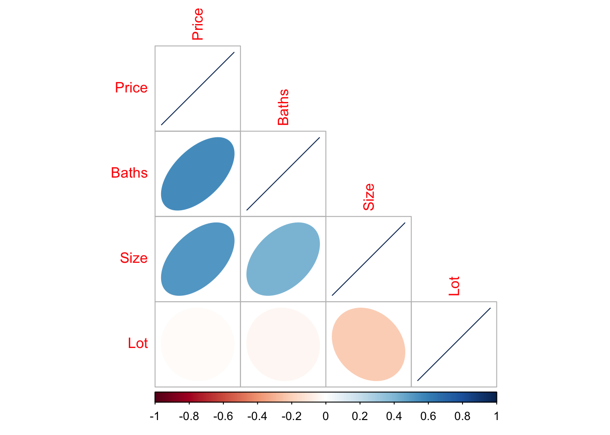

In this case, you can see that "Beds" is missing because we made it categorical.

<br>

## `ggcorrmat()` from ggstatsplot  {#T10_ggcorrmat}

A second option is in the `ggstatsplot` package and you don't need to worry about subsetting to numeric data. It automatically removes the categorical data for you.

First, remember to install the `ggstatsplot` package (if you haven't already) and to add `library(ggstatsplot)` to your library code chunk at the top of your script.  

To look at the correlation matrix of all the data, you can simply run.


``` r
ggcorrmat(HousesNY)
```

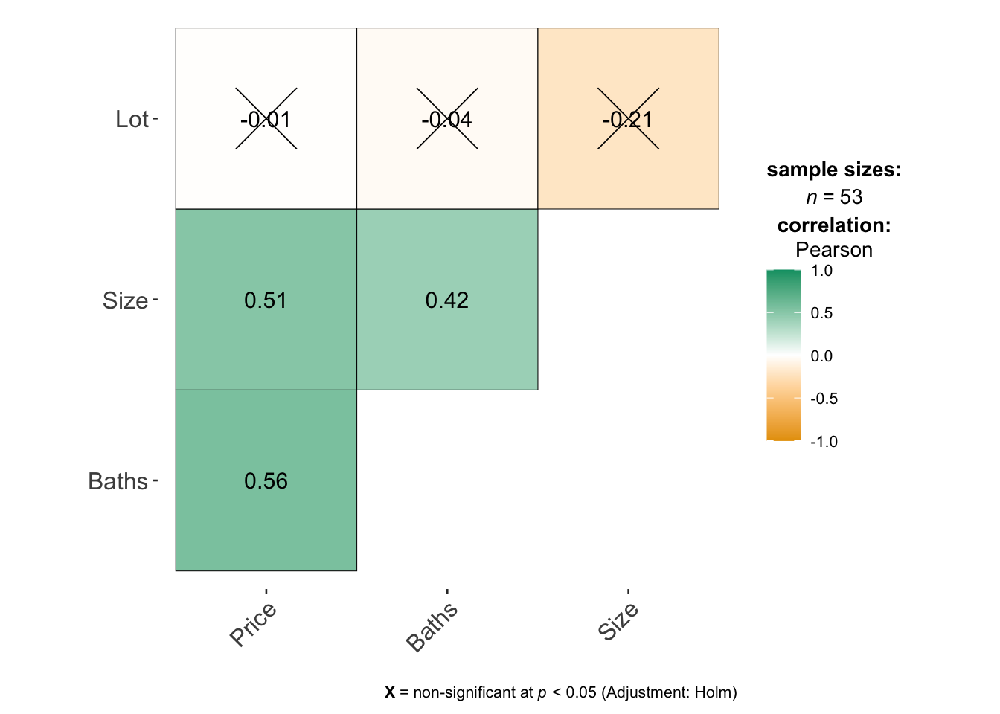

If you only want to look at some columns (say your data is huge), you can select them like this - where you're choosing the COLUMN NAMES. See 
<https://indrajeetpatil.github.io/ggstatsplot/articles/web_only/ggcorrmat.html> many more options and examples using this command.


``` r
ggcorrmat(HousesNY[,c("Size","Beds","Price","Lot")])
```

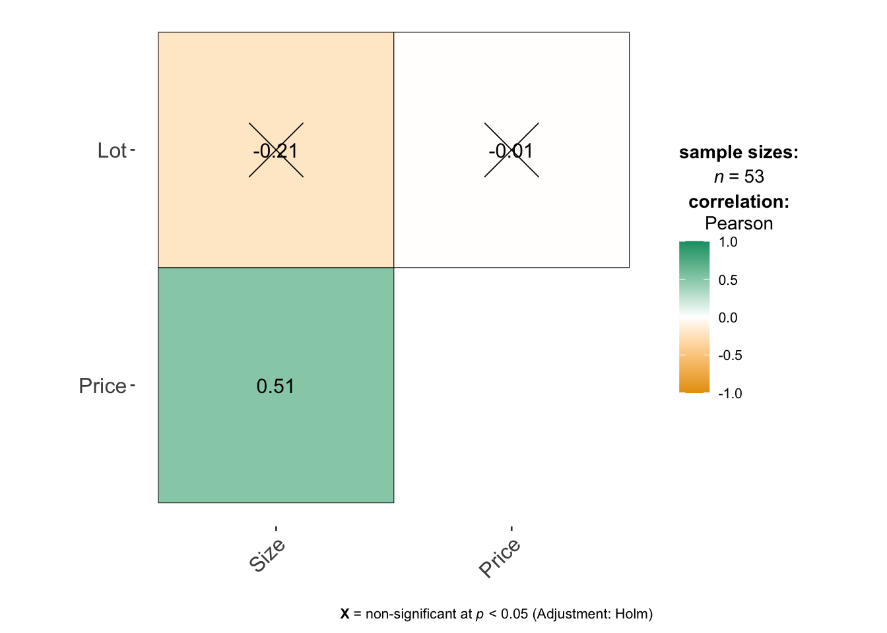


<br>

## `ggpairs()` from `GGally`
 
Another package is called GGally and it makes mini scatterplots of all your variables, or looks at boxplots for categorical ones.  For small datasets this is MUCH more useful than looking at a single number for the correlation coefficient because you can check for non linearity.

First, remember to install the `GGally` package (if you haven't already) and to add `library(GGally)` to your library code chunk at the top of your script.  

Then run the ggpairs command look at the correlation matrix.  I STRONGLY SUGGEST ADDING CODE CHUNK OPTIONS message=FALSE, and warning=FALSE in the code chunk with this code, or it prints a load of unnecessary output.


``` r
# I have message=TRUE and warning=TRUE turned on at the top of my code chunk
ggpairs(HousesNY)
```

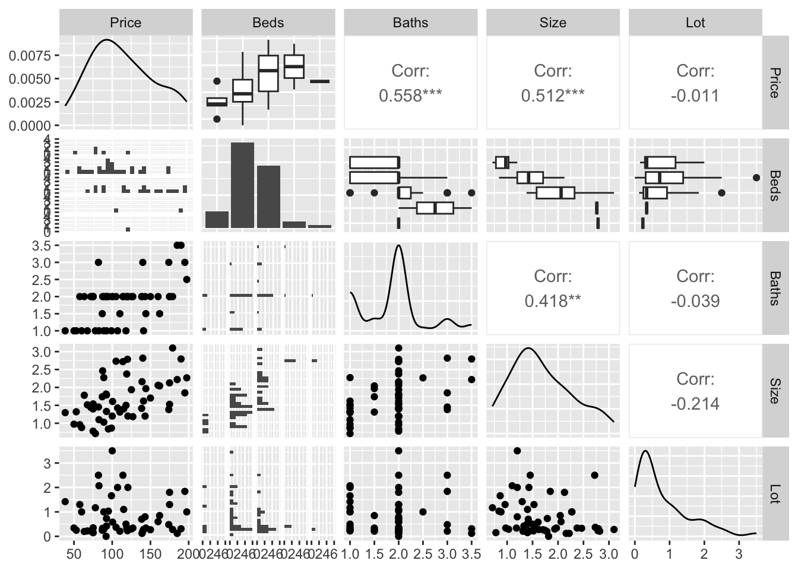


You can see in this case that you get the histograms of each variable, the scatterplots of numeric data (and the correlation coefficient), and grouped boxplots of any categorical data. 

<br><br>

<!--chapter:end:in_04-Tutorial10_Correlation.Rmd-->


# Simple Linear Regression {#T11_SLR}

<br>

By this point your data should be ready: categorical columns converted to factors, missing data dealt with, and a QC check done. Now we fit the model.

We will use the `HousesNY` dataset throughout. Our question: **can lot size predict house sale price?**

<br>

------------------------------------------------------------------------

## Running the model {#T11_RunModel}

The command for linear regression in R is `lm()` — short for **linear model**.


``` r
output <- lm(y_column ~ x_column, data = tablename)
```

The `~` symbol means *"is modelled by"* or *"depends on"*. Think of it as the equals sign in your regression equation: y is on the left, x is on the right. So this line of code is saying

*Get the "tablename" spreadsheet. Then run a simple linear regression model (lm) where were use the the data in the column called "x_column" to predict the data in the column called "y_column". Rather than print out the results on the screen, save the model to an object called "output".*

### Example

For the `HousesNY` data, predicting `Price` from `Lot` and saving the result to an object called Model1.lm


``` r
Model1.lm <- lm(Price ~ Lot, data = HousesNY)
```

> **Note:** Always save your model to an object with `<-`. You will need it for every subsequent step — summaries, plots, diagnostics. If you just run `lm(...)` without saving it, the output is lost.

<br>

### Important

**DO NOT USE \$ WHEN YOU RUN THIS COMMAND! Always put the name of the table under data. It will run if you use \$ but later things break.**

<br>

------------------------------------------------------------------------

## Model Outputs {#T11_Output}

#### Quick look {#T11_OLSregress}

Typing the name of your model and running the code chunk will show the formula and coefficients, but not much else


``` r
Model1.lm
```

```
## 
## Call:
## lm(formula = Price ~ Lot, data = HousesNY)
## 
## Coefficients:
## (Intercept)          Lot  
##    114.0911      -0.5749
```

<br>

There are also some more detailed summaries. Both summaries contain the same information — use whichever is easier to read. In practice it is useful to have both available, which is why we saved the model as `Model1.lm` and can pass it to either function.

#### Standard summary

For the full output, use `summary()` on your model.


``` r
summary(Model1.lm)
```

```
## 
## Call:
## lm(formula = Price ~ Lot, data = HousesNY)
## 
## Residuals:
##     Min      1Q  Median      3Q     Max 
## -74.775 -30.201  -5.941  27.070  83.984 
## 
## Coefficients:
##             Estimate Std. Error t value Pr(>|t|)    
## (Intercept) 114.0911     8.3639  13.641   <2e-16 ***
## Lot          -0.5749     7.6113  -0.076     0.94    
## ---
## Signif. codes:  0 '***' 0.001 '**' 0.01 '*' 0.05 '.' 0.1 ' ' 1
## 
## Residual standard error: 41.83 on 51 degrees of freedom
## Multiple R-squared:  0.0001119,	Adjusted R-squared:  -0.01949 
## F-statistic: 0.005705 on 1 and 51 DF,  p-value: 0.9401
```

and the ANOVA table


``` r
anova(Model1.lm)
```

```
## Analysis of Variance Table
## 
## Response: Price
##           Df Sum Sq Mean Sq F value Pr(>F)
## Lot        1     10    9.98  0.0057 0.9401
## Residuals 51  89245 1749.91
```

<br>

#### The `ols_regress()` summary

The `olsrr` package provides an alternative summary with a cleaner layout. Remember to first install the olsrr package and to add library(olsrr) to your library code chunk at the top of your script.


``` r
## you apply this command to the MODEL
ols_regress(Model1.lm)
```

```
##                           Model Summary                           
## -----------------------------------------------------------------
## R                        0.011       RMSE                 41.035 
## R-Squared                0.000       MSE                1683.876 
## Adj. R-Squared          -0.019       Coef. Var            36.813 
## Pred R-Squared          -0.068       AIC                 550.137 
## MAE                     34.152       SBC                 556.048 
## -----------------------------------------------------------------
##  RMSE: Root Mean Square Error 
##  MSE: Mean Square Error 
##  MAE: Mean Absolute Error 
##  AIC: Akaike Information Criteria 
##  SBC: Schwarz Bayesian Criteria 
## 
##                                ANOVA                                 
## --------------------------------------------------------------------
##                  Sum of                                             
##                 Squares        DF    Mean Square      F        Sig. 
## --------------------------------------------------------------------
## Regression        9.983         1          9.983    0.006    0.9401 
## Residual      89245.412        51       1749.910                    
## Total         89255.395        52                                   
## --------------------------------------------------------------------
## 
##                                     Parameter Estimates                                     
## -------------------------------------------------------------------------------------------
##       model       Beta    Std. Error    Std. Beta      t        Sig       lower      upper 
## -------------------------------------------------------------------------------------------
## (Intercept)    114.091         8.364                 13.641    0.000     97.300    130.882 
##         Lot     -0.575         7.611       -0.011    -0.076    0.940    -15.855     14.705 
## -------------------------------------------------------------------------------------------
```

> **Important:** `ols_regress()` only works if you used `lm(y ~ x, data = tablename)`. If you used the `$` operator (e.g. `lm(data$y ~ data$x)`), it will break. This is one reason to always use the `data =` argument.

<br>

------------------------------------------------------------------------

## Writing the regression equation {#T11_Equation}

<br>

#### Population vs sample notation {#T11_Notation}

There are two versions of the regression equation, and it matters which one you write.

The **population equation** describes the true underlying relationship we are trying to estimate. We rarely if ever know these values — they are population parameters. Here's the equation and here's how to write it yourself.

For an individual value in your population, you have the model output plus some error/residual.

$$
y_i = model_i + \varepsilon_i
$$

$$
y_i = \beta_0 + \beta_1 x_i + \varepsilon_i
$$

Under the linear regression model, we assume that the population mean of y, $\mu_y$, changes linearly as you increase x:

$$
\mu_y = \beta_0 + \beta_1 x
$$


The **sample equation** describes our estimated line from the data. The hats (\^) indicate these are estimates:

$$
\hat{y} = b_0 + b_1 x
$$

You don't need to use x and y if it's clearer to use the variable names e.g.

$$
\mu_{price} = \beta_0 + \beta_1 LotSize
$$

$$
\hat{\text{Price}} = b_0 + b_1 \times \text{LotSize}
$$

Where price is in $1000USD and LotSize is in metres squared.


#### Filling in the numbers {#T11_FillIn}

From the model output, the intercept ($b_0$) is `114.0911` and the slope ($b_1$) is `-0.5749`. So the fitted SAMPLE equation is:

$$
\hat{\text{Price}} = 114.09 - 0.5749 \times \text{LotSize}
$$

Where price is in $1000USD and LotSize is in metres squared.

<br>


#### Writing these equations yourself {#T11_EquationCode}

To write equations in R Markdown, put `$$` and bottom for a centred display equation. The \$$ at the top and bottom tells R that this is an equation

**You should NOT do this in a code chunk**.  This is part of your word processing/report writing, so you WRITE THEM IN THE TEXT.  


Here are the symbols you will need most often:

| What you want          | What to type  |
|------------------------|---------------|
| $\hat{y}$              | `\hat{y}`     |
| $\beta_0$              | `\beta_0`     |
| $\beta_1$              | `\beta_1`     |
| $\varepsilon$          | `\varepsilon` |
| $\times$               | `\times`      |
| Subscript e.g. $x_i$   | `x_i`         |
| Superscript e.g. $R^2$ | `R^2`         |


Below I have written out all the equations above for you to have a look at how I did it (with some notes).  First...

-  \$$ means start/end equation
-  \_ means "subscript

```
$$
y_i = model_i + \varepsilon_i
$$
```

-  `\` means "special symbol" for example greek letters e.g. \beta makes the curly B. We are using LateX, so you can look them up.

```
$$
y_i = \beta_0 + \beta_1 x_i + \varepsilon_i
$$
```

-  You can combine these commands, so `\mu_y` means special symbol $\mu$, with a subscript y.

```
$$
\mu_y = \beta_0 + \beta_1 x
$$
```


-  `{ }` means "do something" to the stuff inside. e.g. \hat{y} means "put a little hat on y"

```
$$
\hat{y} = b_0 + b_1 x
$$
```


-  In this case, I needed the { } to make the computer realise I wanted the entire word price as subscript

```
$$
\mu_{price} = \beta_0 + \beta_1 LotSize
$$
```


-   `\text` makes the font look different

```
$$
\hat{\text{Price}} = b_0 + b_1 \times \text{LotSize}
$$
```

-   Finally, when you write out your own coefficients, remember you are typing the numbers, so check for typos!

````
$$
\hat{\text{Price}} = 114.2TYPO - 0.5749 \times \text{Lot}
$$
````

<br><br>

------------------------------------------------------------------------

## Interpreting slope and intercept {#T11_Interpret}

<br>

#### The sample intercept ($b_0 = 114.09$) {#T11_Intercept}

The intercept is the average value of $y$ when $x = 0$. In this case: a house with a lot size of zero metres squared would be predicted to sell for $114,090 on average

Whether this is meaningful depends on context. A lot size of zero is not realistic for a house, so here the intercept is a mathematical anchor for the line rather than a practically useful estimate. Always ask: *is x = 0 a sensible value in this context?*. See the lab 2 worked answers for more!

<br>

#### The sample slope ($b_1 = -0.5749$) {#T11_Slope}

The sample slope is the predicted change in the average $y$ for each one-unit increase in $x$. Here: for each additional metre-squared of lot size, the predicted average sale price **decreases by \$575**.

The negative slope is worth thinking about — it is counterintuitive. This might reflect confounding variables not in the model (e.g. larger lots may be in more rural, lower-value areas). This is why we check assumptions and consider multiple predictors.

<br>

------------------------------------------------------------------------

## Significance tests {#T11_Significance}

<br>

### Is the slope or intercept significantly different from zero? {#T11_SigZero}

The `summary()` output includes a t-test for each coefficient. The hypotheses are:

-   For the slope: $H_0: \beta_1 = 0$ (lot size has no linear relationship with price)
-   For the intercept: $H_0: \beta_0 = 0$ (the line passes through the origin)

The test statistic is:

$$
t = \frac{b_1 - 0}{SE(b_1)}
$$

R calculates this automatically. In the `summary()` output, look at the `Coefficients` table:

-   `Estimate` — the value of $b_0$ or $b_1$
-   `Std. Error` — the standard error of the estimate
-   `t value` — the test statistic
-   `Pr(>|t|)` — the two-sided p-value


``` r
summary(Model1.lm)
```

```
## 
## Call:
## lm(formula = Price ~ Lot, data = HousesNY)
## 
## Residuals:
##     Min      1Q  Median      3Q     Max 
## -74.775 -30.201  -5.941  27.070  83.984 
## 
## Coefficients:
##             Estimate Std. Error t value Pr(>|t|)    
## (Intercept) 114.0911     8.3639  13.641   <2e-16 ***
## Lot          -0.5749     7.6113  -0.076     0.94    
## ---
## Signif. codes:  0 '***' 0.001 '**' 0.01 '*' 0.05 '.' 0.1 ' ' 1
## 
## Residual standard error: 41.83 on 51 degrees of freedom
## Multiple R-squared:  0.0001119,	Adjusted R-squared:  -0.01949 
## F-statistic: 0.005705 on 1 and 51 DF,  p-value: 0.9401
```

If the p-value is below your significance threshold (typically 0.05), you reject $H_0$ and conclude the coefficient is significantly different from zero.

<br>

### Confidence intervals on slope and intercept {#T11_CI}

To get 95% confidence intervals for both coefficients:


``` r
confint(Model1.lm)
```

```
##                 2.5 %    97.5 %
## (Intercept)  97.29998 130.88227
## Lot         -15.85529  14.70549
```

To change the confidence level (e.g. 99%):


``` r
confint(Model1.lm, level = 0.99)
```

```
##                 0.5 %    99.5 %
## (Intercept)  91.71177 136.47049
## Lot         -20.94071  19.79091
```

The confidence interval gives a range of plausible values for the true population parameter. If the interval for $\beta_1$ does not include zero, this is consistent with rejecting $H_0: \beta_1 = 0$ at the corresponding significance level.

<br>

### Testing against a non-zero value {#T11_SigOther}

Sometimes the hypothesis of interest is not whether the slope equals zero, but whether it equals some other specific value. 


How likely is it that the real price decreases by exactly \$2000 per square m of lot size).

$H_0: \beta_1 = -2$ 
$H_1: \beta_1 != -2$ 

R does not do this automatically, so you calculate the t-statistic manually:

$$
t = \frac{b_1 - \beta_{1}fromH_0}{se(b_1)}
$$

where $\beta_{1}$ is the hypothesised value of the population slope from our experiment, $b_1$ is the sample slope that we actually see and se is the standard error on our sample slope. Step by step:


``` r
# First, extract the coefficients and standard errors from the model. the easiest way is to use olsrr 

Model1.summary <- ols_regress(Model1.lm)
Model1.Coefficients <- Model1.summary$betas
Model1.StandardError <- Model1.summary$std_errors

# we're looking at the slope - and our x predictor is called Lot, so
b1    <- Model1.Coefficients["Lot"]
se_b1 <- Model1.StandardError["Lot"]

# in case you need to test the intercept
b0 <- Model1.Coefficients["(Intercept)"]
se_b0  <- Model1.StandardError["(Intercept)"]

# In our test, we asked if the slope was different to -2
# Hypothesised value
beta1_H0 <- -2

# Calculate t statistic
t_stat <- (b1 - beta1_H0) / se_b1
t_stat
```

```
##       Lot 
## 0.1872342
```

Then calculate the two-sided p-value, using the residual degrees of freedom from the model:

We also need the residual degrees of freedom from the model (n-2). Many ways you can calculate this!


``` r
df <- df.residual(Model1.lm)
```

and calcualte the probablity


``` r
p_value <- 2 * pt(abs(t_stat), df = df, lower.tail = FALSE)
p_value
```

```
##       Lot 
## 0.8522199
```

**Confidence interval reframe:** an equivalent approach is to check whether your hypothesised value falls inside the confidence interval from `confint()`. If $\beta_{1,0} = -1$ lies outside the 95% CI, you reject $H_0$ at $\alpha = 0.05$. This gives the same conclusion as the t-test and is often easier to communicate.

<br>

------------------------------------------------------------------------

## The F-test and ANOVA table {#T11_Ftest}

The F-test asks a broader question than the individual t-tests: **does the model as a whole explain a significant amount of variance in y?** For simple linear regression with one predictor, the F-test and the t-test for the slope are equivalent — but this will matter more when you move to multiple regression.

The ANOVA table breaks the total variance in $y$ into:

-   **Regression SS** — variance explained by the model
-   **Residual SS** — variance left unexplained

To get the ANOVA table, look at the olsrr output or type


``` r
anova(Model1.lm)
```

```
## Analysis of Variance Table
## 
## Response: Price
##           Df Sum Sq Mean Sq F value Pr(>F)
## Lot        1     10    9.98  0.0057 0.9401
## Residuals 51  89245 1749.91
```

The F-statistic is the ratio of the mean regression SS to the mean residual SS. A large F (small p-value) means the model explains significantly more variance than would be expected by chance.

The F-statistic and its p-value also appear at the bottom of `summary(Model1.lm)` output — both routes give the same result.

<br>

------------------------------------------------------------------------

## $R^2$ and $r$ {#T11_Rsquared}

<br>

#### $R^2$ — coefficient of determination {#T11_R2}

$R^2$ tells you the **proportion of variance in** $y$ explained by the model. It ranges from 0 (model explains nothing) to 1 (model explains everything).


``` r
summary(Model1.lm)$r.squared
```

```
## [1] 0.0001118517
```

For example, $R^2 = 0.08$ would mean that lot size explains 8% of the variation in house price.

The **adjusted** $R^2$ penalises for adding extra predictors and is more appropriate when comparing models:


``` r
summary(Model1.lm)$adj.r.squared
```

```
## [1] -0.0194938
```

Both values appear in the `summary()` output under `Multiple R-squared` and `Adjusted R-squared`.  

<br>

#### $r$ — Pearson's correlation coefficient {#T11_r}

For simple linear regression (one predictor), $r$ is simply the square root of $R^2$, with the sign taken from the slope:


``` r
r <- sqrt(summary(Model1.lm)$r.squared) * sign(coef(Model1.lm)["Lot"])
r
```

```
##         Lot 
## -0.01057599
```

$r$ ranges from -1 to 1. It measures the strength and direction of the linear relationship between $x$ and $y$.

You can also calculate $r$ directly using `cor()`:


``` r
cor(HousesNY$Price, HousesNY$Lot)
```

```
## [1] -0.01057599
```

Both should give the same value. Note that $r$ and $R^2$ are related by $R^2 = r^2$ — so if $r = -0.29$, then $R^2 = 0.084$.

<br>

------------------------------------------------------------------------

## Plotting the regression line {#T11_Plot}

<br>

#### Quick plot — base R {#T11_BasePlot}

For a fast check during analysis, base R is the quickest option:


``` r
plot(Price ~ Lot, data = HousesNY,
     xlab = "Lot size", ylab = "Price (x$1000)",
     pch = 16, col = "grey50")
abline(Model1.lm, col = "steelblue", lwd = 2)
```

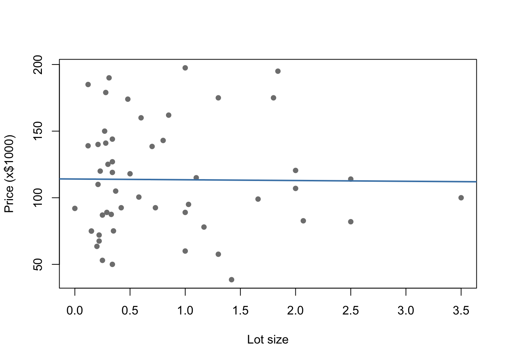

<br>

#### Publication plot — ggplot {#T11_GGPlot}

For a report or presentation, use `ggplot2`:


``` r
ggplot(HousesNY, aes(x = Lot, y = Price)) +
  geom_point(colour = "grey50", alpha = 0.7) +
  geom_smooth(method = "lm", colour = "steelblue", se = TRUE) +
  labs(x = "Lot size",
       y = "Price (x$1000)",
       title = "House price vs lot size",
       subtitle = "Shaded band = 95% confidence interval on the mean") +
  theme_bw()
```

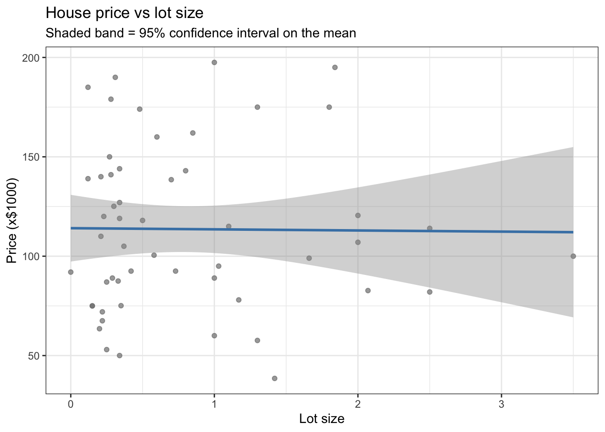

`se = TRUE` adds a shaded confidence band around the line. Set `se = FALSE` to remove it.

> **Note:** `geom_smooth(method = "lm")` fits its own line internally — it is not using your saved `Model1.lm` object. For simple regression this makes no difference, but if your model includes transformations or additional terms, use `geom_abline()` with the coefficients from your model instead.

<br>

------------------------------------------------------------------------

## Checking LINE assumptions {#T11_LINE}

From lectures, linear regression relies on four assumptions — summarised as **LINE**:

-   **L**inearity — the relationship between $x$ and $y$ is linear
-   **I**ndependence — the errors are independent of each other
-   **N**ormality — the errors are normally distributed
-   **E**qual variance (homoscedasticity) — the errors have constant variance

Independence is usually assessed from study design rather than plots. The other three can be checked using residual plots.

<br>

### Checking Linearity {#T11_Linearity}

**What to look for:** a random cloud of points in the residuals vs fitted plot. A curve or systematic pattern means a straight line is not the right model.

{width="90%"}


``` r
ols_plot_resid_fit(Model1.lm)
```

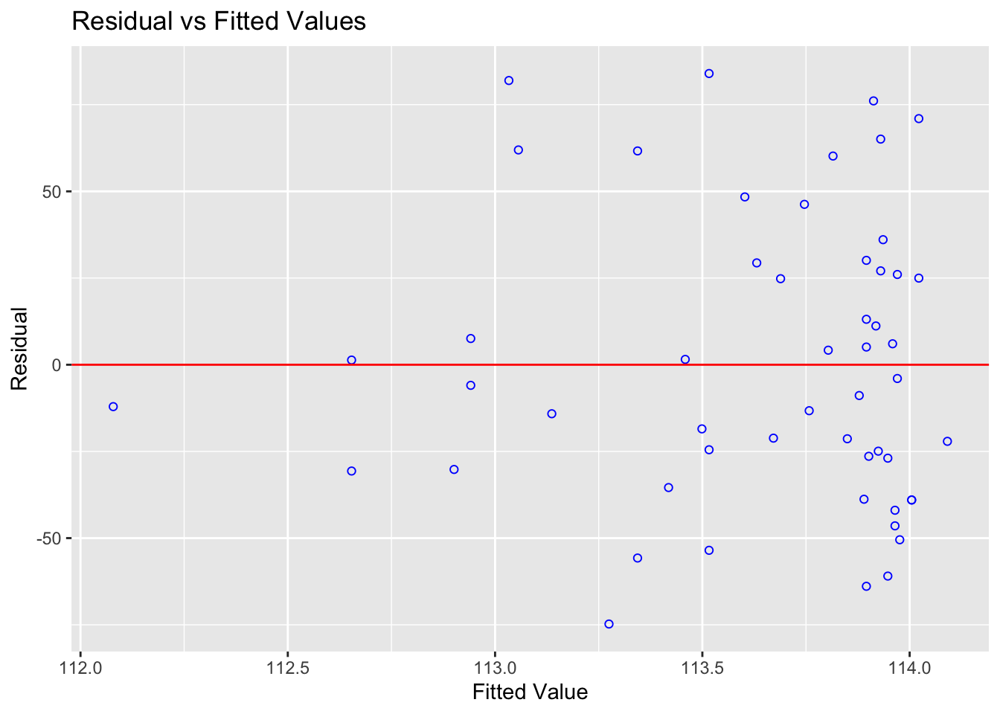

<details>

<summary>[Expand to see an example where linearity is broken]{style="color: #1388aa;"}</summary>

This example uses treadwear data where the raw scatterplot looks approximately linear — but the residuals reveal a clear curve:


``` r
treadwear  <- read.csv("/Users/hgreatrex/Documents/GitHub/Teaching/STAT-462/Stat462-2026/index_data/treadwear.csv")
tread_model <- lm(mileage ~ groove, data = treadwear)
ols_plot_resid_fit(tread_model)
```

<div class="figure">
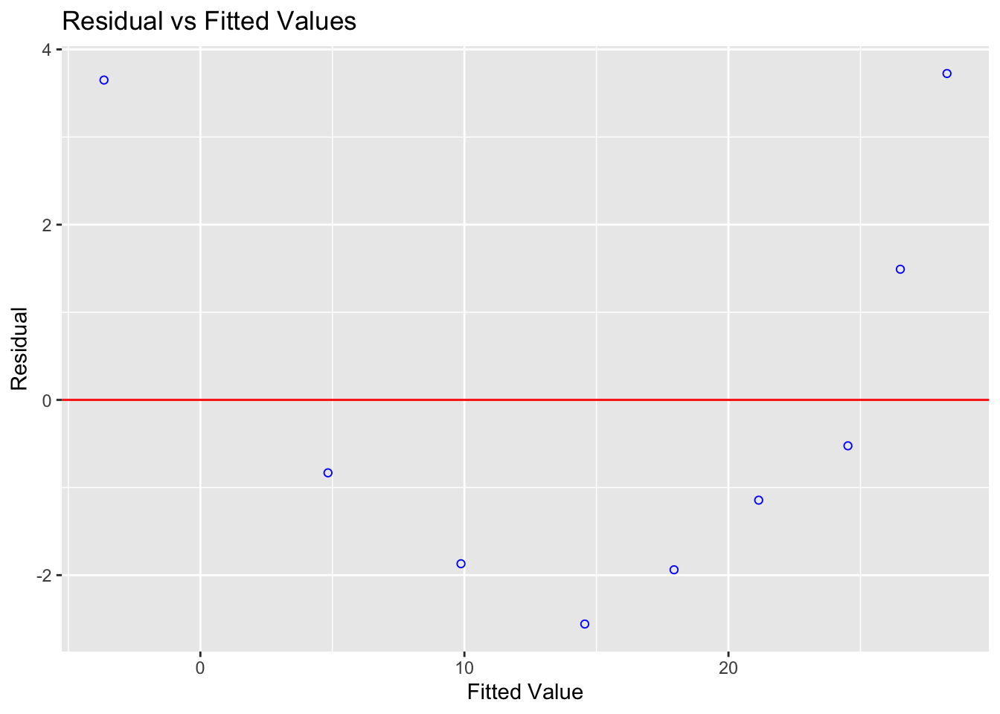
<p class="caption">(\#fig:unnamed-chunk-21)The residuals show a clear parabolic pattern — a linear model is not appropriate here</p>
</div>

The residuals are systematically positive at low and high fitted values, and negative in the middle. A non-linear model would be more appropriate.

</details>

<br>

### Checking Equal Variance (Homoscedasticity) {#T11_Variance}

**What to look for:** the spread of residuals should stay roughly constant across all fitted values. A fan shape or bow-tie means variance is unequal.

{width="90%"}


``` r
ols_plot_resid_fit(Model1.lm)
```


You can also run a formal test. The F-test assumes residuals are independent and identically distributed:


``` r
ols_test_f(Model1.lm)
```

```
## 
##  F Test for Heteroskedasticity
##  -----------------------------
##  Ho: Variance is homogenous
##  Ha: Variance is not homogenous
## 
##  Variables: fitted values of Price 
## 
##        Test Summary        
##  --------------------------
##  Num DF     =    1 
##  Den DF     =    51 
##  F          =    0.00352732 
##  Prob > F   =    0.9528726
```

A small p-value suggests the population may not have equal variance.

<details>

<summary>[Expand to see an example where equal variance is broken]{style="color: #1388aa;"}</summary>


``` r
alphapluto  <- read.table("/Users/hgreatrex/Documents/GitHub/Teaching/STAT-462/Stat462-2026/index_data/alphapluto.txt", sep = "\t", header = TRUE)
alpha_model <- lm(alpha ~ pluto, data = alphapluto)
ols_plot_resid_fit(alpha_model)
```

<div class="figure">

<p class="caption">(\#fig:unnamed-chunk-24)Clear fanning — variance increases with fitted values</p>
</div>

``` r
ols_test_f(alpha_model)
```

```
## 
##  F Test for Heteroskedasticity
##  -----------------------------
##  Ho: Variance is homogenous
##  Ha: Variance is not homogenous
## 
##  Variables: fitted values of alpha 
## 
##         Test Summary         
##  ----------------------------
##  Num DF     =    1 
##  Den DF     =    21 
##  F          =    16.37716 
##  Prob > F   =    0.0005808712
```

</details>

<br>

### Checking Normality of Residuals {#T11_Normality}

**What to look for:** residuals that follow a roughly normal distribution. Check with a Q-Q plot and histogram.

{width="90%"}

> **Note:** Normality matters mainly for p-values and confidence intervals in small samples. With $n > 200$, the Central Limit Theorem means mild non-normality has little practical effect. Never discard data just because this assumption is mildly broken.


``` r
ols_plot_resid_qq(Model1.lm)    # Q-Q plot
```


``` r
ols_plot_resid_hist(Model1.lm)  # histogram of residuals
```


``` r
ols_test_normality(Model1.lm)   # formal normality tests
```

```
## -----------------------------------------------
##        Test             Statistic       pvalue  
## -----------------------------------------------
## Shapiro-Wilk              0.9638         0.1078 
## Kolmogorov-Smirnov        0.0916         0.7658 
## Cramer-von Mises          4.4591         0.0000 
## Anderson-Darling          0.5791         0.1257 
## -----------------------------------------------
```

Points on the Q-Q plot should follow the diagonal line. The histogram should be approximately bell-shaped. For the Shapiro-Wilk test, a large p-value (fail to reject $H_0$) means no strong evidence against normality.

<details>

<summary>[Expand: what if normality is broken?]{style="color: #1388aa;"}</summary>

If you have a large sample ($n > 200$), mild departures from normality are generally not a concern. For smaller samples, options include:

-   Transforming the response variable (e.g. log transformation)
-   Using a generalised linear model (GLM) with an appropriate distribution
-   Using bootstrap confidence intervals

These are covered in later tutorials.

</details>

<br>

### Checking Independence {#T11_Independence}

Independence of errors cannot be checked with a residual plot — it depends on how the data were collected. Ask yourself:

-   Are observations from the same subject, location, or time point repeated? (→ not independent)
-   Is there a time or spatial order to the data that could cause nearby values to be related?

For cross-sectional data collected independently (like the `HousesNY` sample), independence is usually a reasonable assumption. If you have time series, spatial, or clustered data, independence needs to be explicitly modelled.

<br><br>


------------------------------------------------------------------------

## Troubleshooting {#T11_TroubleshootingB}

<br>

# Outliers, high leverage & influential points

## What are they

There are three key things to know when it comes to outliers:

### An "outlier" {.unnumbered}

We use the word **outlier** to describe an observation (point on the scatterplot) that has a very different response from the predicted response from the model. E.g. it has a large residual.  

<br>

### A high leverage point {.unnumbered}

If a data point has an x-value that is extremely different (either too high or too low) from the rest of the data points, we call this a **high leverage** point. It might, or might not be an outlier.

<br>

### An influential point {.unnumbered}

We call a data point an **influential point** if that data point has a considerable impact on the regression model. It likely has an unusual X AND an unusual residual. For instance, if the model fit changes considerably by removing a point, such data point is called an influential point. Influential points tend to be further from the mean.

<br><br>

<details>

## How to find them

We can identify residuals via "residual vs leverage plots" and by looking at the 'cooks distance' for influential points. 

### Residual vs leverage plots


``` r
ols_plot_resid_lev(model)
```

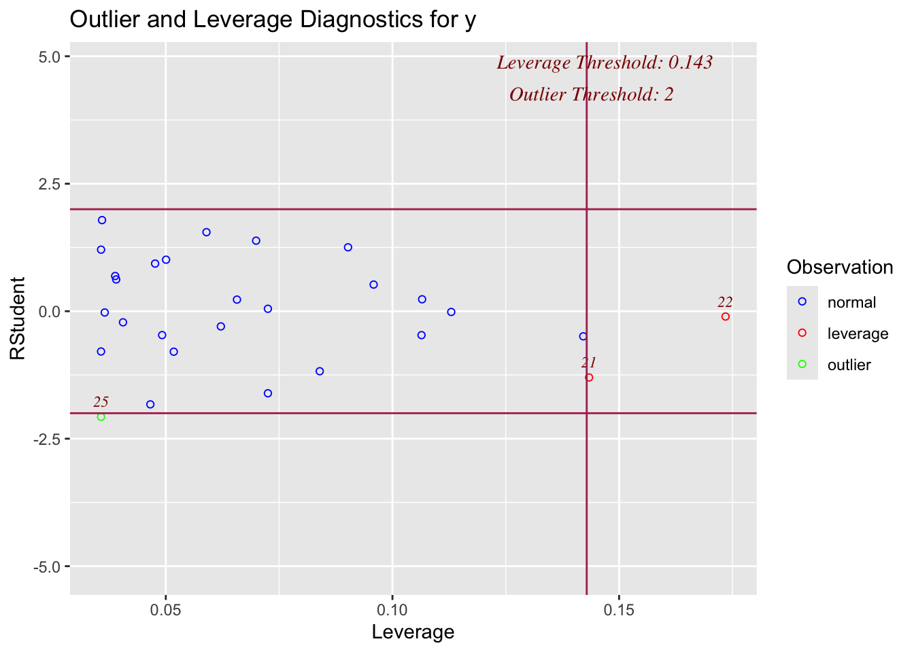

This takes all 


## Examples

### No outliers, influential or high leverage points {.unnumbered}

<div class="figure">

<p class="caption">(\#fig:unnamed-chunk-28)No outliers, influential values or high leverage points</p>
</div>


</details>


## How to find them

### Assessing outliers via visual inspection

The first way we can check for simple linear regression is to plot the data and take a look. Here are some examples that we can assess by eye which show the different effects.

<br>

### No outliers, influential or high leverage points {.unnumbered}

<div class="figure">
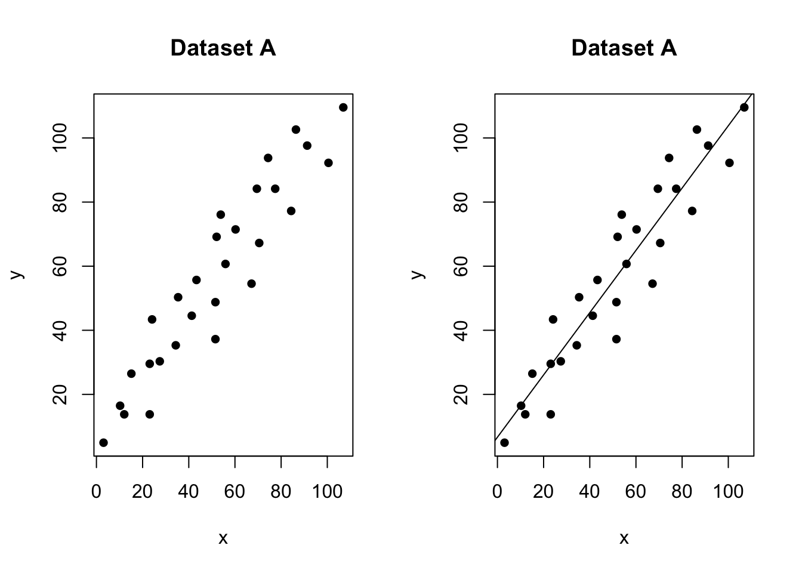
<p class="caption">(\#fig:unnamed-chunk-29)No outliers, influential values or high leverage points</p>
</div>

In the figure above, all of the data points follow the general trend of the rest of the data, so there are no outliers (in the y direction). And, none of the data points are extreme with respect to x, so there are no high leverage points. Overall, none of the data points would appear to be influential with respect to the location of the best fitting line. e.g. if we removed any one point, the line would probably be the same.

<br>

### An outlier with no leverage {.unnumbered}

<div class="figure">
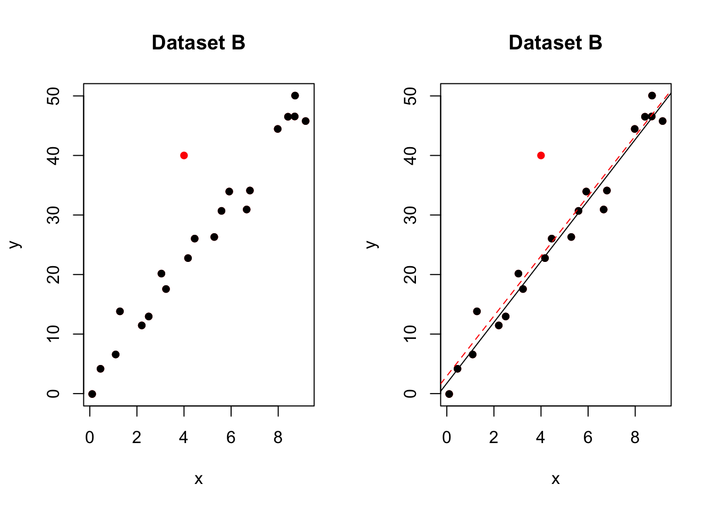
<p class="caption">(\#fig:unnamed-chunk-30)One outlier. The red-dashed line is the model including all the points. The black-solid line is the model with the red point removed </p>
</div>

In the figure above, most of the data points follow the general trend of the rest of the data, but there is one clear outlier (one point that is unusual in the y direction). However, no point has an extreme x value, so there are no high leverage points. Overall, none of the data points would appear to be influential with respect to the location of the best fitting line. e.g.when we removed the red point,the line of best fit remains relatively stable.

<br>

### A high leverage point that isn't an outlier {.unnumbered}

<div class="figure">
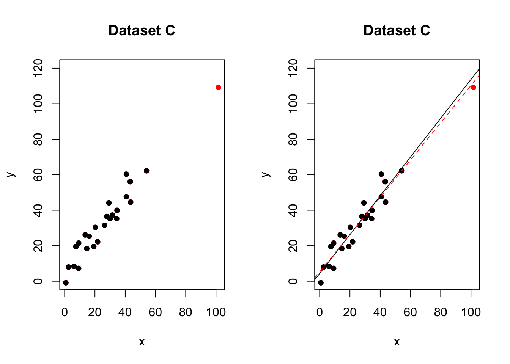
<p class="caption">(\#fig:unnamed-chunk-31)No outliers,but one high leverage point. The red-dashed line is the model including all the points. The black-solid line is the model with the red point removed</p>
</div>

In the figure above, most of the data points follow the general trend of the rest of the data, so there are no outliers (in the y direction). But one data points is extreme with respect to x. Overall, none of the data points would appear to be influential with respect to the location of the best fitting line. e.g.when we removed the red point,the line of best fit remained relatively stable.

<br>

### An influential high leverage outlier {.unnumbered}

<div class="figure">
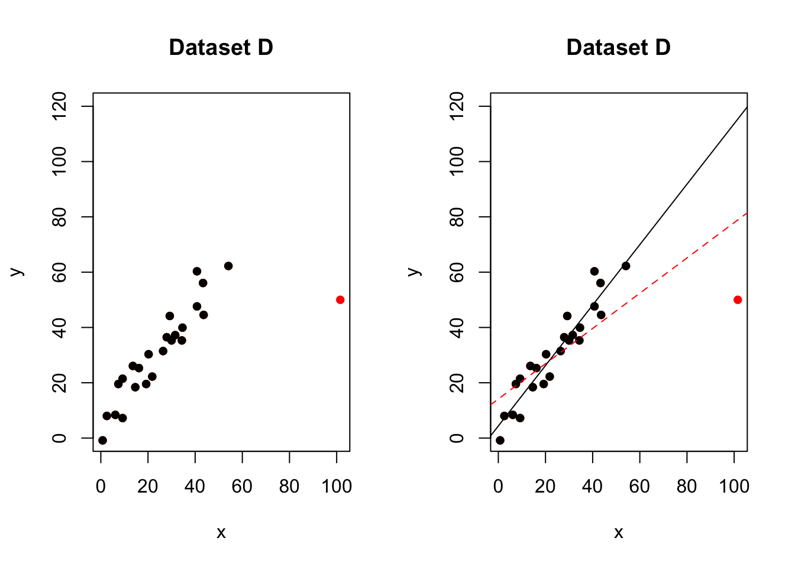
<p class="caption">(\#fig:unnamed-chunk-32)One influential high leverage outlier. The red-dashed line is the model including all the points. The black-solid line is the model with the red point removed</p>
</div>

In the figure above, most of the data points follow the general trend of the rest of the data, with one clear outlier. This point also has high leverage abd appears to be very influential. e.g.when we removed the red point,the line of best fit changes hugely,

Here with a simple regression, we can easily see outliers. This is much harder when we have many predictors. So as well as examining the data by eye, we can use diagnostic plots.

### Detecting outliers via plots

In lab 5, we mentioned two measures that we use to help identify outliers. They are:

-   Residuals
-   Studentized residuals (or internally studentized residuals) (often called standardized residuals)

First, briefly review these measures using this page: <https://online.stat.psu.edu/stat501/lesson/11/11.3>

OLSRR also offers several more plots and tests including :

-   Cook's D Bar Plot
-   Cook's D Chart
-   DFBETAs Panel
-   DFFITs Plot
-   Studentized Residual Plot
-   Standardized Residual Chart
-   Studentized Residuals vs Leverage Plot
-   Deleted Studentized Residual vs Fitted Values Plot
-   Hadi Plot
-   Potential Residual Plot

For now, we will focus on one of the most effective ways to assess residuals, the studentized residual/fits plot.

For example for our test data:


``` r
# read the data
data <- read.csv("/Users/hgreatrex/Documents/GitHub/Teaching/STAT-462/Stat462-2026/index_data/neither.csv")

#calculate the model
model <- lm(y~x,data=data)
leverage <- ols_leverage(model) 

# plot 1 (left hand side)
plot(data$x,data$y,pch=16,xlab="x",ylab="y",main="Dataset C"); 
abline(model)
```

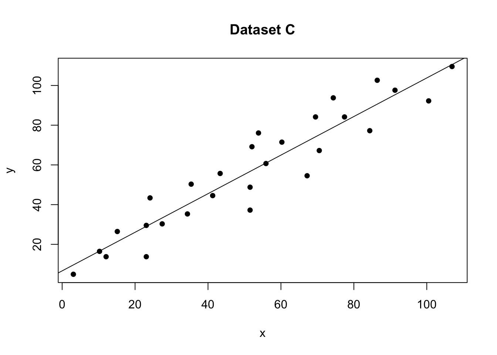

``` r
# plot 2 (right hand side). Remember to choose your own ylim
ols_plot_resid_stud(model)
```

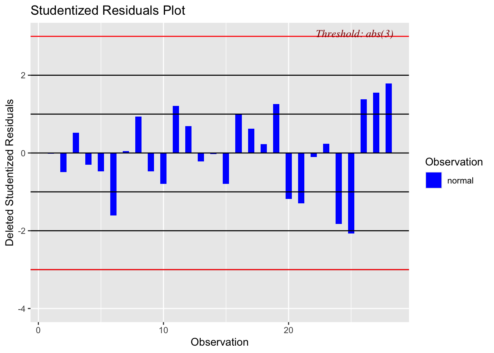

There should be no absolute cut-off here (around 2-3 is a warning sign). Instead, take these as an opportunity to explore those points further. For example here is our plot with the residual:


``` r
# read the data
data1 <- read.csv("/Users/hgreatrex/Documents/GitHub/Teaching/STAT-462/Stat462-2026/index_data/outlier.csv")

#calculate the model
model1 <- lm(y~x,data=data1)

# plot 1 (left hand side)
plot(data1$x,data1$y,pch=16,xlab="x",ylab="y",main="Dataset B"); 
abline(model1)
```

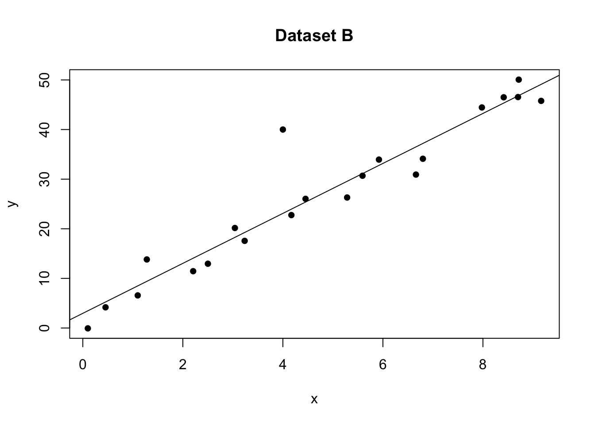

``` r
# plot 2 (right hand side). Remember to choose your own ylim
ols_plot_resid_stand(model1)
```

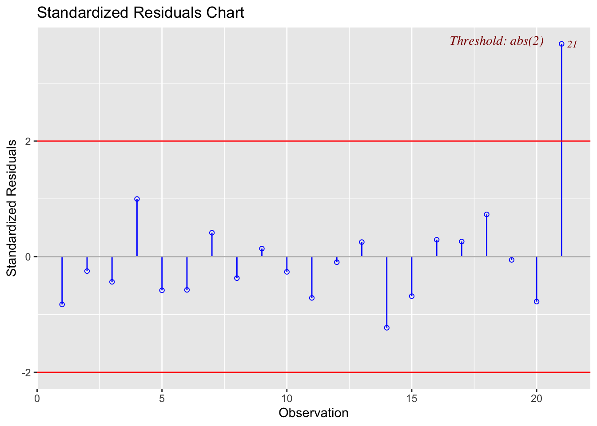

Here the plot is telling me that it thinks row 21 of the dataset might be an outlier


``` r
data1[21,]
```

```
##    x  y
## 21 4 40
```

<br><br>

### Detecting influential points

If a point is both an outlier AND has leverage, chances are it will be influential over the fit. OLSRR has a nice way of summarising both statistics.

For example here are our four plots together:


``` r
# read the data
data <- read.csv("/Users/hgreatrex/Documents/GitHub/Teaching/STAT-462/Stat462-2026/index_data/neither.csv")
data2 <- read.csv("/Users/hgreatrex/Documents/GitHub/Teaching/STAT-462/Stat462-2026/index_data/outlier.csv")
data2b <- data2[-21,]
data3 <- read.csv("/Users/hgreatrex/Documents/GitHub/Teaching/STAT-462/Stat462-2026/index_data/leverage.csv")
data3b <- data3[-25,]
data4 <- read.csv("/Users/hgreatrex/Documents/GitHub/Teaching/STAT-462/Stat462-2026/index_data/influential.csv")
data4b <- data4[-25,]

#calculate the model
model <- lm(y~x,data=data)
model2 <- lm(y~x,data=data2)
model3 <- lm(y~x,data=data3)
model4 <- lm(y~x,data=data4)

# Set up 4 sub-plots one next to each other
layout(matrix(c(1,2,3,4), 2, 2, byrow = TRUE))

plot(data$x,data$y,pch=16,xlab="x",ylab="y",main="Dataset A",col="black") 
abline(model)

plot(data2$x,data2$y,pch=16,xlab="x",ylab="y",main="Dataset B",col="red") 
lines(data2b$x,data2b$y,pch=16,type="p")
abline(model2)

plot(data3$x,data3$y,pch=16,xlab="x",ylab="y",main="Dataset C",col="red") 
lines(data3b$x,data3b$y,pch=16,type="p")
abline(model3)

plot(data4$x,data4$y,pch=16,xlab="x",ylab="y",main="Dataset D",col="red",ylim=c(0,100)) 
lines(data4b$x,data4b$y,pch=16,type="p")
abline(model4)
```

<div class="figure">
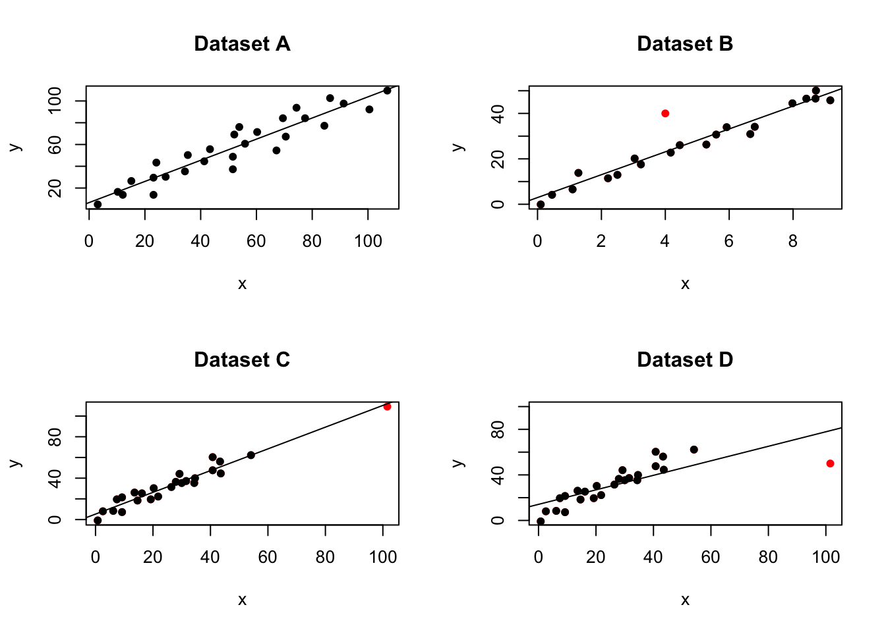
<p class="caption">(\#fig:unnamed-chunk-36)Our four examples</p>
</div>

and here are the OLSRR summary plots for each.

-   On the x-axis, you can see how high the leverage is. E.g. if it's on the left it's close to the mean x, if it's on the right it's far from the mean AKA it's high leverage

-   On the y-axis, you can see the normalised residual value AKA how big is the residual, but plotted in terms of standard deviations away from the mean of y.

Compare plots 1,2,3 and 4 with the scatterplots above. See if you can identify which is which.


``` r
# model A
ols_plot_resid_lev(model)
```


``` r
# model B
ols_plot_resid_lev(model2)
```

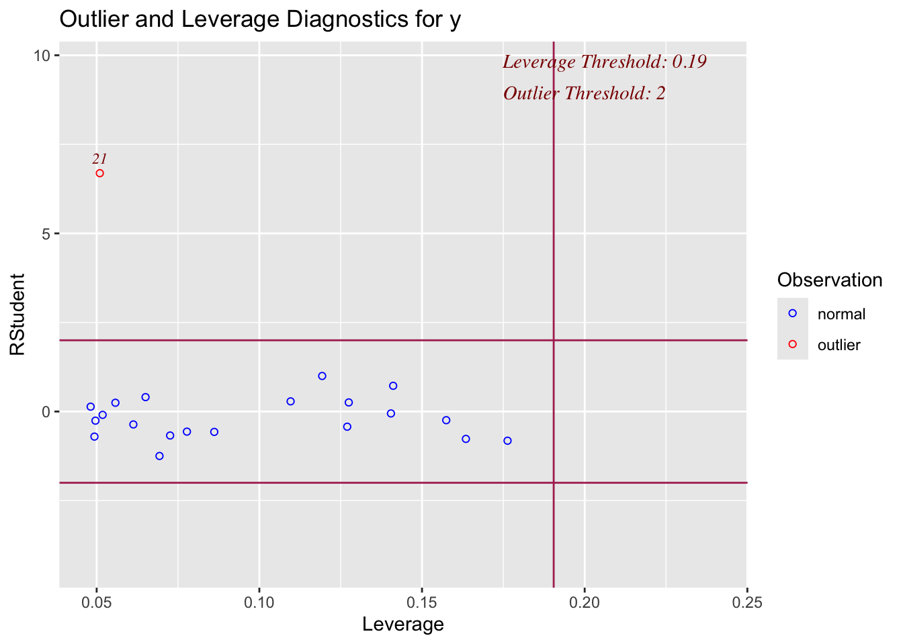

``` r
# model C
ols_plot_resid_lev(model3)
```

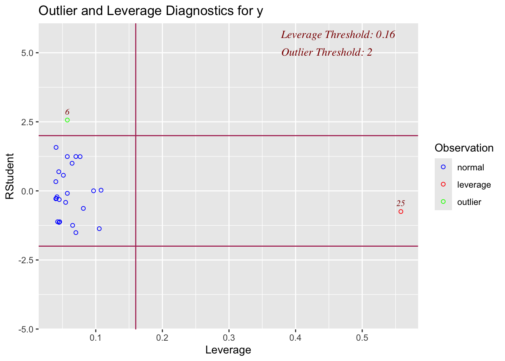

``` r
# model D
ols_plot_resid_lev(model4)
```

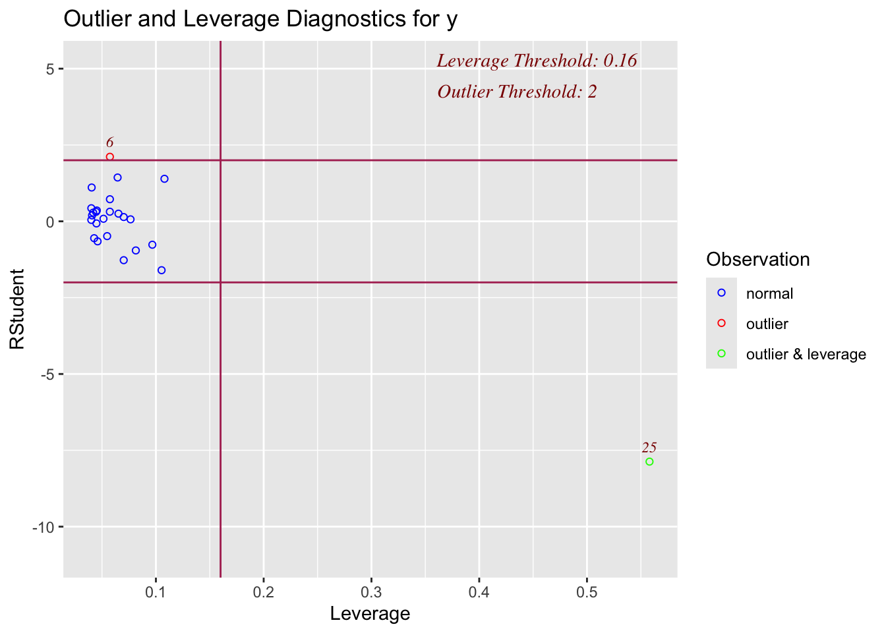


------------------------------------------------------------------------

## Troubleshooting {#T11_Troubleshooting}

<br>

**`ols_regress()` throws an error** You probably used `$` in your `lm()` call. Refit using `lm(y ~ x, data = tablename)` with the `data =` argument, then pass that model object to `ols_regress()`.

<br>

**`confint()` gives very wide intervals** Wide confidence intervals mean high uncertainty in the coefficient estimates — usually because the sample is small, the predictor has low variance, or the model fit is poor. Check your $R^2$ and sample size.

<br>

**The slope is significant but** $R^2$ is very small This is common with large samples. A statistically significant slope just means the relationship is unlikely to be exactly zero — it says nothing about practical importance. Always report and interpret $R^2$ alongside p-values.

<br>

**`ols_plot_resid_fit()` not found** The `olsrr` package is not loaded. Add `library(olsrr)` to your library code chunk.

<br>

**My residual plot shows a clear curve** Your data is not well described by a straight line — the linearity assumption is violated. Consider transforming $x$ or $y$ (e.g. `log(x)`), or fitting a polynomial term. This is covered in later tutorials.

<br>

**My residual plot fans out** Equal variance (homoscedasticity) is violated. A log transformation of $y$ often helps. Alternatively, weighted least squares or robust standard errors can be used — covered in later tutorials.

<!--chapter:end:in_04-Tutorial11_SLR.Rmd-->

