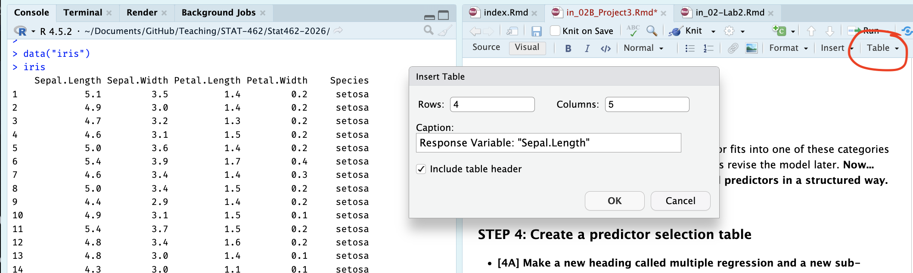

```{r setup, include=FALSE}
# OPTIONS -----------------------------------------------
knitr::opts_chunk$set(echo = TRUE, 
                      warning=FALSE, 
                      message = FALSE)
```

```{r, include=FALSE,echo=FALSE,warning=FALSE,message=FALSE}
library(tidyverse)
library(knitr)
library(kableExtra)
library(olsrr)
library(ggstatsplot)
```

```{=html}
<style>
details > *:not(summary){
  margin-left: 10em;
}
</style>
```

# Project 3 {#Project3 .unnumbered}

## Before you begin {.unnumbered}

Please complete [Project 2](#Project2) before continuing here.

<br><br>

## Aim of project 3 {.unnumbered}

In simple linear regression, we used one predictor to explain or predict a response. In this lab, we move to multiple linear regression (MLR), where we use two or more predictors.

The good news is that most of the ideas from simple linear regression still apply. We still fit a line-like model, interpret coefficients, check the LINE assumptions, and think carefully about when the model is useful. The main difference is that each slope now tells us the relationship between a predictor and the response while holding the other predictors constant.

**By the end of this lab, you should be able to:**

-   identify the response variable, predictor variables, and unit of observation in a multiple regression setting

-   fit and interpret a multiple linear regression model and explain the coefficients

-   Explore goodness of fit ($R^2$ , adjusted $R^2$, overall F-test and the t-tests for individual slopes

-   Assess the LINE assumptions

-   Use the model to make predictions

<br>

The Canvas page for this lab is:

If the labs are causing major problems with your computer, or your hardware is struggling, please talk to Dr Greatrex. Remember that you can always use RStudio Cloud.

<br><br>

## Lab Set-up {.unnumbered}

You are going to be continuing to edit your lab book from project 1 and project 2.

### STEP 1: Re-open your project by either {.unnumbered}

-   Going to your project folder and double clicking on the .RProj,

-   Opening R studio and going to File, Recent Projects, the open the one for your independent

-   Clicking on the project in Posit-cloud online

<br>

### STEP 2: Re-open your lab-book and make some checks {.unnumbered}

-   **[2A]** Check everything runs.

    -   Go to the files tab and open your lab-book RmD file.

    -   On the top right, go to the run menu and press Run-All. Everything should run without errors.

    -   Look at your environment tab and consider renaming your variables if they don't make sense to you.

<br>

-   **[2B]** Check it knits and look at your report structure.

    -   Now press knit. If it doesn't work, look carefully at the error because it will tell you the line of code that broke and exactly why.

    -   Imagine you are me. Is it easy to click through the table of contents and find each sub-section in your work? If not, review what you have done so far and add more headings/sub-heading/sub-sub-headings etc..

    -   Are all your library commands in a code chunk at the top, with message=FALSE and warning=FALSE as code chunk options? If not, move them there and set the options (see rmarkdown tutorial)

Remember, you lose marks for things like poor headings, missing sections, or submitting an unpolished document. (anything that makes it hard for me to find your answers).

<br><br>

## Choosing your initial predictors {.unnumbered}

### STEP 3: Read this BEFORE moving on. {.unnumbered}

In Project 2 you fitted a simple linear regression model using one predictor variable. Now you will extend that earlier model by including additional predictors from your dataset.

A natural question at this stage is: *"Should we include every possible predictor in our initial model?".* The answer is [no]{.underline}. Not every variable (column) in a dataset is suitable as a predictor. Including too many variables can make models harder to interpret and can introduce several common modelling problems.

<br>

[**Types of variables/columns that should NEVER be chosen as predictors include:**]{.underline}

-   **Descriptive or ID variables:** These exist only to identify observations and organise your data, rather than explaining your response. Examples include variables such as `StudentID`, `MovieID`, `zip-code`, or `CountyFIPS`.

-   **Unstructured text variables:** Columns such as `notes`, `comments`, or `address` should not be used as predictors. The only text-like variables you should include are **categorical (factor) variables**.

-   **Variables calculated directly from the response variable:** These create circular reasoning. For example, do not use `log(height)` to predict `height`.

<br>

[**Types of variables/columns that should usually be avoided for an initial model include:**]{.underline}

-   **Predictor variables without a plausible causal link to the response** It is easy for a variable to look related to your response even if there is no sensible real-world mechanism connecting them. For example, I cannot think of a reason why `student_ear_length` would affect `student_STAT462_grade` in real life.

    -   For this first model, we want to avoid these *spurious predictors* as much as possible. A good rule of thumb is that your imaginary client should recognise your chosen predictors as reasonable explanations of the response variable.

-   **Predictor variables that are highly related to each other**

    For example, imagine you are forecasting `total_profit` of cinema releases. If both `global_sales` and `regional_sales` of a movie are strongly related to each other, we're not adding new information to the model by including both as predictors.

    -   In this case, it is usually better to start with only one of them as a predictor, before trying to separate their individual effects in later models.

-   **[FOR THIS STAT 462 PROJECT ONLY]: categorical variables with many categories.** Variables with many factor levels make the regression output much harder to interpret.

    -   For this first model in STAT 462, focus on predictors that are numeric or simple categorical. (4 levels or less)

Note, if you are unsure about whether a predictor fits into one of these categories then it is usually fine to include it. We can always revise the model later.

<br>

**Now... follow these instructions to select your initial predictors in a structured way.**

<br><br>

### STEP 4: Create a predictor selection table

-   **[4A]** **Make a new heading called multiple regression and a new sub-heading called 'choose predictors'.**

    -   *Hint, before you start, the names() command might help you remember whats variables are in your the dataset, or View the data in a new tab.*

<br>

-   **[4B]** **Create a blank table.**

    -   Click on visual mode. In your report, make a table of size: 5 columns, and one row for each of the variables in your dataset.

    -   **To make this project fair on people with many predictors, IF** **your dataset contains more than about 8 possible predictors/columns,**

        -   For this exercise, just choose your **6-8 most promising candidates** based on your earlier exploratory analysis and make the table for those.

    -   *For example if I was using the iris data in my project, I might have*

```{r, P3-inserttable, echo=FALSE,fig.align='center',out.width='100%'}

```

-   **[4C]** **Label the table's column headings:** Name \| Type of Data \| Causal Link with response \| Duplicate information \| Correlation coefficient

-   **[4D]** **Fill in the name column:** with the name of each potential predictor variable.

**Your table should look like this but for your data rather than iris:**

| Name | Correct data format | Causal Link with response | Duplicate information | Correlation coefficient |
|---------------|---------------|---------------|---------------|---------------|
| Sepal.Width |  |  |  |  |
| Petal.Length |  |  |  |  |
| Petal.Width |  |  |  |  |
| Species |  |  |  |  |

: *Response Variable: Sepal.Length*

<br><br>

### STEP 5: Check each predictor

*Note, you don't need to mark the values in the table exactly as I worded as long as it's clear what you mean.*

-   **[5A]. First check if each predictor is is suitable for regression.** The easiest way to do this is to use the str() command. In your table:

    -   If your variable is numeric, mark TRUE/Yes under *'Correct Data Format'*

    -   If it's descriptive/notes/unstructured text, mark FALSE/No under *'Correct Data Format'*

    -   If its categorical/factor, with less than 4 or 5 levels/options, mark TRUE

    -   If its categorical/factor, with more than 4 or 5 levels/options, mark FALSE.

*For example, for the iris data, I can see that three of my columns are numeric and Species is categorical with three potential categories. (see table at the end of step5 for how I recorded this)*

```{r}
str(iris)

```

<br>

-   **[5B]. Assess whether each predictor is a reasonable explanation of your response variable.**

    -   This is based on your real-life knowledge of the topic, and your earlier exploratory analysis, NOT on the correlation coefficient.\

    -   Record one of the following in your table for each potential predictor

        -   reasonable \| maybe \| unlikely\

    -   *For example:* If my response variable was house price

        -   square footage → reasonable predictor

        -   number of birds on the roof at midday yesterday → unlikely predictor

*For the iris data I had to google this because I don't know much about iris flowers! It appears that sepel.width (width of part of the green bit under the iris petals), petal width, petal length and species are all reasonable real-life predictors of sepal length.*

<br>

-   **[5C]. Check whether numeric predictors are trivially linked to the response variable or contain duplicate information.**

    -   For example: is the predictor is calculated from the [response]{.underline} variable. For example, If your response variable is `profit_USD` , trivial predictors are things like `profit_Euro` or `profit_margin` .\

    -   Or is the predictor is too similar to an another [predictor]{.underline} variable? Here, just focus on ones that have an almost perfect correlation between each other (say, global sales and local sales). In your table:

        -   Enter NA if it's categorical

        -   Enter **Direct-calculation** if something is literally calculated from another variable (profit in euros vs profit in gbp)

        -   Enter **strong link** if there's almost a perfect correlation (0.95+) between two variables and it it makes sense that they are related.

        -   Otherwise enter something like "OK".

The easiest way to think this through is by looking at the correlation matrix. Feel free to reprint it in your lab report rather than having to scroll up and down a lot.

*For example in my iris data, I can see that there's no direct-calculations, but there is a VERY strong link between petal length and petal width. So in this, case I might start with only one of the petal variables.*

```{r}
# this is from the ggstatsplot package, 
# remember to run your library code chunk first.
ggcorrmat(iris)
```

<br>

-   **[5D]. Check if there's show at least a weak-to-moderate relationship with the response variable**

    -   We can still include these in a model (maybe the effect is more subtle), but it makes sense to start with variables with a stronger relationship.\

    -   In the table, for numeric variables, write down the correlation coefficient, or refer to your exploratory analysis if you already made a scatterplot (e.g. write strong relationship, weak relationship?)

<br>

Final example iris table:

***Your table should look like this but for your data rather than iris:***

| *Name* | *Correct data format* | *Causal Link with response* | *Duplicate information* | *Correlation coefficient* |
|---------------|---------------|---------------|---------------|---------------|
| *Sepal.Width* | *Yes* | *Yes* | *No* | *-0.12* |
| *Petal.Length* | *Yes* | *Yes* | *Strong link with petal-width* | *.87* |
| *Petal.Width* | *Yes* | *Yes* | *Strong link with petal-length* | *.82* |
| *Species* | *Yes (categorical)* | *Yes* | *No* | *NA* |

: *Response Variable: Sepal.Length*

<br><br>

### STEP 6: Use the table to decide on your first set of predictors

-   **[6A]. Using your completed table and the criteria above, select:**

    -   Your response variable from Project 2

    -   The predictor from Project 2

    -   *At least* 2 additional predictors (try not to go above 5 additional predictors or you give yourself a lot more work)

<br>

-   **[6B].** **Under your table, write a short paragraph for your client explaining:**

    -   which predictors you selected

    -   why you selected them, refering to the table above

    -   which predictors you chose not to include

    -   why they were excluded


-   Your goal is to demonstrate that your model choice is intentional and based on evidence from your dataset.

Finally, here's my iris example:

*Using the table above, I selected **`Sepal.Width`**, **`Petal.Length`**`,` and **`Species`** as predictors of my response variable **`Sepal.Length`**`.` All three variables are measured for the same flowers as the response variable and are either numeric or simple categorical variables, so they are suitable for use in a multiple regression model.*

*Based on my exploratory analysis and some background reading about iris flowers, each of these variables is a reasonable explanation of variation in sepal length. In real plants, different parts of the flower tend to grow together as part of the same overall structure, so measurements such as petal length and sepal width are likely to be related to sepal length and species impacts plant size.*

*`Petal.Length` showed a strong relationship with sepal length in the scatterplots and correlation matrix. This was also my predictor variable from Project 2. `Sepal.Width` showed a weaker relationship with the response variable, but it is still a sensible estimate of what might impact sepal length. and the `species` variable captures biological differences between flower types that affect their overall size and shape.*

***I chose not to include `Petal.Width`** in this first model because it is very strongly related to another predictor `Petal.Length` and provides similar information. Including both variables at this stage would make the model harder to interpret without clearly improving it.*

## Fitting your first MLR model

### STEP 7: Run the model {.unnumbered}

You will now fit your first multiple linear regression model using:

-   Your chosen response variable from Project 2

-   All of your chosen predictors.

To do this, use the structure below, but replace the variable names with the column names of your chosen variables. You may also use `summary(FullModel)` if you prefer.

```         
FullModel <- lm(ResponseVariable ~ Predictor1 + Predictor2 + Predictor3,
                data = yourdataset)

ols_regress(FullModel)
```

For example, for the iris data.

```{r, eval=FALSE}
FullModel <- lm(Sepal.Length ~ Sepal.Width + Petal.Width + Species, data = iris)

ols_regress(FullModel)
```

<br><br>

## Questions

### STEP 8: Questions {.unnumbered}

Using sub-headings to make your answers really easy to find.. answer the following questions in full sentences.

$$
\widehat{yjhekasd} = 1223443+x_1 
$$

<br>

-   **[8A].** **Model size and structure**

    -   What is the sample size *n*?

    -   How many predictors are included in your model?

    -   How many parameters are being estimated in total, e.g. how many Betas **including** the intercept?

<br>

-   **[8B].** **Model size and structure**

    -   Write out the estimated regression equation for your sample, ideally using the LateX equation format.

    -   Your equation should clearly show:

        -   the estimated intercept

        -   all estimated slope coefficients

    -   Either include or refer to the names and units of your variables

<br>

-   **[8C].** **Model coefficients**

    -   **Choose at least two slope coefficients and the intercept** and interpret them carefully in context of your project dataset.

    -   Also comment on whether the **intercept** has a meaningful real-world interpretation for your dataset.

<br>

-   **[8D].** **Interpret model fit**

    -   From the model summary, report and interpret:

        -   R²

        -   adjusted R²\

    -   Explain your own words:

        -   What does R² mean in your model?

        -   Why is the adjusted R² lower, how does it work and why is it useful?

    <br>

-   **[8E].** **Interpret model fit (global F test)**

    -   From the model summary, conduct a global F t-test

        -   State your null and alternative hypothesis

        -   Write out the test statistic

        -   Write out the probability of seeing this

        -   Write out your conclusions

-   **[8F]. Partial slopes**

-   Which predictors appear to be significantly related to your response variable after controlling for the other predictors?

    -   Which of your predictors has

        -   A strong effect size (slope) AND low uncertainty? (standard error)

        -   A strong effect size (slope) AND high uncertainty?

        -   A weak effect size (slope) AND low uncertainty?

        -   A weak effect size (slope) AND high uncertainty?

    -   Conduct a T test on your predictor with the strongest slope compared to beta=0

        -   State your null and alternative hypothesis

        -   Write out the test statistic

        -   Write out the probability of seeing this

        -   Write out your conclusions

<br>

-   **[8G]. Comparison**

    -   Explain the difference between the global F test and the partial T tests for explaining variation in your response variable?

**In the final part of the project, we will look at assumptions, prediction and improving the model.**

<br><br>
