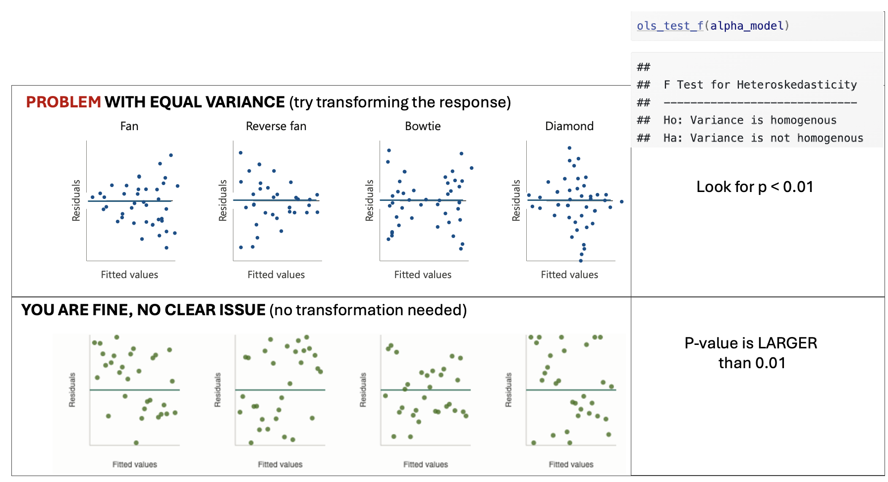
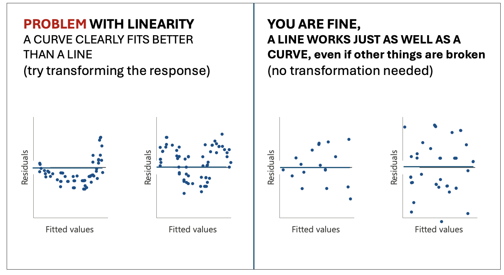

```{r setup, include=FALSE}
# OPTIONS -----------------------------------------------
knitr::opts_chunk$set(echo = TRUE, 
                      warning=FALSE, 
                      message = FALSE)
```

```{r, include=FALSE,echo=FALSE,warning=FALSE,message=FALSE}
library(tidyverse)
library(knitr)
library(kableExtra)
library(olsrr)
library(ggstatsplot)
```

```{=html}
<style>
details > *:not(summary){
  margin-left: 10em;
}
</style>
```

<br>

# Project 4

## Aim of Project 4 {.unnumbered}

In Projects 2 and 3 you fitted a simple linear regression model and then
extended it to a multiple linear regression model. In this project, you
will refine that work by checking your model meets the LINE assumptions,
making targeted improvements, and using a formal model selection
procedure to find the best version of your model.

By the end of this project you should be able to:

-   Check and address violations of the LINE assumptions in a multiple
    regression setting
-   Identify and respond to multicollinearity and nonlinearity in
    individual predictors
-   Use best subsets regression to identify an optimal model
-   Conduct a partial F-test to compare nested models
-   Make a prediction with a confidence and prediction interval
-   Summarize your findings clearly for a non-technical client

<br><br>

------------------------------------------------------------------------

## Meeting the LINE assumptions {.unnumbered}

### STEP 1: Where you should be {.unnumbered}

-   **[1A]** **Re-open your project and check everything runs.**
    -   Re-open your `.RProj` file, open your lab book, and press Run
        All.
    -   Everything should run without errors before you continue.

<br>

-   **[1B]** **Confirm what you have so far.**
    -   At the end of Project 3 you should have:
        -   Chosen your predictors for your intial MLR model.
        -   Fitted a multiple linear regression model (`FullModel`) with coefficients interpreted
        -   Run an overall F-test and partial t-tests and looked at goodness of fit.
    -   If any of these are missing, go back and complete Project first.

<br>

-   **[1C]** **Make a new section in your lab book.**
    -   Add a new heading, and a brief sentence explaining that you are
        now formally checking the LINE assumptions in more detail, to
        refine your MLR model from Project 3.
        
    -   For the rest of these instructions I'm not going to say "add headings and subheadings etc". Keep your labbook need and use your own sections/headings so it's easy for me to find answers.
                

<br><br>

------------------------------------------------------------------------

### STEP 2: Does your response need transforming? {.unnumbered}

In this step you are only looking at one thing: **non-equal variance**
(the E assumption in LINE). You are not re-checking linearity here —
that comes in Step 4. We're going to assume normality and independence
are OK.

<br>

-   **[2A]** **Plot studentized residuals vs fitted values for your
    Project 3 model.**
    -   Use the following code, replacing `FullModel` with the name of
        your model object:

```{r, eval=FALSE}
ols_plot_resid_stud_fit(FullModel)
ols_test_f(FullModel)
```

<br>

```{r, im-P4-EqualVar, echo=FALSE, fig.cap = "*Examples of equal variance*",out.width='90%',fig.align='center'}

```

-   **[2B]** **Look only to see if Equal variance is clearly broken.**
    -   You are looking for a *clear and obvious* change in equal
        variance — not a slightly uneven spread.
    -   See the schematic above for examples where there is a problem
        and where you are fine.

<br>

-   **[2C]** **Depending on your result.....**
    -   **IF THE EQUAL VARIANCE ASSUMPTION IS FINE**

        -   Make a note that you are happy and move onto step 3

        <br>

    -   **IF EQUAL VARIANCE IS BROKEN/A PROBLEM**

        -   At this point in your lab book, make a new column in your
            dataset with a log transformation (you can choose other
            functions,but log normally works). Eg in the code
            belowrename mydata with the name of your dataset and
            \$response with the log of your response variable.
        -   Make a note in your lab-book about what you did and why
        -   YOU DO NOT NEED TO FIT AN UPDATED MODEL YET! You will do
            this in step 4.

```{r, eval=FALSE}
mydata$log_response <- log(mydata$response)
```

<br><br>

------------------------------------------------------------------------

### STEP 3: Do predictors need transforming? {.unnumbered}

In this step we will check each numeric predictor in your model for two
potential problems: **multicollinearity** and **nonlinearity**, because
those can be easy fixes that easily improve your model.

<br>

-   **[3A]** **Make predictor list**
    -   Make a bullet point list with one bullet for each predictor in
        your model. You will fill this in during step 3 below and use it
        to make decisions in step 4.

<br>

-   **[3B]** **Check for multicollinearity using VIF.**

    -   Run `ols_vif_tol(FullModel)` to get Variance Inflation Factors
        for your model (remember to rename FullModel with your model
        name)\

        <br>

    -   For each predictor, note its VIF value in your bullet point list
        and your conclusion
        -   A VIF below 3 is generally fine.

        -   A VIF above 3 suggests a potential multicollinearity problem
            worth addressing.

        -   A VIF above 10 is a serious problem.

<br>

-   **[3C]** **Check for nonlinearity using residual plots against each
    NUMERIC predictor.**
    -   For each numeric predictor in your model, make a plot of the
        model residuals against that predictor: e.g. in the code below,
        replace predictor1, predictor2 etc with the names of each
        predictor column and FullModel with the name of your model. \
    -   For each predictor, look for a clear curve in the points. A
        clear U-shape or arch suggests nonlinearity (see picture below).
        Note your finding for each predictor in your bullet point list,
        and if clearly nonlinear, a suggested transformation (its
        normally log if you're not sure). You will deal with it in
        Step4.\
    -   YOU DO NOT NEED TO CHECK FOR NON EQUAL VARIANCE HERE, because
        you are only looking at the partial effect from that predictor

```{r, eval=FALSE}
# Code to make residual plots for each numeric predictor
# repeat for each numeric predictor
plot(residuals(FullModel) ~ mydata$predictor1, pch=16);abline(h=0)
plot(residuals(FullModel) ~ mydata$predictor1, pch=16);abline(h=0)

```

<br>

```{r, im-P4-Linearity, echo=FALSE, fig.cap = "*Examples of linearity*",out.width='90%',fig.align='center'}

```

<br>

-   **[3D]** **Decide what to do.**

    -   For each predictor, based on the multicollinearity and linearity
        results, choose one of the following paths. Update your bullet
        point list with your conclusion.

        -   **No problems found:**
            -   Keep the predictor as-is. Note that it looks fine.
        -   **If Multicollinearity (VIF \> 3):**
            -   Decide if you will remove the predictor or not.
            -   **Option 1: Note you want to remove it.** I normally
                remove if
                -   The VIF is VERY high \>5.
                -   It's very similar in physical meaning to another
                    predictor in the model (e.g. temperature and
                    heat-index)
                -   Or if you have two proxies for the same thing (e.g.
                    fire-damages and number-of-firemen-attending are
                    both proxies controlled by the "severity of the
                    fire", we might not need both.
            -   **Option 2: Flag the VIF but note you want to keep it.**
                If the VIF isn't too high and you have a strong
                real-life reason to keep the predictor in the model
                (maybe your client needs it), you may keep the predictor
                but note the multicollinearity as a potential issue.
        -   **If there was clear non-linearity:**
            -   Note that you are transforming it and what
                transformation you think is appropriate (if you're not
                sure, choose the log. - don't think too hard on this.)
            -   Create a new column in your dataset with a log
                transformation of that predictor (unless its clear
                another works better). For example something like this
                code where "predictor" is the name of your predictor
                column and mydata is the name of your dataset.

```{r, eval=FALSE}
mydata$log_predictor <- log(mydata$predictor)
```

<br><br>

------------------------------------------------------------------------

### STEP 4: Update your model if needed {.unnumbered}

-   **[4A]** **One sentence action plan from your bullet point list.**
    -   Write a short sentence or two to note if you want to
        -   transform the response from step 2 (and what the new column
            name is),
        -   note if there are any predictors you want to remove,
        -   and if you want to transform any predictors from step 3 (and
            note what the new column names are).
    -   If you don't need to make any changes, you got lucky! Note that
        you needed no changes and jump immediately to STEP 5..

<br>

-   **[4B]** **Make an updated model.**
    -   Use your summary sentence to fit a new updated model that:
        -   Doesn't include any predictors you decided to drop
        -   As needed, REPLACES response or predictor variables with
            their your transformed versions
        -   Keeps all the other predictors as is.

<br>

-   **[4C]** **Quickly check the model summary**
    -   Quickly check the model summary to see if your new model has
        improved things or has any major issues.
    -   Note if your new model improved the overall model goodness of
        fit. You need to select which measures to look at (hint Lab 6).
    -   If there are big issues, don't worry at this point. Just note
        them and choose the model you think fits your data best so far.
    -   This is a good point to check for [influential outliers (see
        tutorial)](https://psu-spatial.github.io/Stat462-2026/outliers-high-leverage-influential-points.html#an-influential-high-leverage-outlier)
        and to remove any if MASSIVELY an issue or clearly a mistake
        (otherwise just note them, this project is long enough as is!)

<br><br>

------------------------------------------------------------------------

## Finding the 'best' model {.unnumbered}

### STEP 5: Use best subsets to find the optimal model {.unnumbered}

Rather than manually trying every combination of predictors, best
subsets regression systematically evaluates all possible models and
helps you identify which combination of predictors gives the best fit.

*From now onwards, use the "best" model you have so far. This is likely
the one with the highest goodness of fit, hopefully your updated model
if you made changes.*

<br>

-   **[5A]** **Run the best subsets command**

    -   Run this command on your best model so far. [COMPLETELY OPTIONAL - You are also allowed to add new predictors that you didn't put in the model at all yet, e.g. make a new model with your best model so far and those new predictors then run best subsets on that].

```{r, eval=FALSE}
ols_step_best_subset(YourModel)
```

<br>

-   **[5B]** **Identify what best-subsets thinks is the 'best' model**
    -   Look at the output table.
    -   For each possible number of predictors, you will see values for
        adjusted-R², AIC, and other goodness-of-fit statistics.
    -   Look for the models with the highest **Adjusted R²** and the
        lowest **AIC**. You often see a story in the data e.g. all the
        "crime related variables seem important".
    -   Select your favourite model based on this output. Write down
        which predictors are included in your chosen best model and why
        you selected it.
        -   Note, You might find a few options are *very* close in terms
            of goodness of fit. So you are allowed to select one that
            isn't the highest fit for your particular sample, but you
            must justify your decision.

<br><br>

------------------------------------------------------------------------

## Your final model {.unnumbered}

Best subsets only tells you the predictors in your final model. You need
to create the model itself using lm()

<br>

### STEP 6: Fit,and check final model {.unnumbered}

-   **[6A]** **Fit your chosen model from the best-subsets output.**
    -   Using the predictors identified in Step 5, fit your final model
        using lm and call it `FINAL_MODEL`:

<br>

-   **[6B]** **Confirm it is an improvement.**
    -   Report the adjusted R² and AIC of your `FinalModel` and compare
        them to your previous models. For example you could look at a
        partial F test.
    -   Write one or two sentences confirming whether the final model is
        an improvement and by how much.

<br>

-   **[6C]** **Quickly check the LINE assumptions.**

    -   You do not need to do any further analysis here. Simply note:

        -   Whether linearity looks reasonable

        -   Whether residuals look roughly normal

        -   Whether variance looks roughly equal

        -   Whether there are any obvious influential points

    -   **If you spot any issues: You do not need to fix them at this
        stage! Just note them briefly as limitations.**

<br>

### STEP 7: Use your final model {.unnumbered}

-   **[7A]** **Create new data for prediction**

    -   To predict new response values, we need to create a set of
        predictors that isn't in your sample data. Because we need
        EXACTLY the same column names, here's the easiest way to do
        this.

        -   [1] Add in this code to create a space for your new data,
            where mydata is replaced with the name of your dataset.

            ```{r, eval=FALSE}
            # This makes a blank dataframe with one empty row and the correct column names
            NEWdata <- mydata[0,]
            NEWdata[1,] <- NA

            ```

            <br>

        -   Think about your data and your imaginary client. Imagine
            they want to predict the response for a new object (e.g. a
            new basketball player, a new student, a new county). \
            <br>

        -   Based on this, write down a meaningful, realistic set of
            predictor values you might want to make a prediction for.
            **Don't think too hard about this!**

            -   **I just want to check you can make a prediction.** *For
                example if your project is about predicting GPA for
                students, and your predictors are 'sleepyness', 'gender'
                and 'age', imaging a new student who is quite sleepy but
                otherwise pretty normal (sleep=10hrs, age=22,
                gender=female)*.\
                <br>

        -   Add your new predictors into NEWdata using the \$ symbol,
            for example like this.

            ```{r, eval=FALSE}
            # This makes a blank dataframe with one empty row and the correct column names
            NEWdata$gender <- "female"
            NEWdata$age <- 22
            NEWdata$sleep <- 10
            ```

<br>

-   **[7B]** **Create prediction and confidence intervals**

    -   Use the predict command to make a 95% confidence interval for
        the mean response and a 95% prediction interval for a new
        observation. E.g.

        ```{r, eval=FALSE}
        predict(FinalModel, newdata = NEWdata, interval = "confidence", level = 0.95)
        predict(FinalModel, newdata = NEWdata, interval = "prediction", level = 0.95)
        ```

        <br>

    -   In your report , Interpret both intervals in plain language for
        your client.\
        <br>

    -   Explain in your own words the difference between the two
        intervals and why the prediction interval is wider.

<br><br>

------------------------------------------------------------------------

## Conclusions {.unnumbered}

### STEP 8: Write your conclusions {.unnumbered}

This is the final summary of everything you have found across the
entire, but this can be SHORT!

Write this in full sentences, as if you are reporting back to your
imaginary client, but you're allowed to use bullets and sub-bullets. You
could even copy/paste this list and answer each question.

You can include statistical jargon like R^2^, but you must then explain
what you mean. e.g. The model R^2^ = 0.59, e.g. farm-size explained 59%
of the variability in egg prices.

<br>

-   **[8A]** **Client background.**
    -   In two or three sentences, remind the reader who your client is,
        what question they wanted answered, and what dataset you used to
        answer it.
        
        <br>

-   **[8B]** **Data.**
    -   In two or three sentences, describe the dataset and any quality
        control/issues you found (e.g. I removed 5 values that appeared
        to be mistakes with cost = -999.

        <br>


-   **[8C]** **Simple linear regression findings.**
    -   Which single predictor did you start with in Project 2 and why
        did you choose it?
    -   What was your model and what did you find? E.g.
        -   How much variability did the model explain?
        -   did it meet LINE?
        -   did your predictor have a 'meaningful' effect size for your
            problem (e.g. an increase of \$0.02 doesn't matter for the
            price of a meal, but does matter for global oil prices)?
        -   and how big was the uncertainty on your slope (e.g. was your
            predictor 'significant'?)
        -   Did it require any transformations or outliers to be
            removed?\
           
            <br>

-   **[8D]** **Write** **Final multiple linear regression findings.**
    -   What predictors ended up in your final model?
    -   How did you get there? e.g. did you remove/transform predictors
        or add new ones from best-subsets?
    -   How well does the model fit the data (refer to adjusted R²)?
    -   What does the model tell you about your response variable? e.g.
        think about your client and what they want to know. Or to put it
        another way, what does this mean for your client — what can they
        now do or decide based on your analysis that they couldn't
        before?
    -   What are the main limitations of your analysis that your client
        should be aware of?

<br><br>

------------------------------------------------------------------------

## Blog write-up {.unnumbered}

Congratulations! You have made it this far. I'm guessing at this point
your lab book is quite long and possibly confusing. \
\
But.. you now have all the analysis you need to write a polished,
client-facing summary of your work. This is a separate document from
your lab book — it is shorter, cleaner, and written for a non-technical
audience.\
\
In this section, you are going to create a polished, client-facing
summary of your work in a separate document as a blog article. Know it's
mostly copy/pasting from your code so far :)

### STEP 9: Write your distill blog post {.unnumbered}

<br>

-   **[9A]** **Get the template.**
    -   Download the blog post template from canvas.
    -   Place it in the same folder as your lab book project `.RProj`
        file.

<br>

-   **[9B]** **Fill in each section.**
    -   Work through the template section by section.
    -   For each section, read the italicised prompt carefully — it
        tells you what to write and roughly how much detail is expected.
    -   Delete the prompts as you go.\
    
<br>  
-   **HINTS FOR A GOOD GRADE**
    -   **Keep your writing clear and explain any jargon**. Imagine your
        client is intelligent but has no statistics background. You can
        genuinely use this for grad school interviews or job interviews!
        So imagine something you might see on medium or LinkedIn.

    -   **When you add code, models and plots, you do NOT need to
        include everything from your lab book — be selective.** A good
        rule of thumb: include a plot or table only if it directly
        supports a claim you are making in the text. You can always say
        things like "for my full exploration of the data, see Appendix 1
        (your lab book). \

    -   Make sure all plots have clear axis labels and titles.

<br>

-   **[9D]** **Knit and check.**
    -   Knit your blog post to HTML and read through it as if you are
        your client.
    -   Is it easy to follow? Are there any sections that assume
        statistical knowledge the client wouldn't have?
    -   Fix any knitting errors before submitting.

<br>\

## SUBMIT YOUR FINAL PROJECT

### STEP 10: YOU NEED TO SUBMIT IN TWO PLACES {.unnumbered}

You need to do TWO THINGS to submit your final project.

-   **[10A]** **Submit your labbook and blog files to
    [canvas]{.underline}**

    -   Upload your Lab-book file AND your blog file to canvas. (both
        .RmD files and both html files), so four files total.\
    -   You do NOT need to upload the data

<br>

-   **[10B]** **Upload your blog and data to [github
    classroom.]{.underline}**

    -   You will soon receive a personal invite to github classroom
        where I will make the final blog.\

    -   Upload the blog RmD AND your dataset AND your blog article html
        to your github classroom folder. Make sure that the filename of
        your blog contains your email ID!


## RUBRIC

