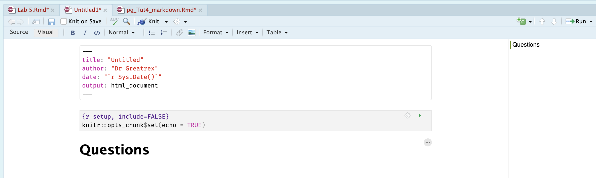
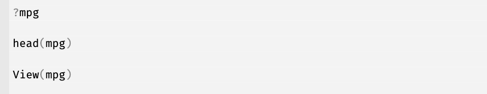
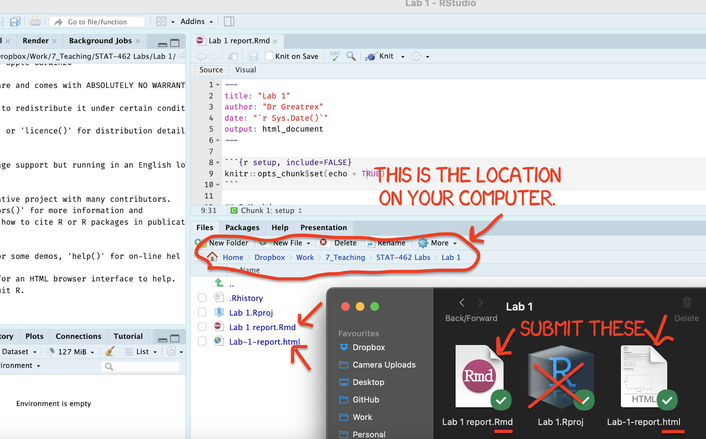
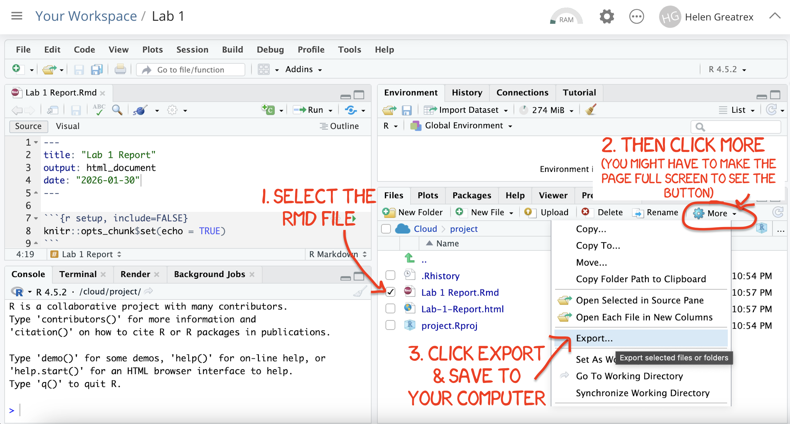

# Lab 1 {#Lab_1 .unnumbered}

## LAB AIM {.unnumbered}

Welcome to Lab 1. This is worth 8% (80 points) and you can drop your lowest lab out of six.

This is a ONE WEEK LAB. You only have one lab session (today) working on this during class, then until next Friday to finish up and write up. The maximum time it should take is about 4-5 hrs of your time.

The aim of this lab is to get comfortable creating your lab reports, and how to edit both text and code. Finally you will get to apply some knowledge from the course so far.

<br>

------------------------------------------------------------------------


## LAB SET-UP (Important!) {.unnumbered}

This might take a while during week 1, but I promise that after a few labs, this will be very easy.

### STEP 1: Install/update R and R-Studio {.unnumbered}

If you are using R on your computer, you should be running R version "4.5.2 [Not] Part in a Rumble" (look at the top of the console), and R-Studio version 2026.01.0. (apple blossom).

If you've already completed Homework 1 & installed/updated R, then, move to STEP 2. If you're using PositCloud, move to STEP 2.

-   **[1A]** First click here to learn more about R, R-Studio and R-Markdown: [What are R and R-Studio](#WhatIsR)

-   **[1B a]** If you're not planning to use your own computer, go here to make an account and log into Posit Cloud, which will let you use R online. [Tutorial on Posit Cloud](#Setup_Online)

-   **[1B b]** If you are planning to use your own laptop but don't yet have R and R studio, go here to learn how to install them. [Tutorial on Installing R](#Setup_Desktop)

-   **[1B c]** if you already have R on your laptop, you probably need to update it! You should be running R version "4.5.2 [Not] Part in a Rumble" (look at the top of the console), and R-Studio version 2026.01.0. (apple blossom). If not, click here to learn more - [Tutorial on Updating R](#Setup_UpdateDesktop)

And finally,

-   **[1C]** Especially if you are new to R, use the tutorials to take a look around! Or take this opportunity to complete the Data Camp section of Homework 1. [NEED TUTORIAL LINK]

<br>

### STEP 2: Creating a project.. {.unnumbered}

It's likely that past R users did not have to use projects, but they are WONDERFUL.

-   **[2A]** Go here to read more about projects and to make a project for Lab 1: [Projects](#T1_Projects)

-   **[2B]** If you haven't already, open your project in R-Studio. It should look like this.

<div class="figure">

<p class="caption">(\#fig:L1-Projectcheck)How to check you are in a project</p>
</div>

<br>

------------------------------------------------------------------------

### STEP 3: Download code-Packages from the app store.. {.unnumbered}

Just like there are millions of apps for your phone, there are about 20,000 'packages' or 'libraries' that you can download and use in R. Just like phone apps can do wildly different things, some of the Packages will contain data, others might help you make beautiful graphics, others might do complex statistics, or speed up performance.. The options are endless.

BUT! Just like phone apps, you don't want to have every package in existence downloaded from the app-store onto your computer. Instead, we select and install the ones we need from the R "app store".

-   **[3A]** Read [About Packages](#T2_Libraries_about), and [Installing Packages](#T2_Libraries_install)

-   **[3B]** Follow the instructions to go to the 'install/app store' and install these three packages:

    -   `rmdformats`

    -   `tidyverse`

    -   `ggstatsplot`

We will load and use them later in the lab.

------------------------------------------------------------------------

### STEP 4: Create your lab report {.unnumbered}

-   **[4A]** Watch the quick video overview of R Markdown. [Markdown Tutorial](#T31_Basics)

-   **[4B]** Using the tutorial instructions, make a new RMarkdown Report ( [Markdown Tutorial](#T31_Basics))

-   **[4C]** Open your RmD report file (click on its name in the files tab, as long as you are running your project). Click visual mode and see if you can identify the code chunks, space for text and yaml files.

-   **[4D]** Using the [YAML tutorial](#Tut4E_YAML), edit the YAML code to include, A title, your author name, automatically created today's date, a floating table of contents, numbered sections (this won't appear until you start typing section headings) and the lumen theme.

-   **[4E]** Click knit. This should work and create a html file in your lab 1 folder AND show you it on your screen. IF YOU HAVE PROBLEMS ASK FOR HELP (as long as you have first installed `rmdformats`)

<br>


------------------------------------------------------------------------

## QUESTIONS {.unnumbered}

### STEP 5: R-Markdown {.unnumbered}

-   **[5A]** Close down the html file so that you are back in your lab report again.

-   **[5B]** Now you are going to delete all "the friendly welcome text" (leaving the code at the top), so you have space to write your answers.


-   **[5B]** Create a level 1 heading called "Questions"


The result should look like this



-   **[5C]** Below this, using bullet points and clearly marking what your answer refers to, answer these questions:

    -   [**5C.Q1:**]{.underline} Using a bullet point list (hint visual mode, then click the bullet button), in your own words, state the difference between viewing your lab script using the Source Button vs the Visual Button (try it!) [Tutorial](#T32A_visualmode)

    -   [**5C.Q2:**]{.underline} In your own words and based on what you learned from Monday's lecture notes (lecture 3D), describe the central limit theorem.

Press knit and check it still works.

<br>

------------------------------------------------------------------------


### STEP 6: R-Coding {.unnumbered}

The following questions link to your homework and datacamp. For those who have programmed in R, they are trivial, but use it to get used to the markdown format. If you are struggling, try the datacamp homework first.

Now make a new heading/sub heading and make a new code chunk.[see here for what to click](#T32Da_Adding)

Inside the code chunk, answer the following questions using R. I have already completed question 1 for you to give you a worked example.

-   **[6A]** Calculate the sum of 1+1 and assign/save it to the variable 'a' (e.g. a \<- 1+1)


``` r
a <- 1+1
```

-   **[6B]** Calculate the sum of 1+3 and assign it to the variable 'b'

-   **[6C]** Calculate your age to the power 4 and assign it to a variable called your name (e.g. mine would be `helen <-` )

-   **[6D]** Calculate the sum of a/b and assign it to the variable ans

-   **[6E]** Calculate the number of characters in the word "Llanfairpwllgwyngyllgogerychwyrndrobwllllantysiliogogogoch" using the nchar command (hint <https://www.educative.io/answers/how-to-calculate-the-size-of-a-string-using-nchar-in-r>, and USE QUOTES)

<br>

------------------------------------------------------------------------


### STEP 7: MPG Data {.unnumbered}

In class we discussed about both numerical and graphical summaries to describe the data.You will be using the `mpg` dataset available in R to make some numerical and graphical summaries. **Hint - press knit after every question to check there are no coding errors before you move on.**

The mpg dataset contains a subset of the fuel economy data that the EPA makes available on <https://fueleconomy.gov/>. It contains only models which had a new release every year between 1999 and 2008 - this was used as a proxy for the popularity of the car.

-   **[7A]** Make a new heading called Car Analysis

-   **[7B]** We need one more library/package. Just as you did in Step 3, go to the packages tab, click install to go to the app store and install the `datasets` package.

Just like downloading a phone app from the app-store doesn't mean that it's automatically open on your phone, we need to load the datasets library every time we want to use it. To do this, we include a line of code in your report which loads the app:

-   **[7C]** Create a new code chunk, and add this command exactly, including the options at the top.<br>

<div class="figure">

<p class="caption">(\#fig:L1-Loadpackages)Type this exactly then run the code chunk. It will only work if you have first installed the packages from the appstore</p>
</div>

-   This will load the `datasets` and `tidyverse` packages which will allow us to use their commands in our analysis.<br>
    -   The options mean that it won't show any error messages or warnings when you press knit.<br>
    -   Run the code chunk by pressing the green arrow. The first time you run it, you might see a load of "friendly loading text". Press the green arrow a second time and it should go away. 
    
<br>

-   **[7D]** One by one, type the three lines below into the CONSOLE (not into a code chunk).
    -   The `?` will bring up the help file for mpg, which contains valuable information about the dataset. You can type `?` before any command and built in dataset and it will bring up the help file.\
    -   The `head` command prints the first 5 lines and
    -   The `View` command opens the data in a new tab (close it to go back to your report)

<div class="figure">

<p class="caption">(\#fig:L1-ViewData)Type each line into the CONSOLE</p>
</div>

<br>

-   **[7E]** Using the help file and your analysis of the data, in your report, write as clearly and accurately as you can: *(note, chatGPT often gets these wrong! rely on the lecture notes and write up in your own writing)*
    -   The object of analysis
    -   The specific sampling frame the data came from
    -   A reasonable target population, stating who or what the results are meant to apply to beyond the data you sampled from. Justify why you chose that population.
    -   List each variable using a bullet point list, explaining what each one is, including units as available and stating what type of data each one is (e.g. nominal, ordinal etc). Justify your decision!

<br>

-   **[7F]** Calculate the mean year of manufacture of the mpg car models. To do this you apply the `mean` command to the `year` column of the mpg data. If you're unsure, try the datacamp homework or see here <https://www.statology.org/r-mean-of-column/>

<br>

-   **[7G]** Make a new code chunk. Use the `str` command to look at the structure of your data e.g. make a new code chunk and type `str(mpg)`. From this, write down how many variables there are and how many objects are in the data.frame.

<br>

-   **[7H]** Make a new code chunk. In the same way as 7F, use the `summary` command to look at the summary statistics of your data

    -   You should see that R thinks many of your categorical variables are either descriptive text or numeric. To fix this, you are going to convert each categorical column to a factor, using the `factor` command. The two commands below will teach R that the `trans` and `model` columns are categorical data (called 'factors in R'). <br>

    -   Make a new code chunk , copy these across and add more lines for every column that should be categorical. Run the code chunk (nothing will seem to happen on the outside).


``` r
mpg$trans        <- factor(mpg$trans)
mpg$model        <- factor(mpg$model)
```

<br>

-   **[7I]** Now make another new code chunk and run the summary command again on the mpg data. You should see a lot more information. Use this information and your previous code to tell me *what percentage* of the care models are the civic model.

Congrats! Finished!

------------------------------------------------------------------------

<br>

## WHAT TO SUBMIT {.unnumbered}

### If you are using your own laptop {.unnumbered}

Press knit one final time. You will have created two files; a `.Rmd` file containing your code and a `.html` file for viewing your finished document.

Find the html and RmD files in your Lab 1 folder on your computer. Double click the html file to open it in your browser and check it's the one you want to submit.

**You need to submit BOTH of these files on the relevant Canvas assignment page.**

You can also add comments to your submission as needed on the canvas page, or you can message Dr G.

<div class="figure">

<p class="caption">(\#fig:L1-Submit)Find them in your STAT462 folder on your computer</p>
</div>

### If you are using Posit Cloud online {.unnumbered}

1.  Press knit one final time. You will have created two files; a `.Rmd` file containing your code and a `.html` file for viewing your finished document.

2.  Go to the files tab an click on the little check-box by the RmD file. Then click the blue "more button" and press export. Save onto your computer.

<div class="figure">

<p class="caption">(\#fig:L1-CloudDownload)How do download the files from PositCloud</p>
</div>

2.  Uncheck the .RmD box and click the box by the html file. Then click the blue "more button" and press export. Save onto your computer.

**You need to submit BOTH of these files on the relevant Canvas assignment page.**

You can also add comments to your submission as needed on the canvas page, or you can message Dr G.

## CHECK YOUR GRADE!  {.unnumbered}

This is how you will be graded for this lab.

<br>

### Rubric/Submission checklist {.unnumbered}

**HTML FILE SUBMISSION - 10 marks**

**RMD CODE SUBMISSION - 10 marks**

**MARKDOWN/CODE STYLE - 20 MARKS**

How to get full marks here

-   Your YAML code is working e.g. when you press knit, you see your author name, a table of contents etc etc (see step 4)

-   Your code and document is neat and easy to read. LOOK AT YOUR HTML FILE IN YOUR WEB-BROWSER BEFORE YOU SUBMIT. For example:

    -   There is a spell check next to the save button.

    -   You have written in full sentences and it is clear what question your answers are referring to.

    -   You have included units!

    -   You have included formatting like headings/subheadings and bullets. Many people make typos with the headings. The easiest way to do it is to use visual mode, then highlight the text and click Header 1, Header 2 etc.

**WRITTEN QUESTIONS/R-MARKDOWN: 20 MARKS**

You have answered the questions in Step 5 clearly and thoughtfully in a way I could use as a class example.

**R-CODING: 20 MARKS**

You have managed to successfully complete all the code challenges

**MPG ANALYSIS: 20 MARKS**

You included all the code and successfully answered the questions, providing reasoning where appropriate

[100 marks total]

Overall, here is what your lab should correspond to:

<table class=" lightable-classic-2 table table-striped table-hover table-responsive" style='font-family: "Arial Narrow", "Source Sans Pro", sans-serif; margin-left: auto; margin-right: auto; margin-left: auto; margin-right: auto;'>
 <thead>
  <tr>
   <th style="text-align:left;"> POINTS </th>
   <th style="text-align:left;"> Approx grade </th>
   <th style="text-align:left;"> What it means </th>
  </tr>
 </thead>
<tbody>
  <tr>
   <td style="text-align:left;"> 98-100 </td>
   <td style="text-align:left;"> A* </td>
   <td style="text-align:left;"> Exceptional.  Above and beyond.   THIS IS HARD TO GET. </td>
  </tr>
  <tr>
   <td style="text-align:left;"> 93-98 </td>
   <td style="text-align:left;"> A </td>
   <td style="text-align:left;"> Everything asked for with high quality.   Class example </td>
  </tr>
  <tr>
   <td style="text-align:left;"> 85-93 </td>
   <td style="text-align:left;"> B+/A- </td>
   <td style="text-align:left;"> Solid work but the odd  mistake or missing answer in either the code or interpretation </td>
  </tr>
  <tr>
   <td style="text-align:left;"> 70-85 </td>
   <td style="text-align:left;"> B-/B </td>
   <td style="text-align:left;"> Starting to miss entire/questions sections, or multiple larger mistakes. Still a solid attempt.  </td>
  </tr>
  <tr>
   <td style="text-align:left;"> 60-70 </td>
   <td style="text-align:left;"> C/C+ </td>
   <td style="text-align:left;"> It’s clear you tried and learned something.  Just attending labs will get you this much as we can help you get to this stage </td>
  </tr>
  <tr>
   <td style="text-align:left;"> 40-60 </td>
   <td style="text-align:left;"> D </td>
   <td style="text-align:left;"> You submit a single word AND have reached out to Dr G or Aish for help before the deadline (make sure to comment you did this so we can check) </td>
  </tr>
  <tr>
   <td style="text-align:left;"> 30-40 </td>
   <td style="text-align:left;"> F </td>
   <td style="text-align:left;"> You submit a single word…....  ANYTHING..                Think, that's 30-40 marks towards your total…. </td>
  </tr>
  <tr>
   <td style="text-align:left;"> 0+ </td>
   <td style="text-align:left;"> F </td>
   <td style="text-align:left;"> Didn’t submit, or incredibly limited attempt.  </td>
  </tr>
</tbody>
</table>

