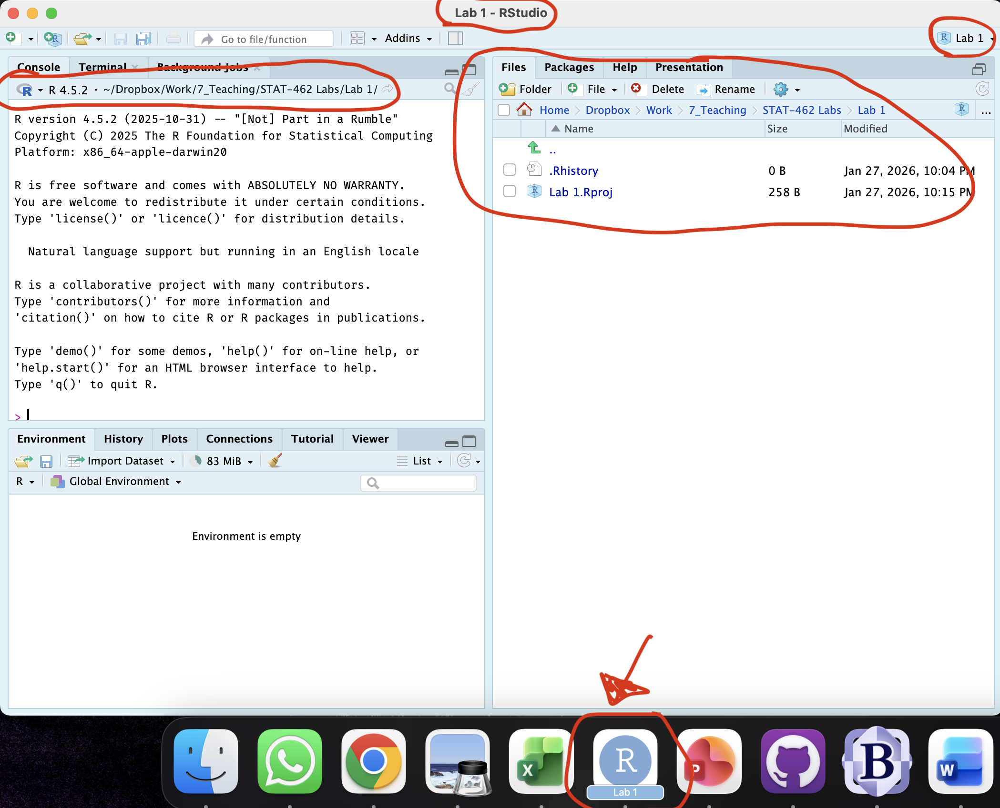

# Lab 1 {#Lab_1 .unnumbered}

## Aim

Welcome to your first lab. This is worth 8% (80 points) and you can drop your lowest lab out of six. We have three main learning objectives.

-   To allow you to practice the statistical concepts from the course

-   To use real-world data-sets.

-   To be comfortable conducting analysis in R and writing up your reports professionally.

This is a ONE WEEK LAB. You only have one lab session (today) working on this during class, then until next Friday to finish up and write up. The maximum time it should take is about 4-5 hrs of your time. [**If you are really stuck, ask for help**]{.underline}.

<br>

------------------------------------------------------------------------

## Instructions {.unnumbered}

<br>

### STEP 1: Installing/Updating R & R-Studio.. {.unnumbered}

-   **[1A]** First click here to learn more about R, R-Studio and R-Markdown: [What are R and R-Studio](#WhatIsR)

If you haven't yet completed homework 1..

-   **[1B a]** If you're not planning to use your own computer, go here to make an account and log into Posit Cloud, which will let you use R online. [Tutorial on Posit Cloud](#Setup_Online)

-   **[1B b]** If you are planning to use your own laptop but don't yet have R and R studio, go here to learn how to install them. [Tutorial on Installing R](#Setup_Desktop)

-   **[1B c]** if you already have R on your laptop, you probably need to update it! You should be running R version "4.5.2 [Not] Part in a Rumble" (look at the top of the console), and R-Studio version 2026.01.0. (apple blossom). If not, click here to learn more - [Tutorial on Updating R](#Setup_UpdateDesktop)

And finally, 

-   **[1C]** Especially if you are new to R, use the tutorials to take a look around!  Or take this opportunity to complete the Data Camp section of Homework 1.   


----------------------------------------------------------------------

### STEP 2: Creating a project.. {.unnumbered}

It's likely that past R users did not have to use projects, but they are WONDERFUL.

-   **[2A]** Go here to read more about projects and to make a project for Lab 1: [Projects](#T1_Projects)

-   **[2B]** If you haven't already, open your project in R-Studio. It should look like this.

<div class="figure">

<p class="caption">(\#fig:L1-Projectcheck)How to check you are in a project</p>
</div>
<br>

----------------------------------------------------------------------

### STEP 3: Download code-Packages from the app store.. {.unnumbered}

Just like there are millions of apps for your phone, there are about 20,000 'packages' or 'libraries' that you can download and use in R. Just like phone apps can do wildly different things, some of the Packages will contain datasets, others might help you make beautiful graphics, others might do complex statistics, or speed up performance..

The options are endless. BUT!  Just like phone apps, you don't want to have every package in existence downloaded from the app-store onto your computer.  Instead, we select and install the ones we need from the R "app store". 

-   **[3A]** Read [About Packages](#T2_Libraries_about), and  [Installing Packages](#T2_Libraries_install)


-   **[3B]** Follow the instructions to go to the 'install/app store' and install these three packages:

    -   `rmdformats`

    -   `tidyverse`

    -   `ggstatsplot`

We will load and use them later in the lab.


----------------------------------------------------------------------

### STEP 4: Create your lab report

-   **[4A]** Watch the video tutorial about R Markdown. [Markdown Tutorial](#T31_Basics)

- 

------------------------------------------------------------------------

<br>

### R-Markdown {.unnumbered}

-   **[7]** Read through the tutorial about R Markdown. [Markdown Tutorial](#T3_Markdown)

-   **[8]** Open your RmD report file (click on its name in the files tab, as long as you are running your project). Click visual mode and see if you can identify the code chunks, space for text and yaml files.

-   **[9]** Click knit. This should work and create a html file. IF YOU HAVE PROBLEMS ASK FOR HELP (as long as you have first installed rmdformats)

-   **[10]** In the space assigned, answer these questions

    -   [**QUESTION 1:**]{.underline} Using a bullet point list (hint visual mode, formatting at the top), state three advantages of using R projects (hint 2, video in the project tutorial)\

    -   [**QUESTION 2:**]{.underline} Using the example of phone apps (or any other example), explain what R packages are and the difference between installing them and loading them. State what command is used to *load* packages ready for use? Finally, state whether you can load packages when you are not connected to the internet (hint, think about your phone).\

    -   [**QUESTION 3:**]{.underline} Make a new heading called favorite photo in the question 3 slot, then change its format to 'heading 3'. Inside insert a photo/picture of your choice and underneath explain why you chose it.\

    -   [**QUESTION 4:**]{.underline} Go to the canvas course page and look at the course expectations document (in modules at the top). Summarise IN YOUR OWN WORDS what assignments are expected for this course.\

    -   [**QUESTION 5:**]{.underline} Go to the lab FAQ page. <https://psu-spatial.github.io/Stat462-2024/FAQ.html> Explain IN YOUR OWN WORDS, what the policy is surrounding ChatGPT.

Press knit and check it still works.

------------------------------------------------------------------------

<br>

### R-Coding {.unnumbered}

The following questions link to your homework and datacamp. For those who have programmed in R, they are trivial, but use it to get used to the markdown format.

In the space for Question 6, make a new code chunk. (either a single one or mulitple is fine). Answer the following questions using R.

You get the first one for free :)

1.  Calculate the sum of 1+1 and assign it to the variable 'a' (e.g. a \<- 1+1)


``` r
a <- 1+1
```

2.  Calculate the sum of 1+3 and assign it to the variable 'b'

3.  Calculate your age to the power 4 and assign it to a variable called yourname (e.g. mine would be helen \<- ..)

4.  Calculate the sum of a/b and assign it to the variable ans

5.  Calculate the number of characters in the word "Llanfairpwllgwyngyllgogerychwyrndrobwllllantysiliogogogoch" using the nchar commannd (hint <https://www.educative.io/answers/how-to-calculate-the-size-of-a-string-using-nchar-in-r>, hint 2 QUOTES)

------------------------------------------------------------------------

<br>

### Above and beyond {.unnumbered}

There are only 3 marks for this! So it's a space to stretch yourself and show off. Set a timer for 20mins and see how far you get.

Load the starwars dataset by creating a code chunk with this command.


``` r
# THIS WILL ONLY RUN IF YOU FIRST RUN THAT LIBRARY CODE CHUNK AT THE TOP
data(starwars)
```

See how much you can find out about this dataset using R. Hints, you could use the summary command, you can select individual columns using \$ e.g. starwars\$name gets the data command, you can use the table command on categories, or any plots you wish.

You get the three marks for a reasonable attempt, and if nothing works, for writing what you tried and what happened.

------------------------------------------------------------------------

<br>

## What do I submit? {#Lab_1_01}

Press knit one final time.

You will have created two files; a `.Rmd` file containing your code and a `.html` file for viewing your finished document. You need to submit BOTH of these files on the relevant Canvas assignment page. You can also add comments to your submission as needed on the canvas page, or you can message Dr G.

To download them on posit cloud, click on the check box by the RmD and html, then click on the little blue cog on the far right of the Files tab (you might need to maximise the window), then press export.
