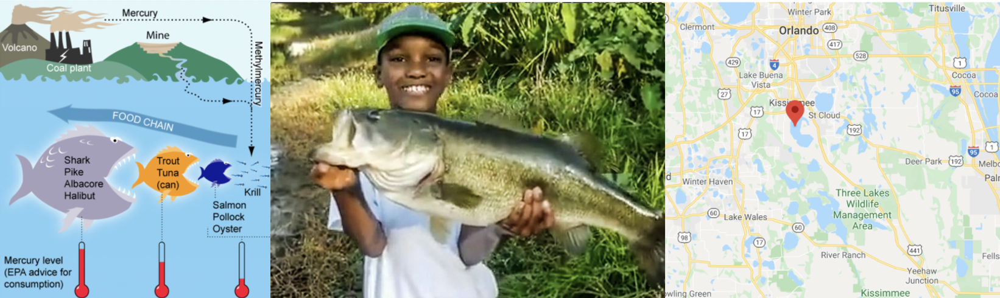

# Lab 4 {#Lab_4 .unnumbered}


### Aim {.unnumbered}

Welcome to lab 4. This is worth 8% (480 points) and you can drop your lowest lab.

By the end of this lab, you will be able to:

1.  Understand & use regression diagnostics to assess LINE
2.  Apply this knowledge to a real case study on pollution in Florida Lakes

This is a ONE WEEK LAB. You need to finish writing up by next Tuesday (23:59pm) e.g. just before Lab 6 starts.

<br>

### Need help?

REMEMBER THAT EVERY TIME YOU RE-OPEN R-STUDIO YOU NEED TO RE-RUN **ALL** YOUR CODE CHUNKS. The easiest way to do this is to press the "Run All" button (see the Run menu at the top right of your script)

The maximum time this lab should take is about 4-5 hrs of your time.

<br> 


------------------------------------------------------------------------

## 1. LAB SET-UP (Important!) {.unnumbered}

### STEP 1: Create your Lab 4 project {.unnumbered}

-   **[1A]** Make a project for Lab 4 (tutorial here) [Projects](#T1_Projects)

-   **[1B]** Open your Lab 4 project in R-Studio (see screenshot below).

<br>

------------------------------------------------------------------------

### STEP 2: Create your lab report structure {.unnumbered}

-   **[3A]** Make a new RMarkdown Report ([Tutorial here](#T31_Basics)) <br>

-   **[3B]** Using the [YAML tutorial](#Tut4E_YAML), edit the YAML code at the top to include,

    -   A title,

    -   your author name,

    -   Automatically creating today's date,

    -   A floating table of contents,

    -   Numbered sections

    -   A theme of your choice. (See the screenshot below) <br>

-   **[3C]** Delete all "the friendly welcome text", leaving the code at the top, so you have space to write your answers. (see the screenshot below)


<br>

### STEP 3: NEW (ish) Adjust your knit options {.unnumbered}

Many of you are losing marks because you are allowing all the library loading text to appear when you press knit. This makes it hard to find your answers. Although this was addressed in earlier labs, here's how to fix this issue.

-   Look at the first code chunk below the YAML code (or if you deleted it, put this code in a code chunk). The opts_chunk command allows us to set general knit options for the entire report

```         
   knitr::opts_chunk$set(echo = TRUE)
```

-   Add in two more options, warning=FALSE and message=FALSE. Now when you press knit, you shouldn't see any library loading text. You can also add these options to any code chunk if you want to suppress that specific output (see the Markdown Tutorial)

<br>

### STEP 4: NEW(ish) Sort out libraries {.unnumbered}

It's good practice to have a single code chunk near the top of the script containing all your library commands. This is to stop duplicated code and to make it easy to see what you are loading before running your labs.

-   Add a new code chunk and add the following libraries. Then press save or try to knit. <br> If any are missing you will see

    -   EITHER a little yellow bar at the top of the screen asking if you want to install the libraries. Say yes, wait until the libraries are installed and try again. <br>
    -   OR an error saying that it can't find that library (it might also be a spelling mistake if you are sure it's installed). In this case, you have to go to the app store and download it. <br>\

-   Finally, if ChatGPT, or R or anyone else gives you code with a library command in it, PUT THAT LIBRARY COMMAND IN YOUR TOP 'LIBRARY' CODE CHUNK!


``` r
library(tidyverse) # Lots of data processing commands
library(knitr)     # Helps make good output files
library(ggplot2)   # Output plots
library(skimr)     # Summary statistics
library(Stat2Data) # Regression specific commands
library(corrplot)  # correlation plots
library(GGally)    # correlation plots
library(ggpubr)    # QQplots
library(olsrr)     # Regression specific commands
library(plotly)    # Interactive plots
library(readxl)    # Read from excel files
```

<br><br>

### **[Step 1.4] Check Progress** {.unnumbered}

-   OK - so by now, you should be running project 4 - see if it says Project 4 at the very top of your screen , you have created your lab report, the YAML code works and your libraries work. If not, STOP, go back and redo the tutorials or talk to Dr G.

<br><br>

------------------------------------------------------------------------

## 2. REGRESSION VALIDITY {.unnumbered}

-   Create a level 1 heading called Regression assumptions.

### **[Step 2.1] LINE** {.unnumbered}

-   Create a level 2 heading called LINE assumptions. From your notes and the online textbook (<https://online.stat.psu.edu/stat501/lesson/4/4.1>), write at LEAST 100 words (total) explaining what the LINE assumptions are for linear regression.

<br>

### **[Step 2.2] Outliers** {.unnumbered}

-   Create a level 2 heading called Outliers and influential points. From your notes and the online textbook (<https://online.stat.psu.edu/stat501/lesson/4/4.1>), Write at LEAST 100 words (total) explaining outliers, leverage and influential points.

<br><br>

### **[Step 2.3] Residual vs Fits**  {.unnumbered}

-   Write at LEAST 100 words (total) explaining in your own words

    -   What a residual vs fits plot is,
    -   Why it's useful compared to just looking at the scatterplot.\
    -   Referring to your plots to explain how each of your three datasets does/doesn't meet the LINE assumptions of linearity and equal variance.

### **[Step 2.4] Create some teaching data** {.unnumbered}

-   Go to <https://stephenturner.github.io/drawmydata/>. Here you can click on the plot on the screen and it will create a scatterplot for you. You can then download that data as a csv file.\

-   **You are going to create and save 4 datasets into your Lab 4 folder.** <br> Each should have *at minimum* 30 points.

    -   A dataset that meets all the assumptions of simple linear regression, but with an influential outlier.
    -   A dataset that breaks the assumption of linearity but meets everything else.
    -   A dataset that breaks the assumption of equal variance/heteroskadisity.
    -   A dataset with a non influential outlier.

-   For each one, download the data **INTO YOUR LAB-4 PROJECT FOLDER**. **Name your files sensible things so you don't go insane**

<br><br>

### **[Step 2.5] Showcase the issues in R.** {.unnumbered}

-   Make sure that your csv files are actually in your lab 4 project folder AND you are running your project

<br>

-   Create a level 2 heading called Showcase.

<br>

-   Underneath, make a code chunk and read each of the four csv files into R, saving each as a sensible variable name. [Reading-In Data tutorial here](#T4_load_csv)

<br>

-   **FOR EACH OF THE FOUR DATASETS**
    -   Create a professional scatterplot of Y vs X for each of your four datasets. [Tutorial here](#T7_PlotsScatter_ggplot2)<br>

    -   Below each one, explain why you think it does/doesn't LINE assumptions and outlier assumptions. See here for example length/detail - <https://online.stat.psu.edu/stat501/lesson/4/4.7>

        <br>

    -   For each dataset, create a linear regression model, making sure that your response (y-axis) and predictor are the correct way around [Tutorial here](#T11_RunModel). You do not need to write out the equation, but check against your scatterplot to make sure it all makes sense.

        <br>

    -   For each of your datasets, use the code in the [LINE Tutorial](#T11_LINE), and the [Outliers Tutorial](#T11_Outliers) to show that the data meets or breaks the LINE assumptions and outlier conditions described above.\
        <br>

    -   Make sure to explain what you are doing at each step (e.g. a few sentences below each test/plot so I am satisfied you understand what you are doing)

<br><br>

## 3. FLORIDA FISH CHALLENGE {.unnumbered}

<br>

### **[Step 3.1] IMPORTANT! READ THIS!** {.unnumbered}

FIRST (right now), read the study background below - you will need all the info there! Remember you can use chatgpt to help understand it.

#### Study Background {.unnumbered}

<div class="figure" style="text-align: center">

<p class="caption">(\#fig:unnamed-chunk-3)a. (Left): The mercury food chain in fish.(Wikimedia commons, Bretwood Higman, Ground Truth Trekking) b. (middle) A large bass caught and released in a central Florida lake (https://www.wired2fish.com/news/young-man-catches-releases-huge-bass-from-bank/) c. (right). The location of the lakes in Florida (Google maps)</p>
</div>

Small amounts of the element mercury are present in many foods. They do not normally affect your health, but too much mercury can be poisonous. Although mercury is naturally occurring, the amounts in the environment have been on the rise from industrialization. You can read more details here:

-   <https://www.wearecognitive.com/project/extra-narrative/bbc-mercury>
-   <https://medium.com/predict/mercury-pollution-reaches-the-deep-sea-f59a4938dc7c>

In the late 1980s, there were widespread public safety concerns in Florida about high mercury concentrations in sport fish. In 1989, the State of Florida issued an advisory urging the public to limit consumption of "top level" predatory fish from Lake Tohopekaliga and connected waters: including largemouth bass (Micropterus salmoides), bowfin (Amia calva), and gar (Lepisosteus spp.). This severely impacted tourism and the economy in the area.

Urgent research was required to inform public policy about which lakes needed to be closed. We are going to reproduce part of a real study on this topic <br>

#### Your Goal {.unnumbered}

**You have been asked to use this dataset assess whether the alkalinity levels of a lake might impact Mercury levels in large-mouth bass.**

**You will be presenting your results to the Mayor of Orlando in order to set new fishing regulations.**

In 1993, Dr. T.R. Lange and colleagues collected water samples from 53 lakes across Central Florida. For each lake, they recorded four water quality measures — pH, chlorophyll, calcium, and alkalinity — alongside the average mercury concentration found in the muscle tissue of fish sampled from each lake's waters.

You can read more details in the paper/resources here - [https://www.researchgate.net/publication/241734788_Influence_of_Water_Chemistry_on_Mercury_Concentration_in_Largemouth_Bass_from_Florida_Lakes](https://www.researchgate.net/publication/241734788_Influence_of_Water_Chemistry_on_Mercury_Concentration_in_Largemouth_Bass_from_Florida_Lakes){.uri}.

The units of the your dataset are:

+------------------+----------------------------------------------------------------------------------------------------------------------------+
| **Variable**     | **Unit**                                                                                                                   |
+:================:+:==========================================================================================================================:+
| No_fish_sampled  | Number of fish sampled from each lake                                                                                      |
+------------------+----------------------------------------------------------------------------------------------------------------------------+
| fish_av_mercury  | Average amount of mercury found in sampled fish, $\mu g$                                                                   |
+------------------+----------------------------------------------------------------------------------------------------------------------------+
| lake_alkalinity  | miligrams/Litre, $mg/L$                                                                                                    |
|                  |                                                                                                                            |
|                  | (Total alkalinity is expressed as **milligrams per liter** (mg/L) or parts per million (ppm) of calcium carbonate (CaCO3)) |
+------------------+----------------------------------------------------------------------------------------------------------------------------+
| lake_ph          | Unitless measure of acidity/alkalinity                                                                                     |
+------------------+----------------------------------------------------------------------------------------------------------------------------+
| lake_calcium     | Measured calcium content of the lake in miligrams/Litre, $mg/L$                                                            |
+------------------+----------------------------------------------------------------------------------------------------------------------------+
| lake_chlorophyll | Measured chlorophyll content of the lake in miligrams/Litre, Micrograms, $\mu g$                                           |
+------------------+----------------------------------------------------------------------------------------------------------------------------+

<br><br>

### **[Step 3.2]** Obtain the data {.unnumbered}

-   Create a level 1 heading called Florida Fish
-   The data is stored on Canvas in **BassNew.xlsx**. Obtain the data from Canvas and put it in your project folder.
-   Use read_excel to read it into R and save it as a variable called `bass`. e.g.


``` r
bass <- read_excel("index_data/BassNew.xlsx")
```

<br><br>

### **[Step 3.3]** Describe the study aim {.unnumbered}

-   If you skipped it, go back and read the brief in 3.1. Seriously, it will save you time.

-   Imagine you are writing a brief for the Orlando Mayor. Start by summarizing your research goal and the data available, including

    -   Why people who care about Mercury poisoning are looking at fish (use the reference links)

    -   What you are trying to achieve in this report

    -   The data that is available and what population you are planning to apply it to (e.g. is your sample representative of "Florida lakes today"

    -   The object of analysis.

    -   The variables and their units (especially identifying the response variable - you're welcome to copy/paste my table.

-   Use formatting like headings/sub-headings/bullet points etc to make your write up easy to read.

<br><br>

### **[Step 3.4]** Exploratory analysis {.unnumbered}

-  Using the summary command, and things like ndim to provide evidence,  describe how much data is available, if there is any missing data and any other interesting features (there might be none!)

-   Use the ggcorrmat command from the ggstatsplot package to make a correlation matrix of your bass data: [Tutorial here)](#T10_ggcorrmat) <br>

-   Below, describe the relationship you see between your main response variable and your predictors.  Also note any potential *confounding variables* that might influence the response variable.  (remember to read the problem statement above to work out what they are)

<br><br>

### **[Step 3.5]** First model {.unnumbered}

-   Create a linear model between your response and predictor.  It will make your life easier to save this as a variable called model1. e.g. `model1 <- lm(...`


-   Make a professional looking scatterplot with the line of best fit plotted from the model

-   Use ols_regress to summarise your model (see Tutorial 11)

-   In the text below the model, describe the scatter-plot (e.g. strength, shape/association, outliers etc), formally write out the linear model equation, including the numeric coefficients.  Bonus mark if you properly format this as a LateX equation.

-   The Mayor doesn't understand statistics very well. Clearly interpret the estimated model parameters (slope & intercept)/model summary-statistics in the the context of the problem, in a way that would be understandable to a policy maker. (e.g. you should be talking about florida lakes - remember you can google the topic!) <br>

-   Use the code from above or the LINE tutorial to  inspect the LINE assumptions and write your conclusions in the text.

<br><br>

### **[Step 3.6]** Outliers {.unnumbered}

In this lab, we will now also look at Outliers. 

-   I have assumed that you have called your linear-model, `model1` and your data, `bass`.  So edit your code as necessary 

This extracts from the model your predicted y-values, the residuals and outlier analysis for each data point. Get this working without errors.


``` r
# Make a new column with the predicted y value
bass$y_predicted <- model1$fitted.values

# Make a new column with the raw residuals
bass$residuals_m1 <- model1$residuals

# Make a new column with the leverage
bass$x_leverage <- ols_leverage(model1)

# Make a new column with the Cook's distance. OLSRR package
bass$cooks.distance <- cooks.distance(model1)

# Print out the table
head(bass)
```

<br>

**Now take a look at tutorial 11 (NEW)!.**

-   Use this data to identify:

    a.  The name of the lake with highest residual mercury value

    b.  The name of the lake with highest leverage

    c.  The name of the lake with highest Cook's distance

HINT - To do this, remember you can filter and sort the data table in the View window (tiny little arrows next to each variable name) You can also use commands like max() on any column (e.g. this code would tell you the row number). Or you can sort the data using this command (<https://psu-spatial.github.io/Stat462-2024/T9_wrangling.html#sorting-data>)

```         
which(tablename$columnname == max(tablename$columnname, na.rm=TRUE))
```

<br><br>

### **[Step 3.7]** Outlier question {.unnumbered}

Your colleague looked at the scatterplot and suggested that they thought there might be three or four Lakes which appear to be either influential, or close-to-influential outliers. 

This is concerning, because there is an outlier, then the mayor needs want to send people to examine the lake in question to make sure that there is nothing strange going on.  This is expensive and time consuming.

-   In your analysis, use Cook's distance and the outlier/leverage plots to identify the names of lakes the analysts are worried about.

-   In the text explain if you agree with the comment by the analysts. Explain your reasoning and point the reader to evidence in your R output.

<br><br>

### **[Step 3.8]** Summary {.unnumbered}

We will return to Florida lakes next week.  So summarise to the mayor what we know so far.


Congrats! Finished.  

------------------------------------------------------------------------

<br>

## 3. WHAT TO SUBMIT {.unnumbered}

### If you are using your own laptop {.unnumbered}

Press knit one final time. You will have created two files; a `.Rmd` file containing your code and a `.html` file for viewing your finished document.

Find the html and RmD files in your Lab 1 folder on your computer. Double click the html file to open it in your browser and check it's the one you want to submit.

**You need to submit BOTH of these files on the relevant Canvas assignment page.**

You can also add comments to your submission as needed on the canvas page, or you can message Dr G.

<div class="figure">

<p class="caption">(\#fig:L4-Submit)Find them in your STAT462 folder on your computer</p>
</div>

### If you are using Posit Cloud online {.unnumbered}

1.  Press knit one final time. You will have created two files; a `.Rmd` file containing your code and a `.html` file for viewing your finished document.

2.  Go to the files tab an click on the little check-box by the RmD file. Then click the blue "more button" and press export. Save onto your computer.

<div class="figure">

<p class="caption">(\#fig:L1-CloudDownload)How do download the files from PositCloud</p>
</div>

2.  Uncheck the .RmD box and click the box by the html file. Then click the blue "more button" and press export. Save onto your computer.

**You need to submit BOTH of these files on the relevant Canvas assignment page.**

You can also add comments to your submission as needed on the canvas page, or you can message Dr G.

<br>

## 4. CHECK YOUR GRADE! {#CheckGradeL4 .unnumbered}

### RUBRIC {.unnumbered}

This is how you will be graded (percent)

-   **HTML FILE SUBMISSION - 10 marks**

-   **RMD CODE SUBMISSION - 10 marks**

-   **MARKDOWN/CODE STYLE - 10 MARKS** <br> How to get full marks for this:

    -   Your YAML code is working e.g. when you press knit, you see your author name, a table of contents etc etc (see step 4)

    -   Your code and document is neat and easy to read. LOOK AT YOUR HTML FILE IN YOUR WEB-BROWSER BEFORE YOU SUBMIT. For example:

        -   There is a spell check next to the save button.

        -   You have written in full sentences and it is clear what question your answers are referring to.

        -   You have included units!

        -   You have included formatting like headings/subheadings and bullets. Many people make typos with the headings. The easiest way to do it is to use visual mode, then highlight the text and click Header 1, Header 2 etc.

-   **REGRESSION VALIDITY - 20 MARKS** <br>


-   **FLORIDA FISH - 25 MARKS** <br>


-   **CONCLUSION - 5 MARKS** <br>

    -   You clearly summarised the main findings from your analysis in plain language appropriate for a non-technical audience. e.g. you highlighted the most important insights about the relationship between advertising channels and plant sales and explain what the results suggest about effective advertising strategies.

        Your summary focuses on the practical implications of the analysis rather than repeating technical output.

[80 marks total]

<br>

### Grade meaning {.unnumbered}

Overall, here is what your lab should correspond to:

<table class=" lightable-classic-2 table table-striped table-hover table-responsive" style='font-family: "Arial Narrow", "Source Sans Pro", sans-serif; margin-left: auto; margin-right: auto; margin-left: auto; margin-right: auto;'>
 <thead>
  <tr>
   <th style="text-align:left;"> POINTS </th>
   <th style="text-align:left;"> Approx grade </th>
   <th style="text-align:left;"> What it means </th>
  </tr>
 </thead>
<tbody>
  <tr>
   <td style="text-align:left;"> 98-100 </td>
   <td style="text-align:left;"> A* </td>
   <td style="text-align:left;"> Exceptional.  Above and beyond.   THIS IS HARD TO GET. </td>
  </tr>
  <tr>
   <td style="text-align:left;"> 93-98 </td>
   <td style="text-align:left;"> A </td>
   <td style="text-align:left;"> Everything asked for with high quality.   Class example </td>
  </tr>
  <tr>
   <td style="text-align:left;"> 85-93 </td>
   <td style="text-align:left;"> B+/A- </td>
   <td style="text-align:left;"> Solid work but the odd  mistake or missing answer in either the code or interpretation </td>
  </tr>
  <tr>
   <td style="text-align:left;"> 70-85 </td>
   <td style="text-align:left;"> B-/B </td>
   <td style="text-align:left;"> Starting to miss entire/questions sections, or multiple larger mistakes. Still a solid attempt.  </td>
  </tr>
  <tr>
   <td style="text-align:left;"> 60-70 </td>
   <td style="text-align:left;"> C/C+ </td>
   <td style="text-align:left;"> It’s clear you tried and learned something.  Just attending labs will get you this much as we can help you get to this stage </td>
  </tr>
  <tr>
   <td style="text-align:left;"> 40-60 </td>
   <td style="text-align:left;"> D </td>
   <td style="text-align:left;"> You submit a single word AND have reached out to Dr G or Aish for help before the deadline (make sure to comment you did this so we can check) </td>
  </tr>
  <tr>
   <td style="text-align:left;"> 30-40 </td>
   <td style="text-align:left;"> F </td>
   <td style="text-align:left;"> You submit a single word…....  ANYTHING..                Think, that's 30-40 marks towards your total…. </td>
  </tr>
  <tr>
   <td style="text-align:left;"> 0+ </td>
   <td style="text-align:left;"> F </td>
   <td style="text-align:left;"> Didn’t submit, or incredibly limited attempt.  </td>
  </tr>
</tbody>
</table>
