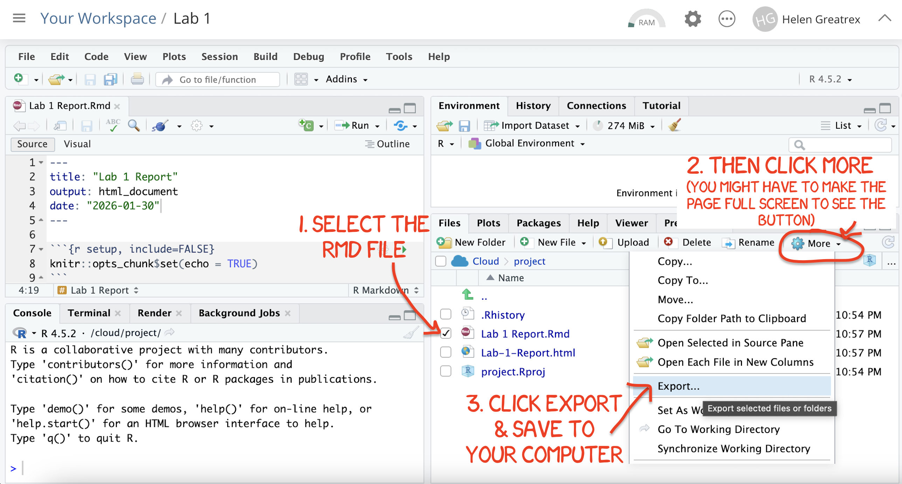

# Lab 5 {#Lab_5 .unnumbered}

### Aim {.unnumbered}

Welcome to Lab 5. This is worth 8% (480 points) and you can drop your lowest lab.

By the end of this lab, you will be able to:

1.  Understand & use regression diagnostics to assess LINE
2.  Apply this knowledge to a real case study on pollution in Florida Lakes

This is a ONE WEEK LAB. You need to finish writing up by next Tuesday (23:59pm) e.g. just before Lab 6 starts.

<br>

### Need help?

REMEMBER THAT EVERY TIME YOU RE-OPEN R-STUDIO YOU NEED TO RE-RUN **ALL** YOUR CODE CHUNKS. The easiest way to do this is to press the "Run All" button (see the Run menu at the top right of your script)

The maximum time this lab should take is about 4-5 hrs of your time.

<br>

------------------------------------------------------------------------

## 1. LAB SET-UP (Important!) {.unnumbered}

### STEP 1: Create your Lab 5 project {.unnumbered}

-   **[1A]** Make a project for Lab 5 (tutorial here) [Projects](#T1_Projects)

-   **[1B]** Open your Lab 5 project in R-Studio (see screenshot below).

<br>

------------------------------------------------------------------------

### STEP 2: Create your lab report structure {.unnumbered}

-   **[3A]** Make a new RMarkdown Report ([Tutorial here](#T31_Basics)) <br>

-   **[3B]** Using the [YAML tutorial](#Tut4E_YAML), edit the YAML code at the top to include,

    -   A title,

    -   your author name,

    -   Automatically creating today's date,

    -   A floating table of contents,

    -   Numbered sections

    -   A theme of your choice. (See the screenshot below) <br>

-   **[3C]** Delete all "the friendly welcome text", leaving the code at the top, so you have space to write your answers. (see the screenshot below)


<br>

### STEP 3: NEW (ish) Adjust your knit options {.unnumbered}

Many of you are losing marks because you are allowing all the library loading text to appear when you press knit. This makes it hard to find your answers. Although this was addressed in earlier labs, here's how to fix this issue.

-   Look at the first code chunk below the YAML code (or if you deleted it, put this code in a code chunk). The opts_chunk command allows us to set general knit options for the entire report

```         
   knitr::opts_chunk$set(echo = TRUE)
```

-   Add in two more options, warning=FALSE and message=FALSE. Now when you press knit, you shouldn't see any library loading text. You can also add these options to any code chunk if you want to suppress that specific output (see the Markdown Tutorial)

<br>

### STEP 4: NEW(ish) Sort out libraries {.unnumbered}

It's good practice to have a single code chunk near the top of the script containing all your library commands. This is to stop duplicated code and to make it easy to see what you are loading before running your labs.

-   Add a new code chunk and add the following libraries. Then press save or try to knit. <br> If any are missing you will see

    -   EITHER a little yellow bar at the top of the screen asking if you want to install the libraries. Say yes, wait until the libraries are installed and try again. <br>
    -   OR an error saying that it can't find that library (it might also be a spelling mistake if you are sure it's installed). In this case, you have to go to the app store and download it. <br>\

-   Finally, if ChatGPT, or R or anyone else gives you code with a library command in it, PUT THAT LIBRARY COMMAND IN YOUR TOP 'LIBRARY' CODE CHUNK!


``` r
library(tidyverse) # Lots of data processing commands
library(knitr)     # Helps make good output files
library(ggplot2)   # Output plots
library(skimr)     # Summary statistics
library(Stat2Data) # Regression specific commands
library(corrplot)  # correlation plots
library(GGally)    # correlation plots
library(ggpubr)    # QQplots
library(olsrr)     # Regression specific commands
library(plotly)    # Interactive plots
library(readxl)    # Read from excel files
```

<br><br>

### **[Step 1.4] Check Progress** {.unnumbered}

-   OK - so by now, you should be running project 5 - see if it says Project 5 at the very top of your screen , you have created your lab report, the YAML code works and your libraries work. If not, STOP, go back and redo the tutorials or talk to Dr G.

<br><br>

------------------------------------------------------------------------

## 2. STUDY SET-UP {.unnumbered}

<br>

**THIS IS A SEPARATE LAB TO LAB 4, SO YOU CAN START FRESH IN A NEW PROJECT** <br>

<br>

### **[Step 2.1] GET NEW DATA** {.unnumbered}

Although we are on the same topic, this lab is separate to the previous lab, so we need new data.

-   Create a level 1 heading called Set up
-   Go to the Canvas Lab 5 page, download BOTH the datasets and put them into your Lab 5 project folder.
-   Use read_excel to read each of them into R.  e.g. 


``` r
AllData       <- read_excel("index_data/Lab5bassFull.xlsx")
MinusOutliers <- read_excel("index_data/Lab5bassMinusOutlier.xlsx")
```

<br><br>


### **[Step 2.2] Background context.** {.unnumbered}

Go back to your lab 4 report and remind yourself of what you did and what the aim of the study was.  Write at least 3 sentences explaining what the topic is, your client, the object of analysis, response & predictor variables, and what you have learned so far. you can copy/paste from your lab 4 text. 


## 3. DATA WITHOUT THE OUTLIERS {.unnumbered}

At the end of Lab 4, one of your colleagues suggested that there were 4 problematic data points, Lake alligator, Lake puzzle, Lake annie and Lake brick. 

This person removed those outliers and asked you to also analyse that data.  **THIS IS YOUR  MinusOutliers DATASET**.


<br><br>

### **[Step 3.1]** Fit a new model {.unnumbered}

THIS IS IDENTICAL TO LAB 4 BUT WITH NEW DATA.. 

-   Fit a new linear model to your minus outlier dataset (see lab 4 for instructions).  Call it `Model_NoOutliers`.

-   Note down the coefficient of determination in the text.

-   Assess if the model meets the LINE assumptions, explaining what you mean in the text and providing all evidence as necessary (e.g. residual plots etc).

-  You do NOT need to remove any more outliers, but please note if any are influential.

<br><br>


### **[Step 3.2]** Transformation for non equal variance  {.unnumbered}

When assessing your LINE plots, your colleague suggested that it broke the assumption of equal variance. In this case we should transform the RESPONSE variable. 

-  In the text, explain if this means we can trust the "line of best fit", use the model to predict new points or neither and give reasons. 

-   Get this code running and explain in the text, referring to the lecture notes or online textbook (https://online.stat.psu.edu/stat501/lesson/9) what we are doing and why.


``` r
MinusOutliers$Ln_fish_av_mercury <- log(MinusOutliers$fish_av_mercury)
```

<br><br>


### **[Step 3.3]** Fit a new model  {.unnumbered}

_Remember you can copy/paste previous code!_


-   Now fit a NEW model between your response and lake_alkalinity (call it something like `Model_NoOutliers_lnResp`),

-   Plot it in a professional scatterplot (with a line of best fit)

-   Assess it for LINE/outliers (ignoring independence).

-   Write out the regression equation remembering that you are now looking at log(fish_av_mercury) as a response.

-   Discuss in the text, whether the transformation helped and why you think that.

<br><br>


## 4. FULL DATA WITH THE OUTLIERS {.unnumbered}

There is good evidence to suggest that NONE of the original outliers mentioned by your colleague are actually unusual points or should be removed.  So we are going to redo the analysis with the full dataset. 

<br><br>


### **[Step 3.1]** Fit the original model {.unnumbered}

_Remember you can copy/paste previous code_

-   Fit a new linear model to your AllData (see lab 4 for instructions).  Call it `Model_Full`.

-   Note down the coefficient of determination in the text and write out the model equation. 

-  You do not need to assess LINE etc because we did this in Lab 4!

<br><br>


### **[Step 3.2]** Linearity Transformations {.unnumbered}

A second way to "explain" the outliers is that the Linearity assumption is broken.

-  In the text, explain if this means we can trust the "line of best fit", use the model to predict new points or neither and give reasons. 


-   To do this, we will take the natural log transformation of our predictor, lake_alkalinity, and save it as a new column.   In R, the natural log (ln) is given by the log() command.


-  So for the **AllData** dataset, take the log of the **lake_alkalinity** column, and save it to a new column called **Log_lake_Alkalinity**. Note, this is similar to step 3.2...


<br><br>


### **[Step 3.2]** Predictor Transformed Model {.unnumbered}

_Remember you can copy/paste previous code_


-   Now fit a NEW model between your response and Log_Alkalinity (call it something clear like `Model_Full_lnPred`),

-   Plot it in a professional scatterplot (with a line of best fit)

-   Assess it for LINE/outliers (ignoring independence).

-   Write out the regression equation remembering that you are now looking at log(lake_alkalinity) as a predictor..

Remember you can copy/paste previous code!


<br><br>

### **[Step 3.3]** Model comparison {.unnumbered}

Make a new sub-heading called "Model Comparison", and sub-sub-heading as needed to keep this neat.  

-   In the text, summarise what we did for the four models e.g.
model 1: linear model of data with four data-points removed.


<br>

-   In the text, explain which of the four models explains the most variability in fish-mercury-content across the lakes?

    -   *Provide evidence to justify your answer, including the relevant statistic for each model from all four model summaries.*

<br>

-   In the text, compare the LINE assumptions (ignoring independence) of the four models.

<br>

-   In the text, calculate what each model predicts for the lake fish mercury (on average), for lakes with an alkalinity of 2.  

<br><br>

### **[Step 3.4]** Summary {.unnumbered}

-   Finally, summarise for the mayor which model you would choose and why. e.g. Is there more than one "good choice"? 

- Explain the consequences of getting choosing the "wrong" model  (e.g. do the other model overpredict for certain lakes? underpredict?).  


<br><br>

NO MATTER WHAT YOUR CONCLUSIONS, EVERYTHING FROM THIS POINT ONWARDS SHOULD USE THE FULL MODEL WITH THE PREDICTOR TRANSFORMATION (Model_Full_lnPred)

<br><br>

## 5. PREDICTION {.unnumbered}

THIS IS GOING TO BE COVERED IN LECTURE 12C.  FOR NOW,  Read Tutorial 12: <https://psu-spatial.github.io/Stat462-2024/confidence-and-prediction-intervals.html


### **[Step 5.1]** Prediction question 1  {.unnumbered}

NO MATTER WHAT YOUR CONCLUSIONS, EVERYTHING FROM THIS POINT ONWARDS SHOULD USE THE FULL MODEL WITH THE PREDICTOR TRANSFORMATION. 


Make a new subsection called `Prediction`. The mayor recently had a question from a member if the public who went fishing in a **new lake** that was not part of the study.

-   We know the alkalinity level of that lake was 40mg/L.

-   The member of the public wants to be 99% sure that they won't exceed the Florida Health Advisory level for Mercury levels in Fish, which is 1 $\mu g$ of Mercury.

-  Should they eat the fish?  

-  Explain your answer and show your evidence for how you came to your conclusion.

HINT 1: https://psu-spatial.github.io/Stat462-2025/in_T17_ConfPred.html#13_Calculating_a_prediction_interval 

HINT 2:  PROBLEM SOLVING - If your output doesn't look correct, then its normally this error.


``` r
# make sure yoru model code is
lm(YColumn ~ XColumn, data=mytable)

# NOT THIS, THIS BREAKS THE PREDICT COMMAND
lm(mytable$YColumn ~ mytable$XColumn, data=mytable
```


<br><br>

### **[Step 3.11]** More complex - worth 4%. {.unnumbered}

Make a new subsection called `Bonus Question`

**The Florida Health Advisory level for Mercury levels in Fish is 1** $\mu g$ **of Mercury. The nayor has accepted your model and is requiring state-wide alkalinity tests.**

**Using your new model, what is your recommended "safety cut-off" value of alkalinity for new lakes? You would like to be 95% sure that you aren't just seeing this result by chance. Provide evidence/code showing how you got to your answer**

*This question is designed to be more difficult and realistic. I will answer points of clarification, but I will not help anyone work through it before the labs are submitted. However I will award partial marks for workings and how far you get.*

*It is based on thinking about confidence and prediction intervals and as a hint, think about confidence and prediction intervals graphically on your scatterplot.*

[{width="50%"}](https://online.stat.psu.edu/stat501/lesson/3/3.3)

<br><br>


Congrats! Finished.

------------------------------------------------------------------------

<br>

## 3. WHAT TO SUBMIT {.unnumbered}

### If you are using your own laptop {.unnumbered}

Press knit one final time. You will have created two files; a `.Rmd` file containing your code and a `.html` file for viewing your finished document.

Find the html and RmD files in your Lab 1 folder on your computer. Double click the html file to open it in your browser and check it's the one you want to submit.

**You need to submit BOTH of these files on the relevant Canvas assignment page.**

You can also add comments to your submission as needed on the canvas page, or you can message Dr G.

<div class="figure">

<p class="caption">(\#fig:L5-Submit)Find them in your STAT462 folder on your computer</p>
</div>

### If you are using Posit Cloud online {.unnumbered}

1.  Press knit one final time. You will have created two files; a `.Rmd` file containing your code and a `.html` file for viewing your finished document.

2.  Go to the files tab an click on the little check-box by the RmD file. Then click the blue "more button" and press export. Save onto your computer.

<div class="figure">

<p class="caption">(\#fig:L5-CloudDownload)How do download the files from PositCloud</p>
</div>

2.  Uncheck the .RmD box and click the box by the html file. Then click the blue "more button" and press export. Save onto your computer.

**You need to submit BOTH of these files on the relevant Canvas assignment page.**

You can also add comments to your submission as needed on the canvas page, or you can message Dr G.

<br>

## 4. CHECK YOUR GRADE! {#CheckGradeL4 .unnumbered}

### RUBRIC {.unnumbered}

This is how you will be graded (percent)

-   **HTML FILE SUBMISSION - 10 marks**

-   **RMD CODE SUBMISSION - 10 marks**

-   **MARKDOWN/CODE STYLE - 10 MARKS** <br> How to get full marks for this:

    -   Your YAML code is working e.g. when you press knit, you see your author name, a table of contents etc etc (see step 4)

    -   Your code and document is neat and easy to read. LOOK AT YOUR HTML FILE IN YOUR WEB-BROWSER BEFORE YOU SUBMIT. For example:

        -   There is a spell check next to the save button.

        -   You have written in full sentences and it is clear what question your answers are referring to.

        -   You have included units!

        -   You have included formatting like headings/subheadings and bullets. Many people make typos with the headings. The easiest way to do it is to use visual mode, then highlight the text and click Header 1, Header 2 etc.

-   **FLORIDA FISH - 45 MARKS** <br>

You clearly summarised the main findings from your analysis in plain language appropriate for a non-technical audience. e.g. you highlighted the most important insights about the relationship between advertising channels and plant sales and explain what the results suggest about effective advertising strategies.


-   **BONUS - 4 MARKS** <br>

        Your summary focuses on the practical implications of the analysis rather than repeating technical output.

[80 marks total]

<br>

### Grade meaning {.unnumbered}

Overall, here is what your lab should correspond to:

<table class=" lightable-classic-2 table table-striped table-hover table-responsive" style='font-family: "Arial Narrow", "Source Sans Pro", sans-serif; margin-left: auto; margin-right: auto; margin-left: auto; margin-right: auto;'>
 <thead>
  <tr>
   <th style="text-align:left;"> POINTS </th>
   <th style="text-align:left;"> Approx grade </th>
   <th style="text-align:left;"> What it means </th>
  </tr>
 </thead>
<tbody>
  <tr>
   <td style="text-align:left;"> 98-100 </td>
   <td style="text-align:left;"> A* </td>
   <td style="text-align:left;"> Exceptional.  Above and beyond.   THIS IS HARD TO GET. </td>
  </tr>
  <tr>
   <td style="text-align:left;"> 93-98 </td>
   <td style="text-align:left;"> A </td>
   <td style="text-align:left;"> Everything asked for with high quality.   Class example </td>
  </tr>
  <tr>
   <td style="text-align:left;"> 85-93 </td>
   <td style="text-align:left;"> B+/A- </td>
   <td style="text-align:left;"> Solid work but the odd  mistake or missing answer in either the code or interpretation </td>
  </tr>
  <tr>
   <td style="text-align:left;"> 70-85 </td>
   <td style="text-align:left;"> B-/B </td>
   <td style="text-align:left;"> Starting to miss entire/questions sections, or multiple larger mistakes. Still a solid attempt.  </td>
  </tr>
  <tr>
   <td style="text-align:left;"> 60-70 </td>
   <td style="text-align:left;"> C/C+ </td>
   <td style="text-align:left;"> It’s clear you tried and learned something.  Just attending labs will get you this much as we can help you get to this stage </td>
  </tr>
  <tr>
   <td style="text-align:left;"> 40-60 </td>
   <td style="text-align:left;"> D </td>
   <td style="text-align:left;"> You submit a single word AND have reached out to Dr G or Aish for help before the deadline (make sure to comment you did this so we can check) </td>
  </tr>
  <tr>
   <td style="text-align:left;"> 30-40 </td>
   <td style="text-align:left;"> F </td>
   <td style="text-align:left;"> You submit a single word…....  ANYTHING..                Think, that's 30-40 marks towards your total…. </td>
  </tr>
  <tr>
   <td style="text-align:left;"> 0+ </td>
   <td style="text-align:left;"> F </td>
   <td style="text-align:left;"> Didn’t submit, or incredibly limited attempt.  </td>
  </tr>
</tbody>
</table>
