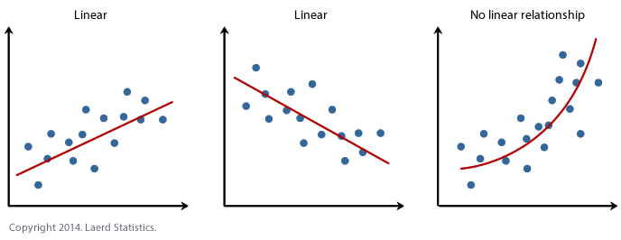
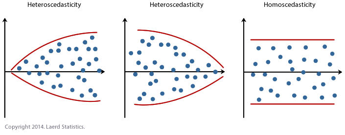
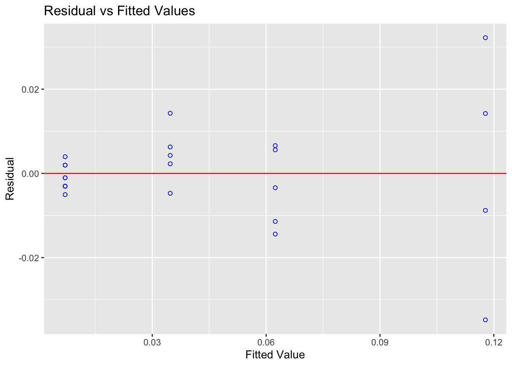
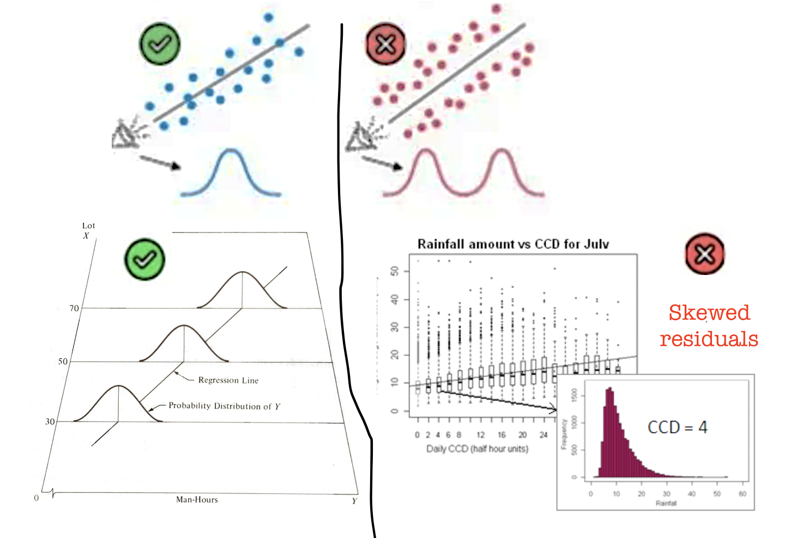
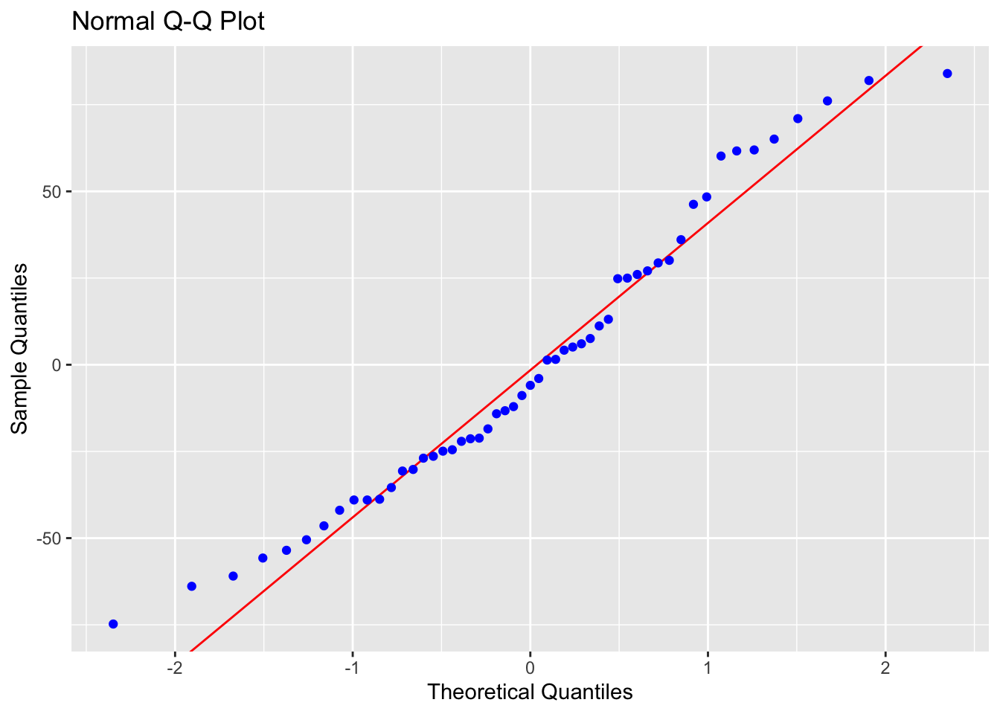
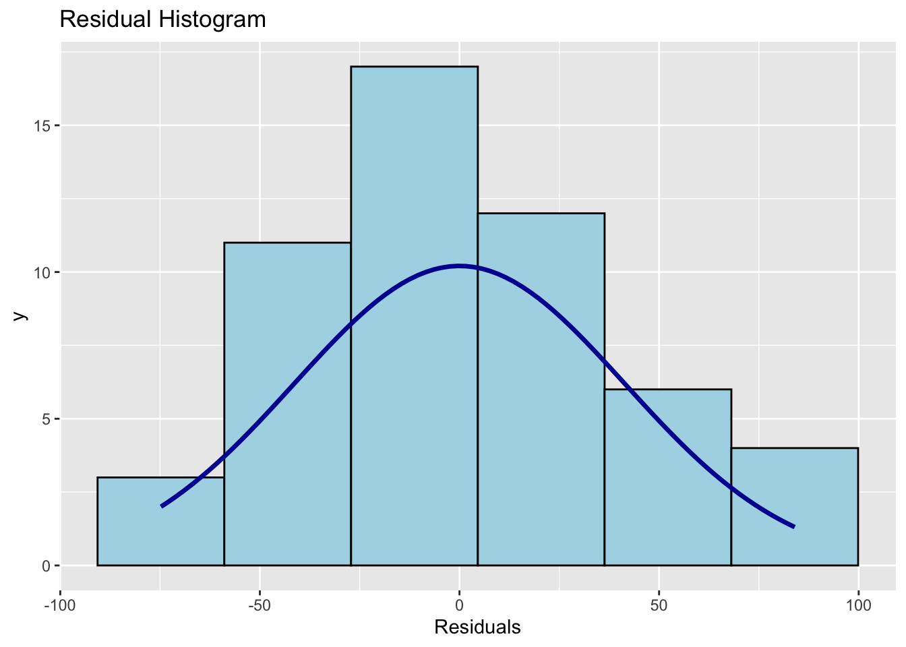

# Simple Linear Regression {#T11_SLR}

<br>

By this point your data should be ready: categorical columns converted to factors, missing data dealt with, and a QC check done. Now we fit the model.

We will use the `HousesNY` dataset throughout. Our question: **can lot size predict house sale price?**

<br>

------------------------------------------------------------------------

## Running the model {#T11_RunModel}

The command for linear regression in R is `lm()` — short for **linear model**.


``` r
output <- lm(y_column ~ x_column, data = tablename)
```

The `~` symbol means *"is modelled by"* or *"depends on"*. Think of it as the equals sign in your regression equation: y is on the left, x is on the right. So this line of code is saying

*Get the "tablename" spreadsheet. Then run a simple linear regression model (lm) where were use the the data in the column called "x_column" to predict the data in the column called "y_column". Rather than print out the results on the screen, save the model to an object called "output".*

### Example

For the `HousesNY` data, predicting `Price` from `Lot` and saving the result to an object called Model1.lm


``` r
Model1.lm <- lm(Price ~ Lot, data = HousesNY)
```

> **Note:** Always save your model to an object with `<-`. You will need it for every subsequent step — summaries, plots, diagnostics. If you just run `lm(...)` without saving it, the output is lost.

<br>

### Important

**DO NOT USE \$ WHEN YOU RUN THIS COMMAND! Always put the name of the table under data. It will run if you use \$ but later things break.**

<br>

------------------------------------------------------------------------

## Model Outputs {#T11_Output}

#### Quick look {#T11_OLSregress}

Typing the name of your model and running the code chunk will show the formula and coefficients, but not much else


``` r
Model1.lm
```

```
## 
## Call:
## lm(formula = Price ~ Lot, data = HousesNY)
## 
## Coefficients:
## (Intercept)          Lot  
##    114.0911      -0.5749
```

<br>

There are also some more detailed summaries. Both summaries contain the same information — use whichever is easier to read. In practice it is useful to have both available, which is why we saved the model as `Model1.lm` and can pass it to either function.

#### Standard summary

For the full output, use `summary()` on your model.


``` r
summary(Model1.lm)
```

```
## 
## Call:
## lm(formula = Price ~ Lot, data = HousesNY)
## 
## Residuals:
##     Min      1Q  Median      3Q     Max 
## -74.775 -30.201  -5.941  27.070  83.984 
## 
## Coefficients:
##             Estimate Std. Error t value Pr(>|t|)    
## (Intercept) 114.0911     8.3639  13.641   <2e-16 ***
## Lot          -0.5749     7.6113  -0.076     0.94    
## ---
## Signif. codes:  0 '***' 0.001 '**' 0.01 '*' 0.05 '.' 0.1 ' ' 1
## 
## Residual standard error: 41.83 on 51 degrees of freedom
## Multiple R-squared:  0.0001119,	Adjusted R-squared:  -0.01949 
## F-statistic: 0.005705 on 1 and 51 DF,  p-value: 0.9401
```

and the ANOVA table


``` r
anova(Model1.lm)
```

```
## Analysis of Variance Table
## 
## Response: Price
##           Df Sum Sq Mean Sq F value Pr(>F)
## Lot        1     10    9.98  0.0057 0.9401
## Residuals 51  89245 1749.91
```

<br>

#### The `ols_regress()` summary

The `olsrr` package provides an alternative summary with a cleaner layout. Remember to first install the olsrr package and to add library(olsrr) to your library code chunk at the top of your script.


``` r
## you apply this command to the MODEL
ols_regress(Model1.lm)
```

```
##                           Model Summary                           
## -----------------------------------------------------------------
## R                        0.011       RMSE                 41.035 
## R-Squared                0.000       MSE                1683.876 
## Adj. R-Squared          -0.019       Coef. Var            36.813 
## Pred R-Squared          -0.068       AIC                 550.137 
## MAE                     34.152       SBC                 556.048 
## -----------------------------------------------------------------
##  RMSE: Root Mean Square Error 
##  MSE: Mean Square Error 
##  MAE: Mean Absolute Error 
##  AIC: Akaike Information Criteria 
##  SBC: Schwarz Bayesian Criteria 
## 
##                                ANOVA                                 
## --------------------------------------------------------------------
##                  Sum of                                             
##                 Squares        DF    Mean Square      F        Sig. 
## --------------------------------------------------------------------
## Regression        9.983         1          9.983    0.006    0.9401 
## Residual      89245.412        51       1749.910                    
## Total         89255.395        52                                   
## --------------------------------------------------------------------
## 
##                                     Parameter Estimates                                     
## -------------------------------------------------------------------------------------------
##       model       Beta    Std. Error    Std. Beta      t        Sig       lower      upper 
## -------------------------------------------------------------------------------------------
## (Intercept)    114.091         8.364                 13.641    0.000     97.300    130.882 
##         Lot     -0.575         7.611       -0.011    -0.076    0.940    -15.855     14.705 
## -------------------------------------------------------------------------------------------
```

> **Important:** `ols_regress()` only works if you used `lm(y ~ x, data = tablename)`. If you used the `$` operator (e.g. `lm(data$y ~ data$x)`), it will break. This is one reason to always use the `data =` argument.

<br>

------------------------------------------------------------------------

## Writing the regression equation {#T11_Equation}

<br>

#### Population vs sample notation {#T11_Notation}

There are two versions of the regression equation, and it matters which one you write.

The **population equation** describes the true underlying relationship we are trying to estimate. We rarely if ever know these values — they are population parameters. Here's the equation and here's how to write it yourself.

For an individual value in your population, you have the model output plus some error/residual.

$$
y_i = model_i + \varepsilon_i
$$

$$
y_i = \beta_0 + \beta_1 x_i + \varepsilon_i
$$

Under the linear regression model, we assume that the population mean of y, $\mu_y$, changes linearly as you increase x:

$$
\mu_y = \beta_0 + \beta_1 x
$$


The **sample equation** describes our estimated line from the data. The hats (\^) indicate these are estimates:

$$
\hat{y} = b_0 + b_1 x
$$

You don't need to use x and y if it's clearer to use the variable names e.g.

$$
\mu_{price} = \beta_0 + \beta_1 LotSize
$$

$$
\hat{\text{Price}} = b_0 + b_1 \times \text{LotSize}
$$

Where price is in $1000USD and LotSize is in metres squared.


#### Filling in the numbers {#T11_FillIn}

From the model output, the intercept ($b_0$) is `114.0911` and the slope ($b_1$) is `-0.5749`. So the fitted SAMPLE equation is:

$$
\hat{\text{Price}} = 114.09 - 0.5749 \times \text{LotSize}
$$

Where price is in $1000USD and LotSize is in metres squared.

<br>


#### Writing these equations yourself {#T11_EquationCode}

To write equations in R Markdown, put `$$` and bottom for a centred display equation. The \$$ at the top and bottom tells R that this is an equation

**You should NOT do this in a code chunk**.  This is part of your word processing/report writing, so you WRITE THEM IN THE TEXT.  


Here are the symbols you will need most often:

| What you want          | What to type  |
|------------------------|---------------|
| $\hat{y}$              | `\hat{y}`     |
| $\beta_0$              | `\beta_0`     |
| $\beta_1$              | `\beta_1`     |
| $\varepsilon$          | `\varepsilon` |
| $\times$               | `\times`      |
| Subscript e.g. $x_i$   | `x_i`         |
| Superscript e.g. $R^2$ | `R^2`         |


Below I have written out all the equations above for you to have a look at how I did it (with some notes).  First...

-  \$$ means start/end equation
-  \_ means "subscript

```
$$
y_i = model_i + \varepsilon_i
$$
```

-  `\` means "special symbol" for example greek letters e.g. \beta makes the curly B. We are using LateX, so you can look them up.

```
$$
y_i = \beta_0 + \beta_1 x_i + \varepsilon_i
$$
```

-  You can combine these commands, so `\mu_y` means special symbol $\mu$, with a subscript y.

```
$$
\mu_y = \beta_0 + \beta_1 x
$$
```


-  `{ }` means "do something" to the stuff inside. e.g. \hat{y} means "put a little hat on y"

```
$$
\hat{y} = b_0 + b_1 x
$$
```


-  In this case, I needed the { } to make the computer realise I wanted the entire word price as subscript

```
$$
\mu_{price} = \beta_0 + \beta_1 LotSize
$$
```


-   `\text` makes the font look different

```
$$
\hat{\text{Price}} = b_0 + b_1 \times \text{LotSize}
$$
```

-   Finally, when you write out your own coefficients, remember you are typing the numbers, so check for typos!

````
$$
\hat{\text{Price}} = 114.2TYPO - 0.5749 \times \text{Lot}
$$
````

<br><br>

------------------------------------------------------------------------

## Interpreting slope and intercept {#T11_Interpret}

<br>

#### The sample intercept ($b_0 = 114.09$) {#T11_Intercept}

The intercept is the average value of $y$ when $x = 0$. In this case: a house with a lot size of zero metres squared would be predicted to sell for $114,090 on average

Whether this is meaningful depends on context. A lot size of zero is not realistic for a house, so here the intercept is a mathematical anchor for the line rather than a practically useful estimate. Always ask: *is x = 0 a sensible value in this context?*. See the lab 2 worked answers for more!

<br>

#### The sample slope ($b_1 = -0.5749$) {#T11_Slope}

The sample slope is the predicted change in the average $y$ for each one-unit increase in $x$. Here: for each additional metre-squared of lot size, the predicted average sale price **decreases by \$575**.

The negative slope is worth thinking about — it is counterintuitive. This might reflect confounding variables not in the model (e.g. larger lots may be in more rural, lower-value areas). This is why we check assumptions and consider multiple predictors.

<br>

------------------------------------------------------------------------

## Significance tests {#T11_Significance}

<br>

### Is the slope or intercept significantly different from zero? {#T11_SigZero}

The `summary()` output includes a t-test for each coefficient. The hypotheses are:

-   For the slope: $H_0: \beta_1 = 0$ (lot size has no linear relationship with price)
-   For the intercept: $H_0: \beta_0 = 0$ (the line passes through the origin)

The test statistic is:

$$
t = \frac{b_1 - 0}{SE(b_1)}
$$

R calculates this automatically. In the `summary()` output, look at the `Coefficients` table:

-   `Estimate` — the value of $b_0$ or $b_1$
-   `Std. Error` — the standard error of the estimate
-   `t value` — the test statistic
-   `Pr(>|t|)` — the two-sided p-value


``` r
summary(Model1.lm)
```

```
## 
## Call:
## lm(formula = Price ~ Lot, data = HousesNY)
## 
## Residuals:
##     Min      1Q  Median      3Q     Max 
## -74.775 -30.201  -5.941  27.070  83.984 
## 
## Coefficients:
##             Estimate Std. Error t value Pr(>|t|)    
## (Intercept) 114.0911     8.3639  13.641   <2e-16 ***
## Lot          -0.5749     7.6113  -0.076     0.94    
## ---
## Signif. codes:  0 '***' 0.001 '**' 0.01 '*' 0.05 '.' 0.1 ' ' 1
## 
## Residual standard error: 41.83 on 51 degrees of freedom
## Multiple R-squared:  0.0001119,	Adjusted R-squared:  -0.01949 
## F-statistic: 0.005705 on 1 and 51 DF,  p-value: 0.9401
```

If the p-value is below your significance threshold (typically 0.05), you reject $H_0$ and conclude the coefficient is significantly different from zero.

<br>

### Confidence intervals on slope and intercept {#T11_CI}

To get 95% confidence intervals for both coefficients:


``` r
confint(Model1.lm)
```

```
##                 2.5 %    97.5 %
## (Intercept)  97.29998 130.88227
## Lot         -15.85529  14.70549
```

To change the confidence level (e.g. 99%):


``` r
confint(Model1.lm, level = 0.99)
```

```
##                 0.5 %    99.5 %
## (Intercept)  91.71177 136.47049
## Lot         -20.94071  19.79091
```

The confidence interval gives a range of plausible values for the true population parameter. If the interval for $\beta_1$ does not include zero, this is consistent with rejecting $H_0: \beta_1 = 0$ at the corresponding significance level.

<br>

### Testing against a non-zero value {#T11_SigOther}

Sometimes the hypothesis of interest is not whether the slope equals zero, but whether it equals some other specific value. 


How likely is it that the real price decreases by exactly \$2000 per square m of lot size).

$H_0: \beta_1 = -2$ 
$H_1: \beta_1 != -2$ 

R does not do this automatically, so you calculate the t-statistic manually:

$$
t = \frac{b_1 - \beta_{1}fromH_0}{se(b_1)}
$$

where $\beta_{1}$ is the hypothesised value of the population slope from our experiment, $b_1$ is the sample slope that we actually see and se is the standard error on our sample slope. Step by step:


``` r
# First, extract the coefficients and standard errors from the model. the easiest way is to use olsrr 

Model1.summary <- ols_regress(Model1.lm)
Model1.Coefficients <- Model1.summary$betas
Model1.StandardError <- Model1.summary$std_errors

# we're looking at the slope - and our x predictor is called Lot, so
b1    <- Model1.Coefficients["Lot"]
se_b1 <- Model1.StandardError["Lot"]

# in case you need to test the intercept
b0 <- Model1.Coefficients["(Intercept)"]
se_b0  <- Model1.StandardError["(Intercept)"]

# In our test, we asked if the slope was different to -2
# Hypothesised value
beta1_H0 <- -2

# Calculate t statistic
t_stat <- (b1 - beta1_H0) / se_b1
t_stat
```

```
##       Lot 
## 0.1872342
```

Then calculate the two-sided p-value, using the residual degrees of freedom from the model:

We also need the residual degrees of freedom from the model (n-2). Many ways you can calculate this!


``` r
df <- df.residual(Model1.lm)
```

and calcualte the probablity


``` r
p_value <- 2 * pt(abs(t_stat), df = df, lower.tail = FALSE)
p_value
```

```
##       Lot 
## 0.8522199
```

**Confidence interval reframe:** an equivalent approach is to check whether your hypothesised value falls inside the confidence interval from `confint()`. If $\beta_{1,0} = -1$ lies outside the 95% CI, you reject $H_0$ at $\alpha = 0.05$. This gives the same conclusion as the t-test and is often easier to communicate.

<br>

------------------------------------------------------------------------

## The F-test and ANOVA table {#T11_Ftest}

The F-test asks a broader question than the individual t-tests: **does the model as a whole explain a significant amount of variance in y?** For simple linear regression with one predictor, the F-test and the t-test for the slope are equivalent — but this will matter more when you move to multiple regression.

The ANOVA table breaks the total variance in $y$ into:

-   **Regression SS** — variance explained by the model
-   **Residual SS** — variance left unexplained

To get the ANOVA table, look at the olsrr output or type


``` r
anova(Model1.lm)
```

```
## Analysis of Variance Table
## 
## Response: Price
##           Df Sum Sq Mean Sq F value Pr(>F)
## Lot        1     10    9.98  0.0057 0.9401
## Residuals 51  89245 1749.91
```

The F-statistic is the ratio of the mean regression SS to the mean residual SS. A large F (small p-value) means the model explains significantly more variance than would be expected by chance.

The F-statistic and its p-value also appear at the bottom of `summary(Model1.lm)` output — both routes give the same result.

<br>

------------------------------------------------------------------------

## $R^2$ and $r$ {#T11_Rsquared}

<br>

#### $R^2$ — coefficient of determination {#T11_R2}

$R^2$ tells you the **proportion of variance in** $y$ explained by the model. It ranges from 0 (model explains nothing) to 1 (model explains everything).


``` r
summary(Model1.lm)$r.squared
```

```
## [1] 0.0001118517
```

For example, $R^2 = 0.08$ would mean that lot size explains 8% of the variation in house price.

The **adjusted** $R^2$ penalises for adding extra predictors and is more appropriate when comparing models:


``` r
summary(Model1.lm)$adj.r.squared
```

```
## [1] -0.0194938
```

Both values appear in the `summary()` output under `Multiple R-squared` and `Adjusted R-squared`.  

<br>

#### $r$ — Pearson's correlation coefficient {#T11_r}

For simple linear regression (one predictor), $r$ is simply the square root of $R^2$, with the sign taken from the slope:


``` r
r <- sqrt(summary(Model1.lm)$r.squared) * sign(coef(Model1.lm)["Lot"])
r
```

```
##         Lot 
## -0.01057599
```

$r$ ranges from -1 to 1. It measures the strength and direction of the linear relationship between $x$ and $y$.

You can also calculate $r$ directly using `cor()`:


``` r
cor(HousesNY$Price, HousesNY$Lot)
```

```
## [1] -0.01057599
```

Both should give the same value. Note that $r$ and $R^2$ are related by $R^2 = r^2$ — so if $r = -0.29$, then $R^2 = 0.084$.

<br>

------------------------------------------------------------------------

## Plotting the regression line {#T11_Plot}

<br>

#### Quick plot — base R {#T11_BasePlot}

For a fast check during analysis, base R is the quickest option:


``` r
plot(Price ~ Lot, data = HousesNY,
     xlab = "Lot size", ylab = "Price (x$1000)",
     pch = 16, col = "grey50")
abline(Model1.lm, col = "steelblue", lwd = 2)
```


<br>

#### Publication plot — ggplot {#T11_GGPlot}

For a report or presentation, use `ggplot2`:


``` r
ggplot(HousesNY, aes(x = Lot, y = Price)) +
  geom_point(colour = "grey50", alpha = 0.7) +
  geom_smooth(method = "lm", colour = "steelblue", se = TRUE) +
  labs(x = "Lot size",
       y = "Price (x$1000)",
       title = "House price vs lot size",
       subtitle = "Shaded band = 95% confidence interval on the mean") +
  theme_bw()
```


`se = TRUE` adds a shaded confidence band around the line. Set `se = FALSE` to remove it.

> **Note:** `geom_smooth(method = "lm")` fits its own line internally — it is not using your saved `Model1.lm` object. For simple regression this makes no difference, but if your model includes transformations or additional terms, use `geom_abline()` with the coefficients from your model instead.

<br>

------------------------------------------------------------------------

## Checking LINE assumptions {#T11_LINE}

From lectures, linear regression relies on four assumptions — summarised as **LINE**:

-   **L**inearity — the relationship between $x$ and $y$ is linear
-   **I**ndependence — the errors are independent of each other
-   **N**ormality — the errors are normally distributed
-   **E**qual variance (homoscedasticity) — the errors have constant variance

Independence is usually assessed from study design rather than plots. The other three can be checked using residual plots.

<br>

### Checking Linearity {#T11_Linearity}

**What to look for:** a random cloud of points in the residuals vs fitted plot. A curve or systematic pattern means a straight line is not the right model.

{width="90%"}


``` r
ols_plot_resid_fit(Model1.lm)
```


<details>

<summary>[Expand to see an example where linearity is broken]{style="color: #1388aa;"}</summary>

This example uses treadwear data where the raw scatterplot looks approximately linear — but the residuals reveal a clear curve:


``` r
treadwear  <- read.csv("index_data/treadwear.csv")
tread_model <- lm(mileage ~ groove, data = treadwear)
ols_plot_resid_fit(tread_model)
```

<div class="figure">

<p class="caption">(\#fig:unnamed-chunk-21)The residuals show a clear parabolic pattern — a linear model is not appropriate here</p>
</div>

The residuals are systematically positive at low and high fitted values, and negative in the middle. A non-linear model would be more appropriate.

</details>

<br>

### Checking Equal Variance (Homoscedasticity) {#T11_Variance}

**What to look for:** the spread of residuals should stay roughly constant across all fitted values. A fan shape or bow-tie means variance is unequal.

{width="90%"}


``` r
ols_plot_resid_fit(Model1.lm)
```


You can also run a formal test. The F-test assumes residuals are independent and identically distributed:


``` r
ols_test_f(Model1.lm)
```

```
## 
##  F Test for Heteroskedasticity
##  -----------------------------
##  Ho: Variance is homogenous
##  Ha: Variance is not homogenous
## 
##  Variables: fitted values of Price 
## 
##        Test Summary        
##  --------------------------
##  Num DF     =    1 
##  Den DF     =    51 
##  F          =    0.00352732 
##  Prob > F   =    0.9528726
```

A small p-value suggests the population may not have equal variance.

<details>

<summary>[Expand to see an example where equal variance is broken]{style="color: #1388aa;"}</summary>


``` r
alphapluto  <- read.table("index_data/alphapluto.txt", sep = "\t", header = TRUE)
alpha_model <- lm(alpha ~ pluto, data = alphapluto)
ols_plot_resid_fit(alpha_model)
```

<div class="figure">

<p class="caption">(\#fig:unnamed-chunk-24)Clear fanning — variance increases with fitted values</p>
</div>

``` r
ols_test_f(alpha_model)
```

```
## 
##  F Test for Heteroskedasticity
##  -----------------------------
##  Ho: Variance is homogenous
##  Ha: Variance is not homogenous
## 
##  Variables: fitted values of alpha 
## 
##         Test Summary         
##  ----------------------------
##  Num DF     =    1 
##  Den DF     =    21 
##  F          =    16.37716 
##  Prob > F   =    0.0005808712
```

</details>

<br>

### Checking Normality of Residuals {#T11_Normality}

**What to look for:** residuals that follow a roughly normal distribution. Check with a Q-Q plot and histogram.

{width="90%"}

> **Note:** Normality matters mainly for p-values and confidence intervals in small samples. With $n > 200$, the Central Limit Theorem means mild non-normality has little practical effect. Never discard data just because this assumption is mildly broken.


``` r
ols_plot_resid_qq(Model1.lm)    # Q-Q plot
```



``` r
ols_plot_resid_hist(Model1.lm)  # histogram of residuals
```



``` r
ols_test_normality(Model1.lm)   # formal normality tests
```

```
## -----------------------------------------------
##        Test             Statistic       pvalue  
## -----------------------------------------------
## Shapiro-Wilk              0.9638         0.1078 
## Kolmogorov-Smirnov        0.0916         0.7658 
## Cramer-von Mises          4.4591         0.0000 
## Anderson-Darling          0.5791         0.1257 
## -----------------------------------------------
```

Points on the Q-Q plot should follow the diagonal line. The histogram should be approximately bell-shaped. For the Shapiro-Wilk test, a large p-value (fail to reject $H_0$) means no strong evidence against normality.

<details>

<summary>[Expand: what if normality is broken?]{style="color: #1388aa;"}</summary>

If you have a large sample ($n > 200$), mild departures from normality are generally not a concern. For smaller samples, options include:

-   Transforming the response variable (e.g. log transformation)
-   Using a generalised linear model (GLM) with an appropriate distribution
-   Using bootstrap confidence intervals

These are covered in later tutorials.

</details>

<br>

### Checking Independence {#T11_Independence}

Independence of errors cannot be checked with a residual plot — it depends on how the data were collected. Ask yourself:

-   Are observations from the same subject, location, or time point repeated? (→ not independent)
-   Is there a time or spatial order to the data that could cause nearby values to be related?

For cross-sectional data collected independently (like the `HousesNY` sample), independence is usually a reasonable assumption. If you have time series, spatial, or clustered data, independence needs to be explicitly modelled.

<br>

------------------------------------------------------------------------

## Troubleshooting {#T11_Troubleshooting}

<br>

**`ols_regress()` throws an error** You probably used `$` in your `lm()` call. Refit using `lm(y ~ x, data = tablename)` with the `data =` argument, then pass that model object to `ols_regress()`.

<br>

**`confint()` gives very wide intervals** Wide confidence intervals mean high uncertainty in the coefficient estimates — usually because the sample is small, the predictor has low variance, or the model fit is poor. Check your $R^2$ and sample size.

<br>

**The slope is significant but** $R^2$ is very small This is common with large samples. A statistically significant slope just means the relationship is unlikely to be exactly zero — it says nothing about practical importance. Always report and interpret $R^2$ alongside p-values.

<br>

**`ols_plot_resid_fit()` not found** The `olsrr` package is not loaded. Add `library(olsrr)` to your library code chunk.

<br>

**My residual plot shows a clear curve** Your data is not well described by a straight line — the linearity assumption is violated. Consider transforming $x$ or $y$ (e.g. `log(x)`), or fitting a polynomial term. This is covered in later tutorials.

<br>

**My residual plot fans out** Equal variance (homoscedasticity) is violated. A log transformation of $y$ often helps. Alternatively, weighted least squares or robust standard errors can be used — covered in later tutorials.
