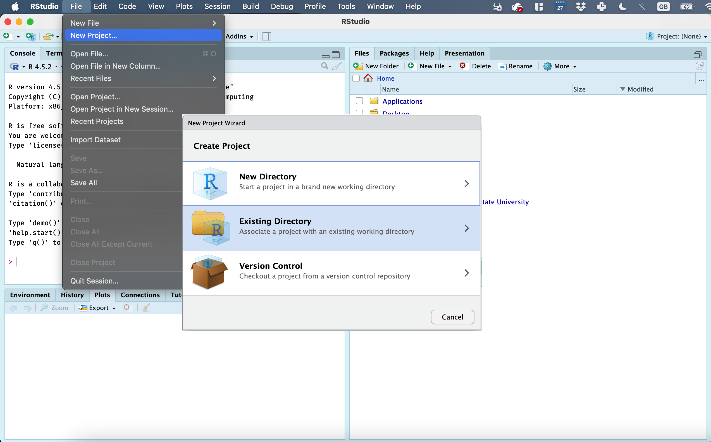

# (PART\*) [.]{style="color: white;"} {.unnumbered}

# (PART\*) **TUTORIALS** {.unnumbered}


# Projects/Starting each lab {#T1_Projects}

An R project  refers to a collection of files, data, and code organized within the R programming language environment for a specific analysis, research, or statistical project. 

An R Project is a home folder the files, scripts, and data connected to one piece of work like Lab 1. Instead of saving files in lots of different places and then struggling to tell R where to look, the Project keeps everything together. 

-   On the Posit Cloud, "a project" means a 'new version of R opens'

-   On the Desktop, "a project" you will have a single folder for each lab. Inside that will be your code, your data/images etc and a special .RProj file that you will use to open R.

Here’s why projects are so useful:

-   Consistency across computers: If you move from Posit Cloud to a lab computer or your own laptop, you only need to copy the Project folder. Open it, and everything inside will still “know where it lives.”

-   No messy file paths: You won’t have to keep typing or updating long folder names. R will automatically treat your Project folder as the starting point.

-   Everything is organised: Each lab, assignment, or project has its own container, so your work never gets tangled.

-   Easy to share or back up: You can zip up the folder, send it, or store it in GitHub/OneDrive, and it will still work when reopened.

Watch this video to find out more: (4 mins)

{width="600"}*(link here if it's not working: <https://www.linkedin.com/learning/learning-the-r-tidyverse/why-should-you-use-projects-in-rstudio?u=76811570>, you will need to log into Penn State)*

<br>

[WE WILL BE MAKING A NEW PROJECT FOR EACH LAB]{.underline}

------------------------------------------------------------------------

## Projects using posit Cloud {#T1_ProjectsCloud}

1.  **Go to this webpage. <https://login.posit.cloud/login>**
    -   You can get here from any web-browser and you do not need a special computer.
    -   When you log in, you should see a dashboard like the one below.\
2.  **Make a new project by clicking the button on the top right. This will open a window containing R-Studio.**
    -   You can open different projects in different tabs on your browser.
3.  **Returning to your lab projects on the cloud is very easy. Just go back to** <https://posit.cloud/content/yours>

<div class="figure" style="text-align: center">

<p class="caption">(\#fig:im-T1-ProjectCloud)*The Cloud dashboard*</p>
</div>

<br>

------------------------------------------------------------------------

## Projects on your desktop {#T1_ProjectsDesktop}

1.  Make a folder called STAT462 in an easy to access location on your computer.
    -   This is where all of your labs will live for this course.  \
2.  Inside this, make a folder called Lab 1 (or Lab 2, Lab 3 etc).You should put all your data and all your code in this relevant folder for each lab. DO NOT LEAVE ANYTHING IN DOWNLOADS! \
3.  Now open R-studio (NOT R!). You should have updated to the most recent version <br>


Steps 3-7 are shown graphically in the figures below. If you are new to this, follow them slowly.

3.  Go to the Main File menu at the [very top left]{.underline} and click `New Project` <br>\

4.  Then click `Existing Directory` <br>\



5.  You will be asked to find your Lab 1 folder on your computer. Find it and click open,


6.  Check that the address looks right.

7.  Finally, press `Create Project`.  Your screen should subtly change (see below) <br>\


### How to check you are running your project

If you have any errors, this will be the first thing I check, so you may as well check first!

-   R will change slightly. If you look at the top of the screen in the title bar, it should say something like *Lab1 - R Studio* at the top and at the top of each quadrant

-   The Files tab should now show your project folder. Essentially, R-Studio is now "looking" inside your Lab 1 folder, making it easier to find your data and output your results. (for people who have used R before, you no longer need to setwd() or write the location on your data).

- The icon at the bottom of your screen will have changed.

<div class="figure">

<p class="caption">(\#fig:im-T1-Projectcheck)How to check you are in a project</p>
</div>

<br>

-   If you want one final check, try typing this command into the console (INCLUDING THE EMPTY PARANTHESES/BRACKETS), press enter and see if it prints out the location of your Lab folder on your computer. If not, talk to an instructor.


``` r
getwd()
```

<br><br>

### Returning to your lab project

OK, let's imagine that you get halfway through your lab and your computer dies. How do you get back to your Lab work? Try this now. Close down R-Studio.

There are two ways to reopen a lab

#### From your computer

1.  Instead navigate on your computer to your *STAT462/Lab1* folder.

3.  Double click on the `Lab1.RProj` file. *Look for the RPROJ file type!* DO NOT DOUBLE CLICK THE RMD FILE

This will reopen R-Studio for that specific lab, so you can continue where you left off. It means you can also open several versions of R studio for multiple labs, which can be very useful in staying sane


#### From inside R-studio.

Alternatively you can open R-Studio, 

 - Then navigate to File/Open Projects and find your Lab 1 folder.
 - OR, look at File/Recent projects and you might just see Lab 1 there, especially if you have worked on it recently.
 

 
Or 


