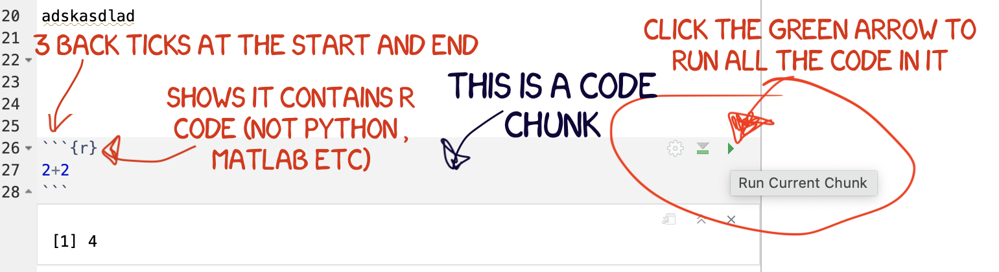

```{r setup, include=FALSE,message=FALSE,warning=FALSE}
# OPTIONS -----------------------------------------------
knitr::opts_chunk$set(echo = TRUE, 
                      warning=FALSE, 
                      message = FALSE)

# Tutorial packages
library(vembedr)
library(skimr)
library(yarrr)
library(RColorBrewer)
library(GGally) 
library(tidyverse)
library(plotly)
library(readxl)
library(rvest)
library(biscale)
library(tidycensus)
library(cowplot)
library(units)
library(equatiomatic)


```

# R-Markdown {#T3_Markdown}

## What is markdown {#T31_Basics}

Remind yourself of what Rmarkdown is here <https://rmarkdown.rstudio.com> via this short video

<iframe title="vimeo-player" src="https://player.vimeo.com/video/846773750?h=7cb3871e91" width="640" height="360" frameborder="0" referrerpolicy="strict-origin-when-cross-origin" allow="autoplay; fullscreen; picture-in-picture; clipboard-write; encrypted-media; web-share"   allowfullscreen></iframe>


### What are R-SCripts?

Read more here: https://rmarkdown.rstudio.com

Typing in console is like a having phone call with the computer, you're talking but you're not keeping records of what you say.  When you close R-studio you lose your analysis.

What we need instead is a way to save the commands for future use - we can do this using scripts. There are several types of document, or script that you can create and save in R-Studio.

-   A basic script (the filetype is .r).  This is simply just a blank notepad where you can save code commands.  When you "run" the commands in the script, R simply copy/pastes the commands over to the console.  This is probably how you have done previous labs.
 
-   An R-Notebook or R-Markdown document (the filetype is .Rmd).  These are much more interesting - and are how I wrote this lab book.  This is what we will be using in our labs.
 
In this course we are going to focus on the R-Markdown format and you are going to submit your labs as websites/html files along with your code. 


<br>

### What is R-Markdown?
 

What is an R-Markdown Document?  imagine a normal Microsoft Word document, but halfway through you can press a button and a mini R console appears....   You type your code inside the mini console, and click run.  The computer runs the code and puts the plots/output directly into your report - then you leave the console and  write about the results below the plot.  
 
As described in the video, Rmd files are also flexible.  You can turn them into reports, websites, blogs, presentations or applications with a few short commands.
 


<br>


## Creating a markdown document {#T31_NewMarkdown}

Go to the File menu on the top left, then click New File - R-Markdown. If this is your first time ever doing this, it might ask to download some packages to be able to do this (look for a little yellow bar at the top of the screen and say yes)

Eventually a window will open up:

```{r, tut4fig1, echo=FALSE,fig.align='center',out.width="80%"}
knitr::include_graphics('./index_images/pg_Tut4_markdown_fig1.png')
```

-   It will ask you to name and save your file.  Give it a relevant name.  

-   A new file should appear on your screen.  

-   At the top of that window (by the knit button, there is a save button. Save it as something relevant INSIDE YOUR PROJECT FOLDER!


```{r, tut4fig2, echo=FALSE,fig.cap="Yours will say STAT462 rather than GEOG364", fig.align='center',out.width="80%"}
knitr::include_graphics('./index_images/pg_Tut4_markdown_fig2.png')
```

The new file on your screen is your first markdown script. 


<br><br>


------------------------------------------------------------------------

## Important things to know {#T32_MarkdownImportant}

<br> 

### All markdown documents have three components. {#T32A_whatisit?}

<br> 

All markdown documents have three components.

-   There is a space at the top of the file where we can add information about themes/styles etc called "YAML". This determines what type/style of document your work will become <br>
-   There is space to add text (white), <br>
-   And you can add code in 'mini consoles' called 'code chunks'. (Grey) <br>

```{r im-T3-Markdown, echo=FALSE, fig.cap='Markdown Components',fig.align='center',out.width="100%"}
knitr::include_graphics('./index_images/im_T3_Markdown.png')
```

<br><br> 

### Visual mode {#T32A_visualmode}

It is MUCH easier to edit markdown documents in the new visual mode. Essentially instead of having to remember text short cuts like \* for bold, you can edit the text part as though you were using a word processor. NOTE HEADERS where it says "Normal", this allows you to make auto tables of contents.

```{r im-T3-SourceVis, echo=FALSE, fig.cap='Look at the circled button near the top of the two reports',fig.align='center',out.width="100%"}
knitr::include_graphics('./index_images/im_T3_SourceVisual.png')
```


<br>


### Editing YAML Code {#Tut4E_YAML}

Your YAML code is the code at the top of your file in between the --- lines. (see \@ref(fig:tut4fig4))).  Let's zoom in

```{r, tut4fig5, echo=FALSE,fig.align='center',out.width="80%"}
knitr::include_graphics('./index_images/pg_Tut4_markdown_fig5.png')
```

<br>

Your YAML code controls how your final output looks and which type of output it becomes. For example, your document could become a website, a pdf, a presentation or app.. 

The basic version is very simple with a title, an author and a self entered date. Let's add in more options. 

YAML code is annnoying to edit, because here, *spaces really do matter*. Everything has to be perfect or it won't knit.  

**Select everything in my code chunk here and replace your YAML with this (remember the --- on line 1 and at the end).**

```{r,eval=FALSE}

---
title: "GEOG-364 - Lab 2"
author: "hlg5155"
date: "`r Sys.Date()`"
output:
  html_document:
    toc: true
    toc_float: yes
    number_sections: yes
    theme: lumen
    df_print: paged
---
      
      
```

Replace the author ID with your user name, change the title if appropriate. 

The elements we just added are:

 - The title
 - The author (note,use your ID not your name)
 - Automatically created today's date
 - A floating table of contents
 - Numbered sections (this won't appear until you start typing section headings)
 - The document is now in the lumen theme. 
 
<br> 
 
### Troubleshooting

 - Note, if you copy/paste this and it doesn't work, sometimes the quote marks copy weirdly from the internet - try deleting and retyping the quotes.  

- If it still doesn't work.. this might be because a space is missing (especially if you typed it out). 
   +  Editing  YAML code can be a pain.  It is very case and space sensitive.<br>For example, the spaces at the start of some lines are important and are created using the TAB KEY, not the space bar.  There is one TAB key before html_notebook (which is now on a new line). There are two TAB KEYS before toc, toc_float, number_sections and theme.

*Don't continue until you can make and view your html when you press knit. If it doesn't work, ask for help before moving on*

<br>

### Changing the theme

You don't need to choose the lumen theme.  There are many other ways you can edit your markdown documents here: https://www.datadreaming.org/post/r-markdown-theme-gallery/

To edit, replace the word lumen with the name of your chosen theme (THIS IS CASE SENSITIVE). Now click knit and see if it works.Some themes are buggy. Try a different one if it doesn't work.  

The themes in "Even More Themes" on the website, requre you to install/load some new packages, so they need some extra work. You're welcome to try if you have one you fell in love with!
 
<nr> 
 
### Adding other YAML options
 
There are many more details about different options on these websites:

 - https://bookdown.org/yihui/rmarkdown/html-document.html
 - https://rstudio.com/wp-content/uploads/2015/03/rmarkdown-reference.pdf

If you want to get really fancy, there is an interesting package to help you design YAML code here: https://education.rstudio.com/blog/2019/10/tools-for-teaching-yaml-with-ymlthis/

<br>
<br>


## Knitting {#T32E_Knitting}


```{r, im-T3-knit, echo=FALSE,fig.align='center',out.width='100%'}
knitr::include_graphics('./index_images/im_T3_knit.png')
```

The file on your screen isn't the finished article. To see how it will look as a final version, we need to "knit" it. Go to the top of the .Rmd file, find the `knit` button. Press it (you might have to first save your script if you haven't already, then press it again)

You should see that the Markdown tab "builds" your document and you get an output as a website. The html should also be saved into your project folder.

For example, here is a file with markdown and knitted output.

```{r, im-T3-MarkdownElement, echo=FALSE,fig.align='center',out.width='100%'}
knitr::include_graphics('./index_images/im_T3_AllMarkdownElements.png')
```

<br><br>


## Editing the report text

You can type anywhere inside the white report area. R will ignore it.

<br>


### Inserting images/tables and formatting {#T32B_formatting}

In visual mode, look at the menu at the top. It's very easy to insert images, tables and other formatting. Pay special attention to the Normal/Heading 1/Heading 2 buttons..

You can also do this in source mode, but you have to learn the keyboard shortcuts. For example to make something *bold* you put stars around it e.g. `*bold*` .  You can see more examples in the pic above and here

For more, see this link: <https://zsmith27.github.io/rmarkdown_crash-course/lesson-3-basic-syntax.html>


<br><br>


------------------------------------------------------------------------

### Code chunks {#T32D_CodeChunks}

Code chunks are mini consoles where you can run R commands. 

#### Adding a code chunk {#T32Da_Adding}

On the top right there are a suite of buttons for adding a new code chunk, running code etc. The green one adds a new code chunk. To run an individual code chunk you will press the green arrow on its top right e.g.


```{r, im-T3-CodeChunkCreate, echo=FALSE,fig.align='center',out.width='100%'}
knitr::include_graphics('./index_images/im_T3_CodeChunkCreate.png')
```

<br>

#### Editing and running code chunks {#T32Db_Editing}

You should see that a new area has appeared in your report that is a different color to the background.
Inside its essentially a "mini console".  It's where you add your code and you need to 'speak R' inside it. 

When you press enter, the code won't run. INSTEAD, click the little green arrow

```{r, im-T3-RunCodeChunk ,echo=FALSE,fig.align='center',out.width='100%'}

```

<br>

------------------------------------------------------------------------


------------------------------------------------------------------------

## Writing Maths equations in R-Markdown {#T3_MathsEquations}

### Double dollar signs

It is relatively easy to write equations in R markdown. They use the "Latex" format and you put them between double dollar signs.

For example, try typing `$$x=2$$` on a new line of the white text area in your repprt ( NOT INTO A CODE CHUNK), then pressing knit. You should see:

$$x=2$$

But how do you write all the fancy equation stuff? We cheat.

Create the equation you want in one of these generators, then copy the code into your script and put it between double dollar signs:

-   <https://latex.codecogs.com/eqneditor/editor.php>
-   <https://www.tutorialspoint.com/latex_equation_editor.htm>

For example

`$$\widehat{y} = b_{0}+b_{1}x$$`

Shows up as $$\widehat{y} = b_{0}+b_{1}x$$

<br><br>

### Single dollar signs

Essentially this is the same, but the equation is part of the text and you only see the output when you press knit. For example including `$x=2$` in this sentence shows $x=2$ as an output.


<br><br>

------------------------------------------------------------------------

## Code Chunk options {#T3_CodeChunkOptions}

What are they? Essentially, instructions that you tell the computer when you press knit.

### Creating them in Source mode

Click source mode and have a look at a code chunk. You will see it starts with three little back-ticks and the {r} sign. For code chunk options, we will be focusing on the top line with the {r}

```{r im-T3-CodeChunkOptions, echo=FALSE,fig.align='center',out.width='100%'}
knitr::include_graphics('index_images/im_T3CodeChunkOptions.png')
``` 

At the moment, the code chunk tells us that the code inside is written in R.

We can also add other options, **separated using commas.**


```{r im-T3-CodeChunkOptionsComplete, echo=FALSE,fig.align='center',out.width='100%'}
knitr::include_graphics('index_images/im_T3CodeChunkOptionsComplete.png')
``` 

In fact, you have often seen me add message=FALSE and warning=FALSE to prevent any spurious messages appearing when you press knit. Keep reading to see the many other things you can add.

<br>

### Creating them in View mode

You can also edit code chunk options in view mode. Create a new code chunk, then click on the little (almost invisible) cogwheel near the run triangle

```{r im-T3-CodeChunkOptionsView, echo=FALSE,fig.align='center',out.width='100%'}
knitr::include_graphics('index_images/im_T3CodeChunkOptionsView.png')
``` 


This will open a menu where you can choose many of the common options


```{r im-T3-CodeChunkOptionsViewMenu, echo=FALSE,fig.align='center',out.width='70%'}
knitr::include_graphics('index_images/im_T3CodeChunkOptionsViewMenu.png')
``` 

<br>

### Setting the default for the whole document {#T3_CodeChunkWholeDoc}

Many templates already include this for you to edit.

If not, you can put a code chunk at the top of your document (below the YAML code) containing `knitr::opts_chunk$set(echo=TRUE)` to change the default values of chunk options in a document.

For example, you may put this in the first code chunk of your document to stop it showing messages on knit.

````         
```{}
knitr::opts_chunk$set(echo=TRUE, 
                      warning=FALSE, 
                      message=FALSE)
```
````

<br>

### Common options

Here are the common options we typically need:

-   `message = TRUE/FALSE`. Don't show friendly R messages on knitting. I use this so often that I put it in that knitr code chunk at the top of my scripts. <br>

-   `warning = TRUE/FALSE` . Don't show R warnings on knitting. It will still show errors, so this is another good one to use. <br>

-   `include = TRUE/FALSE.` Show or Hide the code AND output in the final document. Really useful with inline code (next section) <br>

-   `echo = TRUE/FALSE.` Show or Hide the code chunk code in the final document. The output will still be shown. <br>

-   `eval = TRUE/FALSE`. This option determines whether the code is evaluated or executed. If **`eval = TRUE`**, the code is executed. If **`eval = FALSE`**, the code is not executed, but the code chunk is still displayed. This can be useful for showing example code without actually running it.

-   Or for example, if you can't knit because of an error, you can add eval=FALSE to the problem code chunk so I can see what you did but you can still knit.

<br><br>

------------------------------------------------------------------------

## Inline Code

There are two types of code you can write in your reports: code chunks and inline R code.

#### Code chunks..... (as discussed above)

Click source mode and have a look at a code chunk. You will see it starts with three little back-ticks and the {r} sign.

```{r im-T3-CodeChunk2, echo=FALSE,fig.align='center',out.width='100%'}
knitr::include_graphics('index_images/im_T3CodeChunk.png')
``` 

#### ..... and Inline Code

```{r include=FALSE}
x <- 7; y <- 10
str="`r y`"
str2="`r x^2`"

```

Inline R code is embedded in the TEXT/NARRATIVE of your document using single back-ticks. For example, writing

My value of y is `` `r str` `` and x-squared is `` `r str2` ``

Will output:

My value of y is `r y` and x-squared is `r x^2`.

If this doesn't make sense, follow these tutorial to see how to add inline code.

-   <https://bookdown.org/yihui/rmarkdown-cookbook/r-code.html>
-   <https://www.njtierney.com/post/2019/07/10/jq-verbatim-inline-r/>
-   <https://rmarkdown.rstudio.com/lesson-4.html>

<br><br>

### Tips for adding inline code

Inline code is GREAT. Imagine writing your 100 page thesis, but then you realise that your dataset was wrong. If all the numbers in your report are added using inline code, then it will automatically update your entire report.

The easiest way to do this is to run your commands in a "silent" code chunk with the echo=FALSE and include=FALSE options. Then in the text, I just put the variable name I want to print, sometimes rounding to a better number of decimal places[^in_04-tutorial3_markdown-1].

[^in_04-tutorial3_markdown-1]: You can round in the inline code or the code chunk. Both are fine

```{r, include=FALSE, echo=FALSE}
data(starwars)
meanheight <- mean(starwars$height,na.rm=TRUE)
meanheight <- round(meanheight,2)
```

For example here's how I typed that the mean height of the starwars data is `r round(meanheight,3)` cm:

```{r im-T3-InlineCode, echo=FALSE,fig.align='center',out.width='100%'}
knitr::include_graphics('index_images/im_T3InlineCode.png')
``` 


